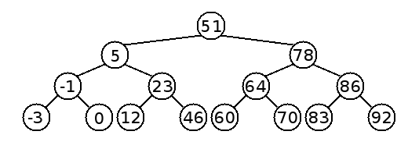

\maketitle
\newpage
\tableofcontents
\newpage

## Linguaggi
'Ma cos''è un linguaggio? Un oggetto matematico formato da: 

- alfabeto (segni/simboli)
- stringhe formate dagli elementi del alfabeto (sequenze ordinate)

Linguaggi come estrema astrazione. Ad esempio le stringhe possono essere formate non da lettere, ma simboli che rappresentano ad esempio le azioni che fa un programma. Altro esempio è scrivere un problema che ci affligge in un determinato linguaggio e cercare le soluzioni-stringhe appartenenti al linguaggio delle soluzioni corrette. 
Dobbiamo poi definire la concatenazione di stringhe, la quale nella sua versione generalizzata si identifica come concatenazione di linguaggi. 

**Stella di Kleene** : (x)* è l'insieme di tutte le stringhe ottenibili concatenando x a sè stessa, arbitrariamente (anche 0 volte).

# Automi a stati finiti

## FSA o ASF
Astrazione del calcolo, che opera su un certo linguaggio e le sue stringhe. 
Tempo discreto, cioè quantizzato a passi.
Passi che ci permettono di spostarci in un sistema finito di stati. 
Qualsiasi problema/comportamento scrivibile come una sequenza finita di stati può essere modellizzato da un FSA (Finite State Automaton).
Un FSA è una tupla $<Q,I,\delta,q_0,F>$: 

- Q , un insieme di stati finito
- I , un alfabeto d'ingresso
- $\delta$ , una funzione $\delta (Q,I) \rightarrow Q$
- $q_0$ , stato iniziale (unico)
- F, l'insieme di stati finali

**Formalmente** le stringhe appartenenti al linguaggio sono $$\forall x (x \in L \leftrightarrow \delta (q_0,x) \in F)$$
Se l'FSA è un traduttore/trasduttore di linguaggi avrà anche una funzione $\gamma (Q,I) \rightarrow O^*$  dove O è un linguaggio di uscita. 
> Ricordati che l'automa si ferma solo quando la stringa è finita. Dopo di che controllerà se si trova in uno stato di accettazione. 

### Automa a stati finiti che riconosce numeri divisibili per 3 in base 10

Si basa sul concetto di tenere il conto delle cifre modulo 3. Ragionamento applicabile per qualsiasi altro ASF in cui bisogna valutare la divisibilità per un certo numero. 


### Pumping Lemma

Importante teorema che ci dice che se digerisco una stringa S, la quale $|S| > |Q|$ (dove |Q| è la cardinalità/numero degli stati della FSA) , allora posso digerire digerire un linguaggio infinito (fatto cioè di infinite stringhe di lunghezza finita). 


Se $x \in  L \wedge |x| \ge |Q|$, allora esistono uno stato $q \in Q$ e una stringa $w \in I$  tali che: 
$$x = ywz$$ con $\delta(q,w) = q$ Perciò vale anche quanto segue: 
$$\forall n \ge 0 \space yw^nz \in L$$Cioé si può “pompare” w. 
Con il Pumping Lemma si puó ad esempio dimostrare che il linguaggio $L = {a^nb^n | n > 0}$ non è riconosciuto da nessun FSA. 
Ma ci permette anche di sapere se un FSA riconosce un linguaggio infinito con questa condizione: 
$$\exists x \in L |Q| \le |x| < 2|Q|$$
O se un FSA riconosce un linguaggio non vuoto tramite questa condizione: 
$$\exists x \in L \leftrightarrow \exists y \in L |y| < |Q|$$

### Operazioni insiemistiche su FSA 
Possiamo fare complemento (negazione), unione,  intersezione di automi a stati finiti.
**Complemento:**
Riconoscere tutte le stringhe che non appartengono al linguaggio, e quindi non riconoscere neanche una stringa che apparteniene al linguaggio.
- scrivere la FSA completa (totale), cioè esplicitare tutti gli stati pozzo (cioè di errore)
- invertire gli stati finali con quelli di non accettazione della stringa

**Intersezione:**
Riconoscere le stringhe che appartengono ad entrambi i linguaggi.
- Si fa il prodotto cartesiano degli stati dei due automi.
 - Lo stato iniziale è quello deteterminato dal prodotto cartesiano dei due stati iniziali.
    Sono invece stati finali tutti quegli stati prodotti dagli stati finali. 

**Unione**:
Riconoscere le stringhe che appartengono o ad uno o all'altro linguaggio. 
- Si realizza sfruttando de Morgan: $A \cup B = \neg (\neg A \cap \neg B)$
 ovvero: due complementi, la loro intersezione e un altro complemento in serie.


### FSA belli fino a quando non bisogna riconoscere $a^nb^n$

Linguaggi dove viene richiesta 'una memoria' creano problemi. 


# Automi a Pila

Un AP è una tupla $<Q, I, \Gamma, \delta, q_0, Z_0, F>$: 

- Q , un insieme di stati finito
- I , un alfabeto d'ingresso
- $\Gamma$ alfabeto di pila
- $\delta$ , una funzione $\delta (Q,I) \rightarrow Q$
- $q_0$ , stato iniziale (unico)
- $Z_0$ inizio pila
- F, l'insieme di stati finali


Stessa cosa degli FSA ma dotati di una pila infinita con però un inizio. Possiamo impilare quello che vogliamo, ma possiamo operare solo sulla cima. Una memoria così distruttiva.. lettura = distruzione. 

AP $\leftarrow$ PDA = Push-Down Automaton 

L'AP non è chiuso rispetto nè l'unione nè l'intersezione. Però il complemento è chiuso(procedura analoga al FSA, ma più complicata causa la possibilità, con gli AP, di poter accettare le $\epsilon$  stringhe, cioè elementi vuoti).

### La pila può fare $a^nb^nc^md^m$ e $a^n b^mc^md^n$  ma non $a^nb^nc^n$ poichè ha una memoria distruttiva.

Questo è gran sbatti ed è dovuto al funzionamento della pila. L'approccio per risolvere questo genere di problemi è impilare tutti 'i placeholders' che indicana la 'a' e poi nel momento in cui leggo le b far saltare i vari placeholders. Il problema è che se poi ho anche da contare un eventuale carattere c non riesco: ho distrutto tutta la memoria per assicurarmi che b fossero presenti nella stessa quantità delle a. Pazienza abbiamo le **Macchine di Touring.

# Macchina di Touring
## Un modello per elaborarli tutti
Una MT è una tupla $<Q,I,\Gamma,\delta,q_0,Z_0,F>$:

- OC, Organo di Controllo analogo a FSA e AP che mi permette di spostarmi tra i vari stati
- Q , un insieme di stati **finito**
- I , solito alfabeto d'ingresso, in realtà ce ne potrebbe essere uno per ciascun nastro
- $\Gamma$ alfabeto dei nastri
- $\delta$ , una funzione $\delta (Q,I) \rightarrow Q$
- $q_0$ , stato iniziale (unico)
- $Z_0$ simbolo iniziale della memoria 
- F, l'insieme di stati finali

Per convenzione nelle MT, negli stati finali non ci sono archi uscenti.
Sostituisco la pila con 3 nastri (input, memoria, output). Non sono 3 pile distruttive, sono 3 nastri su cui posso 'navigare'. 
Le mosse della MT diventano quindi più articolate poichè leggo un carattere in input, posso sostituire un carattere nei vari nastri e posso spostare la testina (sx, dx, stop).

Per convenzione gli stati finali sono tutti pozzo, cioè non ci sono transizioni che ci fanno uscire dagli stati finali. 

Un bel esempio di MT, oltre a poter risolvere problemi quali $a^nb^nc^n$  è 'l'incrementatore decimale' . La unione, intersezione e il complemento per MT ci sono e sono chiuse eccetto l'ultima. Il complemento infatti può essere fatto solo se non ci sono cicli. Nel caso non ci fossero faccio il solito scambio: iniziali $\leftrightarrow$ finali.

L'unione la posso vedere come 'il parallelo' di due macchine di Touring, l'intersezione come 'la serie'. 

La MT è **completa**, non ci sono problemi non esprimibili e modellizzabili con una MT. Inoltre una MT a singolo nastro è potente tanto quanto la MT con 3 nastri ... di base suddivido il mio nastro infinito in 3 zone, delimitate da un carattere a piacere non presente nell'alfabeto su cui sto operando. La complicanza sta solo nella gestione dei movimenti della testina, la quale tutte le volte si deve 'orientare'.
Di fatto una la macchina di Von Neumann , scritta come macchina che si serve di una RAM è completamente equivalente a una MT a singolo nastro. 
[video MT costruita](https://www.youtube.com/watch?v=E3keLeMwfHY)
[video di Computerphile su MT](https://www.youtube.com/watch?v=DILF8usqp7M)

esempi di linguaggi eseguibili su MT:

- $a^nb^nc^n$
- $a^{2n}b^{2n}c^nd^n$
- $a^n b^{n^2}$ , idea: scorrere tutte le a ad ogni b in input. 


## Determinismo e non determinismo.

Una sequenza di mosse non deterministiche, implica che non sappiamo stabilire l'ordine in cui vengono fatte. Ci sono MT non deterministiche, e sono utili per risolvere tutti i problemi nel quale non ha importanza 'l'ordine' delle mosse. 
Il Non Determinismo è quindi il pilastro fondamentale per il **parallelismo**.
Ci sono anche FSA non deterministiche. Formalmente la differenza sta che la funzione $\delta (Q,I)$ non  mappa  uno stato ma un  insieme $\{ q_0,q_1,q_2...\}$, cioè una mossa ci manda in un insieme di stati possibili, i quali eventualmente possono essere percorsi parallelamente. 

### Una FSA D è potente tanto quanto una FSA ND

### Una AP D è meno potente rispetto a una AP ND

Esatto! Un automa a pila non deterministico ha più espressività.. è come se aumentassi le pile. Ma non diventa potente tanto quanto una MT. 

### Una MT ND è potente tanto quanto una MT D

## Operazioni su linguaggi  


# Grammatiche Formali

Le grammatiche formali sono un insieme di regole. Hanno 2 alfabeti, un assioma (o simbolo iniziale) e un insieme di regole dette **produzioni sintattiche**.

## Relazione di derivazione

Produzione sintattica che produce da una stringa un'altra. Posso anche eseguirle in sequenza ottenendo quindi un linguaggio. Da L(G) ottengono il linguaggio L1.

Ci sono 4 tipi di grammatiche: 

*(stringa a è di partenza, stringa b è di arrivo a->b)*

- Tipo 0 = nessuna limitazione
- Tipo 1 = |a|<|b| 
- Tipo 2 = |a| = 1 (**Context Free**)
- Tipo 3 = **regolari**

Regole delle **Grammatiche Regolari**:

- |a| = 1
- b $\in V_t . V_n \cup V_t$  *(nota che $.$ intende la concatenzazione di stringhe)*
- b = $\epsilon$ sono nel caso in cui la stringa vuota è presente nel linguaggio


 
Le grammatiche sono modelli generativi di linguaggi, possiamo associare ciascuna grammatica al rispettivo automa riconoscitore del linguaggio generato:

- Tipo 0 $\rightarrow$ nessuna limitazione $\rightarrow$ MT
- Tipo 1 $\rightarrow$ limitazione cardinalità $\rightarrow$ MT
- Tipo 2 $\rightarrow$ context free $\rightarrow$ **AP ND**!
- Tipo 3 $\rightarrow$ grammatiche regolari $\rightarrow$ FSA

Una roba utile negli esercizi è proprio ricordarsi di queste relazioni per generare i linguaggi. Infatti il tipico esercizio 'trova la grammatica a potenza minima per generare questo linguaggio' può essere affrontato come *'che tipo di automa è in grado di riconoscere questo linguaggio? A questo tipo di automa che grammatica corrisponde?'*. 

Possiamo emulare una MT con una grammatica. Come? Ogni mossa è una derivazione, la derivazione ''finale'' verrà effettuata solo se la MT riconosce la stringa. 
Utilizzeremo la 'losanga' $\diamond$ per separare la stringa input con quella output:
input $\diamond$ output

> Non è obbligatorio che la regola di derivazione $A \rightarrow B$  sia applicata a tutte le ‘A’ contemporaneamente. Si può applicare la regola $A \rightarrow B$  a tutte le ‘A’, ma si può anche non farlo.  L’idea delle grammatiche è che sono un formalismo non-deterministico: tutte le possibili combinazioni di produzioni vengono provate, se si arriva ad una stringa formata da soli caratteri terminali, allora quella stringa viene detta generata dalla grammatica. 

### Palindromi
E' possibile dimostrare che se un linguaggio è palindromo, allora esiste una grammatica che lo genera.

## Formulazione con Logica
Formalizzare i problemi con un linguaggio.
La FOL (Logica del primo ordine) é utilizzata in AI e in altri campi.. nei nostri esercizi, per definire linguaggi, utilizzeremo logiche più ristrette di FOL:

- MFO (Logica Monadica del Prim'ordine)= come FOL ma con quantificatori solo su variabili. 
- MSO (Logica Monadica del Second'ordine)=con quantificatori anche sui predicati. 

### MFO 

- come logica proposizionale ma con variabili che rappresentano posizioni all'interno della stringa
- in genere nei nostri esercizi possiamo utilizzare abbreviazioni. Esempi di abbreviazioni: (succ(x,y) per dire y=x+1)(last(x))
- **strettamente meno potente degli FSA**
- I linguaggi definiti da MFO non sono chiusi rispetto alla $*$ di Kleen. Quindi diciamo che riconosce i cosidetti linguaggi **star-free**, cioè linguaggi definibili come unione, concatenazione,intersezione, complemento di linguaggi finiti.

MFO non sa riconoscere $$L = \{ a^{2n} , n \in \mathbb N \}$$

#### Esempi MFO
Scrivere una formula di MFO che descrive parole in cui tra 2 simboli $a$ ci deve essere almeno un simbolo $b$. 

$$\forall x,y( x < y \wedge a(x) \cup a(y) \implies \exists z( x < z \wedge z < y \wedge b(z)))$$

Scrivere una formula di MFO che descrive parole in cui i simboli al massimo compaiono una volta sola. 
$$\forall x( a(x) \implies \forall y( x < y \rightarrow \not a(y)))$$
Scrivere una formula di MFO che descrive parole in cui, ogni 10 simboli, al massimo 1 puó essere a. 
$$\forall x,y( y = x + 9 \implies \neg (\exists z1,z2( x \le z1 \wedge z1 < z2 \wedge z2 \le y \wedge a(z1) \wedge a(z2)))$$

### MSO
- identico a MFO ma con la possibilità di quantificare anche i predicati.
- **potente tanto quanto gli FSA e quindi le Grammatiche Regolari**

E' possibile utilizzare la logica anche in maniera ricorsiva, l'importante ovviamente è che non vada in loop all'infinito. 


### Logica di Hoare
La notazione di Hoare serve per specificare opportune **pre-condizioni** e **post-condizioni** per un programma. (In questo caso usiamo FOL).

## Tesi di  Church - Turing

> L'insieme delle funzioni calcolabili coincide con quello delle funzioni calcolabili da una macchina di Turing.

Nessun algoritmo, indipendentemente dallo strumento utilizzato per l'implementazione, può risolvere un problema che non sia risolvibile dalla Macchina di Touring. 
In 80 anni non abbiamo trovato controesempi di questa tesi (che non ha dimostrazione).
NB: **esistono problemi non risolvibili algoritmicamente.**
*Enumerazione algoritmica*: un algoritmo che mi trova tutte le corrispondenze biunivoche tra un certo insieme e l'insieme $\mathbb{N}$.  Cioè mi enumera gli elementi di un certo insieme. 
L'insieme di tutte le MT è enumerabile algoritmicamente: infatti fissati il \#stati e il \#nastri , l'unica cosa che distingue le MT è la funzione $\sigma$ (transizione).
Quindi da ora in poi vedremo le finite MT come delle funzioni $f_i$ .
Utilizzeremo il simbolo $\bot$ per indicare 'l'indefinito' , cioè quando una MT non si ferma/è indefinita per un certo ingresso x. 
 
### Macchina di Touring Universale
 
La MTU è una MT che può emulare qualsiasi altra MT. Essendo le MT finite, e fissato il \# stati e il \# nastri , ricevendo il numero corrispondente della MT, la MTU può identificare la corrispondente funzione di transizione e quindi emulare la $MT_i$ . 
MTU calcola quindi $f(y,x)=g_y(x)$ . 
*Possiamo vedere il computer come una MTU, e una scheda già programmata come una MT.*
MTU nidificate -> macchine virtuali

# Computabilità

## Enumerazione di Gödel per MT
*$f_y$ vuol dire funzione **calcolabile** y-esima, cioè la funzione calcolata dalla y-esima MT secondo l’enumerazione di Gödel.* 

## Cosa significa essere computabile/calcolabile: 
Una funzione $f$ è calcolabile/computabile se e solo se esiste una MT che la calcola. Nel momento in cui ti chiedi se una funzione $f$ sia calcolabile o meno non sai ancora se esiste o meno la $MT$ relativa ad $f$. Ci sono funzioni per cui NON esiste una $MT$ corrispondente. Se esiste, vuol dire che, per qualsiasi input $x$, l’output della $MT$ è esattamente $f(x)$.
Questo NON implica la totalità, perché le funzioni di cui studiamo la calcolabilità non sono necessariamente totali.

Esempio funzione **computabile** ma **non** **totale**: 
$$ g(x, y) = \begin{cases} 1 \space f_y(x) \ne \bot \\ \bot \space f_y(x) = \bot \end{cases}$$
Molti problemi, pur matematicamente ben definiti non possono essere risolti mediante procedimenti algoritmici, cioè non sono computabili (vedi l'Halting Problem). Per trovare una soluzione occorrerà **caso per caso** fare ricorso ad altre tecniche, tipicamente umane, senza per altro nessuna garanzia di poterla trovare. 

### Funzione caratteristica
$c_s(x)$ è la funzione caratteristica di un insieme. Restituisce 1 se l'elemento x appartiene all'insieme, restituisce 0 altrimenti.

## Ricorsività degli insiemi: 
- **Ricorsivo** (**decidibile**) se e solo se $c_s(x)$ è computabile, cioè può essere verificata da una macchina di Turing in un periodo di tempo finito.
- **Ricorsivamente Enumerabile** (**semidecidibile**) se e solo se $c_s(x)$ è computabile quando vale 1. Quando la $c_s(x)$ è 0, cioè l'elemento non appartiene all'insieme, non è necessario che la procedura si interrompa; può andare in loop per alcuni casi "non appartiene". 


**Piccolo recap:**
Se insieme è finito $\rightarrow$ ricorsivo.
Se un insieme è ricorsivo $\rightarrow$ $c_s(x)$ computabile e totale.
Se un algoritmo termina sempre $\rightarrow$ decidibile. 
Se un algoritmo termina sempre quando la risposta è SI, ma non necessariamente quando la risposta è NO $\rightarrow$ semidecidibile. 

## Halting Problem 
Nessuna MT può calcolare la funzione totale seguente:
$$ g(x, y) = \begin{cases} 1 \space f_y(x) \ne \bot \\ 0 \space f_y(x) = \bot \end{cases}$$

Nessuna MT può decidere a priori se una MT (leggasi programma) si fermerà (non entrerà “in loop”) per un dato valore di ingresso.
Dimostrazione: Supponiamo che g sia computabile. Allora la funzione h definita come:

$$h(x) = \begin{cases} 1 \space f_x(x) = 0 \\ \bot \space otherwise \end{cases}$$

è anch'essa computabile. Allora esiste $x$ $\in$ N t.c. $f_x = h$. Ma allora se calcoliamo $h(x)$ abbiamo due casi:
$h(x) = f_x(x) = 1$, ma allora $f_x( x) = 0$, che porta a $f_x(x) =\bot$ che è assurdo
$h(x) = f_x(x) = \bot$, ma allora $f_x(x) = 1$, che porta a $f_x(x) \ne \bot$ che è ancora assurdo
Quindi h non può essere computabile e di conseguenza non può essere computabile nemmeno f.

````C
bool halting(int i){
	if(halting(42)) while(1);
	else return true;
}
````

## Problemi **indecidibili**:

> No sense in putting any effort to solve an undecidable problem.

- stabilire se MT riconosce $L_1$ (indecidibile per Rice)
- Problema totalità funzione 
- Problema di determinare se una generica funzione computabile è definita per almeno un valore del suo dominio. La proprietà che si vuole decidere è sicuramente posseduta da alcune funzioni calcolabili definite sull’insieme delle funzioni ma non da tutte. In base al teorema di Rice allora non è possibile stabilire se un generico algoritmo (comunque codificato) calcoli una funzione dotata della proprietà suddetta.
- Problema di determinare se una funzione ha un minimo globale 
- Problema correttezza di un programma
- Problema equivalenza di due programmi
- Problema di decidere se il linguaggio accettato da una generica MT (e quindi grammatice non ristrette) è vuoto o no. Il problema non è decidibile, lo si può mostrate per riduzione dal problema della terminazione del calcolo. 
- Sapere se due programmi computano la stessa funzione sapendo che terminano per ogni input (non decidibile perchè non sai se il dominio di partenza è finito)
- Un problema è irrisolvibile quando bisogna prendere in considerazione infiniti casi possibili (una funzione costante è sempre decidibile).
-  Determinare se l’intersezione dei linguaggi generati da due grammatiche è vuoto
-  Determinare, data una grammatica $G$ ed un insieme di grammatiche $\Gamma$ se $G \in \gamma$
-  Determinare data una grammatica $G$ ed un insieme di linguaggi $\mathbb{L}$ se $L(G) \in \mathbb{L}$
- **l'Alacre Castoro** : determinare la MT in un insieme di MT con lo stesso numero di stati che effettua il maggior numero di passi di computazioni, alla fine terminando.
- Verificare se una MT accetta una stringa vuota
- Condizione **necessaria** finché $P$ sia indecidibile è che esso sia formalizzabile come il problema del calcolo di una funzione $f_P$ il cui dominio sia **infinito**. Non sufficiente!: *ad esempio la funzione $f(x) = x+2$ definta sui numeri naturali ha dominio infinito ma è ovviamente calcolabile*.

## Problemi **decidibili**:

- domande con risposta chiusa si/no che non dipende da alcun input (RISPOSTA CHIUSA)
- Problema di stabilire se il linguaggio accettato da un FSA(e quindi grammatica regolare) è vuoto o no, usando il Pumping Lemma. Questo è equivalente di verificare la 'emptyness di un linguaggio regolare'.
- equivalenza tra automi a stati finiti (e quindi grammatiche regolari)
- equivalenza di due polinomi
-  Sapere se due programmi computano la stessa funzione sapendo che terminano per ogni input e che il dominio di input è finito.
-  funzione costante
-  Il problema di verificare se una formula di FOL è soddisfacibile è un problema sicuramente decidibile anche se la formula è aperta. Inoltre, se fattibile, si può provare a vedere se esiste un assegnamento per cui è vera e quindi la si può rendere effettivamente decisa.
-   Ogni grammatica genera un linguaggio ricorsivamente enumerabile: questo è ovvio se si prende in considerazione la MT che da quella grammatica genera stringhe del linguaggio. La funzione che è calcolata dalla MT ha come immagine l’insieme di tutte le stringhe del linguaggio, quindi per definizione è ricorsivamente enumerabile.
- Una formula logica **chiusa** (formula in cui o non compaiono variabili o tutte le variabili presenti sono vincolate a un quantificatore) è sempre o vera o falsa, quindi decidibile, anche se non è detto che si sappia il suo valore di verità.
- Una funzione definita su un dominio finito è sempre calcolabile e decidibile essendo descrivibile mediante una tabella finita. Esiste ovviamente sempre una Macchina di Turing che “calcola” una tabella finita di valori.


## Problemi **semidecidibili**:

- Sapere se due programmi che terminano per ogni input computano funzioni differenti
- Sapere se due funzioni definite sullo stesso dominio sono differenti


# Metodi per determinare decidibilitá

## Teorema di Rice

 Sia $\mathbb F$ un insieme di funzioni computabili. Per ogni funzione di $\mathbb F$  possiamo trovare una MT. L'insieme $\mathbb S$ di tutti e soli indici delle MT che calcolano le funzioni di $\mathbb F$ è:
 
- **decidibile** se solo se $\mathbb F$ è banale (cioè vuoto o totale). 
- **indecidibile** altrimenti.

**Spiegato a mo' di spaghettata:**
dire se un certo insieme di funzioni condividono o meno una stessa proprietà è indecidibile, tranne nei casi in cui tale insieme è banale.

**Conseguenza peso del Teorema di Rice**: 

- Non possiamo stabilire l'equivalenza di due programmi. 

NB: *Tutte le proprietà che riguardano una caratteristica strutturale (numero di stati, sullo spazio occupato, sul numero di righe di codice) e non **comportamentale** di una MT, NON sono proprietà della funzione calcolata dalla MT e quindi **non si può usare Rice.***

## Riduzione 
**come ricordarsi come funziona la Riduzione di A $\rightarrow$ B
````C
int problemA(){
	//operations
	problemB();
	//operations
}
````
Dati A e B. Riduco A in B e dico che:

- se B non è decidibile, allora neanche A lo è
- se A è decidibile, anche B è decidibile
Cioé:
- Conosco un problema indecidibile che è un caso particolare del mio problema: il mio problema è indecidibile 
- Conosco un problema decidibile di cui il mio problema è un caso particolare: il mio problema è decidibile

## Diagonalizzazione 
Si basa sulla diagonalizzazione di Cantor. Tosta.


---

# Analisi complessità 

Per l'analisi delle complessità ci baseremo sempre sulla lunghezza dell'input $n$.
La **complessità spaziale** sono in gergo molto tecnico le celle sporcate DURANTE l'esecuzione di un algoritmo (non alla fine). Quindi nota bene che DURANTE significa che noi consideriamo solo lo spazio che ci serve per eseguire l'algoritmo, non lo spazio che eventualmente è già stato allocato. Ad esempio: se ci danno una matrice come input, la complessità del nostro algoritmo non deve tener conto di questa matrice. La consideriamo come 'pre-allocata'.

*Calcoliamo le complessità vengono valutate nei casi pessimi, per i casi medi è troppo sbatti calcolarsi le probabilità.*

## Richiami di analisi 

### Gerarchia delle complessità
$$1(costante) < log(log(n)) < log(n) < log^2(n) < \sqrt{n} < n$$ $$n < log(n!) < nlog(n) < n^2 < n^4 < 2^n < 4^n < n! < n^{2^n}$$

### Relazioni utili

- logaritmi: 
	$log(x^y)=ylog(x)$
	$log(xy)=log(x)+log(y)$
	$log(\frac{x}{y})=log(x)-log(y)$
	$\Theta(log(log(x))) = \Theta(log(x))$
	$\Theta(log(x!))=\Theta(xlog(x))$
	
- serie aritmetiche: 
	$\sum_{i=1}^{n}log(i)=\Theta(nlog(n))$
	$\sum ^n _{K=1} k = \frac{n(n+1)}{2}=O(n^2)$
	$\sum ^{log(n)} _{K=1} k =O(log^2(n))$
	$\sum ^n _{K=0} x^k = \frac{x^{n+1}-1}{x-1}$
	$\sum ^n _{K=1} \frac{1}{k} \simeq log(n)$
	$\sum^{log(n)}_{i=1}2^i \simeq n$


**Disclamer:** *abuso di notazione. Nelle precedenti righe, e nel resto del corso, vengono utilizzati i simboli $=$ piuttosto che i simboli $\in$ (più corretti)*.*
Piccolo extra: *l'asintotico (di Analisi 1 per intenderci) è un caso particolare del $\Theta$. Quest'ultimo simbolo infatti ci dice che una funzione è comprimibile tra due coefficienti moltiplicativi di un'altra*.

> Nella crescita esponenziale, la base conta un sacco. 

>I casi ottimi li sanno fare tutti, siete ad ingegneria considerate sempre i casi pessimi.

## Metodi per risolvere ricorrenze:

### Master Theorem 
Utili teorema per valutare complessità del tipo
$$T(n)=aT(\frac{n}{b})+f(n)$$
Il teorema ha tre casi e si tratta sempre di confrontare $n^{log_b(a)}$ con $f(n)$. Si tratta di applicare una formula e stabilire se la ricorsività delle chiamate pesa più della singola chiamata $f(n$) . 

I 3 casi, con K = $log_b(a)$: 

- se $f(n) = O(n^{K})$ allora $T(n) = O(n^{K})$
- se $f(n) = \Theta((nlog(n))^k)$ allora $T(n) = \Theta(n^{k}(log(n))^{k+1})$
- se $f(n) = \Omega(n^K)$ allora controllo che $af(\frac{n}{b}) \le cf(n)$ sia valida per qualche $c<1$ e per tutti gli $n$ grandi a sufficienza. In caso affermativo $T(n)=\Theta(f(n))$

Il Master Theorem non si può applicare nel caso in cui $a<1$ .  Inoltre il MT copre solo i casi in cui le funzioni differiscono **polinomialmente**. Questo significa che non posso confrontare $n^2$ con $n^2log(n)$ ma posso confrontare $n^{2.3}$ e $n^2log(n)$ . 
Inoltre il MT non copre casi in cui la funzione delle ricorrenze è negativa! $T(n) = 64T(\frac{T}{8}) - n^2 log(n)$ non è quindi risolvibile con il MT poichè negativa. 

### Metodo di *guessing and confirming* 

Nel caso in cui $T(n)$ è ricorsiva e non è risolvibile con il Master Theorem, la situazione si fa più difficile.

Tre fasi:
0) Faccio a mano un paio di iterazioni di $T(n)$ e intuire un possibile andamento
1) Intuisco sbattendo la testa sul foglio una possibile soluzione 
2) Maggioro la $T(n)$ con la **mia ipotesi** $f(n)$ :  $T(\frac{n}{2}) \le cf(n)$ 
3) Dimostro la veridicità della disequazione sostituendo la presunta soluzione nella l’equazione/disequazione alle ricorrenze: $cf(\frac{n}{2}) \le cf(n)$ 

*esempio:*

- $T(n) = 2T(\frac{n}{2})  + n$
-  intuisco $T(n) \le c(nlog(n))$
-  maggioro $2T(\frac{n}{2}) +n \le c(nlog(n))$
-  sostituisco (la mia ipotesi induttiva) e verifico $2c(\frac{n}{2}log(\frac{n}{2})) +n \le c(nlog(n))$

per una $n$ abbastanza grande e una qualsiasi $c$ (non importa quanto piccola) se la disuguaglianza è corretta, ho trovato una soluzione. 

### Albero di ricorsione

L’albero di ricorsione fornisce un aiuto per avere una congettura da verificare con il metodo di sostituzione. E' una rappresentazione delle chiamate ricorsive, indicando per ognuna la complessità. Ogni chiamata costituisce un nodo in un albero, i chiamati appaiono come figli del chiamante.
$T(n) =T(\frac{n}{3}) +T(\frac{2n}{3}) +n$


## Teoremi di accelerazione lineare per MT
- Se $L$ è accettato da una $MT_A$ a $k$ nastri con complessità $S_A(n)$, per ogni $c > 0(c \in R)$ si può costruire una $MT_B$ a $k$ nastri con complessità $S_B(n) < cS_A(n)$
- Se L è accettato da una MT A a $k$ nastri con complessità $S_A(n)$, si può costruire una $MT_B$ a 1 nastro (non a
nastro singolo) con complessità $S_B(n)$ = $S_A(n)$
- Se $L$  è accettato da una $MT_A$ a $k$ nastri con complessità $S_A(n)$, per ogni $c > 0(c \in R)$ si può costruire una $MT_B$ a $1$ nastro con complessità $S_B(n) < cS_A(n)$
- Se $L$ è accettato da una $MT_A$ a $k$ nastri con complessità $T_A(n)$, per ogni $c > 0(c \in R)$ si può costruire una $MT_B$ (a $k+1$ nastri) con complessità $T_B(n) = max \{n + 1, cT_A (n)\}$

Conseguenze:

- Lo schema di dimostrazione è valido per qualsiasi tipo di modello di calcolo, quindi anche per calcolatori reali (es.: aumentare il parallelismo fisico (16bit → 32bit → . . . )).

- Aumentando la potenza di calcolo in termini di risorse disponibili si può aumentare la velocità di esecuzione, ma il miglioramento è al più **lineare.

- Miglioramenti di grandezza superiore al lineare possono essere ottenuti solo cambiando algoritmo e non in modo automatico.


# RAM

Un modello più vicino ai calcolatori reali rispetto alle MT. 


La RAM è dotata di una memoria con accesso a indirizzamento diretto. **L’accesso non necessita quindi di scorrimento delle celle**. Le istruzioni di un programma usano normalmente come sorgente il primo operando e come destinazione $N[0]$. Ogni cella contiene un intero. 
Istruzioni della RAM:


NB: *SUB= 1* decrementa N[0] di 1

Nota che se nella ram non usa $*$ allora è garantito che la memoria necessaria all'esecuzione del programma è finita. In caso di $*$ l'indirizzo di memoria su cui la RAM lavora può dipendere dall'input.
La complessità spaziale di una $MT$ a nastro singolo include sempre l'input (si tratta di una convenzione). 

## Due tipi di costo per le RAM

### Costo costante
Il criterio a costo costante presuppone che ogni operazione necessita una 'singola unità' di tempo.

### Costo logaritmico
Il criterio a costo logaritmico invece presuppone che l'operazione non sia a costo costante ma abbia un costo proporzionale ai 'bit'. Con il criterio a costo costante una somma tra due numeri di 8 bit diremo che occupa circa 1 unità di tempo. A costo logaritmico invece $T(n)=lg_2(n)$  dove n è il numero più alto memorizzabile negli 8 bit (caso pessimo). Quindi a costo logaritmico la somma la consideremo di peso 8 (e non 1).

Costo log per principali operazioni:

- read, load $\rightarrow$ $log(n)$
- add, sum $\rightarrow$ $log(n)$
- mul, div $\rightarrow$ $log^2(n)$ 

### Teorema correlazione polinomiale

>Se un problema è risolvibile mediante il modello $M_1$ con complessità (spaziale o temporale) $C_1(n)$, allora è risolvibile da un qualsiasi altro modello (Turing-completo) $M_2$ con complessità $C_2(n)\le \pi(C_1(n))$, dove $\pi (\dot \space)$ un opportuno polinomio.

Ad esempio $n^2$ e $n^{1000}$ sono correlate polinomialmente poichè a 'separarle' c'è un polinomio. $n^{1000}$ e $e^n$ no.

#### Correlazione temporale tra TM e RAM

La $TM$ impiega al più $\Theta(T_{RAM}(n))$ per simulare **una** mossa della RAM. Se la RAM ha complessità $\Theta(T_{RAM}(n))$ essa effettua al più $T_{RAM}(n)$ mosse (*ogni mossa costa almeno 1*), le quali a costo costante sono esattamente $T_{RAM}(n)$, a costo logaritmico sono di meno. La simulazione completa della $RAM$ da parte della $TM$ costa al più $\Theta((T_{RAM}(n^2))$; il legame tra $T_{RAM}(n)$ e $T_{MT}(n))$ è polinomiale.


#### Nota su TM, RAM e linguaggi regolari 

Quando un linguaggio è regolare ognuna dei modelli di calcolo (MT o RAM) possono simulare un automa a stati finiti con il proprio organo di controllo: questo ci spiega che qualsiasi problema formulato con un linguaggio regolare è risolvibile da un algoritmo in $\Theta(n)$ .


# Sorting

### Proprietà di stabilità 

Se un algoritmo di sorting è stabile allora se nell'array da ordinare ci sono più elementi con lo stesso valore, questi appariranno nell'array ordinato mantenendo il loro ordine relativo iniziale. Questa proprietà non è particolarmente interessante se ci limitiamo ad ordinare numeri. Lo diviene se stiamo ordinando dei oggetti utilizzando un valore dei loro attributi come chiave.

## Insertion sort 
- $T(n) = O(n^2)$ 
- $S(n) = O(1)$
-  array 
-  Non ricorsivo
- Concetto: Dividi l'array in 2 array: uno ordinato e l'altro non ordinato. Inizialmente quello ordinato avrà dimensione 1 ma ad ogni iterazione $k$ lo espandiamo di un elemento e facendo $k-1$ confronti posizioniamento il 'nuovo' elemento nel giusto punto dell'array già ordinato. 
- Recensione: deprecato

## Counting sort 
- $T(n) = O(n+k), k=|alfabeto|$
- $S(n) = O(k)$
- array 
- Non ricorsivo
- Concetto: si salva su un array $k$ contatori. Vengono incrementati i contatori ad ogni occorrenza dopo aver controllato una volta l’array da ordinare $O(n)$, poi partendo dall’inizio del nuovo array stampo $array[i]$ volte il valore $i$.
- Recensione: Ottimo se $k = O(n)$, altrimenti meglio mergesort o heapsort. 

## Merge sort 
- $T(n) = O(n log(n))$ 
- $S(n) = O(n)$ 
- array 
- Ricorsivo (d.e.i.)
- Concetto: divido ogni array in sottoarray e ogni sottoarray ricorsivamente ancora. Il caso base sará un semplice scambio, ogni altro caso invece sará effettuato con un confronto tra indici.
	Passi: 
	1) Controlli che $l$ < $r$ e nel caso trovi la metà, da cui trovi i sotto array
	2) continui in maniera ricorsiva a dividere fino a quando i sottoarray sono a singoli.
	3) a questo punto mergi facendo il confronto e risalendo tutte le chiamate ricorsive. Avrai sempre 2 arrays e li mergi usando 2 indici per ciascun array. Usando i due indici inserisci sempre l'elemento più piccolo tra i 2 valori puntati dagli indici. E dopo averlo inserito incrementi l'indice dell'elemento appena inserito.
- Recensione: Ottimo per la complessità temporale, ma non è in place. Infatti ad ogni divisione si istanziano 2 nuovi array ricorsivamente. 

````Java
private static void mergeSort(int[] array) {		
	int length = array.length;
	if (length <= 1) return; //base case
		
	int middle = length / 2;
	int[] leftArray = new int[middle];
	int[] rightArray = new int[length - middle];
		
		int i = 0; //left array
		int j = 0; //right array
		
	for(; i < length; i++) {
		if(i < middle) {
			leftArray[i] = array[i];
		}
		else {
			rightArray[j] = array[i];
			j++;
		}
	}
	mergeSort(leftArray);
	mergeSort(rightArray);
	merge(leftArray, rightArray, array);
}
	
//notare come è il metodo merge a fare la 'magia'

private static void merge(int[] leftArray, int[] rightArray, int[] array) {
		
	int leftSize = array.length / 2;
	int rightSize = array.length - leftSize;
	int i = 0, l = 0, r = 0; 
		
	//è proprio mentre si fa merge che si scambia
	
	while(l < leftSize && r < rightSize) {
		if(leftArray[l] < rightArray[r]) {
			array[i] = leftArray[l];
			i++;
			l++;
		}
		else {
			array[i] = rightArray[r];
			i++;
			r++;
		}
	}
	
	while(l < leftSize) {
		array[i] = leftArray[l];
		i++;
		l++;
	}
	
	while(r < rightSize) {
		array[i] = rightArray[r];
		i++;
		r++;
	}
}
````

## Heapsort 
- $T(n) = O(n log(n))$
- $S(n) = O(1)$ 
- heap (albero binario) 
- Ricorsivo
- Concetto: costruire un heap con l'algoritmo  ````Heapify(Array)```` ed estrarre uno a uno il massimo 'usando i metodi dell'Heap' : cioé scambiando la 'cima' del mucchio con l'ultimo elemento e 'runnare' la  ````MaxHeapify(Array)````ogni volta. 
- Recensione: Meglio di merge per l’uso della memoria. Non é stabile. 

````Java
HEAPSORT(A){
	BUILD-MAX-HEAP(A) 
	for i := A.length downto 2 
		swap(A[1],A[i]) 
		A.heap-size := A.heap-size - 1 
		MAX-HEAPIFY(A,1)
}
````

## Quicksort 
- $T(n) = O(n^2)$ ma media $\Theta(n log(n))$ 
- $S(n) = O(1)$
- array 
- Ricorsivo 
- Concetto: sposto con uno 'swap' gli elementi piú piccoli del **pivot** (un elemento scelto arbitrariamente quasi) a sinistra, e i piú grossi a destra. Poi divido i due sotto array ricorsivamente, scegliendo per ogni array un pivot. 
- Recensione: Nel caso di molti elementi si converge alla media che è buona. 

````Java
private static void quickSort(int[] array, int start, int end) {
	if(end <= start) return; //base case
		
	int pivot = partition(array, start, end);
	quickSort(array, start, pivot - 1);
	quickSort(array, pivot + 1, end);		
	}
	
private static int partition(int[] array, int start, int end) {
	int pivot = array[end];
	int i = start - 1;
		
	for(int j = start; j <= end; j++) {
		if(array[j] < pivot) {
			i++;
			int temp = array[i];
			array[i] = array[j];
			array[j] = temp;
		}
	}
	i++;
	int temp = array[i];
	array[i] = array[end];
	array[end] = temp;
		
	return i;
	}
}
````

Altri tipi di sorting, [link interessante per l'ordinamento di una spirale](https://www.youtube.com/watch?v=LOZTuMds3LM) . 

# Strutture dati

## Array
Pila/stack , code/queue , lista doppiamente concatenata.

Complessità liste: 

- Search $T(n)=O(n)$
- Insert $T(n)=O(1)$
- Delete $T(n)=O(1)$

Quando usare array:

 - Conosco la dimensione in partenza
 - Mi serve accesso diretto di valori vicini
 - Il merge di k array ordinati di n elementi mi costa: $O(nk^2)$ : scorro tutte le teste degli array O(k), trovo il min e lo aggiungo l’elemento trovato al nuovo array. 

Quando usare liste:

- Il costo della costruzione non mi interessa (per liste ordinate)
- Voglio accedere sempre il min/max (liste ordinate), il primo/ultimo inserito (queue/stack)

## Dizionari 
Agli oggetti di un dizionario si accede tramite le chiavi, che sono numeri interi. Implementare un dizionario è molto semplice: vettore di $n$ bit in cui inserisco $1$ o meno all' $n$-esimo bit se il corrispondente numero è presente nel dizionario.

Caratteristiche:

- molto semplici
- $OR$, $AND$ etc. sui bit mi permette di unire insiemi etc.
- dizionari però **sprecano spazio se gli elementi non sono continui**.

Complessità dizionari: 

- Search $T(n)=O(1)$
- Insert $T(n)=O(1)$
- Delete $T(n)=O(1)$


## Tabelle di Hashing 

Utilizzate da Python per implementare ad esempio i dizionari. Il concetto: data una chiave $k$, so la posizione in cui si trova nel mio array tale chiave e ci accedo direttamente.  Dentro ogni cella vuota, mi serve un valore di garbage, che non deve appartenere al dominio delle mie key! Quindi il vettore iniziale lo inizializzo con i simboli di garbage.

Complessità Tabelle di Hashing:

- Search di k a tempo proporzionale alla lunghezza della lista di chiavi nella posizione f(k).
- Insert $O(1)$ (se lo slot non è già occupato, altrimenti come il search)
- Delete $O(1)$ nel caso di liste doppiamente concatenate, altrimenti se concatenate solo da un lato è proporzionale alla lunghezza della lista di chiavi nella posizione f(k).

Quando usare hashing table:

- Voglio accesso diretto a elementi sparsi o non accessibili facilmente (n numeri in un intervallo >> n, stringhe, altri dati non facilmente indicizzabili)

- Le keywords "elementi distribuiti uniformemente", "accesso diretto" e "caso medio" implicano spesso l’utilizzo di una hast table.

Due tipi di implementazioni: 

- Tabelle di hashing ad indirizzamento aperto (closed hashing)
	I dati stanno sempre dentro, la tabella è quindi 'chiusa' e non ci sono liste che 'escono' da tale tabella. Per questo motivo l'indirizzamento è aperto, infatti una chiave non è per forza indirizzata in un indirizzo specifico ma può l'indirizzamento è aperto a 'qualsiasi' cella della tabella. 
	
- Tabelle di hashing ad indirizzamento chiuso (open hashing)
	" 'open' perchè la tabella è aperta letteralmente e dal vettore 'escono' le  liste per ciascuna cella nel caso di sovrapposizione di chiavi". Di conseguenza si dice 'indirizzamento chiuso' perchè ogni chiave è indirizzata sempre e comunque ad una sola cella (chiuso in questo senso) e al più non sarà la prima della lista ma sarà in quella lista. 

### Tabelle di hashing ad indirizzamento chiuso (open):

Calcolo h(k) che mi restituisce una cella.
Collisione? $\rightarrow$ concateno: gli oggetti che vengono mappati sullo stresso slot vengono messi in una lista concatenata.

### Tabelle di hashing ad indirizzamento aperto (closed):

Calcolo $h(k)$, ovvero una funzione che data $k$ mi restituisce una cella. Collisione? $\rightarrow$ ispeziono con una **tecnica di ispezione**, cioè cerco un'altra cella con una formula. 

**Allocare per aggiungere liste è più dispendioso di semplici ispezioni**. 
Problema delle ispezioni: 


- ci potrebbe essere il clustering (raggruppamento): se continuo ad avere collisioni negli stessi punti, finisco che poi avrò continue collisioni nei posti vicini, creando un effetto a catena.
- La cancellazione in caso di indirizzamento aperto è un po' più complicata, in quanto non possiamo limitarci a mettere lo slot desiderato a $NIL$, altrimenti non riusciremmo più a trovare le chiavi inserite dopo quella cancellata. Una soluzione è quella di mettere nello slot, invece che $NIL$, un valore convenzionale: una "tombstone" .  

#### Hashing 

Esistono diverse funzioni di hashing e di ispezione.
Calcolo $h(k)$, ovvero una funzione che data $k$ mi restituisce una cella. Diversi metodi di hashing:

- Metodo della divisione
	$$h(k) = (k)mod(m)$$ 
	Facile da realizzare e veloce ma con l'accortezza di sui valori di $m$: 
		- evitare potenze di 2   
		- $m$ un numero primo non vicino ad una potenza esatta di 2. Per esempio $m$=701 ci darebbe, se n=2000, in media 3 elementi per lista concatenata.
	
- Metodo della moltiplicazione
	 $$h(k) = \lfloor m((kA)mod(1)) \rfloor$$dove $(x)mod(1)$ è la parte frazionaria di $x$ . Spesso come $m$ si prende una potenza di 2 (per 'facilitare' i conti per il calcolatore) ed è utile prendere come A il valore proposto da Knuth: 
	 $$A = \frac{\sqrt{5} -1}{2}$$

#### Tecniche di ispezione

Tecniche utilizzare in caso di collisioni. 

Tre tecniche: 

- ispezione lineare (linear probing)
	linear probing, dopo la prima collisione per evitare clustering si fa $h(k,i)=(h(k,0) + i)mod(m)$  come candidato per l' $i$-esimo inserimento. **Soffre di clustering primario**: lunghe sequenze di celle occupate consecutive, che rallentano la ricerca.

- ispezione quadratica 
	$h(k,i)=(h(k,0)+c_{1}i^2+c_{2}i)mod(m)$ per evitare clustering banale all'intorno di alcuni elementi. Non è più garantito però che la sequenza di ispezioni tocchi tutte le celle. 
	
- doppio hashing (double hashing)
	$h(k,i)=(h_1(k)+h_2(k)i )mod(m)$ dove $h_1$ e $h_2$ sono funzioni hash di supporto.  $h_2$ deve generare solo numeri dispari e che non mai $0$ (per non avere una sequenza di ispezione degenere). 


NOTA: *nessuna di queste tecniche produce le giuste permutazioni necessarie a soddisfare l'ispezione uniforme/perfetta: cioè in pratica visitare tutte le celle una ad una senza mai ripeterle... tuttavia, nella pratica si rivelano efficaci.*  


### Analisi di complessità e fattore di carico

#### Indirizzamento chiuso 
Con HashTable con indirizzamento chiuso, nel caso pessimo in cui tutti gli $n$ elementi memorizzati finiscono nello stesso slot la complessità è quella di una ricerca in una lista di $n$ elementi, cioè $O(n)$. In **media**, però, le cose non vanno così male.

Dati $m$ la dimensione della tabella ed $n$ il numero di elementi e $\alpha$ il fattore di carico, $\alpha = \frac{n}{m}$  . Siccome $0 \le n \le |U|$ avremo $0 \le \alpha \le \frac{|U|}{m}$ .

Ogni chiave ha la stessa probabilità $\frac{1}{m}$  di finire in una qualsiasi delle $m$ celle, indipendentemente dalle chiavi precedentemente inserite.  Quindi la lunghezza media di una lista è il tempo medio per cercare una chiave $k$ non presente nella lista: $\Theta (1+\alpha)$ dove $O(1)$ è il tempo per calcolare $h(k)$, che si suppone sia costante.

Quindi la complessità temporale è $O(1)$ per tutte le operazioni (INSERT, SEARCH, DELETE) . 


#### Indirizzamento aperto 


Dato $\alpha = \frac{n}{m}$ , siccome abbiamo al massimo un oggetto per slot della tabella, $n \le m$, e $0 \le a \le 1$ . 

Il numero **medio** di ispezioni necessarie per effettuare l'**inserimento** di un nuovo oggetto nella tabella è $m$ se $a = 1$ (se la tabella è piena), e non più di $\frac{1}{(1-a)}$ se $a<1$ .

Il numero **medio** di ispezioni necessarie per trovare un elemento presente in tabella è $(m+1)/2$ se $a=1$, e non più di $\frac{1}{a} log(\frac{1}{(1-a)})$ se $a<1$. 


# Alberi e grafi
Gli alberi sono grafi, in cui individuiamo una radice, dei figli e dei padri.

## Heap
Un albero che soddisfa la "proprietà di heap": 

- **max heap** se X è un genitore di Y, allora X.key $\ge$ Y.key 
-  **min heap** se X è un genitore di Y, allora X.ky $\le$ Y.key

Gli heap vengono utilizzati in situazioni tipo: 

- code con priorità 
- ordinare vettori 

#### Implementazione Heap Binari
Heap implementati come vettori. Figlio sx del n-esimo nodo $2n$, figlio dx del n-esimo nodo $2n +1$ . 

#### Max Heapify e complessità

Funzione che trasforma un array in un heap. 
Idea: spingo elementi in fondo al vettore scambiandoli con i padri. 
NB: negli Heap il massimo/minimo (a seconda del tipo di Heap) lo si ottiene sempre con $O(1)$ . 

- Cancellazione/inserimento in $O(log(n))$ 
- Accodamento/estrazione in $O(log(n))$
- creazione =$O(n)$


````C
BUILD-MAX-HEAP(A){
	A.heapSize := A.length 
	for i := A.length/2 downto 1 
		MAX-HEAPIFY(A, i)
}
````

che costa $O(n)$; è *"lunghina" la dimostrazione che costa questo e non $O(n log(n))$*. 

````C
MAX-HEAPIFY(A, max){
	(A, i) 
	l := LEFT(i) 
	r := RIGHT(i) 
	
	if l <= A.heapSize and A[l] > A[i] 
		max := l 
	else 
		max := i 
	
	if r <= A.heapSize and A[r] > A[max] 
		max := r 
		
	if max != i then 
	swap(A[i],A[max]) 
	
	MAX-HEAPIFY(A, max)
}
````

che costa $O(log(n))$ .

Operazioni:

````C
INSERISCI(A,k){
	A.heapSize := A.heapSize+1;
	A[A.heapSize] = k;
	i = A.heapSize;
	while(i>1 && A[parent(i)] < A[i]){
		swap(A[parent(i)],A[i]);
		i <- parent[A];
	}
}
````


````C
CANCELLA-MAX(A){
	if(A.heapSize < 1) return ;
	max := A[1];
	swap(A[1],A[A.heapSize]);
	A.heapSize := A.heapSize-1;
	MAX-HEAPIFY(A, 1)
	return max;
}
````


## BT - Binary Tree

### BST - Binary Search Tree

Degli alberi di ricerca sono alberi binari in cui sussiste una certa relazione tra i padri e i figli. Questa relazione, se sensata, ci permette di navigare e quindi cercare meglio nell'albero. Gli alberi possono essere binari o non binari a seconda del numero della prole di ciascun nodo. In questo corso ci concentreremo principalemente su quelli binari.
Un albero binario di ricerca è un albero binario nel quale: la key di ogni nodo $X$, se $Y$ è un nodo del sottoalbero sinistro di $X$, vale che $X.key$ $\ge$ $Y.key$ . Mentre se $Z$ è un nodo del suo sottoalbero destro vale $Z.key \ge  X.key$ .



I BST sono la concretizzazione in struttura della ricerca binaria. Molto efficienti, ma devono essere correttamente bilanciati! Se ad esempio un nodo finisce per diventare una lista (caso pessimo) non abbiamo alcun tipo di vantaggio!
Ricordati che c'è differenza tra BT e BST ! 

#### Complessità BST 
- $O(h)$(altezza albero) = $\Theta(log(n))$ (se completo/bilanciato) o $\Theta(n)$ (un ramo solo è ovviamente lineare).
- Tutte le operazioni sui BST (SEARCH, MINIMUM, MAXIMUM, SUCCESSOR, PREDECESSOR, INSERT, DELETE) hanno tempo di esecuzione che è $O(h)$

Quando usare BST:

- il BST ad esempio mi permette di accedere all’elemento più vicino se quello cercato non è in lista

- Non sono interessato all’accesso diretto. Mi interessa poter ricavare il minimo/massimo e/o predecessore successore, e se non presente l’elemento più vicino.

- Il vantaggio principale è quello di combinare ordine e efficienza in ricerca/inserimento/eliminazione,usando solo la memoria necessaria.

- La ricerca del max/min su un BST è meno efficiente di quella su uno HeapTree ($O(1)$) , **ma io posso implementare un puntatore che punta sempre al max/min**, facendo diventare max/min $O(1)$. Se però una voltra trovato il max/min devo eliminarlo dall’albero, dovrò comunque performare un’operazione di costo $log(n)$. 


#### Attraversamento simmetrico
Restituisce i nodi ordinati se l’albero è un BST:

- Prima si visita il sottoalbero sinistro e si restituiscono i suoi nodi
- Si restituisce la radice
-  Si visita il sottoalbero destro e si restituiscono i suoi
nodi. (ricorsivamente)

````C
INORDER-TREE-WALK(x)
	if x != NIL
		INORDER-TREE-WALK(x.left)
		print x.key
		INORDER-TREE-WALK(x.right)
````

Anticipato (preorder tree walk)
• in preorder, la radice è restituita prima dei sottoalberi
• Posticipato (postorder tree walk)
• in postorder, la radice è restituita dopo i sottoalberi


### Ricerche

````C
TREE-SEARCH(x, k)
	if x = NIL or k = x.key
		return x
	if k < x.key
		return TREE-SEARCH(x.left, k)
	else return TREE-SEARCH(x.right, k)
````


#### Minimo (foglia più a sinistra)

````C
TREE-MINIMUM(x)
	while x.left != NIL
		x := x.left
	return x
````

#### Massimo (foglia più a destra)

````C
TREE-MAXIMUM(x)
	while x.right != NIL
		x:= x.right
	return x
````

#### Successore e Predecessore
Il successore di un oggetto $x$ in un BST è l’elemento $y$ tale che $y$.key è la più piccola tra le chiavi che sono più grandi di $x$.key, cioè è il **minimo del sottoalbero destro di $x$**. 
Se il sottoalbero di $x$ è vuoto, il successore di $x$ è il primo elemento $y$ che si incontra risalendo nell’albero da $x$ tale che $x$ è nel sottoalbero sinistro di $y$: **salgo dai “right” finchè non risalgo da un “left”**.

````C
TREE-SUCCESSOR(x)
	if x.right != NIL
		return TREE-MINIMUM(x.right)
	y := x.p
	while y != NIL and x = y.right
		x := y
		y := y.p
	return y
````

Il predecessore di un oggetto $x$ in un BST è l’elemento $y$ tale che  $y.key$ è la più grande tra le chiavi che sono più piccole di $x.key$, cioè è il massimo del sottoalbero sinistro di $x$. Se il sottoalbero di $x$ è vuoto, il predecessore di $x$ è il primo elemento $y$ che si incontra risalendo nell’albero da $x$ tale che $x$ è nel sottoalbero destro di $y$: **salgo dai “left” finchè non risalgo da un “right”**.
Codice analogo al SUCCESSORE. 

### Operazioni su BST

#### Inserimento

L'inserimento è molto semplice: scendere nell'albero fino a che non si raggiunge il posto in cui il nuovo elemento deve essere inserito, ed aggiungere questo come **foglia**.

````C
TREE-INSERT(T, z)
	y := NIL
	x := T.root
	while x != NIL
		y := x
		if z.key < x.key
			x := x.left
		else x := x.right
	
	z.p := y
	if y = NIL //l'albero T e' vuoto
		T.root := z
	else if z.key < y.key
		y.left := z
	else y.right := z
````

#### Eliminazione 

Quando cancelliamo un oggetto $z$ da un albero, abbiamo 3 possibili casi. Il nodo $z$ da cancellare:

- non ha sottoalberi 

	
- ha 1 sottoalbero:
	ysy, si sposta l'intero sotto albero
	
	

- ha 2 sottoalberi:
	sbattella, dobbiamo trovare il successore del nodo da cancellare $z$. Copiare la chiave del successore in $z$ e quindi cancellare il successore. Cancellare il successore potrebbe richiedere di spostare in sù il sottoalbero destro ma ysy. (notare che il successore è il minimo del sottoalbero, quindi al più avrà un sottoalbero destro).
	
	

````C
TREE-DELETE(T, z)
	if z.left = NIL or z.right = NIL
		y := z
	else y := TREE-SUCCESSOR(z)
	
	if y.left != NIL
		x := y.left
	else x := y.right

	if x != NIL
		x.p := y.p
	if y.p = NIL
		T.root := x
	else if y = y.p.left
		y.p.left := x
	else y.p.right := x
	
	if y != z
		z.key := y.key
	
	return y
````


### Possibile implementazione di Binary Trees 

Un albero generale può essere rappresentato con una struttura a puntatori in cui ogni nodo $x$ ha 4 attributi: $x.key$ è la chiave, $x.p$ è il puntatore al padre, $x.fst$ è il puntatore al figlio più a sinistra, e $x.sibling$ è il puntatore al fratello a destra.


### Fusione di due alberi binari di ricerca in uno bilanciato

Un algoritmo per costruire un albero bilanciato: 
1)  Si effettua visita "in ordine" dei due alberi $T_1$ e $T_2$, ottenendo due liste ordinate $L_1$ e $L_2$ .
2) Si fondono le due liste in un array ordinato.
3) Si crea un BST partendo dall'elemento centrale dell'array, poi ricorrendo sui due sottoarray rimanenti.

Quindi le complessità risultanti sono entrambe lineari nel numero dei nodi presenti nei sottoalberi: $S(n) = T(n) = (n)$, dove $n = n_1+n_2$ . 

## Alberi rosso-neri

**Complessità** $\rightarrow$ come un BST **completo** . 

Quando usare i RB trees:

- Il BST è molto vulnerabile a un caso comune: creare un albero troppo lungo a destra e a sinistra. Il modo per risolverlo è usare un RB (red and black tree) o simil alberi tipo gli alberi AVL (di Adelson-Velskii e Landis) . Questi alberi sono esattamente equivalenti ai BST ma sono bilanciati: nessun ramo è più lungo del doppio dell’altro. Conviene quasi sempre aggiungere questa nota nei temi.

Gli RB sono BST che si 'bilanciano' più facilmente.
Proprietà degli alberi rosso-neri:

1) Ogni nodo è rosso o nero
2) la radice è nera
3) le foglie (NIL) sono tutte nere, 
4) I nodi rossi hanno solo figli neri, quindi i nodi rossi possono avere come padri solo nodi neri. 
5) Per ogni nodo $X$, tutti i cammini da $X$ alle sue foglie discendenti contengono lo stesso numero di nodi neri. (è la condizione più stringente).

Viene impiegato un tag rosso e uno nero sui nodi e vengono utilizzate rotazioni di nodi per mantenere la completezza.  

### Operazioni su RB trees

All’inserimento ogni nodo è rosso. Quindi, se anche il padre del nodo appena inserito è rosso, sistemo l’albero in modo che rispetti le regole dei colori. 

Rotazioni: 


````C
LEFT-ROTATE(T,x)
	y := x.right
	x.right := y.left 
	if y.left != T.nil
		y.left.p := x
	y.p := x.p //attacca il padre di x a y
	if x.p = T.nil
		T.root := y
	else if x = x.p.left
		x.p.left := y
	else x.p.right := y
	y.left := x //mette x a sinistra di y
	x.p := y
````


#### Inserimento 

Quasi sempre problemi con $2$ rossi consecutivi e in pratica ricoloro propagando la nuova colorazione. 

- caso1: zio del nodo appena inserito è rosso. Ricoloro di nero padre, zio e nonno (quest'ultimo solo se radice). 
- caso2 e caso3: lo zio del nodo è inserito si effettua una rotazione (o sinistra o destra). La riparazione va sempre effettuata sul nodo appena inserito. 

Ad ogni modo la riparazione del RB tree è sempre $O(log(n))$ , così come quella di cancellazione. 

````C
RB-INSERT(T, z)
	y := T.nil // y padre del nodo considerato
	x := T.root // nodo considerato
	while x != T.nil
		y := x
		if z.key < x.key
			x := x.left
		else x := x.right
	z.p := y
	if y = T.nil
		T.root := z //l'albero T e' vuoto
	else if z.key < y.key
		y.left := z
	else y.right := z
	z.left := T.nil
	z.right := T.nil
	z.color := RED
	RB-INSERT-FIXUP(T, z)

RB-INSERT-FIXUP(T, z)
	if z = T.root
		T.root.color = BLACK
	else x := z.p // x e' il padre di z
		if x.color = RED
			if x = x.p.left // se x e' figlio sin.
				y := x.p.right // y e' fratello di x
				if y.color = RED
					x.color := BLACK // Caso 1
					y.color := BLACK // Caso 1
					x.p.color := RED // Caso 1
					RB-INSERT-FIXUP(T,x.p) // Caso 1
				else if z = x.right
					z := x // Caso 2
					LEFT-ROTATE(T, z) // Caso 2
					x := z.p // Caso 2
					x.color := BLACK // Caso 3
					x.p.color := RED // Caso 3
					RIGHT-ROTATE(T, x.p) // Caso 3
				else 
					y := x.p.left
					LEFT-ROTATE(T, y)
````


#### Eliminazione

````C
RB-DELETE(T, z) 
	if z.left = T.nil or z.right = T.nil 
		y := z 
	else y := TREE-SUCCESSOR(z) 
	if y.left != T.nil 
		x := y.left 
	else x := y.right 
	x.p := y.p 
	if y.p = T.nil 
		T.root := x 
	else if y = y.p.left 
		y.p.left := x 
	else y.p.right := x 
	if y != z 
		z.key := y.key 
	if y.color = BLACK
		RB-DELETE-FIXUP(T,x)
	return y
````

````C
RB-DELETE-FIXUP(T, x)
	if x.color = RED or x.p = T.nil 
		x.color := BLACK // Caso 0 
	else if x = x.p.left // x e' figlio sinistro 
		w := x.p.right // w e' fratello di x 
		if w.color = RED 
			w.color := BLACK // Caso 1 
			x.p.color := RED // Caso 1 
			LEFT-ROTATE(T,x.p) // Caso 1 
			w := x.p.right // Caso 1 
		
		if w.left.color = BLACK and w.right.color = BLACK
			w.color := RED // Caso 2 
			RB-DELETE-FIXUP(T,x.p) // Caso 2 
			
		else if w.right.color = BLACK 
			w.left.color := BLACK // Caso 3 
			w.color := RED // Caso 3 
			ROTATE-RIGHT(T,w) // Caso 3 
			w := x.p.right // Caso 3 
			
			w.color := x.p.color // Caso 4 
			x.p.color := BLACK // Caso 4 
			w.right.color := BLACK // Caso 4 
			ROTATE-LEFT(T,x.p) // Caso 4 
	
	else (/*come precedente else scambiando right/left*/)
````

La cancellazione è ancora più complicata: 

- caso 0: $x$ è rosso, quindi si cancella! 
- caso 1: $x$ è nero, con fratello $w$ rosso. Scambi i colori $w.p$ e $w$, e fai una leftRotate su $x.p$ . Ora $x$ ha un fratello $w$ nero: diventa uno tra i casi 2,3,4 . 
- caso 2: $x$ è nero, $x.p$ qualsiasi colore, $x$ ha un fratello $w$ nero e nipoti neri. Colori fratello $w$ di rosso e chiami la riparazione con cancellazione su $x.p$ .
- caso 3: $x$ è nero, con fratello $w$ nero, e nipote destro nero ($x.p$ può essere qualsiasi colore) , scambi di colore $w$ e $w.left$ , RightRotate su $w$ -> caso 4 . 
- caso 4: $x$ è nero, $w$ nero, e nipote destro rosso ($x.p$ e $w.left$ possono essere qualsiasi colore). $w$ prende il colore di $w.p$ , $w.right$ diventa nero. Invoco LeftRotate su $w.p$ . 

Gli RB sono strutture molto utilizzate per la gestione di alberi binari di ricerca e corrispondono ad alcune classiche implementazioni che si possono trovare nelle librerie dei linguaggi più usati tipo $Java$ o implementazione standard di $C++$. 


#### Colorazione albero in RB

Una condizione necessaria e sufficiente perché un BST possa essere colorato in modo da diventare un albero rosso-nero è che, nell’intero albero e in ogni suo sottoalbero il rapporto tra le lunghezze minime e massime dei cammini che dalla radice raggiungono le foglie non superi mai 2 (che è anche la definizione di albero bilanciato).


## Grafi, loro rappresentazione e gestione (visita in ampiezza, visita in profondità)

Struttura dati più flessibile. Elementi legati da una generica relazione. 
Grafi come generalizzazione di BST, RB trees, heaps, liste.

Se un grafo ha $|V|$ nodi ha al più $|V^2|$  vertici. 
- Grafo connesso $\rightarrow$ se esiste almeno un arco tra ogni coppia di nodi.
- Grafo aciclico $\rightarrow$ grafo privo di cicli.

Possibili implementazioni:
- **Liste** : $\Theta(|V|+|E|)$  
	Una lista per ogni nodo, la quale contiene tutti i nodi adiacenti al primo nodo. 

- **Matrice** $\Theta(|V|)^2$   
	La più semplice da implementare. Una matrice quadrata di dimensione $V$ in cui ogni elemento è 1 o 0 a seconda ci sia il rispettivo arco tra i vertici.  

#### Confronto implementazioni: 
Le liste di adiacenza sono in generale migliori quando $|E| \ne \Theta(|V|^2)$, cioè quando il grafo è sparso. 
Se il grafo è completo (o quasi), tanto vale usare una matrice di adiacenza... infatti usando le liste per un grafo quasi completo ($E$ dell'ordine di $V^2$) la rappresentazione diventa nell'ordine di $V^2log_2(V)$, contro $V^2$ della rappresentazione in matrice.

### Visita in ampiezza (Breadth-First Search)
Complessità: $O(|V|+|E|)$
1) Politica FIFO (coda)
2) Visito tutti i nodi a distanza 1 da s (sorgente)
3) Quando visito un nodo u, salvo la sua distanza da s in un attributo u.dist
4) 'Coloro' i nodi che visito (bianco se è da visitare, grigio se è già stato visitato, ma bisogna completare la visita dei nodi adiacenti, nero dopo che abbiamo visitato tutti i suoi nodi adiacenti)
 I nodi da visitare sono in una coda (inizialmente solo s) e ad ogni iterazione, cancello dalla coda un elemento u e ne visito i nodi adiacenti che sono ancora bianchi (la cui distanza da s sarà u.dist+1).


L'algoritmo per poter essere eseguito necessita di array/liste di appoggio:
-   Lista di adiacenza, che contiene la lista dei nodi adiacenti al generico nodo.
-   Array stato che contiene lo stato ("visitato", "non visitato", "in corso di visita") del generico nodo.
-   Distanza che contiene la distanza del generico nodo dal nodo "sorgente".
-   Array che contiene il predecessore del nodo 'u' nell'albero BFS.
-   Coda che contiene i nodi "in corso di visita".


Visita in ampiezza $\rightarrow$  diventa un **algoritmo di ricerca**, inserendo un controllo ad ogni nuovo nodo. 
E’ possibile risolvere il problema di trovare il **percorso più breve** che conduce un nodo ad un altro. Può essere calcolato tramite una visita in ampiezza del grafo che inizia dal nodo sorgente e termina quando il nodo incontrato è quello di destinazione. La distanza si ricava tenendo traccia di quante volte si è espanso l’ orizzonte di visita nella ricerca in ampiezza.

````C
BFS(G, s) 
	for each u in G.V – {s} 
		u.color := WHITE 
		u.dist := infinity 
		s.color := GREY 
		s.dist := 0 
		Q := empty  
		ENQUEUE(Q, s) 
	
	while Q != empty 
		u := DEQUEUE(Q) 
		for each v in u.Adj 
			if v.color = WHITE 
				v.color := GRAY 
				v.dist := u.dist +1 
				ENQUEUE(Q, v) 
		u.color := BLACK
````

L'algoritmo in breve:
- all'inizio tutti i nodi sono bianchi, tranne la sorgente ````s````, che è grigio
- manteniamo i nodi di cui dobbiamo ancora visitare i nodi adiacenti in una coda che è gestita con politica FIFO
- all'inizio la coda contiene solo s
- a ogni iterazione del ciclo, eliminiamo dalla coda un elemento u, e ne visitiamo i nodi adiacenti che sono ancora bianchi (cioè che devono essere ancora visitati)
- Si noti che, se u.dist è la distanza del nodo u da s, la distanza dei nodi bianchi adiacenti ad u è u.dist+1

### Visita in profondità (Depth-First Search)
Complessità: $\Theta(|V | + |E|)$ (occhio al $\Theta$)

- Usa una politica LIFO (stack)
- Tiene traccia di quando un nodo è aggiunto alla pila ($u.d$) e di quando viene tolto ($u.f$)

La visita di un grafo in profondità corrisponde a visitare i nodi incontrati percorrendo un cammino (il più lungo possibile) che a partire da un nodo di partenza arriva in un nodo avente tutti i nodi ad esso adiacenti già visitati. A questo punto si risale il cammino fino al primo nodo che possiede un vertice adiacente non visitato e si ricomincia il processo di visita con lo stesso criterio. Una implementazione **ricorsiva** di tale metodo è diretta.

````C
DFS(G) 
	for each u in G.V 
		u.color := WHITE 
		time := 0 
	
	for each u in G.V 
		if u.color = WHITE 
			DFS-VISIT(u)
````

````C
DFS-VISIT(u) 
	u.color := GRAY 
	time := time + 1 
	u.d := time 
	for each v in u.Adj 
		if v.color = WHITE 
			DFS-VISIT(v) 
	
	u.color := BLACK 
	time := time + 1 
	u.f := time
````


#### Ordinamento Topologico 


Dato in input un DAG (directed acyclic graph) un ordinamento topologico è una lista che rappresenta l'ordine delle connessioni. In particolare, l'ordinamento lineare dei nodi del grafo è tale che se nel DAG c’è un arco $(u, v)$, allora il nodo $u$ precede $v$ nell’ordinamento. L’ordinamento ottenuto rispetta la precedenza tra nodi. C'è stato un tema d'esame un anno nel quale si richiedeva l'ordinamento topologico di un grafo che rappresentava dipendenze di programmi tra loro: un programma C poteva essere eseguito solo dopo la fine del programma C ... e così via. 


L'idea per l'algoritmo si basa su DFS:
1) Visito il DAG con un algoritmo DFS
2) Quando coloro un nodo $u$ di nero, inserisco $u$ in testa alla lista
3) Una volta visitati tutti i nodi, ottengo un ordinamento topologico

Ha la stessa complessità di DFS, cioè $$TTS = O(|V | + |E|)$$
````C
TOPOLOGICAL-SORT(G): 
	L := NIL 
	for u in G.V 
		u.color := WHITE 
	for u in G.V 
		if u.color = WHITE 
			TOPSORT-VISIT(L, u) 
	return L
````

````C
TOPSORT-VISIT(L, u) 
	u.color := GRAY 
	for v in u.Adj 
		if v.color = WHITE 
		TOPSORT-VISIT(L, v) 
	crea l'elemento di lista x 
	x.key := u 
	LIST-INSERT(L, x) 
	u.color := BLACK
````
### Rilassamento di un lato

Se $d[v] > d[u]+w(u,v)$ allora $d[v] := d[u]+w(u,v)$ e $Predecessore[v] := u$ .  Cioè ci accorgiamo che il costo per raggiungere $v$ è minore se lo raggiungiamo attraverso $u$ . 

### Bellman-Ford
- Rilasso un passo alla volta partendo da s
- Ad ogni passo avanzo nei cammini
- Al $|V|-1$-esimo passo sicuramente avrò toccato tutti i nodi raggiungibili
- non converge se ci sono cicli negativi

````C
BELLMAN-FORD(adj, s) { 
	V := vettore dei nodi di adj 
	// dopo allocazione d e Pi si inizializza
	for i:=0 to adj.length-1 
		d[i]:= infinity; 
		Pi[i]:=NIL  //predecessore/parent
	d[s]:=0 
	
	for i:=1 to adj.length-1 // ripete |V|-1 volte
		for each u in V 
			for each v in adj[u] 
				RELAX(u, v, adj, d, Pi) 
	
	return (d, Pi) }
````

dove RELAX è proprio il rilassamento di un lato. 

````C
RELAX(u, v, adj, d, Pi) 
if d[v] > d[u] + adj[u][v] 
	d[v] := d[u] + adj[u][v] 
	Pi[v] := u
````

### Algoritmo di Floyd

Dato un grafo orientato, per cui ogni **nodo ha un solo successore** dato un nodo di partenza si determina se esiste un ciclo. 
Idea: usiamo due riferimenti $t$ e $l$  (*tartarughina* e *leprotto*) che spostiamo a ogni passo, il leprotto ciclando incontrerà la tartarughina che va più lenta. 
Chiamiamo $C$ la lunghezza del ciclo e $T$ quella della “pista” che lo precede. 

````C
FloydLT(G,x)
t <- x.succ
l <- x.succ.succ 

while l != t
	t <- t.succ
	l <- l.succ.succ

T <- 0 
t <- x 

while l != t
	t <- t.succ
	l <- l.succ
	T++

C <- 0 
l <- t  //forse dovrebbe essere t.succ ? 

while l != t 
	l <- l.succ
	C++

return T,C
````

La complessità temporale: $\Theta(T + C - r + T + C) = \Theta(2(T + C) - r)$ mentre la spaziale: $\Theta(1)$ . 


