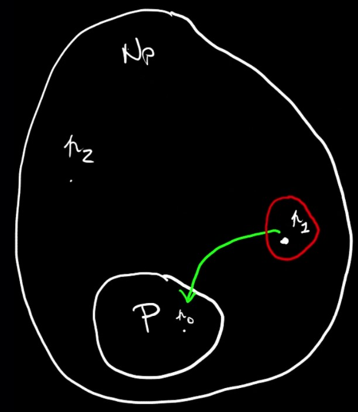
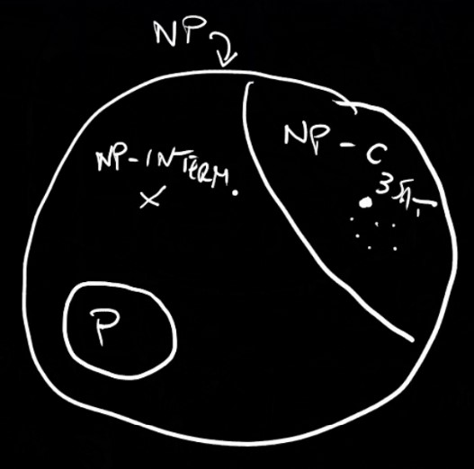
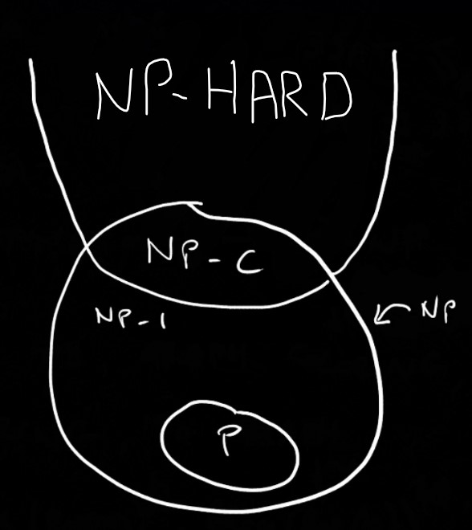

prof: Barenghi Alessandro 

# Dynamic Programming 
Generalizzazione di divide et impera. In generale quando dei sottoproblemi di un problema sono 'uguali' alla soluzione del problema . 
Ci sono problemi in cui tali sottoproblemi non 'si sovrappongono' in altri casi invece si, e qui entra la DP che fa uso di 'look up' , cioè si salva le informazioni già calcolate. 

---- 
## Algoritmi Greedy 
Sono algoritmi che analizzano ottimi locali. 

----
# Complessità computazionale 
Posso classificare i problemi in base alla loro complessità? 

- $D_{time}(f(n))$: insieme di tutti i problemi per cui esiste un algoritmo in $O(f(n))$
- $N_{time}(f(n))$ come $D_{time}(f(n))$ ma solo per MT non deterministiche. 

Problemi polinomiali: $P_{mt det}=\cup D_{time}(f(n^k))$

Sovrainsieme dei problemi risolvibili con una MT non deterministica in maniera polinomiale. 
$$NP = \cup N_{time}(f(n^k))$$

*Ricordiamoci che una MT ND fa tutto quello che fa una MT D .. letteralmente è come se provasse tante MT D in parallelo raggiungendo la soluzione. Il fatto è che noi per certi problemi non riusciamo a risolverli con una MT D e basta*.

Esiste un algoritmo che risolve i problemi di NP in P? 
cioè .. P=NP? 

- Riduzione di Turing: riduco prob. A in B, significa che A può essere risolto sapendo risolvere B. Cioè effettivamente è come se risolvessi la funzione A() con dentro la funzione B().

- Riduzione di Cook: riduzione di Turing ma chiamo B in A un numero **polinomiale** di volte. 

Due problemi hanno stessa complessità se riduco A in B e riduco B in A. 

Per ora siamo abbastanza convinti che $P \ne NP$

se P fosse NP, noi potremmo dire che risolvere una formula 3-sat sarebbe difficile tanto quanto verificarne la correttezza. Che tradotto significherebbe dire che trovare una dimostrazione è tanto difficile tanto quanto dimostrarne la correttezza, concetto che va un tantino in contrasto con quello fin'ora fatto dall'umanità. 

> Se è vero che trovare la dimostrazione di NP=P è tanto difficile tanto quanto verificarne la correttezza perchè non ci siamo ancora riusciti? 

