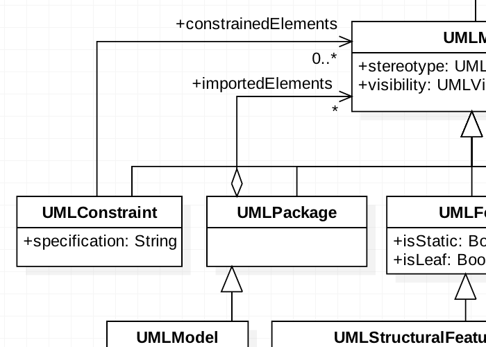

\maketitle
\newpage
\tableofcontents
\newpage


# Introduzione

> Software Engineering is art. 

Lo sviluppo software non è solo l'eseguibile, nè il sorgente. Lo sviluppo software comprende tutti gli artifatti, documentazione etc. 

> Software Engineering è la gestione dell'attività di sviluppo del software secondo criteri ingegneristici

La produzione software, a differenza di altri ambiti ingegneristici in cui il prodotto finale 'si produce' , lo si progetta e i requisiti di progetto non vengono mai congelati: la particolarità del software è proprio di essere bello flessibile durante quasi tutta la sua realizzazione.

# Lifecycle del software
## Waterfall 

- studio fattibilità 
- analisi e specifiche
- progettazione 
- implementazione e test
- integrazione e test di sistema
- messa in opera 
- manutenzione
Troppo statico e rigido, utilizzabile solo in progetti 'critici' in cui il rigore, la precisione e sicurezza ha più priorità rispetto alla flessibilità. 
Modello che ha la sua età .. in origine non considerava neppure una fase di 'manutenzione'.

> Manutenzione? no -> non c'è mica usura. 

In realtà sappiamo che oggi giorno la manutenzione è sempre più rilevante ... il software infatti si 'evolve' durante lo sviluppo .. cambiamento del contesto, cambiamento dei requisiti e specifiche magari non note/mal implementate inizialmente. 

Classifichiamo diversi tipi di manutenzione:

- correttiva
- adattiva
- perfettiva

> Costo delle correzioni ritardate è esponenziale. Attività di testing dovrebbe quindi essere costante, poichè rimediare gli errori in uno stato avanzato del processo è estramamente costoso. 


Il ciclo a cascata non risponde alla esigenze di manutenzione, quindi ha senso solo per programmi il cui focus è la correttezza (il software di un aereo). Non ha senso per un sito di e-commerce (esempio).
Il ciclo a cascata è inoltre 'black-box' .. 0 interazioni con l'utente a parte l'inizio e la fine. 

## Agile 

Sostanzialmente i modelli agili o extreme programming & co sono modelli a cascata iterati all'infinito. Continue versioni diverse.. microcicli di vita. Per ogni microciclo, o 'sprint', i requisiti sono congelati. Alla fine del microciclo si possono eventualmente cambiare i requisiti. Introduzione di **backlog**, cioè una lista ordinata per priorità di funzionalità da introdurre. 

### Extreme Programming 

Continuo riaggiustamento .. si continua a buttare via un sacco di codice .. ''non mi deve far spaventare il continuo cambiamento''. 

> Non fossilizzarti a prendere la decisione perfetta. 


{width=50%}

### DevsOps

Le aziende che tipicamente potrebbero avere maggiori benefici da un orientamento DevOps sono quelle con rilasci di software frequenti. Il metodo DevOps aiuta le aziende nella gestione dei rilasci, standardizzando gli ambienti di sviluppo. L'integrazione DevOps ha come obiettivo il rilascio del prodotto, il testing del software, l'evoluzione e il mantenimento in modo tale da aumentare affidabilità e sicurezza e rendere più veloci i cicli di sviluppo e rilascio. Molte delle idee che costituiscono DevOps provengono dalla gestione di sistemi aziendali e dalla metodologia agile.
I teams che adottano la cultura, le procedure e gli strumenti DevOps ottengono prestazioni elevate e creano più rapidamente prodotti, incrementando la soddisfazione dei clienti.


## Riassunto modelli di sviluppo


# Object Oriented Programming 

## Introduzione OOP

Il linguaggio C è un linguaggio procedurale (procedure = funzioni): ogni programma viene decomposto in "moduli" sempre più semplici implementabili in procedure e funzioni. 
In OOP i "moduli" non sono solo funzioni ma anche classi. 
Ogni modulo è quindi una interfaccia con una specifica e ben definita sintassi. Per contro esiste l'implementazione, cioè una parte interna. 
Interfaccia svolge quindi il ruole di ponte tra il modulo e i clienti (utilizzatori).
Una buona modularizzazione facilita il riuso e influenza positivamente la verificabilità (partendo dal presupposto che ogni componente è corretto, se riscontro problemi so che è colpa solo di come li ho collegati tra loro), manutenibilità e comprensibilità.
L'approccio tradizionale top-down è adatto a progettare algoritmi ma non sistemi di grosse dimensioni. 

## Java ed ereditarietà 

Polimorfismo/ereditarietá è la capacità per un elemento sintattico di riferirsi a elementi di diverso tipo. In Java una variabile di un tipo T può riferirsi ad un qualsiasi oggetto il cui tipo sia T o un sottotipo di T. 

Una sottoclasse (o sottotipo) di una classe eredita metodi e attributi dalla sopraclasse. Posso quindi assegnare dinamicamente a oggetti di tipo sopraclasse, oggetti della sottoclasse.
Nota: la sottoclasse eredita tutti i metodi ma soltanto gli attributi *protected* . 

Java garantisce che la sostituibilità non comprometta la type safety: cioè il compilatore verifica che ogni oggetto venga manipolato correttamente in base al tipo statico e garantisce che a runtime non sorgano errori se si opera su un oggetto il cui tipo dinamico è un sottotipo del tipo statico.

Il tipo statico è quello definito dalla dichiarazione mentre il tipo dinamico è definito dal costruttore usato per definirlo e può essere sottotipo del tipo statico (ma non viceversa):

````Java
Automobile myCar = new Automobile(); 
Teslino yourCar = new Teslino(); 
myCar = yourCar;
````

### Regola d'oro ereditarietà:

- non è possibile assegnare ad una sottoclasse la propria sopraclasse (anche se interfaccia). 


## Overloading e overriding

Il compilatore, quando trova una chiamata di un metodo risolve staticamente l’overloading, individuando il metodo chiamato in base al tipo statico. 

Altrimenti se un metodo della sopraclasse non è statico e viene chiamato da un oggetto il cui tipo statico è la sopraclasse, ma il tipo dinamico è la sottoclasse, tale metodo della sottoclasse che lo ridefinisce (overriding) sarà soggetto a **binding dinamico**. Cioè dinamicamente a *runtime*, il compilatore 'sceglierà' di utilizzare l'implementazione della sottoclasse. 

Il binding dinamico si applica a run-time: il codice sceglie a runtime il metodo “più vicino” tra quelli che hanno il prototipo stabilito staticamente.

### Regola d'oro:

- si applica binding dinamico solo se si ridefinisce il metodo facendo **overriding** , **non** se ne si aggiunge un altro con diversa *segnatura*.


## Binding su parametri

Ricorda che Java quando viene chiamata una funzione con parametro, Java guarda il tipo statico di tale parametro! 
Java quando fa overriding, **non guarda eventuali tipi dinamici dei parametri** ma sempre e solo tipi statici! 
Tipi dinamici non influenzano la chiamata e la decisione. L'unico modo per fare 'overriding' in base al parametro é utilizzando un **casting** esplicito.

### Casting 

Il casting da una classe a una sopraclasse è un’operazione SEMPRE consentita. L’operazione di casting viene eseguita inserendo tra parentesi tonde il nome della classe nella quale si vuole convertire un oggetto.
Invece il casting da una classe a una sottoclasse è possibile solo se l’oggetto  è veramente un esemplare della sottoclasse (cioè a livello dinamico è davvero il sottotipo), altrimenti non è permesso.
Il controllo della correttezza di questo casting può essere fatto solo durante l’esecuzione (run-time). Se il casting non è permesso, viene segnalata l’eccezione ````ClassCastException````.

## Attributes

Keywords: 

- ````public //ovunque````
- ````protected //stesso package e sottoclassi della classe
- ````private //solo stessa classe````
- ````static````

Con la keyword 'static' posso far si che un attributo (ma anche metodo) può essere modificato/letto senza per forza istanziarne una classe. Gli attributi statici vengono condivisi tra tutti gli oggetti. I metodi statici non sono soggetti ad overriding ma sono soggetti a overloading.

## Interfacce
Le interfacce sono classi astratte che non implementano i propri metodi, ma li definiscono solo.
Una qualsiasi classe che implementa una interfaccia **deve** fare overriding su **ogni** metodo dell'interfaccia.
Le interfacce sono utilizzate come un ulteriore livello di information hiding, ma anche come 'trick' per avere una sorta di multi-ereditarietà. Infatti le classi non possono ereditare da più classi, ma possono implementare più classi (separate da virgola al momento dell'implementazione). 


### Collezioni e mappe varie in Java


### Iterators

````Iterator<E>```` è un'interfaccia che permette di scandire e rimuovere oggetti da collezioni. È composta dai metodi:
````boolean hasNext()```` restituisce True se c'è un elemento successivo, mentre  ````next()```` restituisce l'elemento successivo.
````remove()```` rimuove l'elemento corrente.

````Java
class MyIterator implements Iterator<E> {
public boolean hasNext() {
...
}
public E next() throws NoSuchElementException {
...
}
public void remove() throws UnsupportedOperationException {
...
}
}
````

Con Iterator è poi possibile usare il for generalizzato (o il metodo ````forEach()````  ) su oggetti che implementano tale interfaccia.

````Java
operations.forEach(System.out::println)
````

## Exceptions 
Un’eccezione è un oggetto speciale restituito da un metodo. 
Le eccezioni vengono segnalate al chiamante che può gestirle nella maniera più opportuna. Le eccezioni sono classi come altre che estendono la classe ``
````Exception````.  

```Java
public void faiQualcosa() { 
	try { 
		leggiFile();
	 } catch(FileInesistenteException fi) { 
	 System.out.println("Ooops! Il file non esiste!"); } 
	 catch(FileDanneggiatoException fd) { 
	 System.out.println("Ooops! Il file ha dati scorretti!"); 
	 }
```

Per sollevare esplicitamente un’eccezione, si usa il comando throw, seguito dall’oggetto (del tipo dell’eccezione) da “lanciare” al chiamante e per terminare immediatamente l’esecuzione del blocco di codice. 

````Java
public int fuck(int n){
	if (n<0) 
		throw new NegativeException(); 
	else if (n==0 || n==1) return 1; 
	else return (n*fuck(n-1)); 
	}
````

Un blocco try/catch può avere un ramo finally in aggiunta a uno o più rami catch: Il ramo finally è comunque eseguito sia che all’interno del blocco try non vengano sollevate eccezioni, sia che all’interno del ramo try vengano sollevate eccezioni gestite da un catch.
Nell'ultimo caso il ramo finally viene eseguito dopo il ramo catch gestisce l’eccezione. 
Le eccezioni possono contenere dati che danno indicazioni sul problema incontrato e possono anche essere definite dall’utente.

````Java
public class MyException extends Exception {
	public MyException() {
		super();
	}
	
	public MyException(String s) {
		super(s);
	}
}
````


## Recap OOP

I principali concetti da portarci a casa sono quindi:

- polimorfismo ed ereditarietà: se x è persona e uno studente è una persona. Ad x posso assegnare uno studente. Ma se x è uno studente non posso assegnarli una persona. La classe deve 'inglobare' la sottoclasse.
- late binding: a causa del precedente punto, cioè a causa del polimorismo, il compilatore non sarà in grado a priori di sapere qual è il sottotipo associato all'oggetto se non al momento dell'invocazione (runtime). Il late binding si riferisce proprio a questo aspetto, cioè al fatto che la funzione e il sottotipo vengono **bindati dinamicamente**.
- information hiding: nascondo all'utilizzatore come è fatto il mio modulo.
- incapsulamento: non posso accedere alle informazioni se non attraverso i metodi.

# UML 


### Struttura base classe:


### Tipi di relazione:
{width=50%}

- associazione: i due componenti sono semplicemente associati. In genere hanno un nome (verbo) e una molteplicitá 
- aggregazione: un componente logicamente viene aggregato dal componente superiore
- composizione: é una aggregazione forte... se il contenitore viene eliminato, anche i contenuti vengono eliminati. Tipico esempio:  mazzo e carte 

	
- ereditarietá: esprime l'ereditarietá 
- dipendenza: 'relazione di utilizzo'
- implementazione: usato per indicare l'implementazione delle interfacce 

### Diagrammi di sequenza 

Dall'alto verso il basso si puó leggere la sequenza di una operazione tra piú classi. In genere si costruisce prima il diagramma di classe e poi quello di sequenza.


- Frecce piene se il messaggio é sincrono 
- Frecce vuote se il messaggio é asincrono 
- Frecce tratteggiate se il messaggio é una risposta


{width=20%}


# Java e Pattern Designs 
Classificazione patterns: 

- creazionali : riguardano la creazione di oggetti
- strutturali : riguardano la composizione di classi
- comportamentali : si occupano di come interagiscono tra loro gli oggetti

### Creational Patterns 

- Abstract Factory: crea istanze specifiche/appropriate usando la Concrete Factory  
- Concrete Factory: implementa l'interfaccia della AbstractFactory per far si che si fa il giusto override. 

Lo stesso (abstract/concrete) per i prodotti. 


- Singleton:  una classe la cui istanza é sempre singola. 

### Structural Patterns 

- Adapter: per matchare interfacce diverse 


- Bridge: per separare l'interfaccia di un oggetto dalla sua implementazione
- Decorator: per aggiungere responsabilitá/funzionalitá ad oggetti esistenti dinamicamente 

{width=50%}

- Facade: una classe che rappresenta un insieme di altre classi e maschera la complessitá. 

 

- Flyweight: un'istanza 'leggera' usata per condividere risorse
- Proxy: Un oggetto che rappresenta un altro oggetto, in genere usato per evitare di istanziare oggetti pesante se non veramente necessari.

{width=50%}
{width=50%}

### Behavioral Patterns 

- Chain of Responsability: un modo per 'passare' una richiesta in una serie di classi a mo' di catena di montaggio nella quale ogni classe adempie alla propria responsabilitá.
- Command: incapsula una richiesta in una classe command, per 'standardizzare' le richieste.
- Iterator: per accedere sequenzialmente ad una collezione. 
- Mediator: per semplificare la comunicazione tra classi 
- Memento: per 'snapshottare' lo stato di una classe
- Observer: un modo per notificare agli oggetti 'Listeners' o 'Observers' un cambiamento sul oggetto osservato. 


- State: un oggetto la cui configurazione cambia a seconda dello stato (che varia a runtime).


- Strategy: incapsula gli algoritmi all'interno di una classe: utili per quei casi in cui é necessario cambiare/scegliere un algoritmo dinamicamente. 

- Comparator: Implementazione di una generica interfaccia Comprator per comparaare oggetti di tipi diversi. 

- Template Method
- Visitor
- MVC: 
	- Model: dove risiede la logica dell'applicazione 
	- View: visualizza i dati del Model 
	- Controller: riceve i comandi dell’utente (generalmente attraverso il View) e li attua modificando lo stato degli altri due componenti


# Threads 

In Java, la classe Thread in realtà implementa un’interfaccia chiamata Runnable, la quale definisce il metodo run() , il quale contine il codice del thread. 
In Java i metodi che contengono sequenze di operazioni le quali accedono a dati condivisi vengano eseguite dai diversi thread in mutua esclusione specificando tali metodi con la parola chiave ````synchronized```` .

Il linguaggio Java assegna un intrinsic lock a ciascun oggetto. 
Quando un metodo ````synchronized```` viene invocato, viene eseguita la seguente serie di istruzioni: 

1) Il programma controlla l’esecuzione di metodi synchronized 
2) se nessuno é in esecuzione, l’oggetto viene bloccato (assume quindi uno stato locked) automaticamente. Altrimenti, se l’oggetto é giá bloccato, il task chiamante viene sospeso fino allo sblocco.
3) Il lock viene acquisito automaticamente  
4) Il metodo viene eseguito 
5) Il lock viene rilasciato automaticamente

### wait() 

Per rilasciare il lock sull’oggetto e sospendere il task, si usa l’istruzione wait() ;  sará poi l’istruzione notify() di un altro metodo ad eventualmente far riprendere il thread.  


````Java
class CrazyTest {
private boolean randomStuff;

	synchronized public void crazyMethod() {
		while (!randomStuff) {
			try{
				wait(); //the thread is waiting
			}catch(Final InterruptException e){
				e.printStackTrace();
			} 
		//crazy lines after waiting
	}

	synchronized public void crazyMethodThatNotify() {

		//doing something awesome

		randomStuff=true;

		notifyAll(); // o notify()

	}
}
````

Si può inoltre applicare un lock ad un oggetto all'interno di un metodo tramite ````synchronized(ObjectToLock)```` , che blocca l'oggetto fino al termine del codice del blocco. In generale la regola da seguire è di sincronizzare tutti gli oggetti mutabili e accessibile da più threads. 

````Java
class AwesomeTest{

	public void method(stuff) {
		synchronized(this) {
			.... //code while LOCK
		}
		//UNLOCK
	}

}
````


L’accesso ai campi static é controllato da un lock speciale, diverso da quelli associati alle istanze della classe. 
````static synchronized```` é una cosa piú generale: a livello di classe e non di oggetto singolo. Ad esempio per un attributo static (quindi un attributo che é sopra la singola istanza, ma é a livello di classe) puoi fare uno synchronized static che "estende la sincronizzazione anche a livello di classe" .


{width=25%}

In caso di sincronizzazione statica su un attributo della classe dei due oggetti, si sincronizzeranno anche i threads di colore diverso. Senza static, i threads si sincronizzeranno solo con quelli dello stesso colore/operanti sullo stesso oggetto. 


Con synchronized si possono comunque creare le solite possibile situe legate  ai Threads: 

- Deadlock: due o più thread sono bloccati per sempre, in attesa l’uno dell’altro.
- Starvation: un thread o piú hanno difficoltà a "vincere" e lockare l'accesso a una risorsa e quindi hanno difficoltà a procedere. 
- Livelock: errore di progetto che genera una sequenza ciclica di operazioni inutili ai fini dell’effettivo avanzamento della computazione. (loop)

## New Thread esplicito

````Java
public void methodOnNewThread(){
	
	
	new Thread( () -> method()).start();

	//oppure
	 
	new Thread(){
		public void run(){
			method();
		}
	}.start();
	
}
````


Per lanciare pezzi di codice on the fly in un thread separato rispetto al chiamante. Ovvero, il chiamante ritorna subito, mentre il thread separato esegue il vero e proprio metodo in 'differita'.

## Locks
Synchronized definisce un caso elementare di lock (implicito), ma meccanismi più sofisticati sono forniti dal package ````java.util.concurrent.locks````. 
  
Un lock, definito dall’interfaccia lock, può essere acquisito da un solo un thread, come nel caso degli “implicit lock” associati a codice synchronized ma é piú avanzato, poiché permette ai thread di 'ritararsi' usando metodi tipo tryLock(). 

Da ````java.util.concurrent.locks```` è possibile utilizzare un lock esplicito, dichiarando esplicitamente un lock e poi in un try statement provare ad attivare il lock e infine rilasciarlo nel finally statement.

````Java
// Crea un lock
Lock lock = new Lock();
try {
	// Prova ad attivare il lock
	Boolean isLocked = lock.tryLock();
	// ...
} finally {
	// Disattiva il lock
	lock.unlock();
}
```` 

## Variabili atomiche 

Le variabili atomiche, dichiarate in java.util.atomic , sono un'implementazione più fine di alcuni tipi di synchronized statements, come per esempio un counter. Si specificano le singole variabili come Atomic e si può interagire con esse tramite appositi metodi.
````Java
import java.util.concurrent.atomic.AtomicInteger;
class AtomicCounter {
	private AtomicInteger c = new AtomicInteger(0);
	public void increment() {
		// Sommo 1 a `c`
		c.incrementAndGet();
	}
	
	public void decrement() {
		// Sottraggo 1 a `c`
		c.decrementAndGet();
	}
	public int value() {
		return c.get();
	}
}
```` 

## Executors 

Gli strumenti finora disponibili impongono una stretta relazione tra il compito che deve essere eseguito da un thread e il thread stesso. I due concetti possono essere tenuti distinti in applicazioni complesse, mediante apposite interfacce. Gli esecutori consentono una gestione efficiente che riduce il pesanti overhead dovuto alla gestione dei thread. 
Se $t$ è un Runnable ed $e$ è un Executor:

````Java
// new Thread(r)).start(); 
e.execute(r); 
````  

# Progettazione 

## SOLID

In ambito di progettazione software é utile tenere in mente i principi SOLID: 

### Single-responsability principle

Ogni elemento di un software, che sia una classe, una funzione o una variabile deve avere al suo interno una sola responsabilitá. 

### Open–closed principle
Un modulo dovrebbe essere aperto per le estensioni, ma chiuso per le modifiche. Vogliamo cioé essere capaci di cambiare il comportamento delle classi senza cambiarne il codice sorgente (se non modifico, non faccio errori).

### Liskov substitution principle
Gli oggetti della sottoclasse devono rispettare il contratto (ossia la specifica) della superclasse permettendo quindi che una qualsiasi classe di un certo tipo puó essere sostituita da un qualsiasi classe del sottotipo senza “accorgersi" della differenza. 

Regole da seguire per permetterlo: 

- regola della segnatura: un sottotipo deve avere tutti i metodi del sopratipo e le segnature dei metodi del sottotipo devono essere compatibili
- regola dei metodi: i metodi in overriding devono avere lo stesso comportamento/scopo dei metodi del supertipo
- regola della proprietá: il sottotipo deve rispettare l'invariante del supertipo. 

### Interface segregation principle 
Sarebbero preferibili più interfacce specifiche, che una singola generica.

### Dependency inversion principle
Dipendere dalle astrazioni, non dagli elementi concreti cioé invertire la pratica tradizionale secondo cui i moduli di alto livello nelle gerachia di ereditarietà dipendono da quelli di basso livello. **Quindi dipendere da interfacce e classi astratte, non da metodi e classi concrete**. Ogni classe C che si ritiene possa essere estesa in futuro, dovrebbe essere definite come sottotipo di un'interfaccia o di una classe astratta A – Tutte le volte che non è strettamente indispensabile riferirsi ad oggetti della classe concreta C, è meglio riferirsi invece a oggetti il cui tipo statico è la classe astratta A, non C – In questo modo, sarà più facile in seguito modificare il codice client per utilizzare invece di C altre classi concrete sottotipi di A. 


## Aspetti strutturali del software
La “correttezza funzionale” di un progetto è fondamentale ma possiamo anche valutarlo rispetto a requisiti strutturali: 

- Accoppiamento
- Coesione 
- Principio open-closed

### Accoppiamento 
Un alto grado di accoppiamento significa alta interdipendenza tra le classi e quindi difficoltà di modifica e manutenzione.  Un basso accoppiamento è requisito fondamentale per creare un sistema comprensibile e modificabile nel tempo. 
Le forme da evitare si hanno quando un metodo manipola direttamente le variabili di stato di altre classi e scambia informazioni attraverso variabili temporanee. Per ridurre l’accoppiamento i metodi dovrebbero passare la minor quantità di informazione possibile attraverso il minor numero di parametri. 

### Cohesion
Solo gli elementi fortemente correlati dovrebbero stare nello stesso modulo. Il modulo rappresenterebbe una chiara astrazione e sarebbe più semplice da capire. Alta coesione solitamente porta a basso accoppiamento. 
Tre tipi di coesione: 

- method 
- class 
- inheritance

## Metriche di un software 
E’ possibile definire delle misure (dette metriche) di queste caratteristiche: 

- Weighted Methods per Class (WMC): Numero dei metodi pesati per la loro complessità. In genere la maggior parte delle classi dovrebbe avere un numero limitato di metodi, essere semplici e fornire astrazioni e operazioni specifiche.
- Depth of Inheritance Tree (DIT): In genere le classi sono solitamente “vicine” alla radice e si tende a non sfruttare al pieno l'ereditarietá (favorendo comprensibilità rispetto a riusabilità). 
- Number of Children (NOC) 
- Coupling Between Classes (CBC): si tende a scrivere classi auto-contenute, cioé poco accoppiate
- Response for a Class (RFC): Il numero totale di metodi che possono essere invocati da un oggetto della classe.
- Lack of Cohesion in Methods (LCOM): cattura la “vicinanza” tra i metodi di una classe, cioé misura quanto accedono a variabili/attributi comuni. 

## Software malfatto:

- Rigido: la tendenza del software ad essere difficile da cambiare, anche in modo semplice (quando c'é un alto livello di accoppiamento). 
- Fragile: la tendenza del software a “rompersi” in molti punti ogni volta che viene cambiato un aspetto. 
- Immobile: l’incapacità di riusare software da altri progetti o da altre parti dello stesso progetto 
- Viscoso: quando l’uso di anti-pattern, scorciatoie e metodologie notoriamente errate è più facile dell’uso dei metodi che rispettano il progetto. Cioé se scrivi un softwate in cui é piú facile fare la cosa sbagliata e difficile fare quella giusta allora hai scritto un software troppo viscoso. 

Consigli pratici per software di qualitá: 

- Minimizzazione dell’interfaccia: se non serve che sia pubblico sempre privato. Tutti i getter che vuoi (anche se di solito é assurdo avere tanti getter), ma meno setter possibili. 
- Pochi parametri nei metodi: meno parametri possibili. Particolarmente pericolose sono parametri di fila dello stesso tipo .. Un’inversione non genera errori di compilazione ma provoca malfunzionamenti difficilmente diagnosticabili. 
- Metodi di piccole dimensioni
- Spostare i metodi nella classe in cui sono definiti i dati che usano. 
- Sostituire l'uso dello Switch con ereditarietà, enum, pattern (State).
- Non usare gli Anti-Pattern!: classe BLOB che contiene tutto, codice duplicato, metodi lunghi (se il codice di un metodo diventa troppo lungo per poterlo capire facilmente, bisogna estrarne delle parti come metodi di servizio). 
- Usare poco eccezioni non é una buona cosa

## Refactoring 
Refactoring é cosa buona e giusta: È abbastanza difficile fare la cosa giusta al primo colpo. Ovvero il miglioramento del progetto del codice esistente senza cambiarne il comportamento. 

## Commentare 
Nei linguaggi OO è generalmente una buona idea fornire un commento all’inizio di ogni metodo, che dettagli il significato del metodo, eventuali vincoli, requisiti ecc . 
Se si può rendere il codice abbastanza chiaro da poterlo considerare autocommentato, questo è ciò che va fatto .. occorre commentare solo quando è necessario dire qualcosa con maggiore chiarezza di quanto non possa fare il codice. 

### Convenzioni di programmazione

- Nomi di classi e interfacce hanno l’iniziale maiuscola: 
- Nomi di variabili e metodi (in Java, c# no ad esempio) iniziano sempre con una minuscola. 
- I nomi delle costanti sono completamente maiuscoli.
- Se il nome è composto da più parole, ciascuna di queste è scritta con l’iniziale maiuscola

# Programmazione Funzionale 

{width=50%}

Erlang, Lisp e Haskell sono linguaggi puramente funzionali. 

## Functional Interfaces
Da java 8 abbiamo zucchero sintattico che ci permette di semplificare ad esempio la dichiarazione di un comparator in questo modo: 

````Java
Comparator c = (Persona p1, Persona p2) -> {
if (p1.getEta() < p2.getEta()) return -1; 
else if (p1.getEta() > p2.getEta()) return 1; 
else return 0; };
````

*Alternativamente senza usare questa functional interface avremmo dovuto fare la classe Comparator che implementava l'interfaccia comparator di Persona e che faceva quindi overriding del metodo compare(Persona 1, Persona 2) .*

Tutte le interfacce con un solo metodo possono essere viste come Functional Interfaces in Java , dunque ad esempio anche l'interfaccia Runnable lo :

````Java
Thread t = new Thread(() -> doSomething()); 
t.start();
````

*Nota: doSomething() é la funzione svolta dall'unico metodo dell'interfaccia, cioé il metodo run.*

## Stream
Gli stream permettono di concatenare funzioni che agiscono su collection. Partendo da una Collection il metodo stream() ritorna un oggetto Stream, il quale possiede diversi metodi utilissimi: 

- ````forEach()````: nel caso ad esempio di una lista di stringhe posso applicare un metodo per ciascun input. Attenzione che questa funzione **non trasforma** .. esegue soltanto un'operazione con gli elementi ma non sugli elementi. 

````Java
list.stream().forEach(String episode -> { 
	WatchList.add(episode); 
	// ... 
	});
````

- ````map()````: applica la funzione in ingresso che mappa da dominio U a dominio T e la applica a ogni elemento dello stream di U, ottenendo un nuovo stream di T. 

````Java
//Two equivalent expressions: 
list.stream().map(x -> x.size());
lis.stream().map(x::size())
````
Per funzioni piú complicate posso proprio scrivere cosí: 
````Java
list.stream().map((x) -> {
x.size(
return 
}
));
````
*Da una lista di stringhe ottengono una lista di interi* . 

- ````filter()````: nel caso ad esempio di una lista di interi posso applicare filter(predicato) che mi filtra la lista, eliminando gli elementi che non soddisfano il predicato.

````Java
list.stream().filter(x -> x%2 == 0);
````
- ````distinct()````: elimina i duplicati degli oggetti U (deve essere definita la equals(U))
- ````flatMap()````: funzione simile a map() ma mappa da dominio U a dominio Stream\<T>
- ````sum()```` o ````average()````: sono funzioni di riduzione poiché riducono (al contrario di flatMap()) uno stream in un unico elemento.
- ````reduce()````: puó essere esplicitata la propria funzione di riduzione. Gli argomenti di tale funzione sono il valore identitá (iniziale) e la funzione lambda che si basa su $acc$ e $elem$ ; cioé rispettivamente un elemento successivo nello stream/lista e il risultato parziale. 
````Java
listOfIntegers.stream().reduce(0, (elem, acc) -> elem + acc));
```` 
Altro esempio con reduce() per il calcolo del massimo:  

````Java 
final int maxExpensive = prices.stream().reduce(0, Math::max);
````

- ````parallel()````:gli elementi di uno stream se sono indipendenti tra loro possono essere analizzati in parallelo.

- ````collect()````: utile ad esempio per collezionare lo stream in una lista: 

````Java
listOfIntegers.stream().collect(Collectors.toList()) 
/*
// Nel caso di strutture dati “standard” esistono collectors predefiniti: toList(), toSet(), toMap() 
*/

````


- ````orElse(T other)````: se lo Stream() non restituisce nulla, si forza la restituzione del oggetto other di tipo T (qualsiasi oggetto).  Un esempio è quando findFirst() ritorna un optional e si usa .orElse(null) per ottenere effettivamente un valore. 
````Java
//longestInUppercase
people.stream().filter(name -> name.equals(name.toUpperCase())).reduce((name1,name2) -> name1.length()>=name2.length() ?name1 : name2).orElse("n.a.");
}
````

- ````count()```` : alla fine se mi serve il conto 

- ````sorted(Comparator comparator)````: prende in ingresso uno stream e opzionalmente, puó prendere in ingresso un comparator per ordinare gli elementi. 

### Esempio Optional 

````Java
public static void longestName(List<String> names) { 

final Optional<String> theLongest = friends. stream().reduce((namel, name2) -> namel.length() >= namel.length() ? namel : name2); 

theLongest.ifPresent(name -> System.out.println(String.format("The longest name: %s", name))) 
````


Uso di Optional L’accesso al valore all’interno di un Optional puó avvenire tramite: 

- ````o.ifPresent()```` : prende in ingresso una funzione che accetta T e ne fa uso 

- ````o.flatMap()````: prende in ingresso una funzione da T a Optional. Ritorna un Optional se é empty. 

- ````o.orElse()````


# ADT e JML

## ADT

From wikipedia: 
> An **abstract data type** (**ADT**) is a class of objects whose logical behavior is defined by a set of values and a set of operations. This is analogous to an algebraic structure in mathematics.
>  An ADT is defined by its behavior from the point of view of a **user**, of the data, specifically in terms of possible values, possible operations on data of this type, and the behavior of these operations. This mathematical model **contrasts with data structures** , which are **concrete** representations of data, and are the point of view of an implementer, not a user.

Un tipo sarà definito dai possibili valori assumibili e operazioni. Tale tipo avrà una specifica astratta, la quale si distinguerà dall'implementazione dell' oggetto concreto. 

- Specifica $\rightarrow$ condizioni che l'oggetto astratto rispetta
- Implementazione $\rightarrow$ algoritmo e struttura dati nei metodi 

Le operazioni effettuabili su ADT si possono classificare in:

- creators: crea oggetti (in genere costruttori se non sono producers)
- producers: produce oggetti usando altri oggetti dello stesso tipo
- mutators: modificano ADT
- observers: in genere puri 

Un ADT può essere: 

- Mutable: richiede almeno metodi creators, observers e mutators
- Immutable: richiede almeno creators, observers e producers 

## JML 

JML (Java Modelling Language) viene utilizzato per definire precondizioni/postcondizioni e invarianti di oggetti/metodi in linguaggio naturale/matematico.

````//@````  per ogni riga,  oppure 
````/*@   */```` .
````//@requires````  per le precondizioni e 
````//@ensures```` per le postcondizioni.

## Specifiche parziali 

Le specifiche parziali sono specifiche, 'contratti' che devono essere rispettati da un metodo. Si dicono parziali poichè pongono vincoli sugli input. 
Quindi sono scomponibili in precondizioni e post condizioni. e non in 'condizioni'. 
Indica che cosa è vero quando il metodo lancia un'eccezione.

Robe usabili: 
````Java
/result  
/old(Exp) //valore prima della espressione
&& , || , ! , ==>, <==, <==>, <=!=> //espressioni logico matematiche usabili
(\forall variable, range, condition)
(\exists variable, range, condition)
(\num_of variabile; cond. ciclo (boolean); condizione (bool))
(\sum var; cond. ciclo (boolean); espressione)
(\product var; cond. ciclo (boolean); espressione)
(\min var; cond. ciclo (boolean); espressione)
(\max var; cond. ciclo(boolean); espressione)
````
## Specifiche totali 

Le specifiche totali si caratterizzano per non usare ````//@requires````  
````//@ensures```` ma per l'uso in ````&&```` delle ````/signals(Exception e) ...;```` in ````//@ensures````  . Questo per indicare la corretta throw delle eccezioni.    
Quindi il passaggio 
$Parziale \leftrightarrow totale$ è meccanico: pigli le requires, le neghi e le disgiungi tra loro. 


## Invarianti pubblici e privati 
L'invariante "cattura" ogni singolo istante del oggetto astratto e fa asserzioni riguardo quelle proprietà *che non variano mai*. 
Un invariante dichiarato “private” in JML è autorizzato a usare anche le parti private (metodi puri e attributi) della classe, altrimenti un inviarante pubblico no.
Sia la funzione di astrazione che l'invariante di rappresentazione sono in genere descritte in JML come un invariante privato. 

Ci possono essere eccezioni a questa ultima frase solo nel caso in cui si volesse esprimere il cosiddetto ' **invariante astratto** ' , cioé un invariante per la classe astratta. In questo caso allora si utilizza un public invariant. 

I metodi puri si specificano con ```` /@pure@*/ ```` e sono utilizzabili nella specifica, poichè sono 'puri' cioè non modificano lo stato interno ma agiscono da puri osservatori.

````Java
/*@ public invariant
/assert  (something)
*/
````

L'invariante non copre proprietá evolutive: tutte quelle proprietà che 'dipendono dallo stato precedente' non considerarle neanche. 

Perchè le proprietà astratte sono utili? 
Gli utilizzatori della classe possono usare le proprietà come assunzioni sul comportamento della classe.

## Abstract Function e Represantation Invariants 

Ogni ADT puó essere implementato con piú strutture dati, chiamata rappresentazione. La rappresentazione non è univoca e può essere liberamente scelta.
Esiste quindi la funzione di astrazione AF è l'entità che definisce il significato della nostra rappresentazione.
L'AF è definita solo per stati concreti validi. Per definire se uno stato è
valido o meno usiamo un altro tipo di invariante: il cosiddetto invariante di rappresentazione RI. 
La RI è una funzione caratteristica per gli stati validi: restituisce true ogni volta che lo stato è valido, falso altrimenti. 


### Abstract Function 

La Funzione di astrazione è una funzione non iniettiva che associa a ogni stato concreto al più uno stato astratto: molti stati concreti possono essere associati allo stesso stato astratto (es. [1,2,5] e [2,1,5] corrispondono allo stesso stato astratto {1,2,5} nel caso del ADT dell'insieme di interi).


Se con il RI specifichiamo 'quali stati sono legali'; con l'AF associamo gli **stati astratti** con gli stati concreti che rispettano le proprietà del RI:
L'AF si rappresenta con un private invariant, che mette in relazione gli **attributi privati** e gli **observer pubblici**.

Consiglio: definisci i metodi base/pure sui quali si appoggiano tutti gli altri. 


### Representation Invariant

Il rep. invariant definisce quali rappresentazioni sono legali (true). Il RI deve essere verificato in tutti gli stati osservabili dagli utilizzatori.
Un RI è un modo molto preciso per descrivere le ipotesi da rispettare **sempre** perchè una rappresentazione dell'ADT sia **legale**, e dunque valga la funzione di astrazione.

#### esempio RI e AF:

Ad esempio nel caso di un ADT che usa come implementazione un array (**attributo privato**):

- l'RI specificherà ad esempio il fatto che l'array non dovrà mai essere nullo e che se contiene elementi ciascun elemento non dovrà mai essere nullo (in qualsiasi istante)
- l'AF specificherà che l'**observer pubblico** del ADT ````.size()```` dovrà essere uguale al metodo ````array.size()```` , dove array è l'**attributo privato**. 

Nel AF in genere si specificano le condizioni riguardo **attributo privato** $\rightleftarrows$ **observer pubblico** . 


## Don't expose your rep! 

Errore comune puó essere quello di 'esporre il rep' : cioé ritornare la referenza ad un oggetto mutabile del rep o inserire nel rep un oggetto mutabile. 
In entrambi i modi permettiamo di modificare il rep esternamente e quindi invalidarlo. 

## Extra, C# Code Contracts
Cosí come in Java esiste JML, anche negli altri linguaggi di programmazione in genere ci sono sistemi per modellizzare specifiche. Ad esempio in C# ci sono i ''Code contracts". Alla stessa maniera i contratti ci permettono di specificare precondizioni, postcondizioni e anche invarianti di oggetti nel framework .NET. 

# Socket e RMI

## Socket

Per i sockets vatti a leggere la documentazione. 

## RMI 

RMI, Remote Method Invocation si basa sul concetto di Proxy: in pratica RMI ci permette di accedere a un oggetto remoto con interfaccia remota come se fosse un oggetto qualsiasi in locale. 
Un paio di termini: 

- $stub$ : interfaccia locale del oggetto remoto.
- $skeleton$ : riceve i risultati del client lato server. 
- marshals/unmarshals : serializzazione

In RMI viene utilizzato un Registry per collegarci attraverso gli ip/porta ai vari oggetti, anzi interfacce di tali oggetti. 
Sostanzialmente l'interfaccia remota deve ereditare la classe Remote, mentre l'oggetto vero e proprio deve ereditare la classe UnicastRemoteObject e implementare l'interfaccia remota. 
In genere il Registry gira sulla stessa macchina del server ma in un eseguibile diverso. 

````Java
//SERVER SIDE
Server server = new Server();  
serverStub stub = server;  //interface of Server Remote Object  
Registry registry = LocateRegistry.createRegistry(PORT);
registry.bind("server", stub);  //Binding server stub
````

Il client fa 'lookup' dell'oggetto remoto utilizzando il Registry (identificato con indirizzo ip e porta) usando LocateRegistry.getRegistry. 
````Java
//CLIENT SIDE
Registry registry = LocateRegistry.getRegistry(IP, PORT); //magic
Server server = (serverStub) registry.lookup("server");
// wHat a tImE to be aLiVe!
````

# Testing 

> Il testing verifica la presenza di errori, non la loro assenza. 


## Testing e definizioni

Perché testing? Per verificare la correttezza del software rispetto la specifica. 
La verifica puó quindi cogliere se il prodotto é corretto o meno, non i reali bisogni dell'utente. Quest'ultima attivitá é legata alla validazione di un programma. 

Diverse definizioni: 

- Verifica statica automatica: analisi statica del compilatore/software su un semilavorato espresso in linguaggio formale. Permette di rilevare ad esempio variabili mai utilizzate o semplici ottimizzazioni, ma mai problemi di prestazioni. 

- Testing (analisi dinamica): in generale non é possibile testare in maniera esaustiva un software a causa della possibile infinitá di casistiche. 

- Code inspection (analisi statica): in genere effettuata da un umano rileggendo altro codice. 

- Test di regressione: quando si controlla che una nuova versione non faccia regredire nessun aspetto del programma (non voglio che nella versione 2.0 non ci siano caratteristiche soddisfatte dalla versione 1.9). 

Durante fasi di testing si possono utilizzare **stubs** e **drivers** : 

- stub: un'interfaccia che serve a emulare un modulo ancora in fase di implementazione e a sostituirlo quindi, per permettere lo sviluppo parallelo di piú moduli indipendenti 

- driver: costruzione di un oggetto che invoca l'oggetto da testare. Il contrario di stub sostanzialemente. Utilizzato molto in un approcco bottom-up , quando ovviamente partendo dall'astrazione piú a basso livello sará necessario costruire tutti gli oggetti chiamanti, dovendo testare gli oggetti chiamati. 

Durante il test si ragiona per casi limite, i quali spessono notano dettagli poco chiari delle specifiche. 
Quasi sempre negli esercizi avremo moduli white-box, cioé di cui conosciamo l'implementazione a differenza dei moduli black-box . 

Possibili coperture da valutare sono: 

- copertura di tutte le istruzioni (statements coverage)
- copertura tutte le decisioni (edge coverage)
- copertura di tutti i cammini (path coverage)


## Statements Coverage (istruzioni)

Ogni istruzione all’interno del software deve essere eseguita almeno una volta. 

## Edge Coverage (decisioni)

Il criterio di copertura delle decisioni (decision coverage, edge coverage o branch coverage) esamina ogni ramificazione all’interno del codice. Equivale a testare ogni condizione di salto (if, while, . . . ) sia per valori di verità che di falsità. Per completare questo criterio risulta necessario costruire un insieme di test tali per cui ciascuna decisione venga percorsa per i valori di verità e falsità e che ciascuna istruzione al suo interno sia eseguita almeno una volta.

## Path Coverage

Si garantisce che ogni **condizione** assuma il valore di verità e falsità almeno una volta. Questo significa che oltre a garantire la presa/rifiuto del branch, si garantisce che esso viene preso in tutti i modi possibili. Per far ciò ogni decisione deve essere scomposta in condizioni elementari, e far in modo che ciascuna condizione sia vera e falsa.


### Osservazioni Path vs Edge 

Naturalmente coprire tutte le decisioni non garantisce la copertura della condizioni. Anche il viceversa, tuttavia, non vale in generale: si tratta di casi ”patologici”, in cui il valore di verita di una condizione non cambia anche assegnando tutti i possibili di valori di verità alle condizioni elementari di cui è composta. Esempi tipici sono formule booleane sempre false o sempre vere.
Si ricorda che anche la condizione dentro il for deve essere controllata! 
