\maketitle
\newpage
\tableofcontents
\newpage

# Introduzione 

## Teorema di espansione di Shannon
$$f(x_1,x_2...x_n)=!x_1f(0,x_2,...,x_n)+x_1f(1,x_2,...,x_3)$$
(applicabile iterativamente)
dualmente:
$$f(x_1,x_2...x_n)=(!x_1+f(0,x_2,...,x_n))(x_1+f(1,x_2,...,x_3))$$

Queste formule, applicate iterativamente, ci permettono di scrivere una qualsiasi formula booleana come Somma di prodotti (Prima forma canonica) o Prodotti di somme (Seconda forma canonica) senza passare dalla classica tabella già utilizzata negli scorsi corsi. 

## Mintermine 
Mintermine è un termine prodotto in cui compaiono tutti i letterali corrispondenti a tutte le variabili della funzione e tale per cui la funzione booleana assume valore 1 in corrispondenza alla configurazioni delle veriabili definite dai letterali. 

## Maxtermine 
Maxtermine è un termine somma in cui compaiono tutti i letterali corrispondenti a tutte le variabili della funzione e tale per cui la funzione booleana assume valore 0 in corrispondenza alla configurazioni delle veriabili definite dai letterali. 

# Sintesi reti combinatorie 
Obiettivo? Ridurre complessitá di reti combinatorie. 
Metodologie di sintesi: 

- Karnaugh 
- Quine-Mc Cluskey 

## Karnaugh

Basically formula di riduzione $az + a'z = z$ applicato in maniera grafica. 

### Distanza di Hamming 

La distanza di Hamming è il numero di bit che cambiano tra due numeri espressi in binario. La regola di riduzione consiste nel identificare i termini che hanno distanza di Hamming unitaria. 

Karnaugh segue un procedimento grafico, basato su una tabella. 
La tabella é come se fosse infinita, cioé la prima riga in alto segue l'ultima riga in basso, la prima colonna a sinistra segue l'ultima colonna destra. 
Le colonne differiranno per una unitá sulla distanza di Hamming, esempio a due dimensioni: 00, 01, 11, 10 ; 
Due tipi di implicanti: 

- **Implicante primo** = raggruppamento massimo di uni.
- **Implicante primo essenziale** = implicante primo unico (tra tutti gli implicanti primi) a coprire uno specifico uno.  


 Divido l'algoritmo in 2 fasi principali:
 
- l'**espansione** in cui identifico gli implicanti e gli implicanti essenziali. 
- la **copertura**, cioé scelta del minor numero di implicanti primi. Chiaramenti dovró per forza prendere quelle essenziali, in quanto al termine di questa fase non ci dovranno essere 1 scoperti.

Potremmo utilizzare i simboli di _don't care_ "-" per indicare bit che non ci interessano. Come trattiamo i DC? all'inizio come se fossero 1 (espansione), poi dopo (copertura) come se fossero 0. 
Quando utilizziamo i DC? ad esempio quando in una rete combionatoria non é osservabile sotto certe configurazioni o non é necessario calcolarne la funzione. Karnugh viene utilizzato con poche variabili, di piú dovremmo ricorrere a piú dimensioni .. cioé piú tabelle. 

## Metodo di Quine McCluskey 
In sostanza é come Karnaugh ma utilizzando solo tabelle e 'skippando' l'uso di un metodo grafico, concentrandosi su un metodo tabulare.
Passaggi risolutivi sono:

1. Riordino dei mintermini.
2. Si notano i mintermini non  marcati (di conseguenza non sono implicanti primi).
3. Successivamente si possono trovare le configurazioni non marcate; questi costituiscono degli implicanti primi.
4. Si passa alla tabella di copertura. 
5. Si cerca di ridurre la tabella di copertura, notando che alcune colonne hanno una sola marca: sono gli **implicanti essenziali**. Di conseguenza applico tutte le regole di dominanza*. 
7. La tabella di copertura ridotta e’ vuota, è una copertura minima e (magari) unica. 

### Dominanza

La 'dominanza' esiste di due tipi: 

- **Dominanza di riga**: $P_i$ domina $P_j$ sse copre almeno i termini di $P_j$ e il costo di $P_j$ é maggiore o uguale a quello di $P_i$. Rimuovo quindi tutta la riga dominata mantenendo la dominante. 
- **Dominanza di colonna**: quando la copertura di un mintermine induce la copertura di un altro mintermine. Quella piú scomoda da imparare. Rimuovo quindi la copertura del mintermine dominato. Il senso è 'mantengo solo la colonna del mintermine il quale sono sicuro, coprendolo, implica anche la copertura del mintermine corrispondente alla colonna eliminata'. 

### McCluskey con funzioni non completamente specificate

Fai come al solito e arrivato alla tabella di copertura non consideri affatto il mintermine del $DC_{set}$ (Don't Care Set). 

# Funzioni multi uscita
Potrei minimizzare le singole funzioni e poi le 'metto insieme'. Non é l'approccio migliore.. ad esempio le due funzioni potrebbero condividere implicanti e quindi potrei ridurre/semplificare per 'avere il minimo indispensabile'.

Quindi:

- **Differenze nella fase di riordino degli implicanti**: si tiene traccia attraverso 2 bit delle funzioni che condividono tale implicante. Si scrive 01 se di una funzione, 10 se dell'altra. E quando si combinano gli implicanti attraverso le riduzioni si fa sempre l'AND bit a bit tra tali bit. Marco solo gli implicanti che possiedono nella colonna funzione i bit corrispondenti al risultato del AND. Ad esempio se sto combinando $m_4$ e $m_5$ e  $m_4$ é comune ad entrambe le funzioni (11), mentre $m_5$ solo dalla seconda (01) l'implicante ridotto sará $m_4m_5$ e avrá nella colonna identificativa l'AND bit a bit (quindi 01) **e verrá marcato solo $m_5$.** In caso di risultato 00 l'implicante ridotto non verrá preso in considerazione (eliminato) e nessuno dei due implicanti originali verrá marcato. 


- **Differenze nella tab. di copertura** (essa sará divisa tra le due funzioni):  
	- è necessario inserire la colonna costo anche se questo viene considerato identico per ogni implicante (cifra di merito=cardinalità)
	- quando un termine prodotto viene scelto per la prima volta e inserito nella copertura di una o più funzioni, il suo costo viene modificato (la modifica serve a tener conto delle possibili condivisioni degli implicanti): 
		- portato a 0(+) nel caso in cui la cifra di merito sia la cardinalità degli implicanti
		- portato a +1 nel caso in cui la cifra di merito sia il numero dei letterali
	- Dominanza di riga: Si guarda l’intera riga!!
	- Dominanza di colonna: La dominanza di colonna ha validità solo all’interno di una funzione.
	- Essenzialità: se l’implicante in oggetto è essenziale per tutte e due le funzioni coinvolte la riga viene eliminata così come tutte le colonne coperte, invece se l’implicante in oggetto non è essenziale, viene scelto tale implicante per le funzioni per cui è essenziale e **aggiornando il costo dell’implicante**.

# Algoritmo di Branch and Bound

è possibile che a un certo punto una tab non presenti ne essenzialitá, ne dominanze di riga o colonna. Si dice 'ciclica'. Un possibile approccio a tale situazione é il metodo di Branch and Bound. 

Il **branch and bound** è una tecnica che scompone il problema, provando tutte le soluzioni possibili fino a trovare quella corretta scartando a priori alcune strade. 
L'algoritmo enumera le possibili combinazioni della tabella in modo furbo, utilizzando un albero. Ogni volta che un ramo mi supera il bound di costo, mi fermo. 
Prendo diverse scelte espandendo l'albero e una volta determinata una prima soluzione completa **si fissa il costo ottenuto come bound** e si risale lungo l’albero fino a raggiungere la penultima scelta fatta e da li si riparte esplorando le altre alternative. A ogni iterazione che mi porta a superare il bound precedentemente fissato mi fermo. Se invece trovo una nuova soluzione completa fisso un limite piú stretto. Quindi pian piano a forza di iterazioni abbasso il limite per selezionare la soluzione migliore. 
Nota che il costo associato ad ogni nodo é pari a quello del nodo superiore piú quello dell’implicante scelto. 


# Aritmetica

## Standard ieee 754 

Standard per scrivere numeri con la virgola mobile in binario. 
Nel caso di singola precisione:
$$(-1)^S 1,mantissa\space 2^{E+127}$$

E poi $S$ $E$ $M$ : con $S$ é logicamente a 1 bit, $E$ a 8 bit e $M$ a 23 bit. Nel caso a doppia precisione $S$ é 1 bit, $E$ 11 bit e $M$ 52 bit.

## Somma tra numeri binari a virgola mobile
Per sommare due numeri in virgola mobile con diverso esponente bisogna considerare la mantissa del numero con più piccolo esponente e farla scorrere a destra (sommando un 1 ad ogni passo all’esponente) fino a quando i due esponenti non si equivalgono. 
Si esegue l’operazione di somma (algebrica) tra le mantisse per determinare il valore ed il segno del risultato e se necessario si normalizza il risultato.

## Moltiplicazione di numeri binari 
La fai come alle elementari ma in complemento a 2. L'unica accortezza é di ricordare che nel caso di XY ci sono 4 casi:

- X positivo, Y positivo no problem
- X é negativo, Y positivo no problem
- X positivo, Y negativo li scambi e moltiplichi uguale (oppure calcoli con i segni invertiti)
- X negativo, Y negativo, calcoli il prodotto tra i loro valori assoluti altrimenti il risultato é sbagliato. 

> la morale é che il moltiplicatore non deve essere negativo

### Algoritmo radici positive e negative 
Alternativamente alla classica moltiplicazione, in caso di moltiplicatore negativo si puó usare l'algoritmo delle radici positive/negative . Si tratta di scomporre la matrice iniziale in due sottomatrici, una con i soli termini negativi, l’altra con solo quelli positivi. Il risultato è  dato dalla differenza dei due risultati parziali.

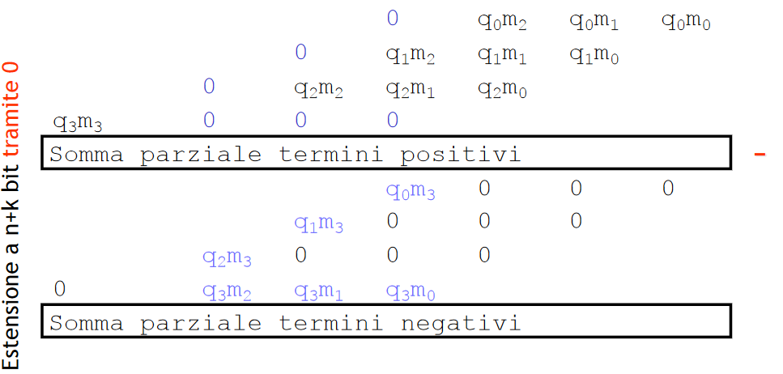

### Codifica di Booth per le moltiplicazioni 
Il concetto base della codifica di Booth é di codificare il moltiplicatore per ridurre i prodotti parziali e semplificare quindi la rete combinatoria/conti. La bellezza della codifica di Booth é che adatto per operandi di qualsiasi segno.
La codifica di Booth é disponibile in due gusti: 

- Radix 2 
- Radix 4 

Sia per Radix 2 che Radix 4 si **aggiunge uno zero** a destra del numero. E poi si divide il numero in gruppetti da 2 (radix2) o 3 (radix3) e si converte in base alle seguenti tabelle ciascun gruppettino. Poi si effettua la moltiplicazione stile elementari.

#### Radix 2 

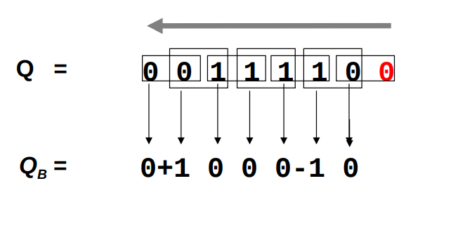{width=50%}

{width=50%}

#### Radix 4 


{width=50%}


{width=50%}

Nota come anche Radix4 alla fine risulti comodo: 

-  1 si tratta di ricopiare il numero
- -1 si tratta di invertire e sommare 1 (complemento)
- -2 si tratta di shiftare verso sinistra di una posizione il numero e di calcolarne il complemento
- 0 solo zeri 

# Logica programmabile

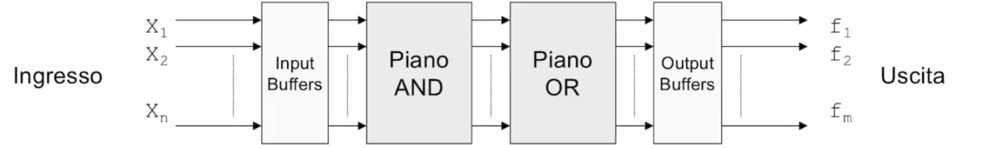

- piano OR
- piano AND 

## ROM 
Read only memory. Piano AND fissato, piano OR adattabile. 

{width=50%}

## PAL 
piano OR fisso, piano AND programmabile. Le uscite non possono condividere termini prodotto. 

{width=50%}

## PLA 

Piano AND/OR programmabile. Completa libertá. 

{width=50%}
Le PLA sono più lente delle PAL a causa della programmabilità della sezione OR: le connessioni fuse-based,  o comunque programmate, presentano una resistenza maggiore rispetto a quelle cablate.

## CPLD
Complex Programmable Logic Devices: sono una evoluzione delle PLA e PAL  e sono caratterizzati da:  

- Connessioni globali  
- Logica concentrata  

Rispetto a PAL e PLA:  

- Hanno dimensioni molto maggiori  
- Sono costituite da celle più complesse  
- Consentono di ottenere prestazioni più elevate  
- Hanno una struttura più regolare e facilmente programmabile.

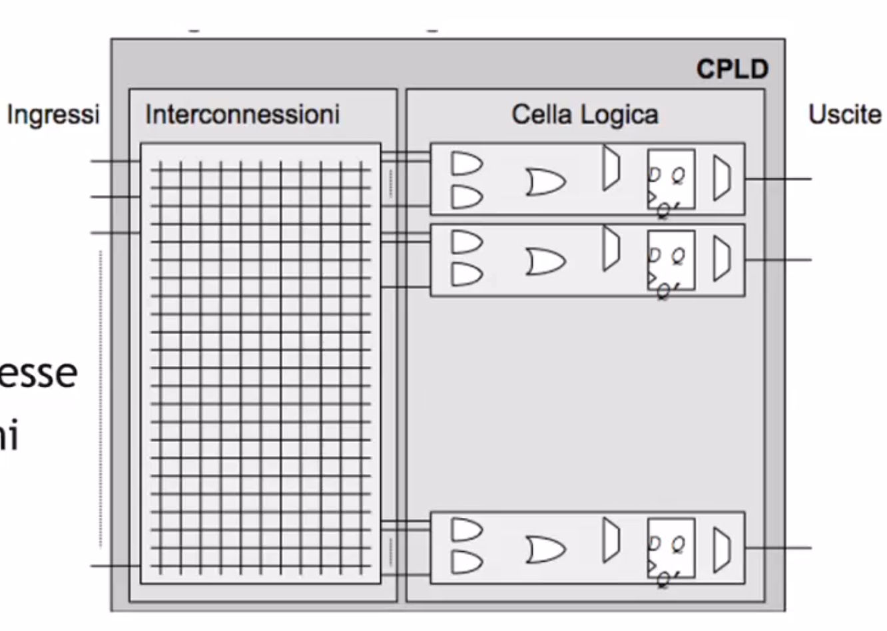

## FPGA 


# Circuiti Sequenziali 

Circuiti nel quale il valore dell'uscita dipende sia dagli ingressi ma anche dal tempo. Il circuito ha infatti memoria del passato. 
Memorie a disposizione:

- **Bistabile**: appunto che possiedo solo 2 stati
- **Latch**: bistabile pilotato da un circuito, sensibile sul livello alto.
- **Flip-flop**: bistabile letch pilotato dal clock. Cioè l'evento di **edge rise** , il segnale di Edge Detection campiona e memorizza.

Diversi tipi di flipflop : 

- **flip-flop SR**: comandato dai segnali di SET e RESET. Il principale problema è il loro stato proibiti, cioè quando SR sono entrambi a 1.
- **flip-flop JK**: funziona identico al SR, con J=S e K=R . è un miglioramento del SR, in cui quando entrambi sono settati a 1 non dà problemi.
- **flip flop D**: flip-flop 'Data'
- **flip-flop T**: flip flop 'Toggle'

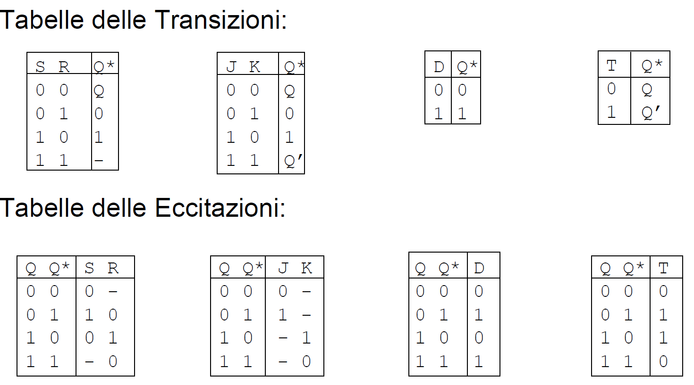

Diverse tabelle per i bistabili: 

- **tabella transizioni**: mi dice cioé le funzioni svolte dal bistabile/flipflop. Transizione $S,I \rightarrow S$ 
- **tabella eccitazioni**: mi dice cosa dovrei applicare al bistabile/flipflop per ottenere uno specifico stato dallo stato attuale. Eccitazione $S,S^* \rightarrow S$ 

> è importante saper ricavare le tabelle di eccitazione piuttosto che ricordarsele

Con i circuiti sequenziali abbiamo il cosiddetto concetto di stato. Questo è un tassello fondamentale per realizzare concretamente modelli comportamentali come le MSFD o DFSM (Deterministic Finite State Machine).
Nella **macchina di Huffman** abbiamo una netta separazione tra rete combinatorio e logica sequenziale. 

 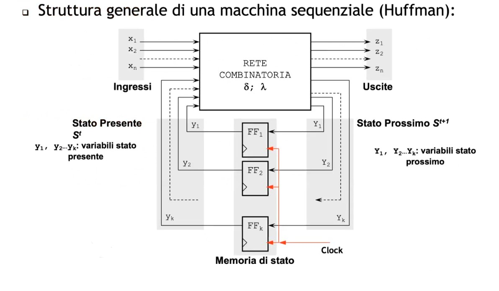

Da notare come nella logica combinatoria debba implementare le giuste tabelle di eccitazioni per le funzioni di $\delta$ e $\lambda$.

# Macchine a stati finiti 

$$(\mathbb{I}-\mathbb{U}-\mathbb{S}-\delta - \lambda)$$
dove:

- $\mathbb{I}-\mathbb{U}$ sono gli alfabeti di ingresso ed uscita
- $\mathbb{S}$ è l'insieme degli stati 
- $\delta$ è la funzione dello **stato prossimo**, cioè una funzione che ha in input un ingresso appartenente all'alfabeto d'ingresso e uno stato e ha in output lo stato prossimo 
- $\lambda$ funzione d'uscita, ha due varianti:
	- funzione d'uscita per **macchina di Mealy** è del tipo $\lambda: \mathbb S \times \mathbb I \rightarrow \mathbb U$
	- funzione d'uscita per **macchina di Moore** è del tipo $\lambda: \mathbb S\rightarrow \mathbb U$

Anche se spesso le direttive/testo dell'esame specifica molto bene quale delle due usare delle due macchine, si é dimostrato che esse sono equivalenti.
Tabella di stato + tabella di eccitazione del bistabile : costruisco la tabella delle eccitazioni. Procedendo in questo modo si ottiene la descrizione della rete combinatoria che ha per ingressi lo stato presente e l'ingresso primario e produce in uscita le configurazioni da applicare ai bistabili per produrre le transizioni desiderate. 
Nel caso di flip flop di tipo D il valore assunto da D é uguale a quello dello stato prossimo. Per questa ragione la tabella delle transizioni coincide esattamente con la tabella dello stato di codificata. 

Ultimo passo della sintesi delle macchine a stati finiti: costruzione della tabella delle eccitazioni dalla tabella delle transizioni di stato codificato. L'ultima tabella costituisce il punto di partenza per effettuare la sintesi delle reti combinatorie che realizzano la funzione di stato prossimo e d'uscita. Spesso se il problema é complesso il diagramma di transizione dello stato a cui si perviene include stati rindondanti, quivalenti o in caso di macchine non completamente specifica compatibili. Prima di procedere alla codifica dello stato si effettua quindi una minimizzazione. 

## Sintesi FSM 

Passi per sintesi macchina a stati finiti: 

1) Diagramma degli stati della macchina (consegna/specifica)
2) Diagramma $\rightarrow$ tabella degli stati: tabella degli stati é costituita da colonne che stanno per le transizioni e 'dentro' le celle gli stati di destinazione a partire dagli stati correnti (righe).


3) Riduzione della tabella degli stati: sostanzialmente elimini tutti gli stati rindondanti, aka eliminare le righe clone di altre righe nella tabella degli stati. In questa fase verifichi quindi la raggiungibilità degli stati ed eventuale equivalenze/compatibilità. 
4) Tabella transizioni: dalla tabella degli stati ridotta otteniamo la tabella transizioni. Semplicemente tabella degli stati codificata con 0 e 1.
5) Tabella delle eccitazioni: _tabella delle eccitazioni dei FlipFlop + Tabella transizioni = logica combinatoria_ . E qui dipende da quali bistabili utilizziamo: 
	- Se usiamo Flip Flop di tipo D la tabella delle transizioni coincide con quella delle transizioni, altrimenti no! 
	- In caso di altro bistabile dobbiamo fare manualmente la tabella di eccitazione. Il concetto é  'quale ingresso del mio bistabile mi serve per andare dallo stato $Q$ allo stato prossimo $Q*$?'. Questa é la domanda a cui dobbiamo rispondere per generare la tabella delle eccitazioni della macchina, usando la tabella delle eccitazioni del mio bistabile. Facciamo il conto singolarmente per ogni bit. **nota bene che per ogni bit mi serve un flip flop a sé.**

6) Sintesi tabella della veritá: possiamo vedere la tabella delle eccitazioni come una tabella della veritá stringata. Generiamo quindi una tabella della veritá che ha gli stati e l'ingresso e i due segnali per i flip flop con l'uscita. In genere in questo corso in questo passaggio dovremmo utilizzare sempre Karnaugh a meno che specificato diversamente. Tabella veritá della rete combinatoria che prende ingresso e stato presente, e restituisce uscita e tabella eccitazioni per i flip flop. 

### Sintesi sequenziale sincrona
$$N_{FF,min}= \lceil log_2|S|\rceil$$ è il numero minimo di flip flop necessari per memorizzare gli stati. 

**Macchina minima specificata** = la macchina con il minor numero possibile di stati per crearla. 

# Minimizzazione FSM

In questa parte vedremo più in dettaglio la fase della riduzione di una FSM completamente specificata e non specificata. 

## Macchine completamente specificate
Due stati $s_i$ ed $s_j$ appartenenti ad $\mathbb S$ sono indistinguibile sse per $\forall x$ simboli d'ingresso:

- Le uscite sono le stesse $\lambda(s_i,x)=\lambda(s_j,x)$$ 
- Gli stati prossimi sono uguali$\delta(s_i,x)=\delta(s_j,x)$

Due stati indistinguibili sono quindi equivalenti e interscambiabili. 
L'indistiguibilità è una relazione d'equivalenza (transitiva, riflessiva, simmetrica), cioè una relazione che crea classi d'equivalenza. 
Una macchina è minima se nel suo insieme di stati non esiste una coppia di stati equivalenti. 

### Regola di Paull Unger 

Riduzione del numero degli stati, costruzione della macchina minima e della partizione di equivalenza. 
Regola di Paull - Unger é una regola iterativa.
Si crea un effetto a cascata del tipo lo stato $S_x$ é equivalente allo stato $S_y$ sse lo stato $S_z$ e $S_w$ é equivalente ...e cosí via. 
Alla fine troveró equivalenze, non equivalenze o equivalenze circolari. I vincoli circolari sono indistinguibili anch'essi. 


**TABELLA DEGLI STATI $\rightarrow$ TABELLA DEGLI STATI RIDOTTA**

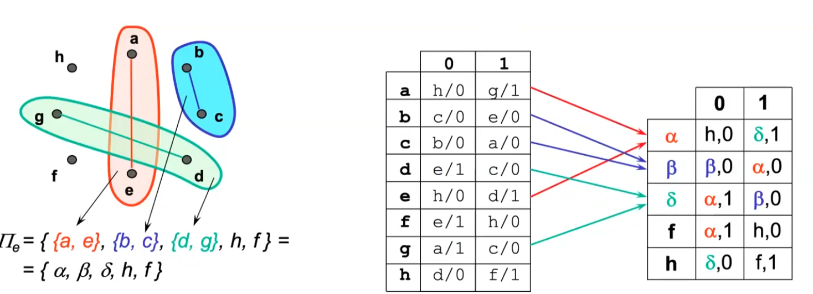

## Macchine non completamente specificate

Per alcune ragioni alcune uscite non le conosciamo.

### Compatibilità 

Non si parla più di distinguibilità ma di **compatibilità**. 
Due stati $s_i$ ed $s_j$ appartenenti ad $\mathbb S$ sono compatibili ($sse \space per \space \forall x$ simboli d'ingresso:

- Le uscite sono le stesse $\lambda(s_i,x)=\lambda(s_j,x)$ **laddove sono specificate** 
- Gli stati prossimi sono uguali $\delta(s_i,x)=\delta(s_j,x)$

La compatibilità è meno forte della indistinguibilità .. simmetrica e riflessiva ma **non** transitiva! 
**La compatibilità non è una relazione d'equivalenza.** 


### Tipi di compatibilità 


- **Le classi di compatibilità** sono insiemi di stati compatibili a coppie, dunque nel grafo delle compatibilità è un sottografo.
- **Le classe di compatibilità prima** se è una classe di compatibilità **non coperta** da nessun'altra classe di compatibilità oppure coperta da un'altra classe ma che però aggiunge un vincolo. Cioè sono tutte le classi più grandi con meno vincoli. (I vincoli vengono riportati sugli archi).
- **Le classe di massima compatibilità** è la classe più grande che non viene inglobata da nessun'altra classe. (Ignori il vincolo di tenere d'occhio i vincoli).

Una classe di compatibilitá prima é una classe di compatibilitá che non é coperta da nessuna altra classe di compatibilitá con i suoi stessi vincoli. 
Una classe di massima compatibilitá é un caso particolare di classe di compatibilitá prima, é infatti una classe che non é coperta da nessuna altra classe indipendentemente dai vincoli. 
Parleremo solo di macchina **ridotta** (e non minima) nel caso di macchine non completamente specificate poichè non useremo un algoritmo che ci garantisce la minimalità.  Per ridurre il numero di stati voglio far collassare le classi di compatibilità in un unico caso. Devo seguire però la chiusura delle varie partizioni valida. Cioè devo ottenere una macchina **deterministica** quindi devo trovare la giusta chiusura tale che poi le transizioni mi portano in classi di compatibilità ben definite e non stati che appartengono a più classi di compatibilità. Il nostro obiettivo è trovare una classe di partizione del mio grafo delle compatibilità **chiusa**. 
Può essere che uno stato si trovi in più classi di compatibilità. Posso al momento di compilare la tabella ridotta scegliere una delle due classi, poichè entrambe valide. 


Contrariamente a quanto indicato per le macchine completamente specificate, i vincoli devono essere mantenuti anche se corrispondenti a una coppia (o piú) compatibili non vincolati $\vee$. Si continua fino a quando non si finisce la tabella delle implicazioni e si trova il grafo delle compatibilitá. 
Per trovare **la macchina minima** dovrei ricorrere al bruteforcing e confrontare (inoltre la macchina minima potrebbe non essere unica). 
Esistono però **algoritmi non esaustivi ma basati su euristiche**.
Un approccio potrebbe essere quello di utilizzare non le classi di compatibilità prime, ma le classi di massima compatibilità. Questo approccio non è deterministico e addirittura in alcuni casi potrebbe peggiorare la situa dandoci più stati e quindi diventando inefficace. 

#### Classi di massima compatibilità usando l'albero dei compatibili massimi. 

Algoritmo che si basa su un albero binario diviso in livelli, ciascuno corrispondente ad un nodo del grafo delle compatibilità. 
Ad ogni livello vengono generati due figli per ogni nodo con il seguente criterio:

- Dato un nodo e un livello, si costruisce il suo successore di sinistra considerando tutti gli stati del progenitore tranne il nodo analizzato
- Dato un nodo e un livello, si costruisce il suo successore di destra considerando tutti gli stati del progenitore giá analizzati, il nodo analizzato e gli stati successivi ad esso compatibili.
- Un nodo é foglia dell’albero se sono stati esaminati tutti gli stati che lo compongono, **tranne al piú l’ultimo**.
- Un nodo puó essere eliminato, se tutti i suoi stati sono compresi in un altro nodo che é una foglia o che si trova nel suo stesso livello. 
- Le foglie identificano le classi di massima compatibilitá

 Il limite superiore al numero degli stati della macchina ridotta é pari al numero delle classi di massima compatibilitá, cioé 5. Una possibile macchina ridotta é quella costituita considerando come stati tutte le classi di massima compatibilitá.

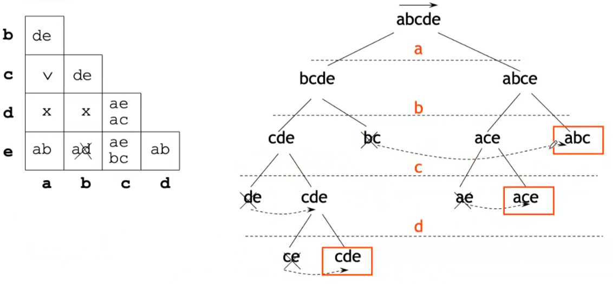

# VHDL

VHDL = Very High Speed Integrate, definito negli anni 80 dal Dipartimento di Difesa degli USA. Linguaggio per descrizione dell'hardware. 

> Perché non con C? 

Cambia la logica: lavoriamo su bit e altri tipi di dato. Usiamo concetti di "don't care" e abbiamo bisogno di concorrenza. 

> Con VHDL non programmiamo, ma piú propriamente 'specifichiamo'. 

## Appunti random

Il VHDL é Case Insensitive, e i commenti vengono specificati con ```- -``` (si estendono fino per solo una riga). 
Specifica dell'interfaccia del componente (entity porte d'ingresso e porte uscita) : 

````vhdl
out1 : out std_logic;
in1, in2, in3 : in std_logic;
````

*indentazione, spazi e a capi non servono*

Il tipo di dato ```std_logic``` é il piú utilizzato per rappresentare i valori logici, i quali vengono indicati tra i singoli apici . 
Il valore X é usato in casi come ad esempio quando due reti pilotano una stessa linea con valori discordanti . Di conseguenza il risultato non sará deterministico. 
La keyword Architecture é usata per le entity: 

- dataflow 
- strutturale 
- comportamentale 

Possiamo usare un mix delle 3 rappresentazioni per descrivere l'architettura. 


Da notare l'assegnamento ```<=``` : le porte "_out_" stanno a sinistra dell'assegnamento. Viceversa le porte _In_ stanno sempre a destra del assegnamento. Possiamo poi utilizzare altri tipi di dati, ad esempio 'signal' :

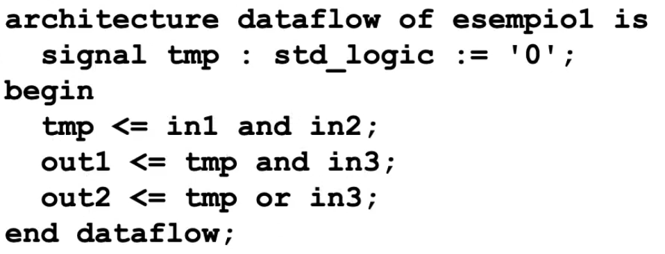

Sintassi per definire un multiplexer. Stiamo facendo cioé un assegnamento condizionale. 

 

Ma abbiamo anche un assegnamento selettivo. 


Ci serve anche eseguire operazioni aritmetiche come ad esempio la somma (con overflow). 
Si converte ```std_logic_vector``` a ```unsigned``` o ```unsigned``` cosí da avere tutte le operazioni aritmetiche.

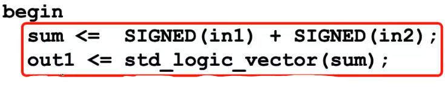


 

Possiamo poi definire delle 'variabili' inserendo nella nostra entity il blocco di codice: 

````vhdl
generic(){
N : integer := 5 
}
````
Dove 5  in questo caso é il valore di default. Una entity che ho definito precedentemente la posso definire come component. Cosí che poi posso utilizzare i component come se fossero oggetti. In questo modo posso costruire gerarchicamente strutture piú complesse partendo da tante entity. Al momento di istanziare il component devo specificare i parametri (altrimenti seguiranno il default value) e 'mappare' i segnali alle interfacce. 

### Process

Creiamo poi il costrutto 'process'  che ci permette di astrarci un po' di più descrivendo il comportamente algoritmico più che la struttura a livello schematico. Descriviamo infatti variabili.
Le variabili sono una astrazione che può corrispondere a una singola o addirittura più linee, ma noi non ci preoccupiamo. La consideriamo come una black box che mi mantiene in memoria uno stato. Il corpo del process viene eseguito sequenzialmente, a differenza di tutte le altri parti di codice che sono concorrenziali. Però **nei process** i segnali vengono tutti aggiornati al termine del process. Bisogna partizionare i segnali in ingresso e in uscita, infatti essi o vengono letti o vengono scritti all'interno del process, non entrambi. Le variabili invece sono lette/scritte all'interno del processo infinite volte, e ha validità solo all'interno del processo. 


Flip-flop di tipo D:

````VHDL
    begin              
    State: process(i_clk, i_rst)
    begin
        if i_rst='1' then
          currentState <= RESET;
        elsif rising_edge(i_clk) then
          currentState <= nextState;
        end if;
     end process;
````

con ```rising_edge(clk)``` possiamo compattere le righe che controllano che il clock sia 1 e che sia appena cambiato.

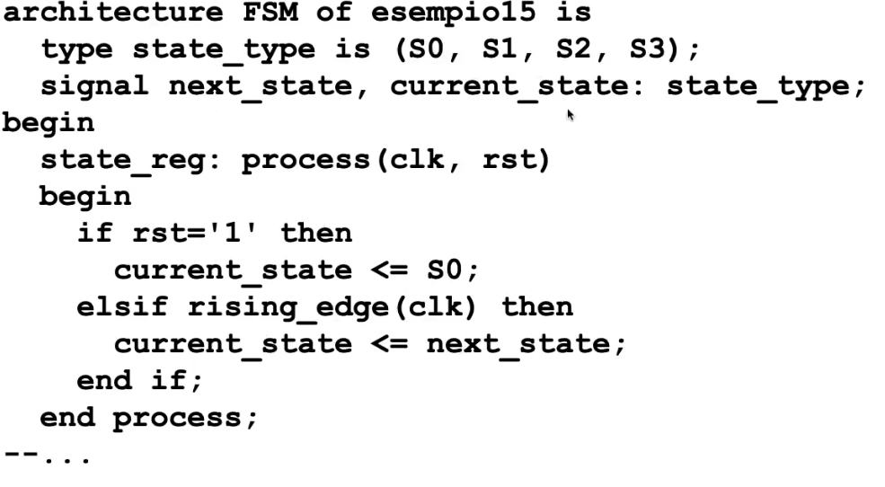

Specifica interna di una FSM.

```VHDL
entity project_reti_logiche is
port (
		i_clk: in std_logic;
		i_rst: in std_logic;
		i_start: in std_logic;
		i_data: in std_logic_vector(7 downto 0);
		o_address : out std_logic_vector(15 downto 0);
		o_done: out std_logic;
		o_en: out std_logic;
		o_we: out std_logic;
		o_data: out std_logic_vector (7 downto 0)
);
end project_reti_logiche;
``` 

 - i_clk è il segnale di CLOCK al quale il modulo si sincronizza.
- i_rst è il segnale di RESET che inizializza la macchina 
- i_start è il segnale START descritto nella specifica.
- i_data è il segnale he arriva dalla memoria in seguito ad una richiesta di lettura, necessario per leggere i bytes.
- o_address è il segnale di uscita con cui si specifica a quale indirizzo della memoria accedere. 
- o_done è il segnale DONE descritto nella specifica.
- o_en è il segnale di ENABLE della memoria
- o_we è il segnale di WRITE ENABLE:
	- 1 per scrivere 
	- 0 per leggere
- o_data è il segnale di uscita dal componente verso la memoria, necessario per salvare i bytes.


## VHDL Simulazione

Creiaimo segnali. Istanziamo il componente e poi generiamo le nostre forme d'onda. Adesso specifico anche il tempo, posso specificare ad esempio di 'aspettare' del tempo. 


## Extra 

Tool per align e format VHDL: [Vhdl Beatify](https://g2384.github.io/VHDLFormatter)
