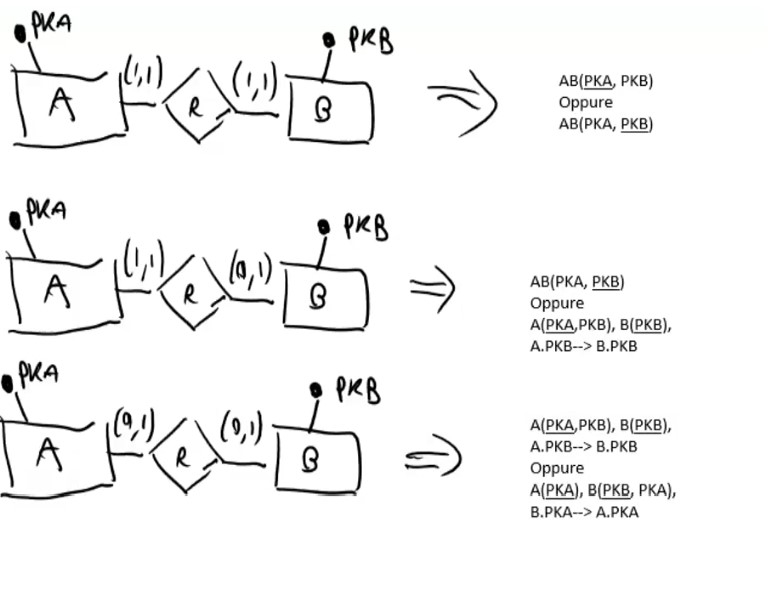

\maketitle
\newpage
\tableofcontents
\newpage

# Basi di dati

DataBase Management System (DBMS) = sistema di gestione di basi di dati, cioè una collezione di dati utilizzati per rappresentare le informazioni d'interesse per una o più applicazioni di una organizzazione.

- Primo approccio = i dati sono il focus/goal. (approccio più Basi di Dati)
- Secondo approccio= i dati sono il supporto al processo. (approccio più Ing Software).
- Nella realtà: probabilmente un ibrido.

Architettura a livelli degli schemi:

- schema esterno: descrizione di parte della base per specifiche applicazioni (quindi ci possono essere schemi esterni specifici per ogni applicazione diversa)
- schema logico: descrizione dell'intera base di dati sempre da un punto di vista logico
- schema fisico: rappresentazione dello schema logico per mezzo di strutture fisiche di memorizzazione.

In questo corso vedremo i primi due schemi logici principalmente. 

Data Manipulation Language -> linguaggio che ci permette di lavorare al livello logico, e disinteressarci dello schema fisico.

Sono state proposte diverse tecnologie per gestire i dati, che si basano proprio su paradigmi di ricerca diversa (basata su relazioni, documenti ecc.).
I più utilizzati si basano sul modello relazionale, che è lo stesso che utilizzeremo anche noi in questo corso. Nella realtà, grandi aziende, utilizzano più modelli. 
MongoDB = document-based. 
Il modello relazionale è basato sull'indipendenza dei dati. 
Per ogni istanza (righe) ci sono più attributi  (colonne), ciascuno con un certo dominio.  

- Relazione molti-molti:

- Relazione uno-molti:

- Concetto di entità debole: 

é necessario avere una chiave. Una chiave deve essere univoca per una specifica istanza. Una chiave se proprio non si riesce a trovarne una minimale  può essere la combinazione di più attributi dell'istanza. 
Minimalità di una chiave: insieme degli attributi è il minimo per identificare l'istanza nella tabella.
Chiavi scelte a priori, durante la progettazione. 

superchiave = insieme di attributi (unicità).
chiave = superchiave minimale (cioè è la superchiave più piccola).

QUINDI 
superchiave (unica), se è minima una superchiave diventa chiave. 
Si evita cambiare le chiavi nel tempo .. 
Ricorda che una chiave esiste sempre! (male che vada prendo l'intera riga).
La chiave non solo serve per accedere alla tabella ma anche per fare eventuali relazioni. 
Eventualmente si possono utilizzare più chiavi .. chiave primaria e secondaria .. 

LINEE GUIDA TABELLE:

- evitare repliche inutile di dati
- non bisogna avere paura di dividere i dati in più tabelle diverse, anzi dobbiamo 
- usiamo solo elementi atomici, cioè evitiamo strutture annidate
- non avere paura di introdurre un codice identificativo come chiave (ma non usarli sempre)
- scegliere chiavi con buon senso 
- tabelle ponte, cioè che relazionano più tabelle diverse tra loro. è preferibile utilizzare come chiave degli attributi.

Linguaggi che affronteremo in questo corso: 

- Linguaggi formali:
	- Algebra relazionale (procedurale)
	- Calcolo relazionale (dichiarativo)
	- DataLog  (dichiarativo)
- Linguaggi ''commerciali''
	- **Structured Query Language** (dichiarativo con elementi procedurali)

# Algebra Relazionale
Linguaggio procedurale, cioè un linguaggio in cui specifichi le procedure da svolgere per 'filtrare i dati'. 
Operatori:

- $\sigma$ operatore di selezione
- $\pi$ operatore di proiezione .. fondamentalmente elimina i dublicati 
- classiche operazioni .. unione, differenza, intersezione, prodotto cartesiano. Ques'ultimo consiste in tutte le possibili combinazioni delle righe. 
- $\rho$ operatore di ridenominazione .. cambia i nomi di uno o più attributi 
- $\bowtie$ join... è un prodotto cartesiano in cui vengono eliminate le colonne no sense. 
- $\ltimes$ semijoin. è un join in cui vengono tenute solo le colonne della tabella sinistra (o dx a seconda dove disegni la stanghetta aperta del simbolo). In pratica te lo puoi ricordare come il join nel quale usi le righe di una tabella per 'selezionare' le stesse righe in un'altra. 
- operatore di divisione. Complicato da capire, sostituibile con le altre operazioni. 


Algebra relazionale è un linguaggio procedurale, cioè l'ordine delle operazioni è molto importante. Or dunque usi le parentesi. 
*join e semi-join naturale usano gli attributi uguali tra le due tabelle*. 

*alcune casistiche un po' tricky: ad esempio ''selezionare righe con x che è sempre stato < 30: non posso selezionare le righe che hanno <30 altrimenti selezionarei tutte quelle entries che almeno una volta hanno avuto l'attributo x < 30. Invece devo selezionare le righe con x >= 30 .. così trovo chi è stato almeno una volta >=30 e poi fare una differenza *. 

oppure 

*trovare l'ultimo esame di uno studente avendo l'attributo data. Devo selezionare tutto le righe le quali sono minori di un'altra riga. A questo punto ho trovato tutte le possibile righe che non sono ultime. Poi faccio una differenza con la tabella originale come nel punto precedente. La logica è quindi sempre la stessa .. quando devo selezionare un insieme potrei dover selezionare il suo complementare.*


Devo anche ottimizzare. Come minchia si ottimizza? 
Rappresenti in modo gerarchico le parentesi/operazioni e poi cerchi di 'pushare' le proiezioni/selezioni verso il basso. Il senso è di fare la proiezione/selezione (operazioni che **riducono** la dimensione delle tabelle) PRIMA di ogni prodotto cartesiano/join/semijoin. 
L'idea generale è quella anche più logica .. devi puntare a scremare la dimensione delle tabelle prima di fare grosse operazioni come ad esempio un prodotto cartesiano che calcola tutte le possibile combinazioni. 
Abbiamo elencato una decina di best practices da seguire ma basta seguire il buon senso. (cit.)
*PS:vedi il join come un doppio for ... stra peso*.
*PS:vedi l'unione/la differenza come operazioni che richiedono l'ordinamento della tabella.*

# Calcolo Relazionale
Linguaggio dichiarativo, cioè dichiara gli obiettivi delle interrogazioni elevandosi dal procedimento da svolgere. 
$$\{ x | p(x) \}$$ dove $p(x)$ è una formula costruita tramite atomi. Un atomo può essere uno scalare o una espressione di costanti con un comparatore.  
**Il calcolo relazionale e l'algebra relazionale hanno lo stesso, ovvero l'insieme delle query esprimibili è lo stesso nonostante le differenze fra i due linguaggi.**

# Datalog
Datalog è un linguaggio di programmazione logica basato su formule che prendono il nome di **regole** . è un linguaggio dichiarativo senza alcuna introduzione procedurale come ad esempio SQL. Sintatticamente derivato dal Prolog. 


Ogni regola ha una **testa** e un **corpo** . 

- Fatto: corrisponde alla tupla del database. 
- Goal: corrisponde alla query ed è sostanzialmente una regola in cui in testa piazziamo *?-* e che viene valutata cercando tutte le variabile che soddisfano il corpo di tale regola. Alcuni goal però restituiscono solo *True* o *False*. 

Il Datalog è più espressivo dell'algebra e il calcolo relazionale (i quali sono equivalenti) delle basi di dati, grazie all'uso della negazione. 
Maggiore espressività si traduce anche in questo modo si introduce possibilità di definire insiemi infiniti e quindi fare errori. La maggiore espressività è anche dovuta alla possibilità di scrivere regole ricorsive in grado cioè di richiamare il medesimo atomo della testa anche nel corpo della regola. L'introduzione di ricorsione e negazione porta facilmente alla scrittura di regole indecidibili. 
Alcune best practice da seguire per evitare ricorsioni infinite o insiemi indecidibili sono ad esempio che tutte le variabili che appaiono nella testa debbano apparire anche nel corpo della regola e che se una variabile compare in un atomo di confronto debba allora comparire in un atomo del corpo della stessa regola. 
Queste ultime hanno lo scopo di garantire che il processo di deduzione che viene effettuato dal compilatore Datalog abbia un tempo di fine. L'operatore di negazione inoltre deve essere usato con la clausola di safe che tutte le variabili in un letterale negato debbano apparire anche in uno non negato all'interno del corpo;
Inoltre non ci devono essere dipendenze circolari. 

# Structured Query Language 

In SQL te ne sbatti dell'interrogazione, vari modi ma alla fine SQL è ottimizzato di suo e non ti fai tutte le pippe mentali dell'algebra relazionale.. che ha diversi sbatti. 
**conclusioni su SQL:** 

- è molto di più del SELECT-FROM-WHERE
- Tramite viste, vincoli, procedure e trigger si costruisce una base di dati ricca dal punto di vista semantico. 
- Tramite grant e revoke si costruiscono sistemi protetti dal punto di vista del controllo degli accessi
- Le procedure (object-orientation) e i trigger (database attivi) verranno ulteriormente studiati nel corso di Basi di Dati 2.


## Vincoli d'integrità 

- **vincolo d'integrità referenziale**: è il vincolo interrelazionale più utilizzato. Gli attributi di una data tabella (_slave_) possono assumere soltanto dei valori specificati in un'altra tabella (_master_). Affinché sia rispettata l'integrità referenziale, ogni campo in una tabella che sia stato dichiarato come foreign key può contenere solo valori della chiave primaria o chiave candidata di una tabella "madre" relazionata.
- **vincolo di tupla**: un vincolo che può essere valutato su ciascuna tupla indipendentemente dalle altre. 
- **vincolo di dominio**: applicabile su ogni singolo attributo.
- **vincolo di primary key**, verificabile solo osservando tutte le tuple di una tabella
-  **vincoli d'integrità** più complessi (esprimibili (in SQL) con parole quali 'CREATE ASSERTION', 'CHECK', 'NOT EXISTS', 'ALL')

# Transazione 
 Una **transazione** indica una qualunque sequenza di operazioni lecite che, se eseguita in modo corretto, produce una variazione nello stato della base di dati. In caso di successo, il risultato delle operazioni deve essere permanente, mentre in caso di insuccesso si deve tornare allo stato precedente all'inizio della transazione. 
 
## ACID
 
 Le transazioni devono possedere le seguenti proprietà logiche: _Atomicity_, _Consistency_, _Isolation_, e _Durability_ .

-   **Atomicità** o **Elementarità**: il processo deve essere suddivisibile in un numero finito di unità indivisibili, chiamate _transazioni_. L'esecuzione di una transazione perciò deve essere per definizione o totale o nulla, e non sono ammesse esecuzioni parziali; un processo, anche parziale, invece, in quanto insieme di transazioni può non essere elementare.

-   **Consistenza**: Il database rispetta i vincoli d'integrità, sia a inizio che a fine transazione. Non devono verificarsi contraddizioni (_incoerenza dei dati_) tra i dati archiviati nel DB;

-   **Isolamento**: ogni transazione deve essere eseguita in modo isolato e indipendente dalle altre transazioni, l'eventuale fallimento di una transazione non deve interferire con le altre transazioni in esecuzione

-   **Durabilità**: detta anche **persistenza**, si riferisce al fatto che una volta che una transazione abbia richiesto un _commit work_, i cambiamenti apportati non dovranno essere più persi. Per evitare che nel lasso di tempo fra il momento in cui la base di dati si impegna a scrivere le modifiche e quello in cui li scrive effettivamente si verifichino perdite di dati dovuti a malfunzionamenti, vengono tenuti dei registri di log dove sono annotate tutte le operazioni sul DB.

# Progettazione 
## Progettazione fisica
Da un punto di vista logico vediamo solo tabelle, ma come sono organizzati i dati fisicamente? 
L'approccio più comune è tenere le tuple distribuite in modo sequenziale in memoria. In genere le tuple sono in ordine cronologico d'inserimento. Sopra questo blocco di memoria vengono poi costruiti degli indici. Questi indici sono nella maggior parte dei casi implementati con hash e albero B+ .


Simile a un BST ma con più chiavi, infatti ogni nodo può avere n puntatori. 
Inoltre un albero B+ è costruito in modo tale che si possono attraversare le foglie in modo sequenziale. 

Può accadere che questi indici in SQL vengano creati automaticamente, ad esempio durante un SELECT o un JOIN. 
Puoi però esplicitarli manualmente. 

````Sql
 create [unique] index IndexName 
on TableName(AttributeList)
````

Good practices per gli indici in SQL:

- non usare per tabelle piccole 
- molti DBMS li fanno in automatico
- può essere necessario usare indici per attributi in select/join o che richiedono l'ordinamento 
- evitare se sono tabelle che vengono aggiornate frequentemente 
- evitare di creare indici su attributi composti da stringhe molto lunghe


## Dipendenza funzionale e normalizzazione 

I vincoli d'integrità che siano di chiave (cioè i vincoli che specificano qual è la chiave), di dominio (il dominio di valori disponibile per l'attributo) o di .. sono fondamentali per la consistenza del database. 
Le dipendenze funzionali  sono particolari tipi di vincoli d'integrità. In particolare la Dipendenza Funzionale $X \implies Y$ ci dice che ogni coppia di tupla la quale ha stesso valore negli attributi X, ha anche stesso valore negli attributi Y.
Esempio di dipendenza funzionale in un database d'esempio:
$${\{}ID,ESAME{}\} \rightarrow VOTO$$
Una dipendenza funzionale è banale $X \implies Y$ quando in X compaiono attributi di Y. 


### Rindondanze
Possono capitare rindondanze nei DBs. Le rindondanze sono dovute ad anomalie di inserimento, aggiornamento o cancellazione. Cioè quando c'è una cancellazione/inserimento/modifica si creano conflitti con alcune key. Ad esempio dopo una cancellazione ci potrebbe essere una key ad essere null. 
Le anomalie possono capitare quando non si parte dal modello di entità-relazione. 
Le anomalie corrispondono a **dipendenze funzionali** che sussistono tra attributi. 
L'idea è di __normalizzare__. Cioè trasformare una tabella composta in una normalizzata per eliminare le dipendenze funzionali tra gli attributi, ed eliminare quindi anomalie e rindondanze. 

### Forme Normali
Forme normali (dalla più debole alla più forte):

- **Prima Forma Normale**: non ci devono essere attributi composti, ma solo atomici.
- **Seconda Forma Normale**: Deve essere 1FN e tutti gli attributi non chiave devono dipendere dall'intera chiave primaria, non da un sottoinsieme di essa (dipendenza completa). 
- **Terza Forma Normale**: Deve essere 2FN e non devono esserci dipendenze transitive. Cioè ogni attributo _non-chiave_ deve dipendere **direttamente** dalla chiave. Cioè gli attributi non si determinano a vicenda, ma hanno una **dipendenza funzionale** $X \implies Y$ solo con la chiave $X$ OPPURE (ed è questo che la rende diversa dalla FN di BC) gli attributi hanno una dipendenza del tipo $X \implies Y$, dove Y **fa parte della chiave**. Più debole di Boyce Codd proprio per la seconda condizione. Quindi non garantisce la scomparsa di tutte le anomalie. (Sempre ottenibile, così come le precedenti).


Il ModelloAuto dipende funzionalmente dalla TargaAuto, duqnue ci sono attributi  che si determinano a vicenda. 

- **Forma di Boyce Codd**: non sempre raggiungibile. Ogni attributo deve dipendere **solo** dalla chiave. Cioè in " $X \implies Y$ " X deve essere sempre chiave. 


All'esame, ogni tabella che facciamo, deve soddisfare almeno la terza forma normale. Normalmente quando faccio un progetto basato sul modello ER riusciremo a soddisfare tranqui Terza Forma Normale. 

# Progetto concettuale e logico 


IL **modello entità-relazione** (**modello ER**) è un modello teorico per la rappresentazione concettuale e grafica dei dati, formalizzato da Peter Chen nel 1976
Il modello entità-relazione viene spesso utilizzato nella prima fase della progettazione di una base di dati, nella quale è necessario tradurre le informazioni analizzate in uno schema concettuale, detto **diagramma entità-relazione** (o **diagramma ER**).
Si tratta di una fase con una astrazione molto elevata. Seguito dal progetto logico. 


Particolare attenzione quando ci si sposta dal progetto concettuale a quello logico. L'idea è che in ogni tupla ci deve essere il riferimento a 0 o al massimo 1 tupla esterna. Quindi le relazioni 0:1 e 1:1 sono le più semplici. I riferimenti tra A e B 1:n non posso stare in A, bisogna fare il riferimento nell'altra tabella solo se B e A ha 0:1 o 1:1. Se l'altra tabella B ha anch'essa 1:n allora serve una tabella ponte AB. 



### Errori gravissimi in uno schema concettuale:

- usare una entità debole al posto di una sottoclasse
- vicevera usare una sottoclasse al posto di una entità con relazione
- considerare come entità nel DB la persona/società/gruppo di persone proprietarie del DB 

# Appunti vari esercizi 

- in datalog non posso mettere piú confronti nell stessa formula. Devo fare un specie di 'overriding'. 
- in datalog, sql e calcolo relazionale posso usare il simbolo $<>$ per indicare il diverso. 
- in sql devo parlare dei riferimenti scrivendo REFERENCES .. CASCADE / NO ACTION / SET NULL e devo specificare le azioni che bisogna attuare in caso di ON DELETE o ON UPDATE
- VARCHAR in caso di una stringa a lunghezza variabile. Ad esempio il codice fiscale sará sempre CHAR(16)
- PRIMARY KEY 
- FOREIGN KEY tutte le volte che c'é un vincolo d'integritá referenziale che coinvolge piú di un attributo. 
- tab1 JOIN tab2 ON tab1.x = tab2.y

> l'approccio é sempre quello.. davanti ad un problema insormontabile spezzetta il problema e ragiona con query piú semplici. Esse poi diventeranno le sotto-query. 

- spesso il ragionamento chiave é pensare ad esempio 'i clienti che hanno sempre prenotato in ristoranti diversi sono i clienti le cui prenotazioni nello stesso ristorante non hanno mai date e orari diversi'. 

- da concettuale a logico posso scegliere come 'implementare' certi schemi. Ad esempio in caso di generalizzazioni posso implementare un attributo 'selettore'. 

## Domande di teoria esami recenti: 

- Si considerino gli attributi multi-valore del modello concettuale (ER), e si spieghi in quali modi si possono tradurre nel modello relazionale e sotto quali condizioni.

- Spiegare per quale motivo il Datalog con negazione è più espressivo dell’Algebra Relazionale.

- Spiegare la relazione tra cardinalità minima di una relazione nel modello ER e vincolo “NOT NULL” nel modello relazionale.

- Dire in quale forma normale sono le relazioni definite nella Parte 1 del compito, e spiegare perché.

- Descrivere brevemente le proprietà ACID garantite da un DBMS.

- Confrontare molto brevemente dal punto di vista del potere espressivo l’algebra relazionale con l’SQL.

- Spiegare brevemente i concetti di Modello,Schema e Istanza per le basi di dati, prendendo a esempio quelle relazionali

- Spiegare la differenza tra modello, schema e istanza nelle basi di dati relazionali.

- Definire il concetto di vincolo di integrità, descrivendone le categorie principali e fornendone esempi.

- Definire il concetto di transazione e le proprietà ACID; discutere in particolare il significato della proprietà di CONSISTENZA e come il DBMS permette di assicurarla.

- Discutere il concetto di informazione incompleta nella basi di dati relazionali, quali significati può assumere la mancanza di un valore, e quale soluzione viene adottata nei sistemi commerciali.

- Illustrare le funzioni di un DBMS.

- Descrivere le caratteristiche di un sistema di gestione di basi di dati che supporti le transazioni.
