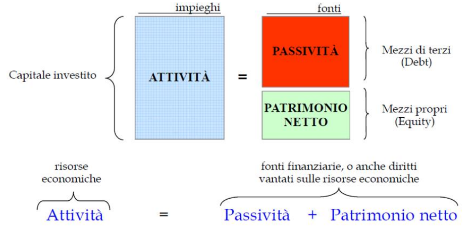
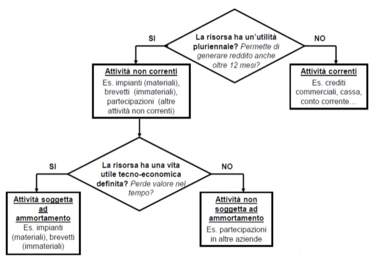
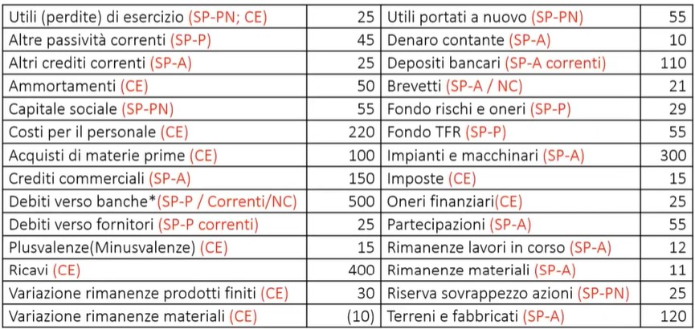
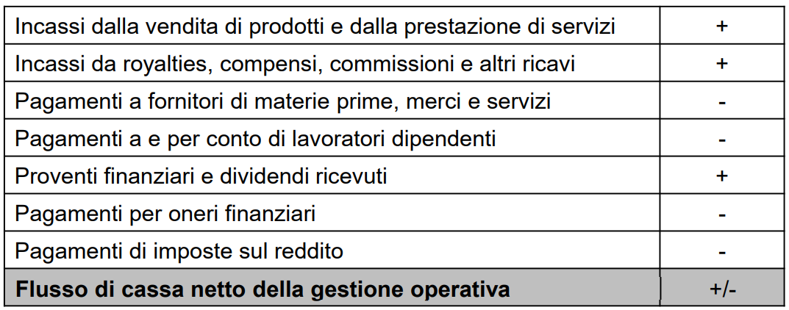
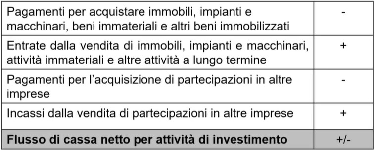
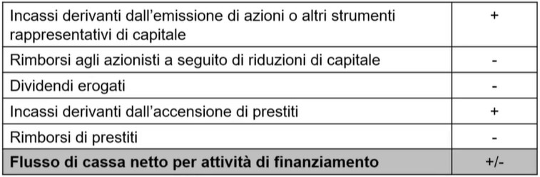

# Contabilitá esterna: bilancio

Il bilancio è un documento pubblico a tutti Il bilancio, ed è la principale base informativa aziendale, redatto per informare tutti gli stakeholders sulla situazione economica, finanziaria e patrimoniale dell’impresa in un determinato periodo (detto **esercizio**). 
*non confondere stakeholder (chiunque abbia un interesse all'interno dell'impresa) con shareholder (azionista)*.

In questo corso guarderemo il bilancio di tipo $IFSR|IAS$  cioè che segue i criteri internazionali. Si possono classificare le voci di bilancio secondo diversi criteri, noi utilizzeremo esclusivamente 
il bilancio per destinazione e non per natura.

Il bilancio si basa sui principi di:

- chiarezza: cioè comprensibile 
- veridicità e correttezza
- prudenza: minimalizzando gli utili 
- continuità della gestione: si presuppone che l'impresa continuerà ad operare nel tempo 
- competenza
- costanza
- misura monetaria
- entità aziendale
- costo: ogni acquisto deve essere registrato con il prezzo effettivamente pagato che può differire dal valore effettivo 
- partita doppia: risorse investite=denaro raccolto 
- realizzazione 
- realismo: il bilancio è il pù possibile realistico ma bisogna tenere conto che ad esempio risorse aziendali quali ad esempio Elon Musk non possono essere tradotte in un valore monetario/ne quantificabile. 

Bilancio diviso in: 

- Stato patrimoniale:
	- attività:
		- correnti 
		- non correnti
	- passività:
		- corrente
		- non corrente
	- patrimonio netto:
		- capitale sociale
		- utile:
			- utile d'esercizio 
			- utili portati a nuovo
- Conto economico 
- Prospetto delle variazioni delle voci del patrimonio netto 
- Rendiconto finanziario 
- Nota integrativa

Solo per gli italiani altri documenti che costituiscono il bilancio sono: 

- relazione degli administratori  
- relazione dei sindaci: organo proposto al controllo della legalità
- relazione della società di revisione: attesta oggettiva correttezza del bilancio

In particolare lo stato patrimoniale: 

## Identità fondamentale

## Stato Patrimoniale 
- Attività: Risorse controllate dall’impresa, risultato di operazioni svolte in passato, dalla quale ci si attende un afflusso di benefici economici futuri.

- Passività: Obbligazioni effettivamente assunte dall’impresa in relazione ad operazioni e altri fatti verificatisi in passato, ossia impegni irrevocabili a tenere un certo comportamento per effetto di disposizioni contrattuali, di leggi o di prassi consolidate 
- Patrimonio netto: Valore residuo delle attività dell’impresa dopo aver dedotto tutte le passività. 

### Ricavi in Utile Netto

L'utile d'esercizio è la differenza tra ricavi e costi di competenza di un esercizio contabile. Necessario per capire la performance economica e reddituale dell'impresa. 

Tabella importantissima: 

## Operazioni di bilancio e mastrini

|       DARE                                 | AVERE                                        |
|-------------------------|---------------------------|
|  $\uparrow$ attività  |  $\textdownarrow$   attività  | 
|  $\downarrow$   patrimonio netto    |  $\uparrow$  patrimonio netto   | 
|   $\downarrow$    passività  |   $\uparrow$  passività    | 
| $\uparrow$ **costi**   | $\uparrow$ **ricavi**  |

Ogni operazione sarà contabilizzata in modo tale che la somma della colonna 'DARE' sia sempre uguale alla somma della colonna 'AVERE' . Ogni operazione coinvolgerà sempre almeno 2 mastrini. 

### Esempio operazioni

- Operazione 1

- Operazione 2

Distribuzione dividendi significa che tolgo dagli utili dell'anno precedente (Utile Netto).
Quello che rimane lo porto a Utili Portati a Nuovo e la differenza (i dividendi) vanno fuori dalla cassa.

- Operazione 3

- Sintetico formulario su dove sono alcune voci

- Generica operazione acquisto MP

Quando acquisto le MP spendo in cassa (o eventualmente in debito fornitori) e registro nel CE come COSTO MP .

#### Operazione con acquisto di altra impresa 

Quando un'impresa acquista un'altra impresa, di fatto aggiungiamo tutte le **attività e passività** di una nell'altra. Ma questo non è abbastanza se il prezzo di acquisto è maggiore del reale patrimonio netto dell'impresa acquisita (come nella maggior parte dei casi accade). Dobbiamo quindi aggiungere il cosidetto **avviamento** nelle **attività non correnti** dell'impresa che ha acquistato. 

$$Avviamento = prezzo \space di \space acquisto - (totale \space attività - totale \space passività )$$ 
(*ovviamente totale attività e passività della società acquisita*).

**Cioè creiamo una voce $avviamento$ per bilanciare il fatto che il prezzo di acquisto è superiore al patrimonio netto dell'azienda acquistata**. Ricordati infatti che il bilancio deve essere sempre 'bilanciato', dunque se noi (azienda) acquistiamo un una startup pagando più di quello dichiarato nel suo bilancio. Nel momento della 'somma' ci ritroviamo proprio un buco uguale proprio al valore del'avviamento. 

## Conto econonomico

Costituisce la sintesi dei flussi di natura economica che interessano l'impresa di un dato arco di tempo. Determina quindi l'utile di esercizio dell'impresa come differenza dei ricavi e costi. 

- Prima parte conto economico riguarda i ricavi e i costi operativi. 
- Con ricavi si intendono la vendita di beni, servizi, utilizzo da parte di terzi dei beni dell'azienda che genera utile. 
- Con costi si intendono anche variazione scorte ecc. ma anche costi per materie prime, servizi e personale e ammortamenti. 

- Diversi tipi di **ammortamento**, cioé la quota del valore di un'immobilizzazione materiale o immateriale (*nota bene! anche immateriale!*) considerata di competenza dell'esercizio in corso:

	- ammortamento a quote costanti 
	- ammortamento accellerato 
	- ammortamento anticipato 

Questi diversi ammortamenti sono soggetti a normative, perché spesso decidono la natura fiscale. Gli ammortamenti sono quindi una 'suddivisione del costo ' sugli anni di esercizio in cui tale bene verrá utilizzato. 

##### Regolina d'oro rimanenze MP nel CE

> Nel CE scrivo solo la **variazione** di prodotti finiti e materie prime da inizio a fine esercizio. 

## Rendiconto finanziario 

Il RF mostra l’ammontare e la composizione delle disponibilità liquide ed il **cashflow** dell’esercizio derivanti dall’attività:

- operativa (attività operativa dell'azienda)
- investimento (acquisizione/cessione di immobilizzazione materiali/immateriali/finanziarie)
- finanziamento (variazione del patr. netto dovuto ad indebitamento per finanziare l'azienda)
é importante che la redazione suddivida in questo modo il cash flow , cioè basandosi sulle origini di tale cashflow. 

### Cash Flow 

$$Cash \space Flow \ne Utile \space Netto$$

Impresa in equilibrio economico quando flusso ricavi $>$ flusso di costi . 
Equilibrio finanziario è diverso: 
Flusso dei ricavi + Finanziamenti > Flusso dei costi + Rimborso dei finanziamenti 

### CashFlow operativo

Diversi modi per calcolare il cashflow operativo: 

- metodo diretto: il metodo  più immediato e si basa sulle principali categorie di incassi e pagamenti lordi 

- metodo indiretto: si basa sulla **rettificazione** dei costi netti dovuto agli effetti delle operazioni non-cash e della variazione di capitale circolante netto. 

Il CF operativo (o flusso di cassa netto) sarà particolarmente importante per gli esercizi riguardo la valutazione degli investimenti e in genere utilizzerai sempre il metodo indiretto (cioè in parole povere non lo calcolerai direttamente, ma partirai con il calcolo dall'utile netto del esercizio). 

### CashFlow per attività di investimento 

Strettamente legato alla variazione di attività non correnti in SP.

### CashFlow per attività di finanziamento 
Strettamente legato alla variazione di Passività finanziare e patrimonio netto in SP.

## Indici di bilancio 
L’acronimo EBIT sta per “earning before interest and taxes” e quindi semplificando si può dire che descrive l’utile di una società senza costi e ricavi provenienti da interessi e imposte.

### Indici patrimoniali 

Classe di indici data dal rapporto tra 2 grandezze di SP.

- Indipendenza finanziaria 
	$$\frac{Patrimonio \space netto}{Patrimonio \space netto + passivitá}$$
Potrà assumere valori compresi tra 0 ed 1. • L’impresa deve avere un capitale minimo (perciò l’indice non potrà essere uguale a 0) e può anche essere finanziata col solo patrimonio netto (indice uguale a 1). Sono da considerare con attenzione valori:

- troppo bassi ($< \frac{1}{3}$ sottocapitalizzazione) 
- troppo alti ($< \frac{2}{3}$ sovracapitalizzazione)

La **sottocapitalizzazione** è una situazione di **carenza di mezzi propri** di un’impresa rispetto al livello necessario per perseguire in maniera ottimale gli obiettivi aziendali. Un $PN$ troppo basso rende più probabile l’incapacità di onorare i propri debiti da parte dell’impresa e anche più rischiosa la posizione dei creditori.  
Diventa dunque necessario per gli azionisti mantenere sempre l’azienda sufficientemente capitalizzata, immettendovi capitale fresco.

- Indebitamento 
$$\frac{Passivitá}{Patrimonio \space netto + passivitá}$$
- elasticità impieghi 
	$$\frac{Attivitá \space correnti}{totale \space attivo}$$

### Indici di liquiditá 
Utili per capire se l'impresa potrebbe avere problemi di liquidità o meno . 

- Rapporto corrente (CR)
$$\frac{attivitá \space correnti}{passivitá \space correnti}$$
Un $RC$ 'corretto' dovrebbe stare verso $2$ , sotto l' $1$ o verso l'$1$ è negativo. Troppo oltre il $2$ si potrebbe incominciare a pensare di avere troppo liquidità: quindi sarebbe meglio investire tale liquidità e ciò porterebbe più reddito.

Una misura più prudente del $RC$ è il Test Acido: 

- Test Acido 
$$\frac{attivitá \space correnti - rimanenze}{passivitá \space correnti}$$

Tra le **risorse correnti** le rimanenze sono le meno facilmente liquidabili, poichè valore di mercato **incerto** e soprattutto perchè i semilavorati sono i più **difficili da liquidare**.

### Indici di rotazione

- Durata media dei crediti commerciali