\maketitle
\newpage
\tableofcontents
\newpage

# L'impresa: obiettivi, tipologie e forme giuridiche 

Un paio di definizioni per iniziare: 

- Imprenditore: chi esercita professionalmente un'attivitá economica organizzata al fine della produzione o dello scambio di beni o di servizi. 

- Impresa: attivitá economica organizzata, svolta professionalmente, al fine della produzione o dello scambio di beni o di servizi. 

- Lavoratore subordinato: chi si obbliga mediante retribuzione a collaborare nell'impresa, prestando il proprio lavoro intellettuale o manuale al imprenditore. 

- Societá: contratto con cui due o piú persone conferiscono beni o servizi per l'esercizio in comune di un'attivitá economica all scopo di dividerne gli utili.

- Azienda: complesso dei beni organizzati dall'imprenditore per l'esercizio dell'impresa. 

- Ditta: nome commerciale (la legge ne garantisce un uso esclusivo, dunque non posso chiamare con lo stesso nome due ditte nello stesso settore).

- Shareholder: azionista 

## Shareholder theory
L'obiettivo principale dell'azienda é generare valore per la shareholder

$$Utile = Ricavi \space Totali - Costi \space Totali$$

Ovviamente l'impresa deve massimizzare l'utile anche pensando alle normative e all'ambiente, cioé con una **certa etica**. 
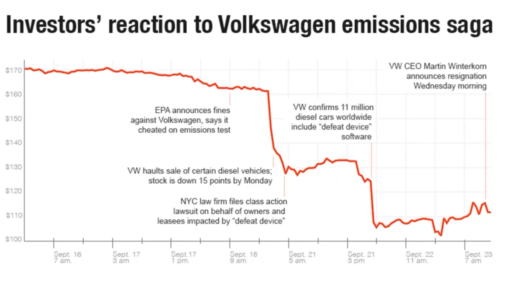o. 
Rischio: impossibilitá di prevedere con certezza gli esiti futuri delle decisioni. Indipendentemente dallo sforzo che un imprenditore ci mette, l'impresa potrebbe essere sfortunata. 

> Gli imprevisti capitano  

Fattori di rischio: 

- tempo
- rigidezza dell'azienda 
- contesto dinamico e mutevole 

Il rischio colpisce tutti. Il contesto dinamico e mutevole ha cancellato Nokia, leader del settore. 

## Forma giuridica dell'impresa

Due tipi di responsabilità: 

- responsabilitá illimitata (personale): l'imprenditore rispondono con tutto il patrimonio personale.
- responsabilitá limitata: l'imprenditore risponde con i soli capitali conferiti.

Come nasce l'impresa? 

In linea di principio non é necessario accollarsi il capitale. Tuttavia la presenza di capitale proprio dei fondatori spesso garantisce capitali. 
Per partire si costruisce il cosiddetto business plan: documento che espone le previsioni degli esiti di business, per convincere l'investitore esterno. 

Come muore? Ormai l'impresa é dissociata con la vita dell'imprenditore, ma puó rischiare di morire in assenza di profitto. In Italia le imprese vivono in media 12 anni. 

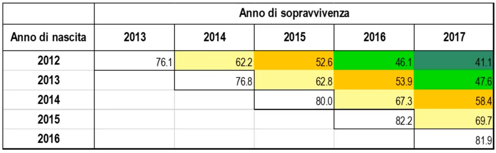

Può morire per:

- Fallimento 
- Liquidazione 
- Acquisizione/Fusione (caso piú positivo)

E può essere classificata per: 

- Proprietá: pubblica - privata 

- Obiettivo: profit - non profit 

- Dimensione(in base ad addetti e fatturato): grandi - medie - piccole  

- Differenze tra beni e servizi. 

- In base al numero di output: 
	- monoprodotto 
	- diversificate 
	- conglomerati 

- Distinzione qualitative:
	- Whoresale
	- Retail 

 - Localizzazione delle attivitá produttive:
	 - Nazionali 
	 - Multinazionali 

*L'[Italia](Italia.md) é fatta di Piccole-Medie imprese. Si parla di una dimensione media di 4 addetti!*

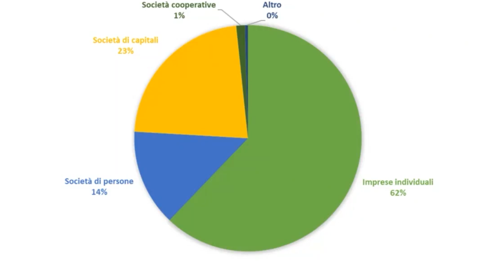
(*Fonti Istat 2019*)

### Diritti e doveri dell'impresa

L'impresa ha quindi diritti:

- diritto di proprietá sui bene, sui servizi 
- diritto di affittare 
- diritto di difendersi in tribunale 

Ma anche doveri:

- rispettare leggi (redigere bilancio, rispettare normativa ambientale ecc. )

> La forma giuridica stabilisce in che modalitá l'azienda deve adempiere ai propri doveri 

Le grandi aziende internazionali devono fare per redigere il bilancio per ogni paese in cui operano, e poi anche il bilancio del capogruppo delle aziende dei vari paesi il quale deve essere coerente con tutti gli altri bilanci chiaramente.

## Forma giuridica

### Tipi di forme giuridiche: 

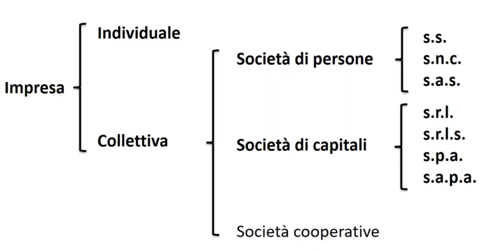
### Impresa individuale 
Caratterizzate da una responsabilitá illimitata. 
(ingegnere, architetto ecc. ecc.): chiaramente di semplice gestione, (tassazione IRPEF, la quale va a privilegiare i redditi bassi) . 

### Impresa collettiva: 

- ###### Societá di persone: 
	- **Societá semplice(s.s)**: attivitá agricole, gestione di patrimoni immobiliari
	- **Societá in modo collettivo (s.n.c)**
	- **Societá in accomandita semplice (s.a.s)**:
		- Soci accomandatari: responsabilitá illimitata
		- Soci accomandanti: responsabilità limitata

- ###### Societá di capitale
Adempimenti burocratici e fiscali molto dettagliate e maggiori obblighi di trasparenza a fronte di responsabilitá limitata. 
	- **Societá a responsabilitá limitata (s.r.l)**: non quotabili, con capitale minimo di 10k euro. 
	- **Societá a responsanilitá limitata semplificata(s.r.l.s)**: capitale minimo di 1 euro.
	- **Societá per azioni (s.p.a)**: il patrimonio sociale é costituito da azioni. Cap. Min: 50k euro. 
	- **Societá in accomandita per azioni (s.a.p.a)**: i soci si distinguono in accomandatari e accomandanti. 

- ###### Societá cooperative 
Simili alle societá di capitale ma tutti **gli utili** vengono reinvestiti nella societá. 

# Il mercato

## La domanda

Mercato: luogo fisico o virtuale in cui avviene la vendita e l'acquisto dei beni e dei servizi. 

Dal punto di vista dell'impresa è quindi fondamentale comprendere la domanda (scelta di acquisto dei consumatori in relazione al bene o servizio offerto) e l'offerta (soprattutto in relazione alle altre imprese). 
Mentre le aziende hanno come unico obiettivo la massimizzazione del profitto, i consumatori (quindi la domanda) mirano a massimizzare il proprio benessere. 

### Funzione di utilità

Descrive come varia il livello di soddisfazione del consumatore al variare della qualità dei beni/servizi . I consumatori massimizzano la funzione di utilitá tenendo conto del loro reddito. 
Assunzioni banali ma fondamentali per caratterizzare la funzione di utilità: 

- Utilità monotona e crescente: aumenta la qualità e aumenta l' utilità del consumatore. 
- Utilità marginale decrescente: l'utilità addizionale (marginale) di ogni successiva consumazione a via via decresce. Cioè la derivata prima della funzione di utilità (crescente) è decrescente. 

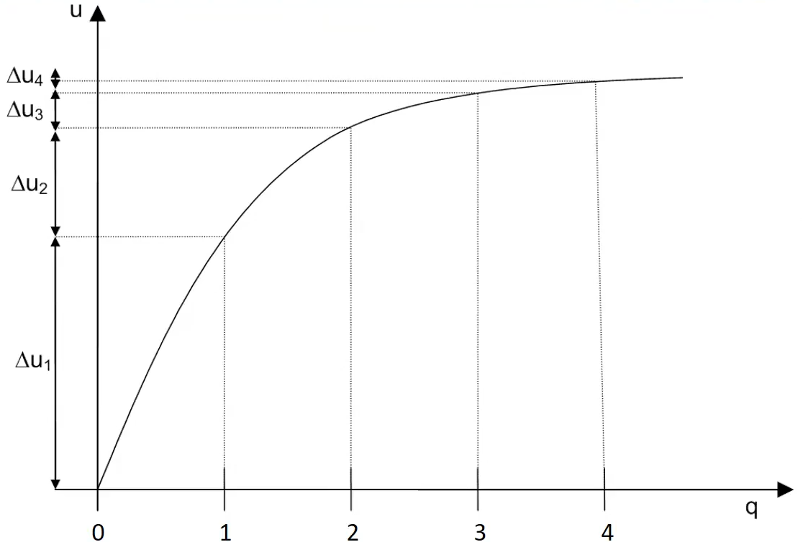

### Prezzo di riserva
Il PR é l'upper bound del prezzo che il consumatore è disposto a pagare per l'acquisto del bene. 
Conoscere il prezzo di riserva dei consumatori permette di definire la curva di domanda individuale di un bene.

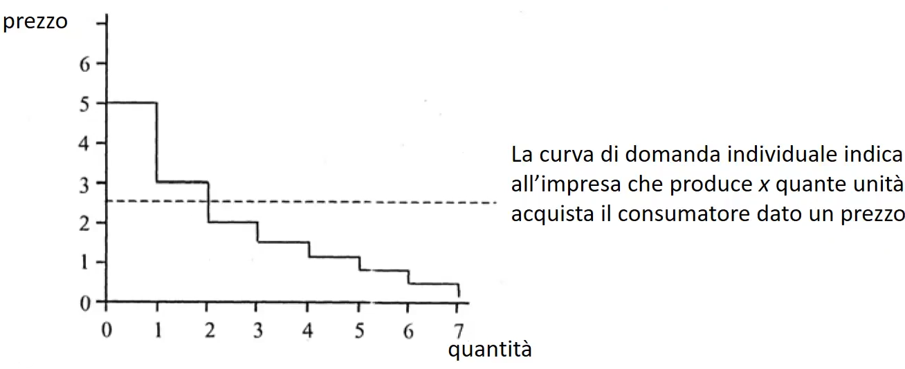

Il surplus è un benessere aggiuntivo del consumatore, cioè differenza tra il PR e il prezzo di mercato del bene. 
Il surplus è un parametro utilizzato per valutare 'il profitto dei consumatori' o meglio, la soddisfazione dei clienti. 

Da cosa dipendono le curve appena definite? 
Principalemennte da caratteristiche del consumatore quali reddito, gusti e **necessità**, ma anche da caratteristiche del bene. 

### Classificazione bene 

- Bene normale: quantità domandata aumenta all'aumentare del reddito.
- Bene inferiore: più aumenta il reddito e non necessariamente ne aumenta la domanda (esempio il cibo).

In caso dei beni inferiori sostanzialmente si effettua una sostituzione dei prodotti, cioè uno spostamento tra beni di bassa qualità a beni di alta qualità. 

- Bene sostituto: beni che espletano stesse funzioni di x . Se aumenta il prezzo di un bene sostituto a $x$ , la quantità domandata di $x$ aumenta, e viceversa. 
- Bene complementare: Beni che tendono a essere consumati insieme a x . Se aumenta il prezzo di un bene complementare a $x$ , la quantità domandata di $x$ diminuisce, e viceversa.

### Domanda di mercato
Somma, per tutti gli N consumatori, delle quantità domandate individuali. 
$$Q(p)=\sum^n_{i=1}q_i(p)$$
*Sostanzialmente non ci importa del singolo consumatore ma della domanda totale, costruita dalla sommatoria delle domande individuali.*

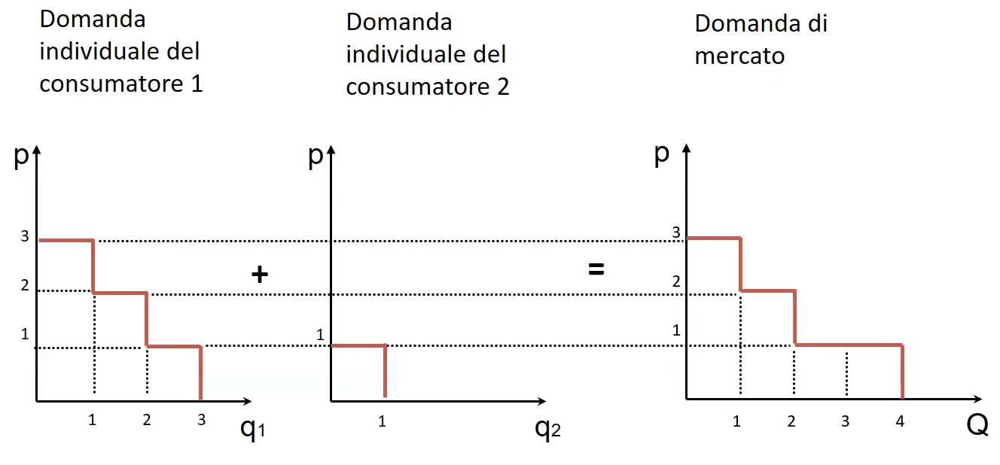
Aggregazione della domanda. 
Una considerazione: può avere forme diverse ma la logica di fondo è che la curva sarà quasi sempre decrescente. 

### Elasticità della domanda 
L'elasticitá della domanda é la variazione della quantitá domandata in relazione al variare di una delle componenti che la caratterizzano: 

- prezzo del bene 
- prezzo degli altri beni (cambia nel caso in cui sono beni sostituti o complementari)
- reddito del consumatore 

Conoscendo l'elasticità della domanda possiamo 'prevedere' o 'stimare' l'impatto che potrebbero avere le scelte dell'impresa riguardo le vendite. 

#### Elasticità della domanda al prezzo
$$\epsilon = \frac{\frac{\Delta q}{q_x}}{\frac{\Delta p}{p_x}} = \frac{\delta q_x}{d p_x}\frac{p_x}{q_x}$$
L'elasticità sarebbe il rapporto percentuale tra la variazione della quantità rispetto la variazione di prezzo. Di fatto calcoli l'elasticità puntuale con l'uso della derivata: cioè fai la derivata prima della domanda rispetto al prezzo, per poi moltiplicarla per $\frac{p}{q}$ . 
Quindi in caso di beni fondamentali/essenziali l'elasticità tende a zero e si rigida. La domanda è completamente anelastica nei beni di prima necessità ad esempio il cibo, la benzina, il metano o l'elettricità.
L'elasticità é in genere negativa e la si considera in valore assoluto.
Quando bisogna calcolare l'elasticità della **domanda** al prezzo, ovviamente devi fare il conticino sulla funzione della curva di domanda.
Nel caso di domanda elastica rispetto al prezzo, il risultato è superiore a 1, mentre è inferiore a 1 nel caso di domanda anelastica; se il valore coincide con 1, invece, la domanda e il prezzo sono direttamente proporzionali. Questo di fatto è estremamente improbabile potendo essere al limite il risultato di un’osservazione dell’elasticità della domanda per un breve periodo. Anche il risultato 0 si verifica solo in pochi casi eccezionali in cui le variazioni dei prezzi non hanno alcun impatto sulla domanda. Un esempio tipico di questa **domanda completamente anelastica** rispetto al prezzo è l’aumento dei prezzi di farmaci salvavita come l’insulina per i diabetici.

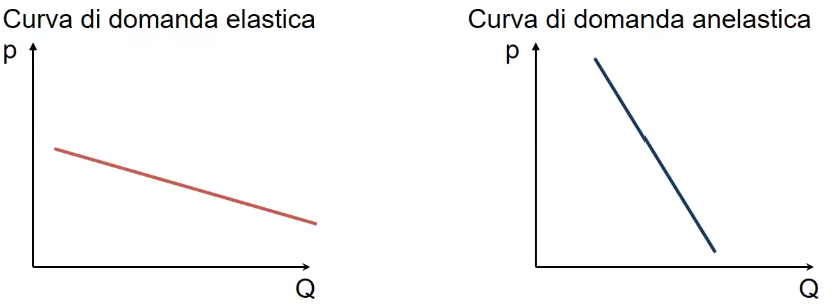
> Un'azienda che opera in un mercato con un prodotto caratterizzato da una curva di domanda elastica dovrà quindi stare attenta a modificare il prezzo del prodotto.

> Sostanzialmente in mercati caratterizzati da domanda elastica la competizione è maggiore.

#### Elasticitá incrociata
$$\epsilon = \frac{\frac{\Delta q_x}{q_x}}{\frac{\Delta p_y}{p_y}}= \frac{\delta q_x}{d p_y}\frac{p_y}{q_x}$$
Beni complementari: elasticità incrociata negativa. Cioè se due beni in genere vengono consumati insieme, se il prezzo di $y$  aumenta allora la quantità di $x$ diminuirà.
Beni sostituti: elasticità incrociata positiva. Se due beni sono uno il sostituto dell'altro, se il prezzo di $y$  aumenta allora la quantità di $x$ aumenterà (poichè più conveniente rispetto ad $y$).
Beni non correlati in alcun modo: elasticità incrociata nulla

#### Elasticità al reddito 
$$\epsilon = \frac{\frac{\Delta q}{q_x}}{\frac{\Delta M}{M}}=\frac{\delta q_x}{d M}\frac{M}{q_x}$$

- Beni inferiori: elasticità della domanda al reddito negativa. Se il reddito aumenta i beni di prima necessità vengono consumati uguali o al massimo di meno. 
- Beni normali: elasticità della domanda al reddito positiva. Se il reddito aumenta la quantità domandata sarà maggiore. 

## Offerta e forme di mercato 

Con $RT$ i ricavi totali e $CT$ i costi totali possiamo scrivere la condizione di massimizzazione del profitto: 

$$max_q \pi = RT(q) - CT(q)$$

Facendo uso di avanzate tecniche di analisi matematica (derivando) $RM(q)-CM(q)=0$ quindi la massimizzazione del profitto la si ha per $RM(q)=CM(q)$.

Con $RM$ e $CM$: 

- $RT$, ricavo marginale: derivata prima del ricavo, rappresenta "il ricavo ottenuto servendo un cliente aggiuntivo". Derivata dei $RT$ rispetto a $q$ . 
 
- $CM$, costo marginale: derivata prima del costo, rappresenta "il costo per produrre un bene aggiuntivo". Derivata dei $CT$ rispetto a $q$ . 

*Tutto dipende da $q$ perchè ci aspettiamo che i ricavi totali ($RT$) e i costi totali ($CT$) sono funzioni della quantità prodotta.*

Concetto generale:

> Quando l'impresa per aggiungere un cliente aggiuntivo mi devo rivolgere a mercati con PR più bassi l'impresa si ferma

La capacità delle imprese di massimizzare il profitto dipende da: 

- concorrenza 
- natura del prodotto (omogeneo o differenziato)
- grado di libertà di entrata e uscita delle imprese 
- quantità dell'informazioni detenuta da imprese e consumatori 

## Concorrenza perfetta
La concorrenza perfetta è un modello teorico che però può simulare perfettamente diversi mercati. 

Si basa su 4 ipotesi:

- numero elevato d'imprese, la singola impresa non potrà mai coprire l'intera offerta
- prodotto omogeneo 
- acquirenti e venditori hanno conoscenza perfetta dei prezzi 
- esiste completa libertà di entrata e uscita di nuove imprese

Quindi il mercato in caso di concorrenza perfetta è una forma estrema, in cui c'è pochissima elasticità della domanda.
La condizione di massimizzazione del profitto in caso di concorrenza perfetta è: 
$$CM(q)=p$$

### Effetti di lungo periodo concorrenza perfetta
In generale nel caso di concorrenza perfetta e in caso di imprese operanti con profitti positivi, nel lungo periodo ci si 
potrebbe aspettare un ingresso di altre imprese, con una conseguente riduzione del prezzo di mercato e dei profitti. Ciò va a favore del singolo consumatore che avrà prezzi dei prodotti sempre più bassi, ma va 'a danno' delle imprese. 

Se $p> \space prezzo \space di \space equilibrio \space di \space mercato \space$ si  avrà un **eccesso di offerta** e sicuramente alcuni produttori non riusciranno a vendere.  
Viceversa se $p < \space prezzo \space di \space equilibrio \space di \space mercato \space$ si avrà un **eccesso di domanda** e sicuramente alcuni consumatori saranno disposti a comprare il bene ma non potranno. 

## Monopolio

Perché esiste il monopolio? Esistono barriere insormontabili per entrare nel mercato da parte di altre aziende. 
Monopolio significa 'Price Maker' . Price Maker significa che il prezzo non sarà 'fisso' rispetto la quantità, come nel caso del price taker. Dunque quando si fa la derivata bisognerà tenere conto di questo fatto. I ricavi totali sono infatti:
$$RT(q)=p(q)*q$$
$$RM(q)= p(q)*(1-\frac{1}{\epsilon})$$

La condizione di massimizzazione del profitto é $RM(q)=CM(q)$ dunque si ottiene: 
$$p(q)=\frac{CM(q)}{1-\frac{1}{\epsilon}}$$

$$\frac{p(q) - CM(q)}{p(q)}  =\frac{1}{\epsilon}$$

Il monopolista fissa un prezzo al di sopra dei costi marginali! Ha potere di mercato. Il potere di mercato sará tanto maggiore quanto meno la domanda risponde alla variazione di prezzo (cioé é rigida). Quindi piú la domanda é rigida e piú il monopolista sará 'forte'.

> Una azienda non guarda il costo di produzione del prodotto, guarda sempre il mercato.

Al policy maker, un monopolio é peggio di una concorrenza perfetta poiché é dimostrato che globalmente, valutando il surplus dei consumatori e il surplus dei produttori , la concorrenza perfetta massimizza il surplus globale mentre il monopolio no. 
In genere il monopolista massimizzando i suoi guadagni provoca una diminuizione del 'benessere complessivo', danneggiando l'economia totale. 

Il concetto di 'il monopolio é il male' é sbagliato in quanto dipende molto dal settore. In particolare quei settori nel quale un'impresa per operare in maniera efficiente deve avere grosse dimensioni, l'economia ha benessere complessivo con poche imprese. Ad esempio nel settore di telecomunicazioni non sará efficiente avere tante imprese che operano in maniera inefficiente rispetto a 3/4 che operano in maniera efficiente. 

### Interventi dello stato: leggi antitrust

1) impedire/approvare fusioni 
2) frazionare imprese divenute troppo grandi 
3) impedire comportamenti volti a ridurre la concorrenza 

Se in un mercato aziende grosse si fondono, il mercato si avvicina troppo a un monopolio e potrebbe ridurre il beneficio complessivo per la societá. 
L'unico motivo per cui l'antitrust permetterebbe un avvicinamento del mercato verso un monopolio sarebbe nella sola situazione in cui l'avvicinamento porterebbe anche a un grosso miglioramento produttivo. 

Per lo stato é piú importante il miglioramento produttivo rispetto al allontamento del mercato dal monopolio. I brevetti servono proprio a questo, 'dai un po' di monopolio all'impresa' per incentivarla a investire in ricerca e sviluppo e migliorare produttivamente. 

Nei nostri esercizi, quando si parla di regolamentazione al monopolista significa quasi sempre di imporre al monopolista di offrire il bene a $p = CM$ . 

### Possibili barriere all'entrata che portano al Monopolio

- **Istituzionali** (licenze e brevetti):Chiaramente in alcuni settori, tipo il settore farmaceutico i brevetti funzionano molto bene poiché una molecola brevettata é inimitabile. Il settore informatico é diverso, un codice brevettato se diffuso puó essere facilmente copiato raggirando il brevetto. 
- **Barriere strutturali**: Nel mercato di messaggistica puó anche uscira un'app nuova piena di funzionalitá, peró non riesci a sradicare whatsapp perché lo 'usano tutti'. 
- **Barriere strategiche**: barriere messe in atto dalle imprese giá presenti sul mercato per inibire l'entrata di altre aziende e indurre l'uscita di altre imprese. Si puó parlare anche di **collusione** tra piú aziende. 

L'antitrust potrebbe anche permettere fusioni ecc. ma introducendo una regolamentazione sul prezzo. Il problema in questi casi é che non é semplice capire il 'prezzo corretto'.

Ricavi marginali e costi marginali fondamentali come concetti da comprendere appieno.  

# Contabilitá esterna: bilancio

Il bilancio è un documento pubblico a tutti Il bilancio, ed è la principale base informativa aziendale, redatto per informare tutti gli stakeholders sulla situazione economica, finanziaria e patrimoniale dell’impresa in un determinato periodo (detto **esercizio**). 
*non confondere stakeholder (chiunque abbia un interesse all'interno dell'impresa) con shareholder (azionista)*.

In questo corso guarderemo il bilancio di tipo $IFSR|IAS$  cioè che segue i criteri internazionali. Si possono classificare le voci di bilancio secondo diversi criteri, noi utilizzeremo esclusivamente 
il bilancio per destinazione e non per natura.

Il bilancio si basa sui principi di:

- chiarezza: cioè comprensibile 
- veridicità e correttezza
- prudenza: minimalizzando gli utili 
- continuità della gestione: si presuppone che l'impresa continuerà ad operare nel tempo 
- competenza
- costanza
- misura monetaria
- entità aziendale
- costo: ogni acquisto deve essere registrato con il prezzo effettivamente pagato che può differire dal valore effettivo 
- partita doppia: risorse investite=denaro raccolto 
- realizzazione 
- realismo: il bilancio è il pù possibile realistico ma bisogna tenere conto che ad esempio risorse aziendali quali ad esempio Elon Musk non possono essere tradotte in un valore monetario/ne quantificabile. 

Bilancio diviso in: 

- Stato patrimoniale:
	- attività:
		- correnti 
		- non correnti
	- passività:
		- corrente
		- non corrente
	- patrimonio netto:
		- capitale sociale
		- utile:
			- utile d'esercizio 
			- utili portati a nuovo
- Conto economico 
- Prospetto delle variazioni delle voci del patrimonio netto 
- Rendiconto finanziario 
- Nota integrativa

Solo per gli italiani altri documenti che costituiscono il bilancio sono: 

- relazione degli administratori  
- relazione dei sindaci: organo proposto al controllo della legalità
- relazione della società di revisione: attesta oggettiva correttezza del bilancio

In particolare lo stato patrimoniale: 

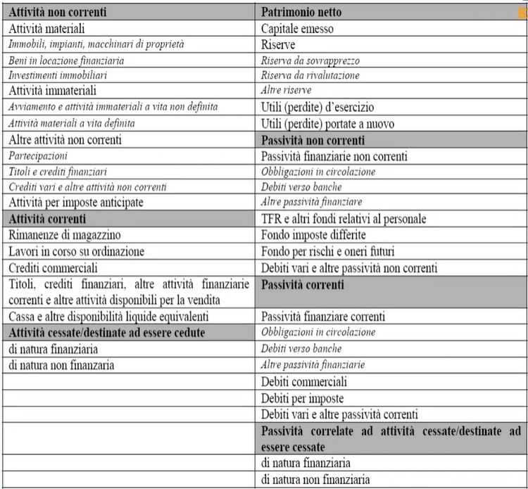

## Identità fondamentale

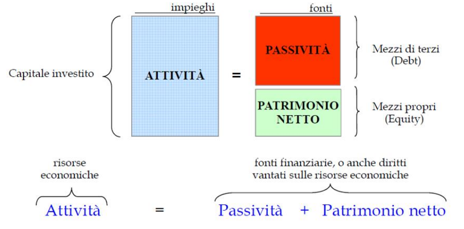

## Stato Patrimoniale 
- Attività: Risorse controllate dall’impresa, risultato di operazioni svolte in passato, dalla quale ci si attende un afflusso di benefici economici futuri.

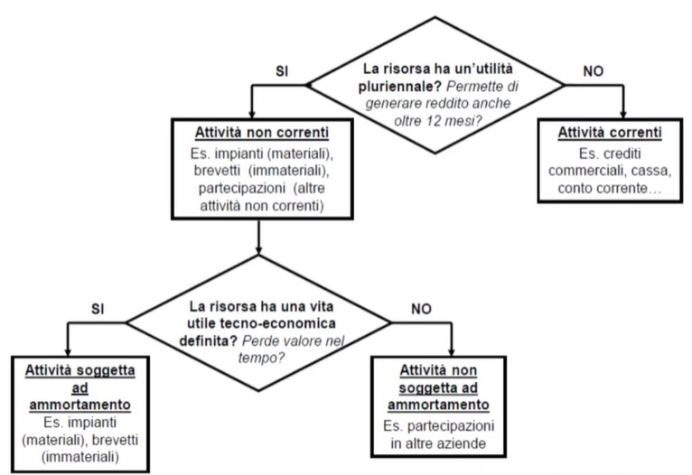
- Passività: Obbligazioni effettivamente assunte dall’impresa in relazione ad operazioni e altri fatti verificatisi in passato, ossia impegni irrevocabili a tenere un certo comportamento per effetto di disposizioni contrattuali, di leggi o di prassi consolidate 
- Patrimonio netto: Valore residuo delle attività dell’impresa dopo aver dedotto tutte le passività. 

### Ricavi in Utile Netto

L'utile d'esercizio è la differenza tra ricavi e costi di competenza di un esercizio contabile. Necessario per capire la performance economica e reddituale dell'impresa. 

Tabella importantissima: 

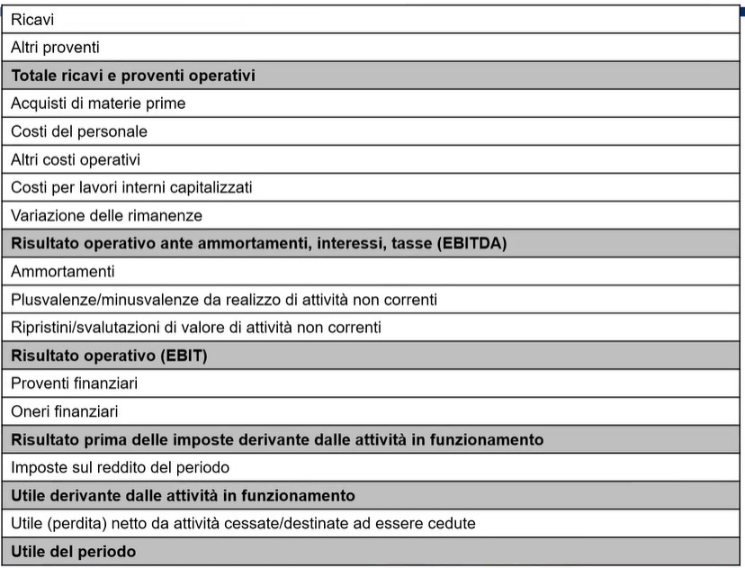

## Operazioni di bilancio e mastrini

|       DARE                                 | AVERE                                        |
|-------------------------|---------------------------|
|  $\uparrow$ attività  |  $\textdownarrow$   attività  | 
|  $\downarrow$   patrimonio netto    |  $\uparrow$  patrimonio netto   | 
|   $\downarrow$    passività  |   $\uparrow$  passività    | 
| $\uparrow$ **costi**   | $\uparrow$ **ricavi**  |

Ogni operazione sarà contabilizzata in modo tale che la somma della colonna 'DARE' sia sempre uguale alla somma della colonna 'AVERE' . Ogni operazione coinvolgerà sempre almeno 2 mastrini. 

### Esempio operazioni

- Operazione 1

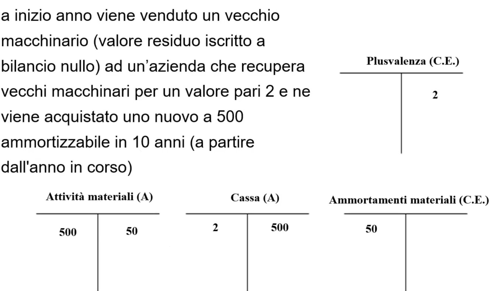

- Operazione 2

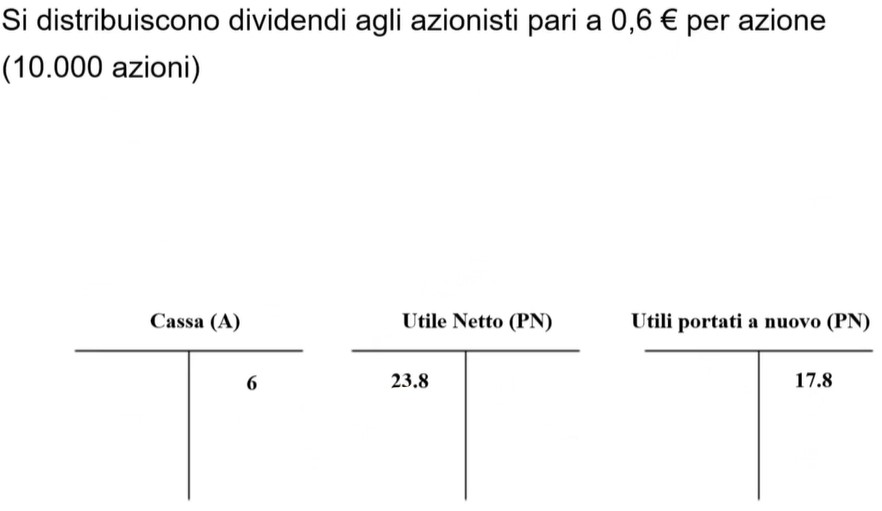

Distribuzione dividendi significa che tolgo dagli utili dell'anno precedente (Utile Netto).
Quello che rimane lo porto a Utili Portati a Nuovo e la differenza (i dividendi) vanno fuori dalla cassa.

- Operazione 3

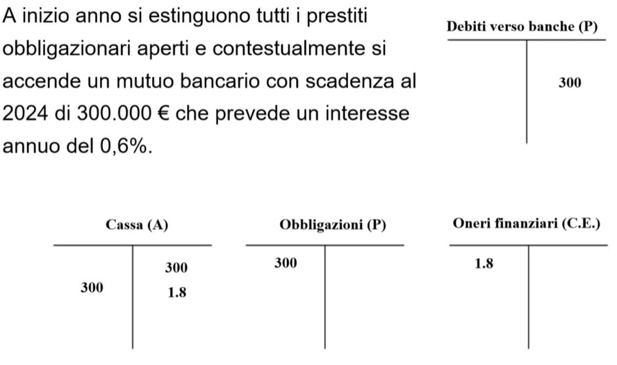

- Sintetico formulario su dove sono alcune voci

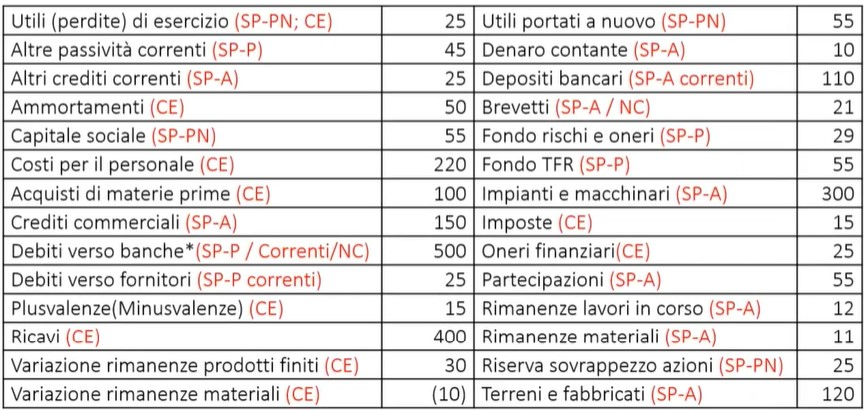

- Generica operazione acquisto MP

Quando acquisto le MP spendo in cassa (o eventualmente in debito fornitori) e registro nel CE come COSTO MP .

#### Operazione con acquisto di altra impresa 

Quando un'impresa acquista un'altra impresa, di fatto aggiungiamo tutte le **attività e passività** di una nell'altra. Ma questo non è abbastanza se il prezzo di acquisto è maggiore del reale patrimonio netto dell'impresa acquisita (come nella maggior parte dei casi accade). Dobbiamo quindi aggiungere il cosidetto **avviamento** nelle **attività non correnti** dell'impresa che ha acquistato. 

$$Avviamento = prezzo \space di \space acquisto - (totale \space attività - totale \space passività )$$ 
(*ovviamente totale attività e passività della società acquisita*).

**Cioè creiamo una voce $avviamento$ per bilanciare il fatto che il prezzo di acquisto è superiore al patrimonio netto dell'azienda acquistata**. Ricordati infatti che il bilancio deve essere sempre 'bilanciato', dunque se noi (azienda) acquistiamo un una startup pagando più di quello dichiarato nel suo bilancio. Nel momento della 'somma' ci ritroviamo proprio un buco uguale proprio al valore del'avviamento. 

## Conto econonomico

Costituisce la sintesi dei flussi di natura economica che interessano l'impresa di un dato arco di tempo. Determina quindi l'utile di esercizio dell'impresa come differenza dei ricavi e costi. 

- Prima parte conto economico riguarda i ricavi e i costi operativi. 
- Con ricavi si intendono la vendita di beni, servizi, utilizzo da parte di terzi dei beni dell'azienda che genera utile. 
- Con costi si intendono anche variazione scorte ecc. ma anche costi per materie prime, servizi e personale e ammortamenti. 

- Diversi tipi di **ammortamento**, cioé la quota del valore di un'immobilizzazione materiale o immateriale (*nota bene! anche immateriale!*) considerata di competenza dell'esercizio in corso:

	- ammortamento a quote costanti 
	- ammortamento accellerato 
	- ammortamento anticipato 

Questi diversi ammortamenti sono soggetti a normative, perché spesso decidono la natura fiscale. Gli ammortamenti sono quindi una 'suddivisione del costo ' sugli anni di esercizio in cui tale bene verrá utilizzato. 

##### Regolina d'oro rimanenze MP nel CE

> Nel CE scrivo solo la **variazione** di prodotti finiti e materie prime da inizio a fine esercizio. 

## Rendiconto finanziario 

Il RF mostra l’ammontare e la composizione delle disponibilità liquide ed il **cashflow** dell’esercizio derivanti dall’attività:

- operativa (attività operativa dell'azienda)
- investimento (acquisizione/cessione di immobilizzazione materiali/immateriali/finanziarie)
- finanziamento (variazione del patr. netto dovuto ad indebitamento per finanziare l'azienda)
é importante che la redazione suddivida in questo modo il cash flow , cioè basandosi sulle origini di tale cashflow. 

### Cash Flow 

$$Cash \space Flow \ne Utile \space Netto$$

Impresa in equilibrio economico quando flusso ricavi $>$ flusso di costi . 
Equilibrio finanziario è diverso: 
Flusso dei ricavi + Finanziamenti > Flusso dei costi + Rimborso dei finanziamenti 

### CashFlow operativo

Diversi modi per calcolare il cashflow operativo: 

- metodo diretto: il metodo  più immediato e si basa sulle principali categorie di incassi e pagamenti lordi 

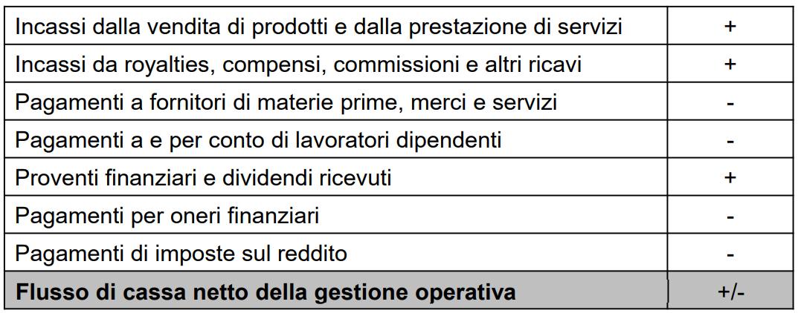

- metodo indiretto: si basa sulla **rettificazione** dei costi netti dovuto agli effetti delle operazioni non-cash e della variazione di capitale circolante netto. 

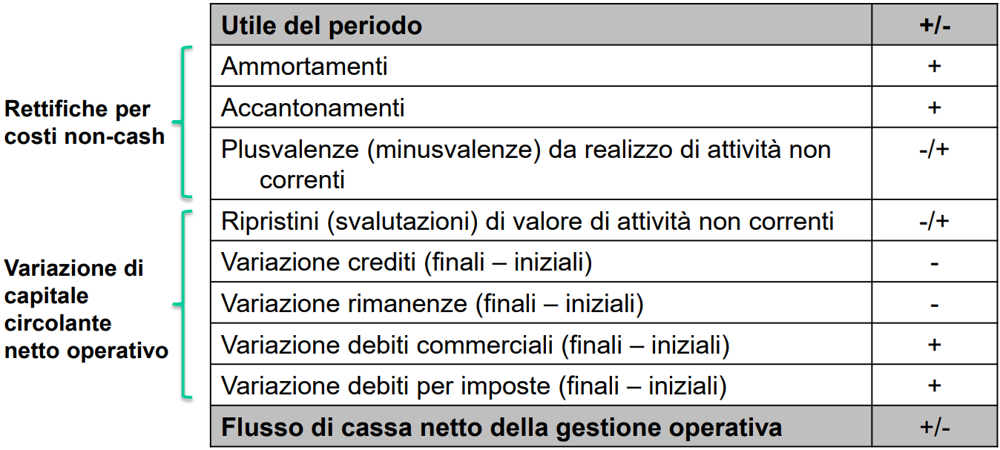

Il CF operativo (o flusso di cassa netto) sarà particolarmente importante per gli esercizi riguardo la valutazione degli investimenti e in genere utilizzerai sempre il metodo indiretto (cioè in parole povere non lo calcolerai direttamente, ma partirai con il calcolo dall'utile netto del esercizio). 

### CashFlow per attività di investimento 

Strettamente legato alla variazione di attività non correnti in SP.

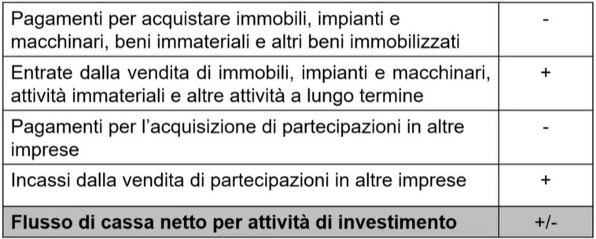

### CashFlow per attività di finanziamento 
Strettamente legato alla variazione di Passività finanziare e patrimonio netto in SP.

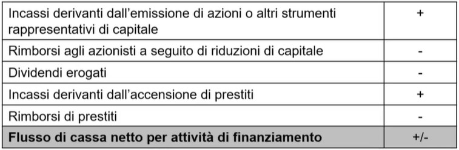

## Indici di bilancio 
L’acronimo EBIT sta per “earning before interest and taxes” e quindi semplificando si può dire che descrive l’utile di una società senza costi e ricavi provenienti da interessi e imposte.

### Indici patrimoniali 

Classe di indici data dal rapporto tra 2 grandezze di SP.

- Indipendenza finanziaria 
	$$\frac{Patrimonio \space netto}{Patrimonio \space netto + passivitá}$$
Potrà assumere valori compresi tra 0 ed 1. • L’impresa deve avere un capitale minimo (perciò l’indice non potrà essere uguale a 0) e può anche essere finanziata col solo patrimonio netto (indice uguale a 1). Sono da considerare con attenzione valori:

- troppo bassi ($< \frac{1}{3}$ sottocapitalizzazione) 
- troppo alti ($< \frac{2}{3}$ sovracapitalizzazione)

La **sottocapitalizzazione** è una situazione di **carenza di mezzi propri** di un’impresa rispetto al livello necessario per perseguire in maniera ottimale gli obiettivi aziendali. Un $PN$ troppo basso rende più probabile l’incapacità di onorare i propri debiti da parte dell’impresa e anche più rischiosa la posizione dei creditori.  
Diventa dunque necessario per gli azionisti mantenere sempre l’azienda sufficientemente capitalizzata, immettendovi capitale fresco.

- Indebitamento 
$$\frac{Passivitá}{Patrimonio \space netto + passivitá}$$
- elasticità impieghi 
	$$\frac{Attivitá \space correnti}{totale \space attivo}$$

### Indici di liquiditá 
Utili per capire se l'impresa potrebbe avere problemi di liquidità o meno . 

- Rapporto corrente (CR)
$$\frac{attivitá \space correnti}{passivitá \space correnti}$$
Un $RC$ 'corretto' dovrebbe stare verso $2$ , sotto l' $1$ o verso l'$1$ è negativo. Troppo oltre il $2$ si potrebbe incominciare a pensare di avere troppo liquidità: quindi sarebbe meglio investire tale liquidità e ciò porterebbe più reddito.

Una misura più prudente del $RC$ è il Test Acido: 

- Test Acido 
$$\frac{attivitá \space correnti - rimanenze}{passivitá \space correnti}$$

Tra le **risorse correnti** le rimanenze sono le meno facilmente liquidabili, poichè valore di mercato **incerto** e soprattutto perchè i semilavorati sono i più **difficili da liquidare**.

### Indici di rotazione

- Durata media dei crediti commerciali 
 $$365* \frac{Crediti \space commerciali}{Fatture\space di \space vendita \space emesse}$$
- Durata media dei debiti commerciali 
 $$365* \frac{Debiti \space commerciali}{Fatture\space di \space acquisto}$$
- Giacenza media in magazzino 
 $$365* \frac{Valore \space magazzino}{Costo\space del \space venduto }$$
- Indice di Rotazione Attivo (RA)
	$$\frac{Ricavi}{Capitale \space Investito}$$

*Dove il capitale investito é il totale delle attivitá che per l'identità é uguale a Totale Passivitá + Patrimonio Netto*

### Indici di redditivitá 

- ROI (Return on Investment)
$$\frac{EBIT}{Capitale \space investito}$$
Il ROI rappresenta la capacità dell’impresa di generare reddito operativo per ogni euro investito. 

scomposizione roi:

$$ROI = ROS * RA$$

- ROS (Return on Sales)
	$$\frac{EBIT}{Ricavi}$$
- ROE (Return on Equity)
$$\frac{Utile \space netto \space dell'esercizio}{Patrimonio \space netto}$$

*ROE è la redditività del capitale proprio per agli azionisti.* 

- ROD (Return on Dept)
	$$\frac{Oneri \space finanziari}{Debiti \space finanziari}$$
Il ROD rappresenta il costo del debito. 
Quando calcoli il ROD devi usare **tutto** il debito **bancario**, sia delle passività non correnti che correnti.

- Leva finanziaria 

$$D/E=\frac{Passivitá}{Patrimonio \space netto}$$

La leva finanziaria $D/E$ è un indicatore di quanto l'impresa viene finanziata dai creditori piuttosto che dalle proprie fonti finanziarie (molto simile al indice di indipendenza finanziaria). Ovviamente gli investitori di solito preferiscono bassi rapporti DE quindi imprese con un elevato rapporto non sono in grado di attrarre ulteriori capitali di prestito.
Mentre in $ROD$ si considera solo il debito verso le banche. Nel $D/E$ si considerano **tutte** le passività diviso il patrimonio netto.
- se la leva finanziaria è minore o uguale a $1$ significa che il capitale proprio è maggiore del capitale di terzi;
-   se la leva finanziaria assume valori superiori a $2$ significa che il capitale di terzi è maggiore del capitale proprio, e dunque che l'azienda è fortemente indebitata.

Non conviene aumentare oltre una certa soglia il livello di indebitamento perché all’aumentare del livello di indebitamento è probabile che $ROD$ aumenti, poiché aumenta il rischio percepito dai finanziatori e questo porta problemi di liquidità, nonchè tutto il fenomeno descritto precedentemente riguardo la *sottocapitalizzazione*. 
Si può genericamente affermare che, in media, se il rapporto assume valori compresi fra $1$ e $2$ l'impresa è in uno stato di corretto equilibrio nell'ambito delle fonti di finanziamento, mentre se il rapporto assume valori superiori a $2$ l'impresa è da considerarsi sottocapitalizzata. 
*(PS: per chi studia sti indici a memoria, è facile ricordarsi tale soglia perchè è la stessa di pericolo del $CR$ o $RC$)*.

### Semplice analisi reddituale

La situazione dell'impresa è positiva in generale se $ROI > ROD$ , cioè $1$ euro di debito rende $ROI$ euro che è maggiore di quanto richiesto dagli investitori ($ROD$ euro) . Quindi conviene indebitarsi. In caso contrario, il debito sta distruggendo valore e i finanziatori esterni vedono l'impresa come rischiosa o l'impresa non sa negoziare tassi di interesse convenienti. 

#### Formula di Modigliani-Miller
$$ROE = (1-t) * [ROI + D/E * (ROI –ROD)]$$
Non ho ben capito perchè ci hanno spiegato sta formula in 2 minuti di lezione ma salta fuori che: con le ipotesi di assenza di imposizione fiscale, costi di fallimento e asimmetrie informative (praticamente teorema non applicabile a qualsiasi mercato reale), da tale formula si può affermare che se la redditività complessiva ($ROI > ROD$) è superiore al costo del debito, l’indebitamento aumenta la remunerazione degli azionisti all’aumentare del debito. Cioè che la remunerazione per gli azionisti è tanto più elevata quanto più: $ROI > ROD$ e $D/E$ è grande.

Quindi in generale si dice che quando:

- $ROI>ROD$  l’impresa può sfruttare la leva finanziaria per accedere a capitale di debito in modo conveniente (rispetto alla redditività del capitale investito, $ROI$) e quindi aumentare la redditività per gli azionisti ($ROE$). 
- $ROI < ROD$ significa che la gestione delle risorse operative è inefficace o inefficiente e i finanziatori esterni vedono l’impresa come rischiosa o l’impresa non sa negoziare tassi di interesse convenienti.

i tratta certamente di un’impresa in salute, con buoni livelli di redditività. Si noti tuttavia che l’impresa non sfrutta per niente l’effetto leva, cosa che consentirebbe un ulteriore aumento di redditività del punto di vista degli azionisti. Dal punto di vista della liquidità e della solidità patrimoniale, l’impresa non dovrebbe avere problemi a far fronte alle obbligazioni con i debitori (essenzialmente debiti commerciali). Parte della liquidità potrebbe però essere utilizzata per investimenti che possano garantire un rendimento, oppure restituita agli azionisti sotto forma di dividendi qualora non ci siano opportunità di investimento interessanti.

# Contabilitá interna 

## Rilevazione dei costi:

La contabilitá interna si concentra sui costi di una determinata impresa in un certo periodo di tempo. 
Possiamo classificare diversi tipi di costi: 

- fissi/variabili
- di produzione/di periodo 
- diretti/indiretti
- evitabili/inevitabili
- inventariabili/non inventariabili 

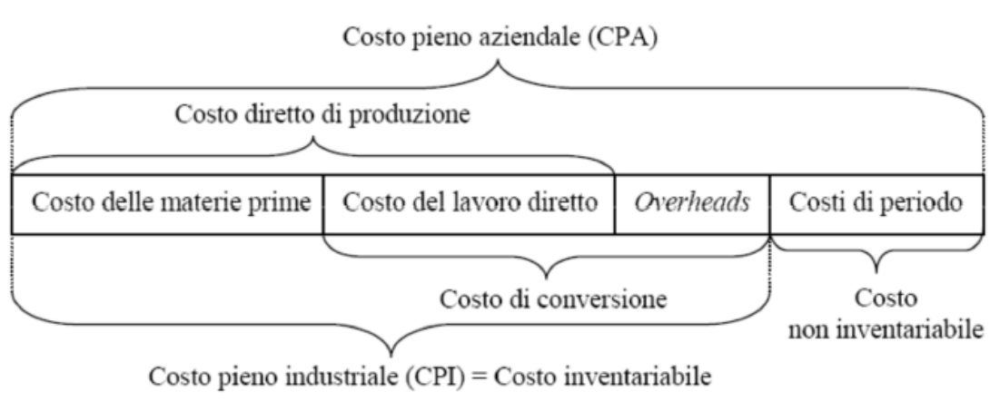

*immagine più importante di questo capitolo, importantissimo sapere la tassonomia dei costi* . 

## Costi fissi/variabili: 

I costi fissi sono i costi che nel breve periodo rimangono invariati. I costi variabili invece dipendeno direttamente (in modo proporzionale) alle variazioni del volume operativo. 
Da notare che i costi variabili non dipendono solo dal volume di produzione ma anche ad esempio dall'ampiezza della gamma, dal tempo di consegna e dalla qualità del prodotto.

## Costi di produzione/di periodo: 

I costi di produzione sono i costi per la trasformazione fisica dell'input in output . 
I costi di produzione si possono dividere in:

- diretti: associabili direttamente alla prod del singolo prodotto
	- materiali diretti
	- lavoro diretto 

- indiretti (overhead): 
	non imputabili ai singoli prodotti 

costi di conversione: lavoro diretto + overhead (cioè costi di produzione senza i MD) .

costi di periodo non associabili alla trasformazione input/output dei prodotti ma associabili invece aò sostentamento dell'azienda. 
Nota che i costi amministrativi non sono costi di produzione ma costi di periodo

## Costi diretti/indiretti 

sebbene spesso i costi di prod diretti sono anche costi variabili non bisogna considerare i due concetti come lo stesso. 

i costi variabili sono infatti costi direttamente dipendenti dal volume prodotto. 

mentre i costi di prod. sono i costi direttamente attribuibili in modo oggettivo a un determinato prodotto. 

lo stesso vale per i costi indiretti/fissi .

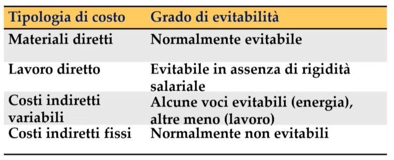

Il concetto principale è che i costi diretti e il lavoro diretto sono facili da determinare per ciascun prodotto. La complessità principale è determinare come i costi **indiretti** vengono spartiti tra i prodotti.  

## Diversi modi per la rilevazione dei costi

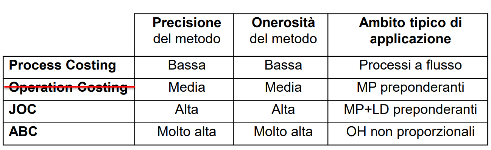

In questo corso guarderemo principalmente i seguenti modi per calcolare i costi: 

- JOC: si basa sul concetto di Job (lotto, in questo contesto). Adatto ad attivitá di tipo manufattiero in ambito aereonautico, navale o comunque tutti quel genere di attivitá in cui si consegna un prodotto , o pochi prodotti , spesso ciascuno che caratteristiche differenti dagli altri. (pensa ad esempio alla produzione di uno yacht).  

- PC: concetto opposto di JOC, indicato per quelle imprese caratterizzate da flussi continui .

- ABC : Activity Based Cost, il piú avanzato. Un 'JOC 2.0' in cui viene introdotto il concetto di attività come 'ponte' tra le risorse utilizzate e i prodotti. 

Quando faccio i calcoli per la rilevazione dei costi, utilizzeremo principalmente questi 3 concetti: 

- MD: materie dirette
- LD: lavoro diretto
- OVH: overheads dovuti alla produzione del prodotto 

I costi servono ovviamente per analizzare il profitto dell'impresa e l'efficienza di produzione.  In caso di profitto negativo, al produttore nel breve periodo conviene offrire una quantità minima di Break-Even per ricoprire parte dei costi fissi (anche operando in perdita), per poi, nel lungo periodo o quando è possibile modificare i CF, aumentare l’efficienza della produzione o uscire dal mercato.

## JOC 

Per i costi diretti sarà semplice .. (per ogni lavoro MD e LD) sono i costi indiretti il problema.. 
Si crea la cosiddetta 'base di allocazione' che viene fatta in base

Costi indiretti del $j-esimo$ prodotto: 
$$CI_j = \frac{OVH_{totali}}{BA_{totale}}BA_j$$

dove la base di allocazione è un 'indicatore del consumo delle risorse': ad esempio la base di allocazione per gli overhead potrebbe essere il prezzo che mi costa la manodopera all'ora. 

Morale: tu hai degli overhead, e non sai come distribuirli equamente tra i JOB. Allora scegli un parametro (esempio la manodopera) con cui fare una 'media pesata' degli overhead. 

### CPI nel JOC

$$CPI = C_{MD} + C_{LD} + C_{OVH}$$

Dove $C_{OVH}$ sarà il costo degli overhead proporzionati. 

## PC
Per il PC introduciamo ulteriori 2 concetti: 

- Unitá equivalente: fondamentale esprimere l'output in termine di unitá equivalenti dei prodotti finiti. Cioé "30 hamburger non nel pane, 34 patatine grandi non salate e 27 bibite ancora senza ghiaccio possono essere visti come 15 HappyMeals, considerati in questo caso come unitá equivalenti, cioé prodotti finiti". 
- Grado di completamento: grado di completamente del WIP, calcolato in termini di percentuale del **costo** utilizzato rispetto al costo totale del prodotto. 

Grafico che mostra che 50k unità sono 'partite' da un WIP al 40% per poi diventare prodotti finiti. Nel frattempo 80k unità sono state prodotte e 40k sono 'uscite' al 60% della lavorazione. Il grafico mostra inoltre di come i materiali diretti siano inseriti all'inizio della produzione. 

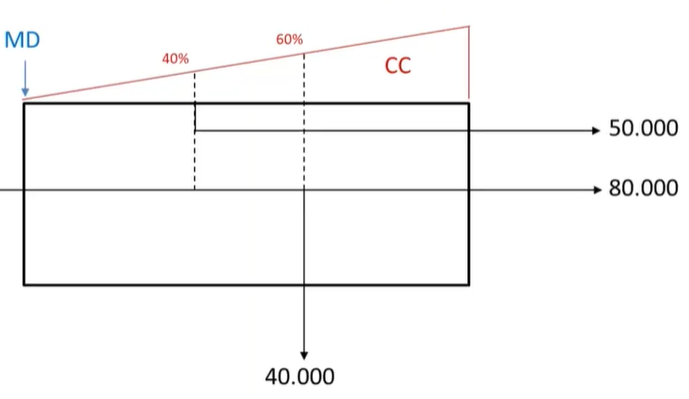

### Passi del PC

1) scegliere una unitá di riferimento tra i prodotti, e calcolare il tasso $\gamma$ di ciascun altro prodotto rispetto alla $UE$  

Per ogni risorsa (in genere per ciascun MD e per i CC) si eseguono i seguenti passi:

2) calcolare l'output in termini di $UE$ 
3) calcolare **costi totali** da attribuire alla risorsa 
4) calcolare il **costo unitario per unità equivalente** .  

Infine:

5) allocare il costo alle unità di prodotto finito e $WIP$ considerando eventualmente coefficienti di assorbimento calcolati nel punto (1) $\gamma$ . 

#### Valorizzazione scorte

Il passo (2) e (5), variano a seconda del **metodo di valorizzazione delle scorte** , il quale può essere: 

- FIFO
- Costo Medio
- LIFO

I risultati generalmente sono diversi a seconda della logica usata. Ovviamente questa ultima affermazione ha senso solo nel caso in cui siano semilavorati iniziali: in caso di assenza di semilavorati iniziali non cambia na bega!

##### FIFO 

Il calcolo del punto (2) con logica $FIFO$: $$UE = N_{PF} + \alpha WIP_{finali} - \alpha WIP_{iniziali}$$con $\alpha$ grado di completamento (cioè a che punto sono arrivati con la produzione di tale unità) e $N_{PF}$ il numero di prodotti finiti target. 
Per poi proseguire con:
$$CPI = \sum \frac{C_x}{UE_x}$$
Cioè il Costo Pieno Industriale è la somma di tutti i costi delle risorse $x_{esime}$, ciascuna divisa per il corretto numero di $UE$ . 
$$C_{WIP_{finali}} = \gamma (CPI * \alpha * WIP_{finali}) $$
$$C_{PF} = \gamma(C + C_{WIP_{iniziali}} - C_{WIP_{finali}})$$
Si deve notare che nel momento del calcolo delle unità equivalenti (con la logica FIFO) vengono 'sottratti' i $WIP_{iniziali}$ (cioè non si contano le $UE$  del periodo precedente considerato). Le $UE$ servono quindi per distribuire correttamente i costi del mese corrente. Le unità del $WIP_{iniziali}$ (e quindi costi associati) devono però essere tenuti in conto in questa ultima formula, quando si valuta il **costo totale** dei $PF$ .

##### Costo medio
Con la logica del costo medio, il calcolo delle $UE$ (cioè punto 2) cambia in: 
$$UE = N_{PF} + \alpha WIP_{finali}$$
Cioè nel calcolo delle $UE$ non vengono sottratti i $WIP_{iniziali}$ : questo perchè mentre nella logica $FIFO$ vogliamo fare distinzione tra i prodotti non completi del periodo precedente e i prodotti del periodo considerato, nella logica del costo medio invece le $UE$ comprendono tutto. Successivamente, proprio perchè le $UE$ considerano anche i $WIP$ dello scorso periodo, verrà giustamente calcolato anche il costo del $WIP_{iniziale}$: 
$$CPI = \sum \frac{C_x + C_{x \space wip \space iniziale}}{UE_x}$$
successivamente (così come nella logica FIFO):
$$C_{WIP_{finali}} = \gamma (CPI * \alpha * WIP_{finali})$$
mentre per i $PF$ non consideriamo i $WIP$ : 
$$C_{PF} = \gamma CPI*N_{PF}$$

## ABC 

Per calcolare i costi indiretti per i diversi prodotti si ''usano'' attività e non risorse come base di allocazione. 

1. individuazione attività che consumano le risorse
2. individuazione *resource driver* per ciascuna attività (in pratica quale risorsa usa l'attività, il proprio peso)
3. ripartizione costi indiretti a ciascuna attività
4. ripartizione dei costi ad ogni prodotto/lotto tramite le attività che usano (proporzionalmente) 

L'ABC è più preciso ma necessita d analizzare i processi aziendali ed è complesso definire il numero di attività e il resource driver più adatto per ciascuna attività. Dopo aver capito i resource drivers, ad esempio che l'attività *controllo costi* dipende dal numero delle unità e l'attività di *attrezzaggio* dipende invece dal numero di ore spese si allocano i costi indiretti e quindi in generale gli $OVH$ alle attività.
Si utilizzano infine i resource driver spesi da **ciascun lotto** o **prodotto** per pesare il costo delle attività tra i prodotti. 

# Decisioni di breve termine

Decisioni in tema di pianificazione delle quantitá di beni o servizi da offrire sul mercato. In particolare analisi di decisioni sul **breve periodo**, cioé tattiche e non strategiche. 
Ricorda che nel breve periodo i costi non sono evitabili. 

## Logica differenziale 
Quando si prende una decisione bisogna valutare tutti e soli aspetti differenziali.

## Margine di contribuizione 
Importante valore definito come l'importo che un'azienda ha a disposizione, in base al fatturato, per **coprire i propri costi fissi**.

- Margine di contribuzioni unitario 
$$m=p-cv$$
- Margine di contribuizione totale: 
$$M=m*Q$$

Esempi di decisione: 

1) make/buy
2) analisi break-even 
3) scelta del mix produttivo 

## Make / buy 
Lezione da portarsi a casa: nella realtá é molto piú difficile quantificare il tutto. Ci sono infatti molti aspetti qualitativi quali la volatilitá dei costi, la qualitá del prodotto esternalizzato, affidabilitá dei fornitori, livello di riservatezza delle conoscenze necessarie 

## Break-even 
Dal inglese 'pareggio dei conti' si tratta di trovare e analizzare qual é la quantitá minima dei prodotti da produrre per coprire i costi e raggiungere un profitto target nel breve periodo. Lezione da portarsi a casa: nella realtá i costi dipendono non solo dalla produzione ma anche da quando mi voglio espandere (costi trasporti ecc.), i ricavi non sono immediati, il prezzo non é costante rispetto al volume. 
 $$mQ_{be}-CF=0$$ 
oppure
$$mQ_{be}-CF=Profitto \space target$$

dove $m$ é il margine di contribuizione unitario.

Vorrei massimizzare il margine di sicurezza  $$=\frac{Q_{max}-Q_{be}}{Q_{max}}$$
Nota: in caso di multiprodotto il margine di costo unitario dovrá essere calcolato in termini di media, presupponendo che le percentuali del mix produttivo sia ben definito e dato da percentuali prefissate. 

$$m_{medio} = \sum\limits _{x} m_{x}p_x$$ dove $p_x$ sará una percentuale prefissata a seconda di quando prodotto $x$ si produce. 

## Scelta del mix produttivo 
Quali prodotti sono da realizzare e in che percentuali/quantitá tali prodotti sono da produrre. Tutto ruota sulla identificazione della risorsa scarsa ($\leftarrow$ tipicamente ore macchina/ore di manodopera) e si massimizza il guadagno: si produce il prodotto con margine di contribuizione maggiore tenendo conto di eventuali vincoli di: 

1) consumo risorse
2) contrattuali 
3) di mercato

# Valutazione investimenti 

Un **investimento** è una immobilizzazione di risorse iniziale, la quale genera un reddito (o dovrebbe generare) nel futuro. Un investimento dovrebbe essere tale da remunerare gli investitori in misura sufficiente a giustificarne il rischio. 

Un po' di panoramica sui nomi delle cose in ambito investimenti: 

- obbligato: il caso base non è 'non investire', siamo obbligati a scegliere. 
- non obbligato: il caso base è 'non investire'.

Parte del corso molto semplice, l'unica parte 'critica' è rettificare l'utile netto e 'trasformarlo' in net cashflow (NCF), concetto su cui si basa la valutazione degli investimenti. 
Tramite il NCF e derivati possiamo usare criteri di accettazione (dire se è un investimento genera valore o meno) e d'ordinamento (quale investimento mi conviene?) . 

Tipi di criteri: 

- DCF (Discounted Cash Flow)
	- Net Present Value (il secondo più usato)
	- Profitability Rate (poco usato)
	- Internal Rate of Return (il più usato)
	- Payback attualizzato
- non-DCF
	- payback

In che senso 'discounted'? Il concetto è che uno stesso esborso ha 'peso' diverso a seconda della coordinata temporale a cui si trova. Quindi terremo in conto che 1000 euro di CashFlow oggi sono diversi da 1000 euro di CashFlow tra 1 anno .  

$$NPV=VAN=\sum\limits _{j=1}^{n}\frac{NCF}{(1+k)^j} +I_0=\sum\limits _{i=0}^{n}\frac{NCF}{(1+k)^i}$$

Cioè la sommatoria dei flussi di cassa in istanti diversi. Si sottrae l'investimento iniziale e si controlla se la sottrazione resistuisce un valore positivo, in tal caso può aver senso investire.
Nella formula di NPV il NCF lo si ottiene con la rettificazione del utile netto mentre $k$ (tasso di attualizzazione/di sconto) è sbatti da determinare, in genere viene dato dal testo. $k$ è il tasso di attualizzazione e rappresenta il costo opportunità del capitale. 

## Da utile a NCF

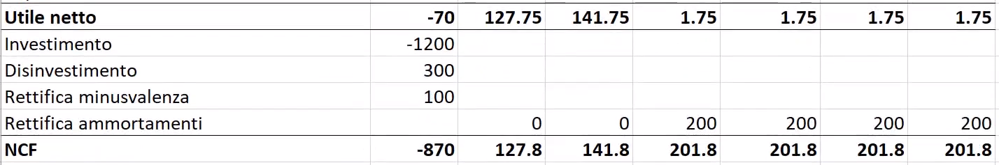

Si passa da logica economica a logica finanziaria. 
Come anticipato nel paragrafo del CashFlow operativo, calcolamo il NCF usando una rettificazione: sommiamo all'utile netto i costi non monetari (esempio minus/plusvalenza , ammortamenti, accantonamenti di credito/debito). 

Da $Utile \space Netto = (Ricavi - costi)*tassazione$ a $NCF$: 

- $+$ Costi non monetari: ammortamenti, accantonamenti, minusvalenze, svalutazioni 
- $-$ Ricavi non monetari: plusvalenza, rivalutazioni
- $-$ Investimenti
- $+$  disinvestimenti
- $\pm$  **Variazione** del Capitale Circolante Netto:

$\Delta CCN = \Delta  Crediti \space commerciali \space + \Delta  \space rimanenze \space - \space \Delta \space debiti \space commerciali$

Negli esercizi, spesso quando ci sono in ballo crediti/debiti e stiamo valutando l'investimento su un periodo di $x$ anni, quasi sicuramente ci toccherà riportare anche una colonna $(x+1)$esima proprio per il fatto che dobbiamo tener conto della variazione del CCN. 

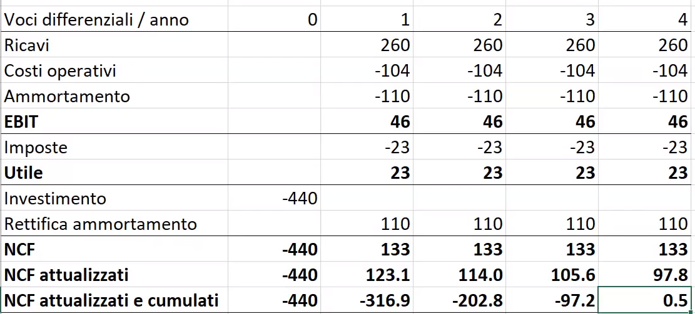

*Nota che la somma degli $NCF$ attualizzati e cumulati è proprio $NPV$ .

Si tratta quindi di valutare un investimento in base al corrente e ai futuri stati finanziari utilizzando tutte le variabili note per predirne il risultato futuro.

- **PI**: sostanzialmente il rapporto tra $NPV$ e l'investimento iniziale. Mentre NPV è un criterio assoluto, il PI é un criterio relativo. PI è da preferirsi rispetto a NPV in presenza di vincoli di budget. 
- **Payback**: in quanti anni ricopro completamente il mio investimento 
- **IRR**: L'IRR corrisponde esattamente per il tasso $k$ per cui il $NPV$  eguaglia l'investimento effettuato. Concettualmente può essere visto come il tasso di rendimento che permette di raggiungere il break-even finanziario. L'IRR è poi utilizzato come 'parametro' per indicare le performance di un investimento o confrontare le performances di più investimenti in termini relativi e non assoluti. 

# Controllo di gestione 

Si fa budgeting per capire se rispettiamo gli obiettivi aziendali. 

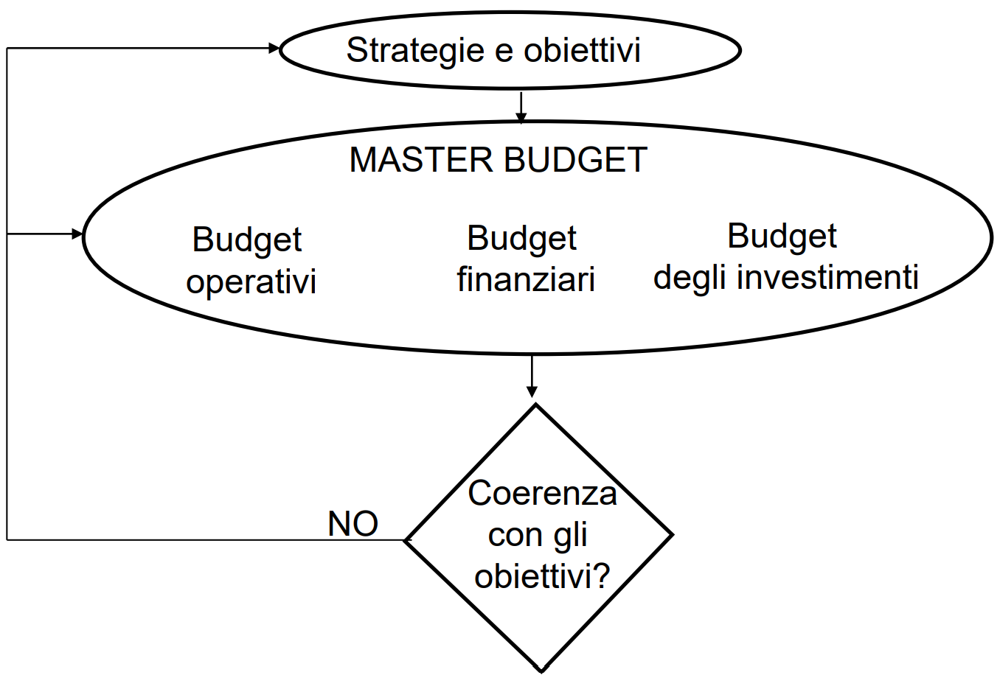

## Master Budget

Il confronto tra tali valori previsionali e gli obiettivi determina l’approvazione del master budget, la sua revisione o addirittura una ridefinizione degli obiettivi quando non venga individuato alcun piano in grado di assicurarne il conseguimento

Il master budget é composto dai tre tipi di budget: 

- **budget operativi**:
	- **budget delle vendite**
	- **budget della produzione e delle scorte finali**
	- **budget del costo del venduto** 
	- **budget costi di periodo**:
- **budget degli investimenti** 
- **budget finanziari** 

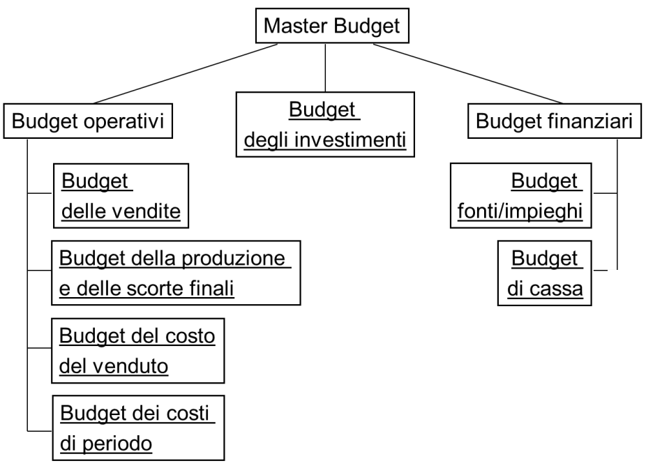

In pratica nei nostri esercizi valuteremo soltanto i budget operativi e non considereremo budget degli investimenti e finanziari. 

## Budget operativo

Non è possibile calcolare il budget della produzione senza prima aver calcolato il budget del venduto, quindi bisogna andare in ordine. 

### Budget del venduto

Calcoli quante **unitá si vogliono vendere e di conseguenza il prezzo di vendita.
	
### Budget della produzione 

In base a quello che voglio vendere che quantitá devo produrre? 
	 $$Q_{p}= Q_{v} + SP_{f} - SP_{i}$$
con $SP_{f}$ e $SP_{i}$ rispettivamente le scorte di prodotto finali/iniziali. 
Ovviamente in questa fase si puó valutare se la quantitá di produzione richiesta puó essere coperta.. in caso contrario si cambierá politica di vendite, di scorte o si effettuerá un cambiamento alla capacitá produttiva o ancora si puó esternalizzare parte della produzione.
	 
Valutazione fattibilitá : 
$$\sum\limits _x Q_{x} t_{j,x} \le T_j$$
Cioé per ogni prodotto $x$ bisogna controllare che la disponibilitá totale della risorsa $j$ sia sufficiente a coprire la richiesta della risorsa totale. 
	 
### Budget del costo del venduto

Che si divide a sua volta in:

- budget degli acquisti: quantità complessiva di materie prime e semilavorati di cui approvvigionarsi. 
- budget del conto lavorazioni: entità delle lavorazioni esterne.
- budget dei costi di conversione: costi di conversione relativi alla trasformazione di input in prodotti finiti destinati alla vendita.
	
Sostanzialmente calcoli quante MP ti servono da comprare in base a quanto ti serve produrre (calcolato nel punto precedente) e a quante scorte di MP hai: 
		$$Q_{MP}=Q_{p}\times C_{MP} + SP_{f} - SP_{i} $$

Ma anche quanto ti costa la conversione (tipo il lavoro diretto, costo energia etc.)

### Budget dei costi di periodo

- *Approccio incrementale*: per prevedere i costi di periodo si moltiplicano i valori passati per un coefficiente che tiene conto di inflazione ed eventuali altri fenomeni.
- *Zero Based Budget (ZBB)* i responsabili delle varie unità organizzative identificano le risorse minime per il funzionamento della propria unità (molto oneroso).  
- *Overhead Value Analysis (OVA)*: per ogni attività si definiscono soluzioni alternative in termini di costi e benefici, costruendo quindi una possibile previsione. 

## Dopo il budgeting che minchia faccio? Analisi scostamenti 

L’analisi degli scostamenti di basa sul confronto tra i dati consuntivi e i dati preventivi. 
L’analisi degli scostamenti ci permette quindi di verificare se i risultati raggiunti sono allineati con quanto previsto ed eventualmente identificare le cause degli scostamenti (cioé della differenza tra il consuntivo e il previsto). 

i distinguono quattro tipologie di centri di responsabilità: 

- Centri di ricavo 
- Centri di costo 
- Centri di spesa
- Centri di profitto

### Budget flessibili 
Per analizzare gli scostamenti utilizziamo dei 'budget'intermedi' chiamati Budget Flessibili. Questi budget sono dei budget virtuali che mi permettono di 'scomporre' la causa dello discostamento in più determinanti. Tale disaggragazione ci permette di meglio identificare e analizzare meglio le cause di discostamenti. Ad esempio un discostamento dei ricavi può essere causato da diversi fattori tra cui ad esempio una variazione di volume di vendita o di prezzo. 
Questi budget flessibili si ottengono combinando parametri di budget preventivi con valori a consuntivo (consutivo *aka* effettivi/reali/rilevati).

### Analisi per ricavi 

Analisi scostamento ricavi: 

|        | Budget     | BF1 | Consuntivo| 
|:------:|:-------:|:------------------:|:--------:|
| Quantitá       | Standard |  Effettivo  |   Effettivo |
| Prezzo       | Standard |  Standard  |   Effettivo |
| Ricavi       |Standard |  Calcolato  | Effettivo |

E si valuta lo scostamento di volume tra il Budget e il BF, mentre si valuta lo scostamento di efficienza tra il BF e il Consuntivo.

$$Varianza_{volume}=\hat p (Q-\hat Q)$$
$$Varianza_{prezzo}= Q (p-\hat p)$$
$$Varianza_{totale}= Varianza_{volume}+Varianza_{prezzo}$$

dove i termini con il cappello sono quelli 'standard/previsti'.

In caso di piú prodotti analizzati contemporaneamente: 

|        | Budget     | BF1 | BF2 | Consuntivo| 
|:------:|:-------:|:---------:|:---------:|---------:|:--------:|
| Quantitá | Standard |  Effettivo  | Effettivo  |  Effettivo |
| Mixaggio  A | Standard |  Standard  |   Effettivo  |  Effettivo |
| Mixaggio  B | Standard |  Standard  | Effettivo  |   Effettivo |
| Prezzo  A| Standard |  Standard  | Standard  |  Effettivo |
| Prezzo  B | Standard |  Standard  |Standard  |   Effettivo |
| Ricavi  |Standard |  Calcolato  |Calcolato  | Effettivo |

### Analisi per costi

Analisi scostamenti in caso di costi MP: 

|        | Budget     | BF1 | BF2 | Consuntivo| 
|:------:|:-------:|:------------------:|:--------:|:--------:|
| Quantitá       | Standard |  Effettivo  |   Effettivo | Effettivo |
| a       | Standard |  Standard  |   Effettivo |Effettivo |
| c       | Standard |  Standard  |   Standard |Effettivo |
| Costi MP       |Standard |  Calcolato  | Calcolato |Effettivo |

Perchè un secondo livello? Per disaggregare ulteriormente le cause delle discostamenti rilevati, nella realtà questi processi sono fondamentali ad esempio per capire con chi prendersela in azienda: di chi è colpa se abbiamo fatto meno cash? 
Ma non solo per prendersela con le persone giuste, ma anche per isolare fattori esogeni (come può essere ad esempio il costo delle MP) con fattori interni all'impresa (come ad esempio l'efficienza di produzione). 
Secondo livello perché ci sono 2 variabili : 

- a: coefficiente di assorbimento di MP per unitá di PF
- c: costo unitario della MP

$$Varianza_{efficienza}=Q(CPI-\hat {CPI})$$
$$Varianza_{costo \space risorsa}=\hat {Q \hat a} (c-\hat c)$$
$$Varianza_{impiego}=\hat {Q \hat c} (a-\hat a)$$
Sussiste la relazione:

$$Varianza_{efficienza} = Varianza_{costo \space risorsa}+Varianza_{impiego}$$
E infine la varianza di volume in termini di costi, indicatore del 'ho piú/meno costi perché ho venduto di piú/di meno'. 

$$Varianza_{volume}=\hat {CPI} (Q-\hat Q)$$

Attenzione,nell'analisi costi si effettua un budget per ciascuna materia prima!  
I costi di assorbimento e costi della risorsa sono ovviamente per ciascuna risorsa. 

# Organizzazione 

## Microstruttura

### Specializzazione orizzontale e verticale 

Con specializzazione orizzontale si intende la varietà di mansioni svolte dal lavoratorie. Se il lavoratore è molto specializzato orizzontalmente significa che fa una sola/poche mansione/i.
Con specializzazione verticale si intende la distanza o profondità logica che c'è tra il lavoratore e lo svolgimento delle proprie decisioni. Ad esempio un manager ha basso livello di specializzazione poichè prende decisioni per altri e non svolge alcuno dei compiti/mansioni derivate dalle sue decisioni. In genere chi è poco specializzato verticalmente ha anche un'elevata autonomia decisionale. 

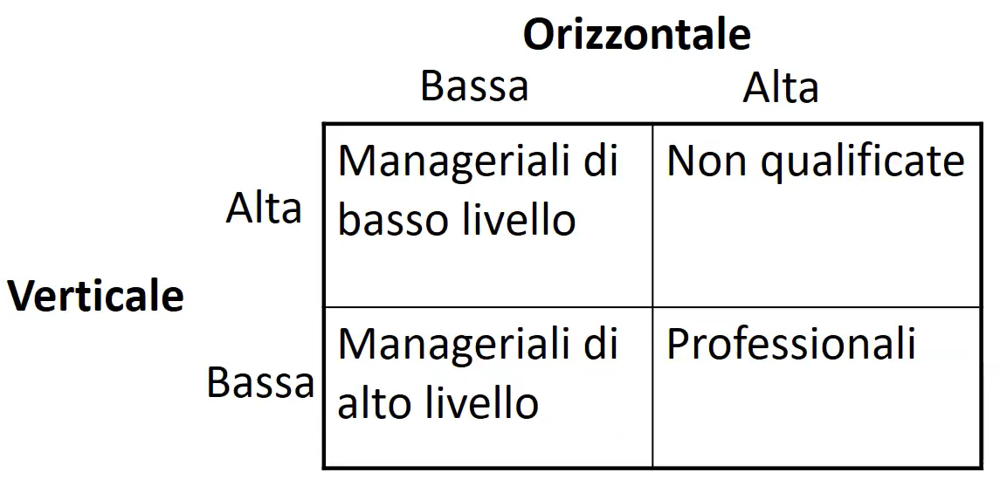

La specializzazione può però inevitabilmente portare alla ripetizione dei compiti e in generale alla alienazione. 
Possibili tecniche per evitare alineazione e perdita di competenze:

- job enlargement
- job enrichment 
- job rotation 

### Meccanismi di coordinamento 

Servono meccanismi di coordinamento per microstruttura:

- adattamento reciproco 
- supervisione diretta 
- standardizzazione progetti
- standardizzazione risultati
- standardizzazione competenze 

Ulteriore modi: 

- formalizzazione 
- autonomia decisionale
- gestione motivazione: l'importanza di seguire un sistema di incentivi che motivi un individuo ad agire perseguendo gli obiettivi dell'impresa. Due tipi di motivazione:
	- motivazione intrinseca : puro piacere nel fare il compito
	- motivazione estrinseca : che dipende dalla propria remunerazione e/o per trovare un lavoro migliore

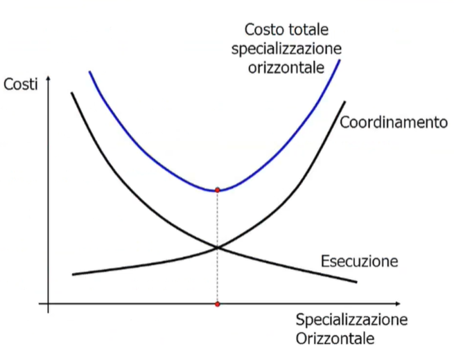

## Macrostruttura 

### Gerarchia
Macrostruttura a gerarchia funzionale spesso utilizzata con sistemi di coordinamento a supervisione e in imprese monoprodotto con standardizzazione degli input nonchè in un contesto stabile. 
Efficiente si , ma lento a prendere decisioni, mi costa coordinarmi e scarsa attenzione per il cliente.

### Divisionale
Macrostruttura divisionale invece standardizza gli output a discapito di una maggiore complessità. 

### Meccanismi di coordinamento per macrostruttura
Servono meccanismi di coordinamento tra le varie unità organizzative: 

- manager integratori
- team inter-funzionali 
- sistemi di pianificazione e controllo 
- sistemi informativi aziendali