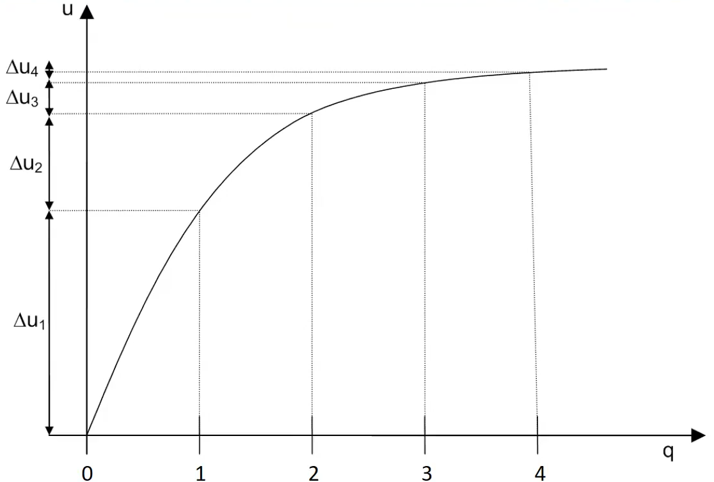
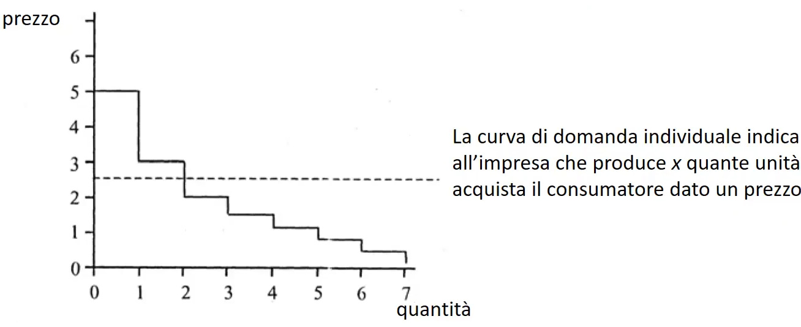
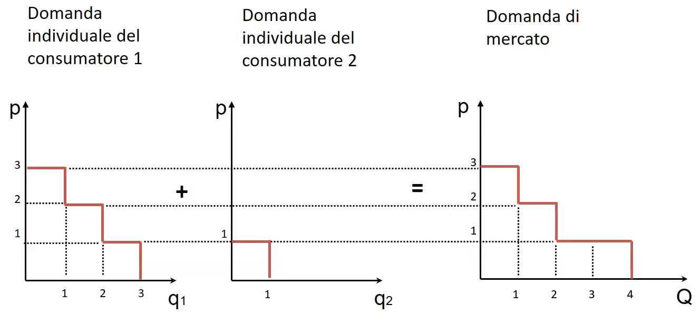
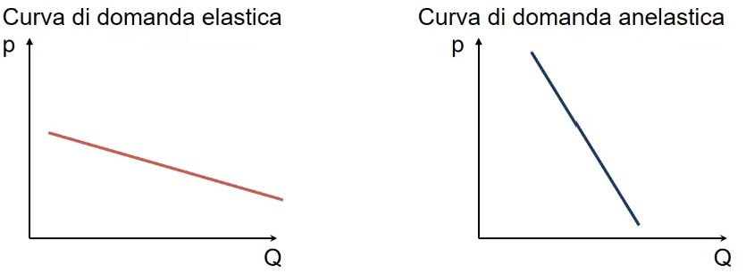

# Il mercato

## La domanda

Mercato: luogo fisico o virtuale in cui avviene la vendita e l'acquisto dei beni e dei servizi. 

Dal punto di vista dell'impresa è quindi fondamentale comprendere la domanda (scelta di acquisto dei consumatori in relazione al bene o servizio offerto) e l'offerta (soprattutto in relazione alle altre imprese). 
Mentre le aziende hanno come unico obiettivo la massimizzazione del profitto, i consumatori (quindi la domanda) mirano a massimizzare il proprio benessere. 

### Funzione di utilità

Descrive come varia il livello di soddisfazione del consumatore al variare della qualità dei beni/servizi . I consumatori massimizzano la funzione di utilitá tenendo conto del loro reddito. 
Assunzioni banali ma fondamentali per caratterizzare la funzione di utilità: 

- Utilità monotona e crescente: aumenta la qualità e aumenta l' utilità del consumatore. 
- Utilità marginale decrescente: l'utilità addizionale (marginale) di ogni successiva consumazione a via via decresce. Cioè la derivata prima della funzione di utilità (crescente) è decrescente. 

### Prezzo di riserva
Il PR é l'upper bound del prezzo che il consumatore è disposto a pagare per l'acquisto del bene. 
Conoscere il prezzo di riserva dei consumatori permette di definire la curva di domanda individuale di un bene.

Il surplus è un benessere aggiuntivo del consumatore, cioè differenza tra il PR e il prezzo di mercato del bene. 
Il surplus è un parametro utilizzato per valutare 'il profitto dei consumatori' o meglio, la soddisfazione dei clienti. 

Da cosa dipendono le curve appena definite? 
Principalemennte da caratteristiche del consumatore quali reddito, gusti e **necessità**, ma anche da caratteristiche del bene. 

### Classificazione bene 

- Bene normale: quantità domandata aumenta all'aumentare del reddito.
- Bene inferiore: più aumenta il reddito e non necessariamente ne aumenta la domanda (esempio il cibo).

In caso dei beni inferiori sostanzialmente si effettua una sostituzione dei prodotti, cioè uno spostamento tra beni di bassa qualità a beni di alta qualità. 

- Bene sostituto: beni che espletano stesse funzioni di x . Se aumenta il prezzo di un bene sostituto a $x$ , la quantità domandata di $x$ aumenta, e viceversa. 
- Bene complementare: Beni che tendono a essere consumati insieme a x . Se aumenta il prezzo di un bene complementare a $x$ , la quantità domandata di $x$ diminuisce, e viceversa.

### Domanda di mercato
Somma, per tutti gli N consumatori, delle quantità domandate individuali. 
$$Q(p)=\sum^n_{i=1}q_i(p)$$
*Sostanzialmente non ci importa del singolo consumatore ma della domanda totale, costruita dalla sommatoria delle domande individuali.*

Aggregazione della domanda. 
Una considerazione: può avere forme diverse ma la logica di fondo è che la curva sarà quasi sempre decrescente. 

### Elasticità della domanda 
L'elasticitá della domanda é la variazione della quantitá domandata in relazione al variare di una delle componenti che la caratterizzano: 

- prezzo del bene 
- prezzo degli altri beni (cambia nel caso in cui sono beni sostituti o complementari)
- reddito del consumatore 

Conoscendo l'elasticità della domanda possiamo 'prevedere' o 'stimare' l'impatto che potrebbero avere le scelte dell'impresa riguardo le vendite. 

#### Elasticità della domanda al prezzo
$$\epsilon = \frac{\frac{\Delta q}{q_x}}{\frac{\Delta p}{p_x}} = \frac{\delta q_x}{d p_x}\frac{p_x}{q_x}$$
L'elasticità sarebbe il rapporto percentuale tra la variazione della quantità rispetto la variazione di prezzo. Di fatto calcoli l'elasticità puntuale con l'uso della derivata: cioè fai la derivata prima della domanda rispetto al prezzo, per poi moltiplicarla per $\frac{p}{q}$ . 
Quindi in caso di beni fondamentali/essenziali l'elasticità tende a zero e si rigida. La domanda è completamente anelastica nei beni di prima necessità ad esempio il cibo, la benzina, il metano o l'elettricità.
L'elasticità é in genere negativa e la si considera in valore assoluto.
Quando bisogna calcolare l'elasticità della **domanda** al prezzo, ovviamente devi fare il conticino sulla funzione della curva di domanda.
Nel caso di domanda elastica rispetto al prezzo, il risultato è superiore a 1, mentre è inferiore a 1 nel caso di domanda anelastica; se il valore coincide con 1, invece, la domanda e il prezzo sono direttamente proporzionali. Questo di fatto è estremamente improbabile potendo essere al limite il risultato di un’osservazione dell’elasticità della domanda per un breve periodo. Anche il risultato 0 si verifica solo in pochi casi eccezionali in cui le variazioni dei prezzi non hanno alcun impatto sulla domanda. Un esempio tipico di questa **domanda completamente anelastica** rispetto al prezzo è l’aumento dei prezzi di farmaci salvavita come l’insulina per i diabetici.

> Un'azienda che opera in un mercato con un prodotto caratterizzato da una curva di domanda elastica dovrà quindi stare attenta a modificare il prezzo del prodotto.

> Sostanzialmente in mercati caratterizzati da domanda elastica la competizione è maggiore.

#### Elasticitá incrociata
$$\epsilon = \frac{\frac{\Delta q_x}{q_x}}{\frac{\Delta p_y}{p_y}}= \frac{\delta q_x}{d p_y}\frac{p_y}{q_x}$$
Beni complementari: elasticità incrociata negativa. Cioè se due beni in genere vengono consumati insieme, se il prezzo di $y$  aumenta allora la quantità di $x$ diminuirà.
Beni sostituti: elasticità incrociata positiva. Se due beni sono uno il sostituto dell'altro, se il prezzo di $y$  aumenta allora la quantità di $x$ aumenterà (poichè più conveniente rispetto ad $y$).
Beni non correlati in alcun modo: elasticità incrociata nulla

#### Elasticità al reddito 
$$\epsilon = \frac{\frac{\Delta q}{q_x}}{\frac{\Delta M}{M}}=\frac{\delta q_x}{d M}\frac{M}{q_x}$$

- Beni inferiori: elasticità della domanda al reddito negativa. Se il reddito aumenta i beni di prima necessità vengono consumati uguali o al massimo di meno. 
- Beni normali: elasticità della domanda al reddito positiva. Se il reddito aumenta la quantità domandata sarà maggiore. 

## Offerta e forme di mercato 

Con $RT$ i ricavi totali e $CT$ i costi totali possiamo scrivere la condizione di massimizzazione del profitto: 

$$max_q \pi = RT(q) - CT(q)$$

Facendo uso di avanzate tecniche di analisi matematica (derivando) $RM(q)-CM(q)=0$ quindi la massimizzazione del profitto la si ha per $RM(q)=CM(q)$.

Con $RM$ e $CM$: 

- $RT$, ricavo marginale: derivata prima del ricavo, rappresenta "il ricavo ottenuto servendo un cliente aggiuntivo". Derivata dei $RT$ rispetto a $q$ . 
- $CM$, costo marginale: derivata prima del costo, rappresenta "il costo per produrre un bene aggiuntivo". Derivata dei $CT$ rispetto a $q$ . 

*Tutto dipende da $q$ perchè ci aspettiamo che i ricavi totali ($RT$) e i costi totali ($CT$) sono funzioni della quantità prodotta.*

Concetto generale:

> Quando l'impresa per aggiungere un cliente aggiuntivo mi devo rivolgere a mercati con PR più bassi l'impresa si ferma

La capacità delle imprese di massimizzare il profitto dipende da: 

- concorrenza 
- natura del prodotto (omogeneo o differenziato)
- grado di libertà di entrata e uscita delle imprese 
- quantità dell'informazioni detenuta da imprese e consumatori 

## Concorrenza perfetta
La concorrenza perfetta è un modello teorico che però può simulare perfettamente diversi mercati. 

Si basa su 4 ipotesi:

- numero elevato d'imprese, la singola impresa non potrà mai coprire l'intera offerta
- prodotto omogeneo 
- acquirenti e venditori hanno conoscenza perfetta dei prezzi 
- esiste completa libertà di entrata e uscita di nuove imprese

Quindi il mercato in caso di concorrenza perfetta è una forma estrema, in cui c'è pochissima elasticità della domanda.
La condizione di massimizzazione del profitto in caso di concorrenza perfetta è: 
$$CM(q)=p$$

### Effetti di lungo periodo concorrenza perfetta
In generale nel caso di concorrenza perfetta e in caso di imprese operanti con profitti positivi, nel lungo periodo ci si 
potrebbe aspettare un ingresso di altre imprese, con una conseguente riduzione del prezzo di mercato e dei profitti. Ciò va a favore del singolo consumatore che avrà prezzi dei prodotti sempre più bassi, ma va 'a danno' delle imprese. 

Se $p> \space prezzo \space di \space equilibrio \space di \space mercato \space$ si  avrà un **eccesso di offerta** e sicuramente alcuni produttori non riusciranno a vendere.  
Viceversa se $p < \space prezzo \space di \space equilibrio \space di \space mercato \space$ si avrà un **eccesso di domanda** e sicuramente alcuni consumatori saranno disposti a comprare il bene ma non potranno. 

## Monopolio

Perché esiste il monopolio? Esistono barriere insormontabili per entrare nel mercato da parte di altre aziende. 
Monopolio significa 'Price Maker' . Price Maker significa che il prezzo non sarà 'fisso' rispetto la quantità, come nel caso del price taker. Dunque quando si fa la derivata bisognerà tenere conto di questo fatto. I ricavi totali sono infatti:
$$RT(q)=p(q)*q$$
$$RM(q)= p(q)*(1-\frac{1}{\epsilon})$$

La condizione di massimizzazione del profitto é $RM(q)=CM(q)$ dunque si ottiene: 
$$p(q)=\frac{CM(q)}{1-\frac{1}{\epsilon}}$$

$$\frac{p(q) - CM(q)}{p(q)}  =\frac{1}{\epsilon}$$

Il monopolista fissa un prezzo al di sopra dei costi marginali! Ha potere di mercato. Il potere di mercato sará tanto maggiore quanto meno la domanda risponde alla variazione di prezzo (cioé é rigida). Quindi piú la domanda é rigida e piú il monopolista sará 'forte'.

> Una azienda non guarda il costo di produzione del prodotto, guarda sempre il mercato.

Al policy maker, un monopolio é peggio di una concorrenza perfetta poiché é dimostrato che globalmente, valutando il surplus dei consumatori e il surplus dei produttori , la concorrenza perfetta massimizza il surplus globale mentre il monopolio no. 
In genere il monopolista massimizzando i suoi guadagni provoca una diminuizione del 'benessere complessivo', danneggiando l'economia totale. 

Il concetto di 'il monopolio é il male' é sbagliato in quanto dipende molto dal settore. In particolare quei settori nel quale un'impresa per operare in maniera efficiente deve avere grosse dimensioni, l'economia ha benessere complessivo con poche imprese. Ad esempio nel settore di telecomunicazioni non sará efficiente avere tante imprese che operano in maniera inefficiente rispetto a 3/4 che operano in maniera efficiente. 

### Interventi dello stato: leggi antitrust

1) impedire/approvare fusioni 
2) frazionare imprese divenute troppo grandi 
3) impedire comportamenti volti a ridurre la concorrenza 

Se in un mercato aziende grosse si fondono, il mercato si avvicina troppo a un monopolio e potrebbe ridurre il beneficio complessivo per la societá. 
L'unico motivo per cui l'antitrust permetterebbe un avvicinamento del mercato verso un monopolio sarebbe nella sola situazione in cui l'avvicinamento porterebbe anche a un grosso miglioramento produttivo. 

Per lo stato é piú importante il miglioramento produttivo rispetto al allontamento del mercato dal monopolio. I brevetti servono proprio a questo, 'dai un po' di monopolio all'impresa' per incentivarla a investire in ricerca e sviluppo e migliorare produttivamente. 

Nei nostri esercizi, quando si parla di regolamentazione al monopolista significa quasi sempre di imporre al monopolista di offrire il bene a $p = CM$ . 

### Possibili barriere all'entrata che portano al Monopolio

- **Istituzionali** (licenze e brevetti):Chiaramente in alcuni settori, tipo il settore farmaceutico i brevetti funzionano molto bene poiché una molecola brevettata é inimitabile. Il settore informatico é diverso, un codice brevettato se diffuso puó essere facilmente copiato raggirando il brevetto. 
- **Barriere strutturali**: Nel mercato di messaggistica puó anche uscira un'app nuova piena di funzionalitá, peró non riesci a sradicare whatsapp perché lo 'usano tutti'. 
- **Barriere strategiche**: barriere messe in atto dalle imprese giá presenti sul mercato per inibire l'entrata di altre aziende e indurre l'uscita di altre imprese. Si puó parlare anche di **collusione** tra piú aziende. 

L'antitrust potrebbe anche permettere fusioni ecc. ma introducendo una regolamentazione sul prezzo. Il problema in questi casi é che non é semplice capire il 'prezzo corretto'.

Ricavi marginali e costi marginali fondamentali come concetti da comprendere appieno.  

[Contabilitá esterna bilancio](projects/polimi-notes/BSc(ITA)/Economia%20e%20Organizzazione%20Aziendale/src/Contabilitá%20esterna%20bilancio.md) 
 $$365* \frac{Crediti \space commerciali}{Fatture\space di \space vendita \space emesse}$$
- Durata media dei debiti commerciali 
 $$365* \frac{Debiti \space commerciali}{Fatture\space di \space acquisto}$$
- Giacenza media in magazzino 
 $$365* \frac{Valore \space magazzino}{Costo\space del \space venduto }$$
- Indice di Rotazione Attivo (RA)
	$$\frac{Ricavi}{Capitale \space Investito}$$

*Dove il capitale investito é il totale delle attivitá che per l'identità é uguale a Totale Passivitá + Patrimonio Netto*

### Indici di redditivitá 

- ROI (Return on Investment)
$$\frac{EBIT}{Capitale \space investito}$$
Il ROI rappresenta la capacità dell’impresa di generare reddito operativo per ogni euro investito. 

scomposizione roi:

$$ROI = ROS * RA$$

- ROS (Return on Sales)
	$$\frac{EBIT}{Ricavi}$$
- ROE (Return on Equity)
$$\frac{Utile \space netto \space dell'esercizio}{Patrimonio \space netto}$$

*ROE è la redditività del capitale proprio per agli azionisti.* 

- ROD (Return on Dept)
	$$\frac{Oneri \space finanziari}{Debiti \space finanziari}$$
Il ROD rappresenta il costo del debito. 
Quando calcoli il ROD devi usare **tutto** il debito **bancario**, sia delle passività non correnti che correnti.

- Leva finanziaria 

$$D/E=\frac{Passivitá}{Patrimonio \space netto}$$

La leva finanziaria $D/E$ è un indicatore di quanto l'impresa viene finanziata dai creditori piuttosto che dalle proprie fonti finanziarie (molto simile al indice di indipendenza finanziaria). Ovviamente gli investitori di solito preferiscono bassi rapporti DE quindi imprese con un elevato rapporto non sono in grado di attrarre ulteriori capitali di prestito.
Mentre in $ROD$ si considera solo il debito verso le banche. Nel $D/E$ si considerano **tutte** le passività diviso il patrimonio netto.
- se la leva finanziaria è minore o uguale a $1$ significa che il capitale proprio è maggiore del capitale di terzi;
-   se la leva finanziaria assume valori superiori a $2$ significa che il capitale di terzi è maggiore del capitale proprio, e dunque che l'azienda è fortemente indebitata.

Non conviene aumentare oltre una certa soglia il livello di indebitamento perché all’aumentare del livello di indebitamento è probabile che $ROD$ aumenti, poiché aumenta il rischio percepito dai finanziatori e questo porta problemi di liquidità, nonchè tutto il fenomeno descritto precedentemente riguardo la *sottocapitalizzazione*. 
Si può genericamente affermare che, in media, se il rapporto assume valori compresi fra $1$ e $2$ l'impresa è in uno stato di corretto equilibrio nell'ambito delle fonti di finanziamento, mentre se il rapporto assume valori superiori a $2$ l'impresa è da considerarsi sottocapitalizzata. 
*(PS: per chi studia sti indici a memoria, è facile ricordarsi tale soglia perchè è la stessa di pericolo del $CR$ o $RC$)*.

### Semplice analisi reddituale

La situazione dell'impresa è positiva in generale se $ROI > ROD$ , cioè $1$ euro di debito rende $ROI$ euro che è maggiore di quanto richiesto dagli investitori ($ROD$ euro) . Quindi conviene indebitarsi. In caso contrario, il debito sta distruggendo valore e i finanziatori esterni vedono l'impresa come rischiosa o l'impresa non sa negoziare tassi di interesse convenienti. 

#### Formula di Modigliani-Miller
$$ROE = (1-t) * [ROI + D/E * (ROI –ROD)]$$
Non ho ben capito perchè ci hanno spiegato sta formula in 2 minuti di lezione ma salta fuori che: con le ipotesi di assenza di imposizione fiscale, costi di fallimento e asimmetrie informative (praticamente teorema non applicabile a qualsiasi mercato reale), da tale formula si può affermare che se la redditività complessiva ($ROI > ROD$) è superiore al costo del debito, l’indebitamento aumenta la remunerazione degli azionisti all’aumentare del debito. Cioè che la remunerazione per gli azionisti è tanto più elevata quanto più: $ROI > ROD$ e $D/E$ è grande.

Quindi in generale si dice che quando:

- $ROI>ROD$  l’impresa può sfruttare la leva finanziaria per accedere a capitale di debito in modo conveniente (rispetto alla redditività del capitale investito, $ROI$) e quindi aumentare la redditività per gli azionisti ($ROE$). 
- $ROI < ROD$ significa che la gestione delle risorse operative è inefficace o inefficiente e i finanziatori esterni vedono l’impresa come rischiosa o l’impresa non sa negoziare tassi di interesse convenienti.

i tratta certamente di un’impresa in salute, con buoni livelli di redditività. Si noti tuttavia che l’impresa non sfrutta per niente l’effetto leva, cosa che consentirebbe un ulteriore aumento di redditività del punto di vista degli azionisti. Dal punto di vista della liquidità e della solidità patrimoniale, l’impresa non dovrebbe avere problemi a far fronte alle obbligazioni con i debitori (essenzialmente debiti commerciali). Parte della liquidità potrebbe però essere utilizzata per investimenti che possano garantire un rendimento, oppure restituita agli azionisti sotto forma di dividendi qualora non ci siano opportunità di investimento interessanti.

[Contabilitá interna](projects/polimi-notes/BSc(ITA)/Economia%20e%20Organizzazione%20Aziendale/src/Contabilitá%20interna.md) 

[Decisioni di breve termine](projects/polimi-notes/BSc(ITA)/Economia%20e%20Organizzazione%20Aziendale/src/Decisioni%20di%20breve%20termine.md) 
 $$mQ_{be}-CF=0$$ 
oppure
$$mQ_{be}-CF=Profitto \space target$$

dove $m$ é il margine di contribuizione unitario.

Vorrei massimizzare il margine di sicurezza  $$=\frac{Q_{max}-Q_{be}}{Q_{max}}$$
Nota: in caso di multiprodotto il margine di costo unitario dovrá essere calcolato in termini di media, presupponendo che le percentuali del mix produttivo sia ben definito e dato da percentuali prefissate. 

$$m_{medio} = \sum\limits _{x} m_{x}p_x$$ dove $p_x$ sará una percentuale prefissata a seconda di quando prodotto $x$ si produce. 

## Scelta del mix produttivo 
Quali prodotti sono da realizzare e in che percentuali/quantitá tali prodotti sono da produrre. Tutto ruota sulla identificazione della risorsa scarsa ($\leftarrow$ tipicamente ore macchina/ore di manodopera) e si massimizza il guadagno: si produce il prodotto con margine di contribuizione maggiore tenendo conto di eventuali vincoli di: 

1) consumo risorse
2) contrattuali 
3) di mercato