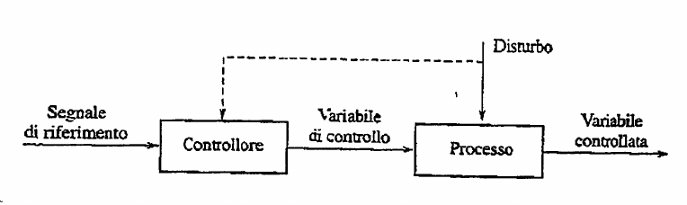
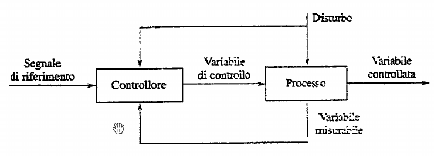
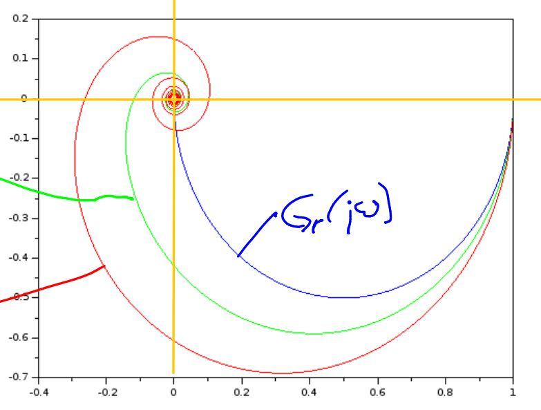
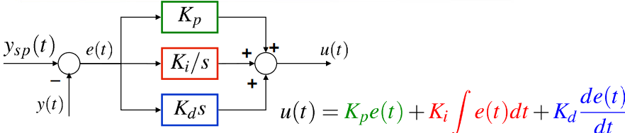

\maketitle
\newpage
\tableofcontents
\newpage

# Fondamenti di Automatica

Gestione e studio dei problemi di controllo. 

Un problema di controllo lo si ha tutte le volte che voglio imporre un comportamento desiderato a un sistema. 

Caratteristiche di un problema di controllo:

- sistema fisico
- variabili di controllare
- variabili su cui agire per controllare
- l'andamento desiderato delle variabili che vogliamo controllare

Problemi di automazione: diversi campi, tutti affrontati con la stessa metodologia.

Diversi approcci per controllare: 

- Anello aperto ad azione diretta (feed forward)

- Anello aperto ad azione diretta con controllo del disturbo, *stessa figura ma con controllo disturbo*
- Anello chiuso Feedback/Retroazione (senza controllo disturbo)

- Anello chiuso Feedback (con controllo disturbo)

Come si può notare la differenza tra anello chiuso/aperto è la presenza o meno della possibilità di 'misurare' la variabile controllata, in modo da avere un feedback costante della variabile che stiamo cercando di controllare. 

Sistemi dinamici e non dinamici: 

- DINAMICI: anche conoscendo l'ingresso puntualmente (istante per istante) u(t) non riusciamo a ricavere y(t)
- NON DINAMICI: ci basta sapere u(t) per ricavare la nostra uscita y(t)

In generale dinamici sono tutti quei sistemi in cui oltre a sapere l'andamento degli ingressi ci serve sapere anche gli stati iniziali delle cosidette variabili di stato.

SISTEMI DINAMICI a Tc (tempo continuo) e SISO (Single Input Single Output) sono i sistemi che più spesso affronteremo e incontreremo. 

$$x_1(t) = \phi(x_1(t_0) , x_2(t_0) ... x_n(t_0),u[t_0,t],t)$$

$$y(t) = \gamma(x_1(t),...,x_n(t),u(t),t)$$

Come si può osservare dalle equazioni qua  sopra un sistema dinamico può essere scritto ad esempio in questo modo, cioè definendo prima tutte le equazioni che governano le variabili di stato e dopo esplicitare l'uscita (che ci interessa) come una funzione delle funzioni di stato, degli ingressi e del tempo. 

DEFINIZIONI (*SD = Sistema DInamico*)

- **SD LINEARE**: le funzioni phi e gamma sono lineari.
- **SD STAZIONARIO o TEMPO-INVARIANTE**: le funzioni phi  e gamma (entrambe!) non dipendono **direttamente** dal tempo, ma solo indirettamente attraverso u(t)
- **SD STRETTAMENTE PROPRIO**: la funzione y(t) dipende solo da variabili di stato e non dagli ingressi (d=0). Ovviamente indirettamente anche dagli ingressi, in quanto le variabili di stato dipenderanno sicuramente dagli ingressi.

Noi useremo sd LTI (Lineari in x e u , e tempo-invarianti) e posso sempre scrivere un mio sd in rappresentazione matriciale. 

$$\begin{cases} x'(t) = Ax(t) + bu(t)  \\ y(t) = c(x(t)) + du(t) \end{cases}$$

Dove A può essere una matrice (nel caso id più variabili di stato) , b un vettore e c  un vettore. 

# Equilibrio

L'equilibrio di un SD si definisce tale quando, il sistema sottoposto a un u(t) costante e partendo da un preciso stato $t_0$ o $k_0$ (a seconda del caso Tempo Discreto o Tempo Continuo) si avrà una funzione di stato costante. 

Nel caso TC (tempo continuo): 

significa che $x'(t) = Ax(t) + bu(t) = 0$ 

Nel caso a TD:

significa che $x(t) = Ax(t) + bu(t)$ cioè 'quello di adesso è uguale a quello di prima' 

### Lagrange x Movimento SD

Il movimento di un SD in TD: 

$$x(t) = A^k x(k_0) + \int _{t_0} ^t A^kbu(\tau)d\tau$$

Dove $A^kx(k_0)$  si dice movimento libero, cioè che non dipende dagli ingressi ma soltanto dallo stato iniziale. 

Il movimento di un SD a TC:

$$x(t) = e^{At}x(t_0) + \int_{t_0}^t e^{A(t - \tau)}bu(\tau) d\tau$$

*NB: **A** è una matrice e in modo analogo al caso a TD $e^{At}x(t_0)$ è il **movimento libero**.

Cos'é il movimento libero? Intuitivamente é l'evoluzione del sistema che non dipende dall'ingresso, ma é intrinseco nel sistema. 
Nei sistemi dinamici **lineari** il  movimento è dato dalla somma algebrica del _movimento libero_ e del _movimento forzato_. 

Come calcolare $e^{A(x)}$ ? 
Se $A$ é diagonalizzabile, calcoliamo la matrice diagonale e la matrice degli autovalori $T$. Dopo di che vale la relazione : $e^{A(x)} = Tdiag \{e^{ \lambda (t) } \}T^{-1}$ ricordando che l'inversa di una matrice 2x2 é lo scambio degli elementi sulla diagonale e il cambio di segno degli elementi sulla antidiagonale, il tutto diviso per il determinante della matrice. 

*integrale di matrice → integrale elemento per elemento*

### Stabilità degli equilibri:

- equilibrio stabile: equilibrio ''classico'' .. ingressi costanti → uscite costanti
- equilibrio asintoticamente stabile: equilibrio ''più forte'' , per $t \rightarrow \infty$ , esempio semplice ma efficace è la pallina in fondo alla coppa con attrito, appena provi a spostarla tornerà al punto di equilibrio.

La stabilità è una proprietà del sistema e dipende da $e^{At}$  cioè dalla matrice A. 

Se $e^{At} \space \space \space t \rightarrow \infty$ :  

- converge a 0: AS
- converge a un numero: S
- diverge: I

In pratica:

Gli autovalori della matrice A: 

- $Re \{\lambda _i \} < 0$    AS
- $Re \{\lambda _i \} \le 0$    S o I
- $Re \{\lambda _i \} > 0$   I

Ancora più in pratica: 

- Det(A) = 0 I
- Tr(A) > 0   I
- Coefficienti del polinomio caratteristico (secondo grado) concordi ma non nulli, condizione necessaria e sufficiente per AS
- Coefficineti del p. c. (terzo grado o di più) concordi ma non nulli, condizione necessaria per AS

Ancora ancora più in pratica: 

### Tabella di Routh:

Ad ogni cambio di segno degli elementi della prima colonna corrisponde un autovalore positivo di A → quindi instabile. 

In pratica riassunto: *usa la tabella di Routh per evitare la diagonalizzazione, guarda sempre la prima colonna, appena trovi un elemento con segno discorde dagli altri di fermi e dici che il SD in quel punto d'equilibrio è instabile*

## Linearizzazione 
Intuitivamente in prossimitá di un equilibrio in un sistema dinamico (non lineare) la tangente é una valida approssimazione dell'intero sistema. 

### Segnali e Trasformate (Laplace e Fourier)

Sistemi dinamici nel dominio del tempo quando hanno equazioni differenziali sono sbatti da gestire. 

Utilizziamo le trasformate per passare al dominio delle frequenze, nel quale i legami differenziali possono essere espressi come semplici legami algebrici.. semplificandoci quindi la vita. 

trasformata di Fourier:

$$V(t) = \int _{-\infty}^{+\infty} v(t)e^{- j \omega t} d t$$

antitrasformata di Fourier: 

$$v(t) = \frac{1}{2 \pi j}\int _{-\infty}^{+\infty} V(t)e^{j \omega t} d t$$

trasformata di Laplace:

$$V(t) = \int _{-\infty}^{+\infty} v(t)e^{-st}
 ds$$

antitrasformata di Laplace:

$$v(t) = \frac{1}{2 \pi j} \int _\gamma V(t)*e^{st}ds$$

dove s = k + jw ed è un numero complesso.

NB: *nell'antitrasformata l'integrale è di linea! La trasformata di Fourier è un caso particolare di quella di Laplace. La TDF è quindi contenuta nella TDL, e se una funzione ammette TDF ammetterà sicuramente la TDL ma non viceversa!*

Noi useremo principalmente quella di Laplace. 

La quale gode di un paio di proprietà comode: 

- **operatore lineare**
- $L[\frac{dv(t)}{d(t)}] = sL[v(t)] - v(t_0)$ **proprietà della derivata**
- $L[\int _{t_0} ^t v(t)] = \frac{1}{s}L[v(t)]$ **proprietà integrale**
- $L[v(t-k)] = e^{-jk}L[v(t)]$ **proprietà ritardo**

Trasformate di Laplace usate spesso: 

- $sca(t) = \frac{1}{s}$
- $ram(t) = \frac{1}{s^2}$
- $dirac(t) = s$
- $sca(t+\alpha) = \frac{1}{s}e^{\alpha}$
- $ram(t+\alpha) = \frac{1}{s^2}e^{\alpha}$
- $e^{\alpha t}=\frac{1}{s-\alpha}$

## Ritardi da applicare alle antitrasformate
Capita negli esercizi vari che vengano applicati dei ritardi ai nostri segnali prima di antitrasformare. 
$$V(s)e^{s \tau }=v(t+\tau)$$
Ad esempio: 
$$\frac{1}{s}e^{-4s}=sca(t-4)$$

### Teorema Valore Iniziale

$$v(0) = \lim _{s \rightarrow \infty} sV(s)$$

### Teorema Valore Finale

$$\lim _{t \rightarrow \infty} v(t) = \lim _{s \rightarrow 0} sV(s)$$

### Funzione di trasferimento 

La FDT di un SD è una funzione analitica nella variabile complessa $s=j \omega$.

Pigliamo un attimo il nostro SD e famo la trasformata di Laplace:
$$\begin{cases} sX(s)=AX(s) + bU(s) \\ Y(s)=cX(s)+dU(s) \end{cases}$$
Se 'risolvi' il sistema ottieni:
$$Y(s)=(c((Is -A)^{-1})b+d)U(s)$$
Dunque, la FDT (funzione di trasferimento) del SD sarà:
$$G(s)=c(sI-A)^{-1}b+d$$ la quale caratterizza il comportamento di un sistema, e descrive la relazione tra ingresso ed uscita.
Quindi $x_{ML} = (sI-A)^{-1}x(0)$ e $x_{MF} = (sI-A)^{-1}bU(s)$  
Nel caso di un SD SISO la G(s) è sempre fratta con $Grado \space numerasctore \le Grado \space Denominatore$.
Possiamo utilzzare la trasformata di Heaviside,  una particolare trasformata applicabile alla TDL razionali fratte, per tornare indietro nel regime temporale. 
Ripasso di nomenclatura per chi non è del mestiere: 

- radici di N(s) li chiameremo **zeri**
- radici di D(s) li chiameremo **poli**

Idea della trasformata di Heaviside è di riscrivere la G(s) come somma di addendi facili da trasformare con la $TDL^{-1}$.
L'instabilità è una proprietà del sistema, certe volte un sistema diverge per qualsiasi ingresso, altre volte solo per determinati ingressi. 

trovare stabilità = controlla gli autovalori di A, puoi anche non calcolarli e guardare i magheggi che abbiamo visto nei precedenti capitoli. In linea generale: autovalore con parte reale positiva implica instabilità nel caso di SD a tempo continuo. Nel caso di SD a tempo discreto autovalore con modulo $\ge 1$ implica instabilità.  

#### Matrice di Jordan. 
Sapevamo che con un autovalore con parte reale positiva si aveva l'instabilità. Ma con parte reale  nulla?? 
Per uscirne da questo ultimo caso ci serve la Matrice di Jordan. 
**Criterio basato sulla matrice di Jordan spiegato a mo' di spaghettata:** 
Nella matrice A possiamo localizzare dei 'miniblocchi' ovvero mini-matrici dentro le matrice. Queste minimatrici quadrate, individuate dal autovalori che hanno sulle diagonali devono essere limitate da 0. Se, con la regola appena descritta, le mini-matrici, cioè i miniblocchi di Jordan, hanno ordine 1 allora la matrice still rimane stabile. Altrimenti se anche un solo miniblocco ha ordine > 1, allora il sistema diverge a causa di termine che divergono polinomialmente. 
NB: per avere il sistema stabile serve che il più grande miniblocco del autovalore con $Re\{\lambda_i\}=0$ abbia dimensione 1.
 

### Raggiungibilità e Osservabili del sistema. 
Teo. di Cayley-Hamilton = un discreto macello di dimostrazione che ci permette di ottenere un risultato importante.
Come determino se un sistema è completamente raggiungibile?
Il rango di questa matrice (quadrata nel caso SISO) deve essere il massimo, cioè non deve essere singolare, cioè non deve avere determinante nullo per essere completamente raggiungibile.
$$M_r=\begin{pmatrix} b & Ab\end{pmatrix}$$
Come determino se un sistema è completamente osservabile?
Il rango di questa matrice deve essere massimo, il determinante non deve essere nullo, non deve essere singolare per essere completamente osservabile:
$$M_o=\begin{pmatrix} c' & A'c'\end{pmatrix}$$

- se non vi sono cancellazioni mentre calcoli $G(s)$ allora è R&O. 

Si dice **a fase minima** un SD  la cui fdt è quella che fra tutte le possibili funzioni di trasferimento con identica risposta in modulo introduce il minimo sfasamento possibile per ogni frequenza a cui essa è valutata. Da un punto di vista matematico ciò è dovuto al fatto che la funzione di trasferimento del sistema non abbia zeri oppure che abbia tutti i suoi zeri stabili, ossia di modulo strettamente minore di uno (nel caso di sistemi a tempo discreto) o con parte reale minore di zero (nel caso di sistemi a tempo continuo). 
$G(s)$ minima $\rightarrow$ Raggiungibile e osservabile. 
NOTA: Posso sempre passare da un SD a uno a fase minima cambiando il segno degli zeri e 'ritardandolo'. Ogni sistema non fase minima infatti lo si può esprimere come uno a fase minima 'ritardato'. Cioè un sistema a fase minima equivalente, in serie a uno sfasatore (che introduce il ritardo).

Nota che $G(s)$ e la quaterna (A,b,c,d) sono rappresentazioni equivalenti di un $SD$ (a meno di una trasformazione di similarità) sse nel calcolo di $G(s)$ non vi sono cancellazioni, ovvero se il $SD$ è R&O.
Ricorda che la funzione di trasferimento però rappresenta solo il movimento forzato. 

## Schemi a blocchi. 
Possiamo esprimere i SD come schemi a blocchi, nei quali ogni blocco rappresenta una $G(s)$ e quindi un "sotto sistema dinamico". Ogni blocco può essere poi suddiviso in ulteriori blocchi, i quali sono gli addendi che compongono la $G(s)$ . 
NB: non c'è un prima o un dopo negli schemi a blocchi. Bisogna vedere il tutto come un'unica equazione e non pensare più in ottica temporale, ma in ottica di 'segnali'.

### Sistemi interconnessi
Uniremo solo blocchi R&O. Cioè uniremo solo SD con $G(s)$  coprime tra loro (che non hanno fattori comuni tra numeratori e denominatori) e che sono minime e senza cancellazioni.
Ci potremmo chiedere, e soprattutto ce lo potrebbe chiedere il prof, se data una rete di sistemi interconnessi, l'AS di singoli blocchi è sufficiente/necessaria per l'AS di tutta la rete. In generale, nel caso in cui volessimo assicurarci l'AS dell'**intera rete** è importante seguire queste regole:

- tutti i blocchi che NON sono in un anello devono necessariamente essere AS 
- tutti i blocchi, il cui denominatore (della rispettiva $G(s)$ ) appare come **fattore** nella $G(s)$  complessiva, devono essere necessariamente AS

Infatti, per quanto riguarda gli anelli, le $G(s)$  inizialmente coprime, potrebbero moltiplicandosi/addizionandosi tra loro avere dei fattori comuni e quindi portare a un sistema interconnesso non AS. DI conseguenza tutto ciò che è in un anello che sia AS o non AS non ci può dire nulla riguardo all'AS della rete complessiva.  Al contrario, tutto ciò che è fuori da un anello condiziona l'AS complessiva.

## Risposta esponenziale
$$ y(t)=Ye^{\lambda t}$$
con $$x(0)=(\lambda I-A)^{-1}bU$$ $$u(t)=Ue^{\lambda t} \space$$

ma $\lambda$ non deve essere autovalore di A.

- Se $\lambda$ è zero di $G(s)$  allora ottengo y(t)=0 ( proprietà **bloccante degli zeri**)
- Se SD AS, allora $y(t)\rightarrow \infty =G(\lambda)u(t)e^{\lambda t}$

## Risposta sinusoidale
$$y(t)=|G(jw)|Usin(wt + faseG(jw))$$
con $$u(t)=Usin(wt)$$
ma $\pm j\omega$ non devono essere autovalori di A.
- se AS, allora $\lim_{t \rightarrow \infty} y(t) = |G(j\omega)|Usin(wt + faseG(jw))$

### Diagrammi di Bode
Studiare la risposta in frequenza significa studiare il comportamento del sistema al variare della  pulsazione o della frequenza del segnale sinusoidale applicato in ingresso.  
Lo studio della risposta in frequenza si riconduce all’analisi della variazione del modulo e della fase della al variare della pulsazione
Rappresentiamo la risposta in frequenza con due grafici, i quali rappresentano rispettivamente il modulo (o ampiezza) e la fase della funzione complessa di risposta in frequenza. 
Contrariamente alla rappresentazione polare, la rappresentazione di modulo e fase della funzione di trasferimento avviene su due piani cartesiani diversi.
*Basta applicare le regoline.*

Regoline rilevanti:

-  se g=0 parte da $20log|\mu|$ (guadagno(non nelle ipotesi di Bode)
- inclinazione iniziale data da $-|g|$ 
- poli buttano giú, zeri buttano su (tutto a botte di 20db/decade)
- diagramma della fase, parto da: $-90g$ e aggiungo $-180$ se $\mu$ (guadagno) negativo.
- diagramma della fase, poli buttano su/giú in base al loro segno, cioé con botte di  $(segno \space polo)*90g$ , mentre gli zeri buttano su/giú in base al inverso del loro segno, cioé con botte di  $(segno\space zero)*(-90g)$

## Margine di fase, di guadagno e di modulo

- effetto del ritardo sul progetto: nel margine di fase sarà $w_c * ritardo*(\frac{180}{\pi})$ (i ritardi/sfasatori influenzano solo la fase e non il modulo, il $\frac{180}{\pi}$ serve per convertire i radianti della pulsazione ($\frac{radianti}{secondo}secondo$) ).
- quando fai il conto del margine di fase non ci devi mettere il polo vero e proprio .. ma il suo inverso .. cioè 'quello che vedi nell'equazione'

## Diagramma Polare 
La funzione di trasferimento di un sistema è una funzione analitica nella variabile complessa  
$s=\sigma+j \omega$ che in regime sinusoidale diventa $s=\sigma+j \omega$.  
Per un generico valore di $\omega$ la funzione diventa, a sua volta, un numero complesso: Al variare di $\omega 2 \pi f$ da zero a infinito, il vettore $G(j \omega)$ varia in modulo e direzione.  
In questo modo può essere definito un luogo geometrico ( curva ) rappresentativo della posizione del vettore $G(j \omega)$ : questa curva è il diagramma di Nyquist della funzione di trasferimento.  
I diagrammi di Nyquist sono dunque, rappresentati su un piano complesso ( piano di Gauss ) dove l'asse delle ascisse rappresenta l'insieme dei numeri reali, mentre quello delle ordinate rappresenta i numeri immaginari.In molte applicazioni, soprattutto in quelle per lo studio della stabilità di un sistema, non interessa la precisione con la quale viene tracciato il diagramma, ma la sua forma qualitativa in particolar modo l'andamento del diagramma per $\omega$ tendente a zero e a infinito.

 

## Criterio di Nyquist e di Bode
Il diagramma di Nyquist è il diagramma polare 'specchiato verticalmente ed eventualmente con 'l'infinito' che si chiude a semicerchio. 

### Criterio di Nyquist per SD Anello Chiuso
Definiti $p_d$ come il numero di poli con $Re>0$ di L(S) e $N$ il numero di giri del diagramma di Nyquist attorno al punto $-1 + 0j$ contati $+$ se in senso orario e $-$ se in senso antiorario. 
Il SD ad anello chiuso sarà: 

- AS sse $p_d = N$ (condizione necessaria e sufficiente)
- non AS se il diagramma passa per -1 

### Criterio di Bode
SE: 

1) $p_d=0=$ il numero di poli con $Re>0$ di $L(S)$ 
2) Il diagramma di Bode taglia l'asse 0 dB una e una sola volta, dall'alto verso il basso
3) Il margine di guadagno $\phi _m$ di L(s) è positivo 
allora il sistema è AS. 
Fondamentale per il progetto.

# Progetto del regolatore e funzione di sensività, uso nella sintesi 
## Progetto statico 
La specifica statica viene formulata mediante valori desiderati per l’errore
a transitorio esaurito $e_\infty$ .
Bisogna garantire la specifica statica a fronte di andamenti assegnati per
gli ingressi $w_t$ ed il disturbo sulla linea di
andata $d_a$). L’obiettivo è scegliere il tipo del controllore $R(s)$ ed eventualmente, se
necessario, calcolare il valore di minimo per il rispetto delle specifiche
(applicando il teorema del valore finale). 
L’errore a transitorio esaurito, per il principio di sovrapposizione degli effetti, è
dato dalla somma dei contributi dovuti agli ingressi (riferimento e disturbo sulla
linea di andata)
$e_\infty = e_{\infty w} + e_{\infty d_a}$
Ai fini del progetto statico è utile solo la parte statica della funzione d’anello,
(la parte dinamica non conta, siamo nel limite per $s \rightarrow 0$) e quindi, sulla base
delle caratteristiche degli ingressi (riferimento e disturbo sulla linea di
andata), si sceglieranno i valori più opportuni per il $g$ del polo nello zero e per il guadagno d’anello $\mu$.

## Progetto dinamico 
Gli zeri per forza gli introduci a sx  (così da buttare su la fase nel caso ), non ha senso introdurli a dx. Mentre i poli OVVIAMENTE devono essere del semipiano sx.

### Cancellazione critica
Una cancellazione si dice critica se avviene al di fuori della asintotica stabilità. 
Ne consegue che (nel caso a TC) non possiamo cancellare zeri nel semipiano destro. Significherebbe infatti che lo stiamo 'semplificando' con una parte instabile del sistema nascosta! (Se lo fai all'esame nell'esercizio di controllo verrai bandito). 

### Margine di fase $\phi _ m$
$\phi _ m$ = $180^o - \phi _{critica}$
In poche parole sottraggo da 180 gradi l'$arcotan(\frac{\omega _ c}{ \omega _x})$ con segno $\pm$ a seconda che $\omega x$ sia: 

- (segno -) un polo negativo o zero positivo 
- (segno +) uno zero negativo o polo positivo (che non possono esserci eh) 

Nella pratica non stiamo a calcolare l'arcotangente manualmente (a meno che in casi specifici in cui vogliamo dei vincoli ben precisi sul margine di fase) ma usiamo il regolo delle fasi in scala logaritmica (posizionando il $45^o$ sulla pulsazione critica)

## Compensazione in anello aperto di disturbi misurabili
Progettazione di un regolatore (chiamato compensatore) per regolare il disturbo in andata. In pratica vuoi il disturbo compensato ad un valore prossimo allo 0 (di modulo) quindi poni delle restrizioni sulla funzione di Trasferimento Y/D . Questa ti darà condizioni su come fare il Compensatore Ideale. Se è realizzabile (\#poli $\ge$ \#zeri) allora $C_{id}$ coinciderà con $C_{reale}$ altrimenti devi introdurre poli per renderla realizzabile a piacimento o seguendo la consegna del prof (in esame). 
> La difficoltà sta tutto nel calcolare correttamente la FDT 

# Regolatori industriali PID 
Regolatori Proporzionali Integrali e Derivativi. Utilizzati largamente nell'industria. 

Visione alternativa:
$$U(s)=K_pE(s)+\frac{K_iE(s)}{s}+K_dsE(s)$$
$$U(s)=k(1+\frac{1}{T_is}+T_ds)E(s)$$

## PID a controllo a 2 gradi di libertà 
Legge PID in Forma Standard ISA reale a 2 gdl. 
$$U(s)=k((bW(s)-Y(s))+\frac{(W(s)-Y(s))}{sT_i}+\frac{sT_d}{1+s\frac{T_d}{N}}(cW(s)-Y(s)))$$
L’acronimo ISA sta per **International Society of Automation** .
Generalizzazione della legge di controllo del PID, frequentemente utilizzata nei regolatori commerciali, è detta **forma pesata**, con peso su set-point e  
misura (rispettivamente $b$ e $c$).
Per b=1, c=1 si ottiene la forma standard del PID, da notare di come questi parametri moltiplichino soltanto $W(s)$ e non $Y(s)$.
Permette di ottenere funzioni di trasferimento diverse (e quindi  
risposte diverse) tra ingresso di set-point e disturbo sull’uscita e  
l’uscita stessa  

## Accenno taratura PI e PID
Si tratta sostanzialmente di progettare un controllore con dei vincoli sullo zero e guadagno (nel caso di PI) o sugli zeri e sul polo (nel caso PID). 

- PI: un polo nell'origine e uno zero.  
$$R(s)=k\frac{(1+\tau _zs)}s$$ 
Quando progetti un PI per cancellazione, $\tau _2$ è appunto scelto per cancellare il polo del processo da tarare. 

- PID: due poli (di cui uno nell'origine) e uno zero.
$$R(s)=k\frac{(1+\tau _{z_1} s)(1+\tau _{z_2} s)}{s(1+\tau _{p_2} s)}$$ 

## Taratura peso 
- Regole di Ziegler-Nichols
- IMC-PID

## IMC - Internal Model Control
Si tratta sempre di tarare un regolatore ma ci basiamo sul modello interno del controllo. 

M è il modello del nostro processo. 

In pratica cerca di 'predire' il processo.  
Sappiamo che $\frac Y W = FQM$ poichè $M=P$ e non c'è quindi feedback. A questo punto cerco di porre $Q=\frac1M$. Se $Q$ risulta realizzabile allora prendo come $F$ la dinamica $\frac Y W$ voluta. (in genere data dal testo del esercizio), basta che $FQ$ sia realizzabile e che durante i calcoli non ci siano cancellazioni critiche (cioè vuol dire che eventuali zeri destri di $P$ rimangono). 
Infine mi ricordo che $$R(s)= \frac{FQ(s)}{(1-FQM(s))}$$
e sostituisco facendo il conto. 

### ADDENDUM: 

Se c'è un ritardo $e^{-tau s}$ dobbiamo cercare di approssimarlo:

- **Approssimazione di Padè** 
	- Padè (1,0) = $1 - s\tau$
	- Padè (1,1) = $\frac{1 - s\tau/2 }{ 1 + s\tau/2}$

# Sistemi Discreti 
## Trasformata Zeta
Nel contesto della trasformata Zeta, la variabile complessa $z$ ha il significato operatoriale di **anticipo di un passo**. 
$$V(z)=Z[v(k)] := \sum ^ \infty _{k=0} v(k) z^{-k}$$
La trasformata Z è un operatore lineare. La proprietà più importante è quella del 'ritardo unitario':
$$Z[v(k+1)]=z*Z[v(k)]-zv(0)$$
_Può capitare negli esercizi in cui si fanno antitrasformate di Z ci sono ritardi anche di -2 -3 ecc. ecc. e per evitare di rendere i calcoli lunghi la consegna esplicita 'condizioni iniziali nulle' per eliminare il termine z*v(0)_ 

Lista Trasformate di Zeta note: 

- $Z[imp(k)]=1$ 
- $Z[sca(k)]=\frac{z}{z-1}$

## Schema di Controllo

$$R^*(z)=\frac{U(z)}{E(z)}$$

## Discretizzazione per realizzazione digitale di SD a TC

Si tratta di sostituire una formuletta già fatta con il $T_s$ ricavato dalle formule di campionamento. 

### Discretizzazione esatta
Idea: far evolvere il sistema a TC per un tempo pari a $T_s$. Cioè implica che se R(s) è AS lo è anche R(z). 

### Discretizzazione approssimata
é pesante da calcolare la discretizzazione esatta. Idea: approssimare la derivata temporale con il rapporto incrementale lungo un passo di campionamento $T_s$

### Metodo di Eulero Esplicito (differenze in avanti)
é un metodo di discretizzazione approssimata che può generare un SD a TD  **instabile** partendo da un SD a TC che è AS.
$$s=\frac{z-1}{T_s}$$

### Metodo di Eulero Implicito (differenze all'indietro)
$$s=\frac{z-1}{T_sz}$$

### Metodo di Tustin 
$$s=\frac{2(z-1)}{T_s(z+1)}$$

windup = anomala sovraelongazione di un regolatore dinamico, non necessariamente integrale. Vincoli lo stato del regolatore quando si raggiunge la saturazione.
Nota: con qualsiasi tipo di discretizzazione posso verificare la correttezza dei miei calcoli osservando che se R(s) ha un polo in 0 allora R(z) avrà un polo in 1. 
e il campionamento $T_s$ ? come lo si decide? 

## Campionamento $T_s$

Il campionamento $T_s$ deve rispettare alcuni vincoli. $w_s = \frac{2 \pi}{T_s}$

- **vincolo proporzionale alla $\omega _c$**, es: 'la ws deve essere almeno 20 volte la wc' 
- **vincolo sul modulo** ,dal teorema del campionamento di Nyquist. $2 \omega _n$** = $\omega _s$** è la massima pulsazione rappresentabile senza aliasing con un campionamento a frequenza $\omega _s$ . Più $|L(j\omega _n|$ è piccolo, meno aliasing. In pratica avrò una condizione sul modulo. Se ad esempio è -20dB cerco dove $|L|$ a tale modulo e trovo la $\omega _n$ . Il doppio sarà la minima  $\omega _s$ .  
- **vincolo Sample and Holding**:
	$\frac{3}{2}w_cT_s$ $\leftarrow$ ($ gradi detti dal testo $(\frac{\pi}{180})$ considerando il _ritardo dovuto al calcolo_. 
	$\frac{1}{2}w_cT_s$  $\leftarrow$ ($ gradi detti dal testo $(\frac{\pi}{180})$ _non considerando il ritardo_.
	
Tutti i vincoli sono dal basso di $\omega _s$ . Quindi tecnicamente potrei prendere una $\omega _s$ altissima o equivalentemente una $T_s$ bassissima.. ma nella realtà non è ottimo abbassare il tempo di campionamento $\rightarrow$ maggiore calcolo computazionale $\rightarrow$ mi serve una macchina più precisa. 

### Legge di controllo LTI a TD

_Possono capitare esercizi di questo genere... sono molto semplici. 
$G(z)=\frac{Y(z)}{U(z)}$ , risolvi l'equazione e antitrasformi, scali Y(z+1) a Y(z) e così via, in modo da esplicitare tutto a Y(z) e valori 'passati', non futuri.  Eventualmente se consegna lo chiede, sostituisci $u(k)$._