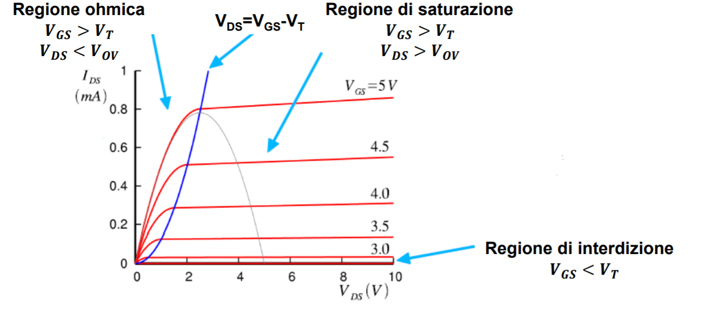
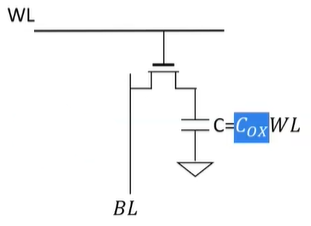
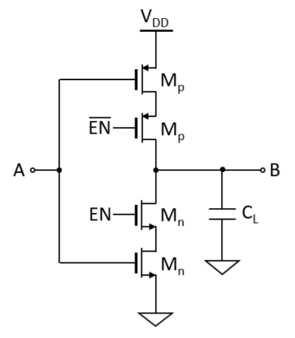
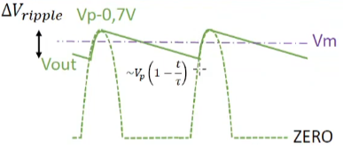
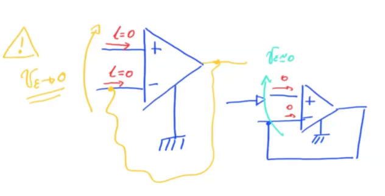
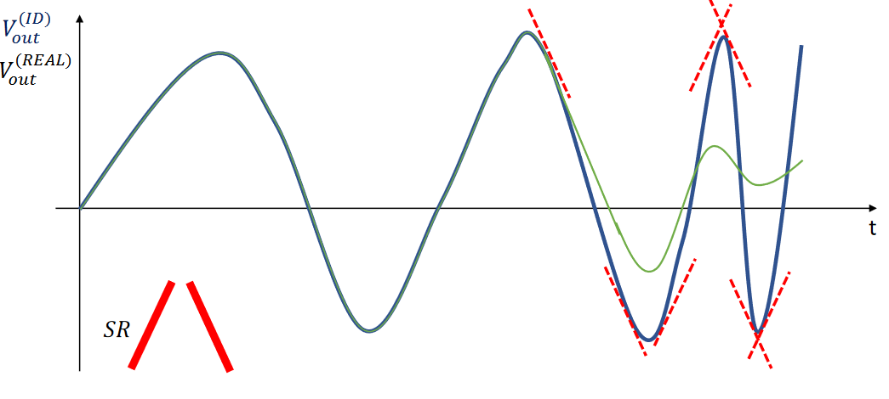

# Ripasso di Elettrotecnica

Introduzione risoluzione di circuiti con condensatori e generatori di corrente/tensione con segnali a gradino. 
Osservazione e studio della fase di regime ed iniziale, con conseguente transizione in cui si manifestano i fenomeni transitori. 

Tutti i circuiti si risolvono sostanzialmente calcolandosi i valori di regime  quando il condensatore (completamente carico) diventa un circuito aperto. 
NB: 'l'inizio, quando cioè il condensatore si deve ancora caricare lo consideriamo come la fine di un transitorio precedente, cioè quello da $-\infty$ a $t_0$.
Ricordiamoci poi della regolina d'oro:
$$v_c(t) = V_c^0 + (V_c^{\infty}-V_c^0)(1-e^{\frac{-(t-t_0)}{\tau}})$$
dove $$\tau = R_{equivalente}C$$
Con queste vai tranqui.

# Diodo
Introduzione del diodo. Definizione delle fasi di breakdown, inversa e diretta. A mo' di spaghettata, dimenticandoci di tutti i fenomeni/osservazioni fisiche matematiche, si può dire che il diodo in inversa (cioè quando la tensione è negativa) non lascia passare corrente, mentre quando la tensione vale 0.7V lascia passare un valore specifico di corrente. Ha poi una zona di breakdown, cioè quando la tensione negativa è eccessivamente bassa il diodo 'esplode'. 
Questa è una estrema semplificazione, in realtà in diretta il diodo lascia passare corrente, ma la relazione tra I e V è esponenziale.. piccole variazioni di corrente provocano una variazione elevatissima di corrente. 
Il diodo quindi lo vediamo come una specie di 'interruttore' comandabile a tensione. Con la tensione giusta opera in diretta, altrimenti è un circuito aperto. 
Abbiamo quindi analizzato circuiti 'raddrizzatori'. Abbiamo infatti visto come un diodo riesce ad 'eliminare' la parte negativa di una tensione sinusoidale. 
Ci sono numerosi tipi di diodi. Noi abbiamo fatto una carrellata ma ci baseremo principalmente su quello classico.
*memo per i non studiosi di elettronica:* anodo positivo, catodo negativo (cioè dove la freccia del diodo punta).
**NB: il diodo non si accende solo quando ha la corrente del segno giusto, ma fino a quando su di esso non cadono 0.7 V non si accende.**

## Potenza media del diodo
P media = $$\frac{P_{on}*T_{on} + P_{off}*T_{off}}T $$

## Diodo Zener
Diodo che opera anche in inversa, nella zona di breakdown. Il diodo Zener potrà essere sia ON con corrente e tensione positiva, che ON con corrente e tensione negativa. 

## Ponte a diodi
Un circuito con una serie di diodi che si occupano di eliminare rispettivamente a 2 a 2 la parte positiva e negativa della sinusoide della tensione. In questo modo si riesce a rettificare una sinusoide. Attravero la combinazione di questi diodi la corrente scorre sempre nello stesso verso .

Abbiamo affrontato circuiti con diversi diodi. L'approccio migliore è quello di ragionare le possibile casistiche senza andare di bruteforce eccessiva (essa infatti ad esempio con 4 diodi porterebbe al calcolo di 2^4 possibili combinazioni on/off). Ragionando sul circuito e 'avendo occhio' si può trovare la giusta ipotesi su come i diodi potrebbero lavorare insieme. Una volta trovata l'ipotesi la bisogna verificare.. verificando che su un diodo acceso la corrente sia positiva e la tensione 0.7 V, mentre su un diodo spento la tensione sia negativa e la corrente nulla. Nei circuiti in genere non vengono presi in considerazione le zone di breakdown, esse non vengono nemmeno specificate nei testi.

# Transistors 

## Nmos 
Metal Oxyde Semiconductor. Componente da tre terminali, dei quali individuiamo 3 terminali: il gate, il drain e il source.
Morale della favola: attraverso una tensione $V_{gs}$ possiamo comandare il transistor, portandolo a 3 possibili diversi stati, uno stato off, uno stato ohminico e uno stato di saturazione. Quando il transistor non è off, viene generata una corrente *i_ds*, che appunto parte dal terminale di *drain* e continua fino al *source* (non lasciarti ingannare dai nomi che invece si adattano bene in termini di 'da dove e dove vanno gli elettroni' e per il Pmos). 
Realtà: il transistor è un componente mega complesso, noi lo affrontiamo a mo' di quinta elementare, idealizzandolo e semplificandolo il più possibile. 

- Corrente che scorre tra d e s nel caso del transistor in fase ohmnico:
$$i_{}^{ohm}=2K_p(V_{gs}-V_{t}-\frac{V_{ds}}{2})V_{ds}$$
- Corrente che scorre tra d e s nel caso del transistor in fase di saturazione:
$$i_{}^{sat}=|K_p|(V_{gs}-V_{t})^2$$

dove $$K_p = \frac{1}{2} \mu _oC'_{ox}\frac{W}{L}$$

Per essere acceso il transistor dovrà avere una $V_{gs}>V_t$ e per essere in zona satura $V_{ds}>V_{gs}-V_t$ . 

## Pmos 
Duale con l'Nmos. Ma con alcune differenze. 
La tensione di gate sarà $V_{sg}$ e piloterà la corrente che a sto giro andrà da source a drain. Cambiano anche le condizioni di accensione e passaggio in zona di saturazione. Il Pmos si accenderà infatti per $V_{sg}>V_{t(p)}$ e passerà in zona omnica per $V_{sd}>V_{sg}-V_{t(p)}$ . 
*Il pmos per erogare la stessa corrente di un nmos equivalente dovrà essere dimensionato circa 3 volte più grande. Questo poichè la corrente 'sfrutta' le lacune le quali 'scorrono circa 3 volte più lenti degli elettroni'.*

Nota: viene sempre indicata con la freccina di corrente il terminale di source. 

## Riepilogo N/P mos 

- NMOS si accende se ga $V_{gs} > V_{t} > 0$, quindi in elettronica digitale se il GATE è a 1 è potenzialmente ON se invece è a 0 sarà **sicuramentente** OFF.
- PMOS si accende se ga $V_{sg} > |Vt| > 0$, quindi in elettronica digitale se il GATE è a 0 è potenzialmente ON se invece è a 1 sarà **sicuramentente** OFF.

Per potenzialmente ON si intende che il MOS può essere considerato acceso, con il dubbio se in zona ohmica, satura e con quale corrente.
Per sicuramente off si intende che non è proprio possibile accenderlo. Se in un NMOS mettiamo un gate a 0V dovremmo avere il source ad una tensione negativa per averlo acceso ed in digitale non si utilizzano tensioni negative.

# Cmos
Complementary Mos . Due mos, uno n e p in serie che 'cooperano' tra loro. Il risultato è un inverter estremamente utile, utilizzato ancora oggi in praticamente ogni circuito integrato.

## Inverter Cmos, meglio dell'inverter mos/resistenza

## $K_{eq}$
Calcolare la $K_{eq}$ cioè il coefficiente utilizzato nel calcolo delle correnti passanti per 'transistors equivalenti' è molto semplice. Dato infatti   $K = \frac{1}{2} \mu _oC'_{ox}\frac{W}{L}$ sappiano che la serie di due transistor ha $K_{eq}^{-1}=\frac{1}{K_a}+\frac{1}{K_b}$, mentre il parallelo è dato da $K_{eq}=K_a+K_b$. Come puoi vedere è molto semplice da ricordare essendo l'inverso delle resistenze. Inoltre questa relazione, se osservata all'interno della formula del calcolo dei tempi di propagazione ci permette di capire in modo molto chiaro di come il parallelo/serie di transistor influenzano il tempo di propagazione del segnale. Ad esempio transistors in parallelo, avranno una $K_{eq}
$ maggiore, poichè data da una somma. La $K_{eq}$ presente nel calcolo della corrente, la quale si trova nel denominatore della nostra formulina decrementerà il tempo di propagazione (viceversa la serie).

## Potenza statica e dinamica
Gli inverter CMOS dissipano potenza solo in transitorio, dunque la potenza statica è nulla. Ma ci sono altre due potenze:

- potenza di cross-conduzione (quando entrambe le porte sono aperte per breve tempo (calcolata usando la classica formula sapendo la tensione in uscita e la corrente che passa tra i due transistor) 
- potenza dinamica (poichè durante il transitorio si carica e scarica del condensatore)
$$P_s = 0$$
$$P_d = f*C*V_{dd}*(V_{oh}-V_{ol})$$
la quale nel 90% dei casi sarà $P_d = f*C*V_{dd}^2$ poichè il progettista tenderà sempre a costruire qualcosa con $V_{oh}$ il più possibile vicino a $V_{dd}$ e $V_{ol}$ vicino a 0.

## Approssimazione in resistenza
Esistono vari modi per definire la Rch al fine di una approssimazione RC di carica/scarica Ohmica.
$$R_{ch}=\frac{V_{ov}}{I_{ds}^{sat}}=\frac{1}{K_{eq}(V_{gs}-V_t)}$$
Non esprime nessuna tangente della caratteristica I/V del MOS. Con questa approssimazione però si ha una media della Rch con Vds=0V e Vds=Vov. Si può utilizzare per completare un calcolo di fall time accurato (per esempio) da Vov a 0V.

$$R_{ch}=\frac{V_{ds}}{I_{ds}^{ohm}}$$

$\frac{Vds}{Ids}$ ohm serve per valutare la $R_{ch}$ in un punto generico della ohmica di cui conosci Vds ed I. In tal caso però conviene usare il valore Rch preciso della terza equazione. 

$$R_{ch}=\frac{1}{d(\frac{I_{ds}^{ohm}}{V_{ds}})}$$

Linearizzazione del mos se nota la Vds.
Vero valore di Rch in un punto a Vds, nel caso di scarica a partire da un punto Vds preciso puoi usare quello per stimare R per una scarica RC oppure per un calcolo di Vol.

In generale approssimare fa parecchio comodo in tutti quei casi in cui nel circuito preso in analisi abbiamo altre resistenze oltre a questa 'nuova resistenza $R_{ch}$'.
 

## Tempi di propagazione del segnale
$$t = \frac{C \Delta V}{I_{sat}}$$
con $\Delta V = (V_{m}-V_{ol})$ se $t_{p_{LH}}$ 
con $\Delta V = (V_{oh}-V_{m})$ se $t_{p_{HL}}$ 
Nota che la $I_{sat}$ è una approx. che utilizziamo noi, nella realtà dovremmo prima calcolare la corrente ohmnica e poi quella di saturazione. 

*LA PARADOSSALE APPROSSIMAZIONE DEGLI INGEGNERI:*
*nota bene che in esame anche nel caso in cui verificassi che il mos stia in una zona ohmnica per tutta la durata della transizione, comunque potrai approssimare il tempo con una corrente di saturazione costante *. 

# Logica Pass - Transistor 
Transistors nel quale uno dei capi (Source o Drain) è direttamente collegato al segnale. Logica Pass-Transistor (PTL) utile per i mux. Introduciamo quindi il concetto per cui i transistor sono simmetrici e dunque non c'è una reale differenza tra Source e Drain. Valgono sempre le seguenti proprietà: - il Source deve necessariamente trovarsi dove c'è il potenziale più basso mentre il Drain al maggiore. Usiamo la freccia sempre per indicare dove si trova il Source. Quando viene omessa la freccia si tratta quindi di un mos simmetrico che può operare in entrambi i modi.

NOTA BENE:

-   Se il MOS (P o N) ha il Gate ed il Source fissi durante tutto il tempo di propagazione, ovvero una $V_{GS}$ o $V_{SG}$ costante consideriamo la 'classica' formula approssimata del tempo di propagazione con una corrente di saturazione per tutto il tempo.  
-  Invece se la $V_{GS}$ o $V_{SG}$ vengono **man mano ridotte** abbiamo risolto più nel dettaglio l'equazione differenziale. 
$$t_{p_{lh}}=\frac{C(\frac{V_{dd}}{2})}{K_n(\frac{V_{dd}}{2}-V_t)(V_{dd}-V_t)}$$ 

Negli esercizi di logica PTL il primo ragionamento da fare sempre è: "Il MOS sarà acceso o spento? ovvero il segnale alla sinistra del MOS sarà propagato verso l'uscita posta alla sua destra?".
Data questa risposta potremmo preoccuparci di capire dove stanno drain e source e la zona di funzionamento; ma sono dettagli che esulano dalla tabella di verità.

# Memorie 
Fino ad ora logiche combinatorie, ma in elettronica digitale è essenziale la memoria e non solo il calcolo combinatorio. 

Memoria più veloci che abbiamo:

- bistabili: appunto che possiedo solo 2 stati
- letch: bistabile pilotato da un circuito, sensibile sul livello alto.
- flip-flop: bistabile letch pilotato dal clock. Cioè l'evento di **edge rise** , il segnale di Edge Detection campiona e memorizza. 

Semplice bistabile: 

Due e solo due stati, quando non applico nessun segnale $Q_n$ si 'ricorderà' $Q_{n-1}$ . 

I bistabili gli utilizziamo per i registri dei processori con un clock di pipeline. Se ho un componente che ha tempi di propagazione maggior del mio clock devo 'spezzettare, allungando la timeline'.

# Memorie RAM 
Non riusciamo a unificare la memoria in un'unica grande memoria cache. Riduciamo spazio ma dunque riduciamo anche velocità introducendo:

- sram = celle composte da un bistabile e 2 mos selettori con un dimensionamento adeguato per leggere/scrivere in modo corretto.
- dram = pass transistor! Composta da 1 condensatore e un mos di selezione (circuito semplice). Perchè **dynamic** RAM? Poichè ci sono parassitismi. Ci serve dunque un refresh nel'ordine dei ms (per quanto riguarda tecnologie implementative con precisione 22-40 nm).
- 

La semplice struttura si paga con una complessa gestione (gestione del refresh). Lettura distruttiva: la Big Line infatti si attacca quando deve leggere. Inoltre nel circuito ci sono anche parassitismi capacitativi che quindi introducono fenome di Charge Sharing tra i condensatori. 

### Esempi di porte logiche semplici semplici

Da notare bene la PDN (Pull Down Network) composta dagli nmos e la PUN (Pull Up Network) composta dai pmos. Essenziale capire la dualità tra le due reti e la loro **complementarità** : In tutti gli esercizi in cui è chiesto di creare una porta logica, nel 90% dei casi devi fare il complementare dei transistors che ti danno. Ricorda che il complementare é: serie di transistors diventa un parallelo di transistor, mentre il parallelo di transistor diventa una serie di transistors.

#### Inverter

{width=50%}

#### Inverter Tristate

Logica TriState é qualsiasi logica con signal di Enable e Enable negato. Ció mi permette di creare 3 stati diversi: 

- on 
- off 
- HZ (High Impedance) .

{width=50%}

#### NOR

{width=50%}

#### NAND

{width=50%}

# Alimentatori 

Un alimentatore permette di raddrizzare l'alternata attraverso l'uso di un ponte raddrizzatore a singola o doppia fase oltre ad un filtro di condensatori per filtrare ed eventualmente un ulteriore diodo zener per ridurre il fenomeno di ripple.
$$V_{rms}= \sqrt{\frac{1}{T}\int_{t=0}^{t=T} v^2(t)dt}$$

$$V_{p}=\sqrt{2}V_{rms}$$

$$V_{pp}=2V{p}$$

$T_{ripple}=T$ in caso di raddrizzatore monofase e $T_{ripple}=\frac{T}{2}$ in caso di raddrizzatore doppiafase. 

$$\Delta V_{ripple}=V_{max}-V_{min}=V_{p}-V_P(1-\frac{T_{ripple}}{\tau})=V_p\frac{T_{ripple}}{\tau}$$

$$V_m=V_{max}-V_{min}$$

La bontà del alimentatore si valuterà infatti con il parametro del Ripple Factor. 
$$RF=\frac{\Delta V _{ripple}}{V_m}$$

# Amplificatore Operazionale
L'amplificatore è un circuito in cui un segnale applicato attraverso una porta d'ingresso viene amplificato e fornito all'esterno attraverso una porta d'uscita. 

Caratteristica fondamentale di un amplificatore è il suo guadagno. Il guadagno può essere identificato in diversi modi, a seconda della grandezza fisica d'interesse. Guadagno di corrente/tensione/transconduttanza(tensione in ingresso e corrente in uscita)/tranresistenza(corrente in ingresso e tensione di uscita). 

## Risposta in frequenza 
Se l'amplificatore è lineare (cioè l'uscita varia linearmente rispetto al segnale d'ingresso) gode di una importante proprietà:
$$V_{in}=V_isin(\omega t) \rightarrow V_{out}=V_o sin(\omega t + \phi)$$
Appunto cambia ampiezza e fase, ma non la frequenza (pulsazione).
La Fdt è un numero complesso, funzione di $\omega$, il cui modulo è $|T(\omega)|=\frac{V_o}{V_i}$
mentre la fase è uguale allo sfasamento $\phi$. 
La funzione di trasferimento descrive il comportamento dell'amplificatore alle diverse frequenze. é dunque importantissimo utilizzarla. Come facciamo a ricavarla dalla rete? 
$$Z_c=\frac{1}{jwC}$$
$$Z_L={jwL}$$
$$Z_r = R$$
oppure direttamente con la trasformata di Laplace: 
$$Z_c=\frac{1}{sC}$$
$$Z_L={sL}$$
$$Z_r = R$$
L'amplificatore operazionale viene controllato tramite una differenza di tensioni, per minimizzare i disturbi esterni: viene amplificato il segnale **differenziale**. Se una scoreggia perturba i segnali che scorrono nei fili, essendo i fili molto vicini tra loro, verranno perturbati da un segnale uguale e dunque la differenza tra i due sarà nulla. 

## Non idealità 
Abbiamo classificato le varie non idealità del amplificatore operazionale:

- non idealità di polarizzazione
- non idealità dovute all'ingresso
- un mistro tra le due precedenti classi
- Innanzitutto l'opamp ha un guadagno differenziale elevato ma non infinito. 
- L'opamp in caso di ingresso differenziale nullo **non** presenta uscita invariata, ma cambia valore. 
- 
Abbiamo cioè un guadagno di modo comune. 
$$V_o = A_d V_{D}+A_{CM}V_{cm}$$
$$V_{CM}=\frac{V_1+V_2}{2}$$
Un parametro di merito di un opamp è il CMRR (common mode rejection rate) cioè:
$$CMRR=\frac{A_D}{A_{CM}}=20log_{10}(\frac{A_D}{A_{CM}})$$

- L'impedenza dell'opamp in ingresso **non** è infinita. Dunque possiamo inserire sia una capacità e resistenza differenziale tra i due morsetti differenziali, sia una capacità e resistenza di modo comune con un terminale a terra e l'altro a uno dei due morsetti. 

- L'impedenza in uscita non è nulla dunque introduciamo una resistenza in uscita.

- **Correnti di bias**: anche a segnale in ingresso nullo, le correnti entranti non sono nulle, dunque le possiamo rappresentare collegando un generatore di corrente a ciascun morsetto. 
- **Corrente di offset**: la corrente di offset $I_{os}$ in un amplificatore operazionale è la corrente data dalla differenza tra le due correnti di ingresso (applicata con verso positivo da + a -). 
- **Tensione di offset**: ponendo gli ingressi a massa ci si aspetterebbe una tensione di uscita nulla, ma ciò non accade. Inseriamo dunque un gen. di tensione su uno dei due morsetti. La tensione di offset è definita quindi come la tensione differenziale che deve essere applicata per portare la tensione di uscita dal valore di $V_{offset}$ a 0. A livello pratica, per essere calcolata, si applica un gen. di tensione per convenzione al morsetto +. Con il segno 'concorde' al morsetto, cioè ponendo il + del generatore verso il morsetto +. 
- **Slew Rate**: $V_{out}=G*V_{in}$ non è immediato. La derivata di $V_{out}$, cioè la sua massima pendenza, satura allo Slew Rate. 

# Retroazione 
$$G_R(s)=G_{ID}(s)\frac{1}{1-\frac{1}{G_{loop}(s)}}$$
da notare come se $|G_{loop}||>>1$ allora $G_{reale}\simeq G_{id}$
altrimenti posso o calcolare $G_{reale}$ o approssimare $G_{reale}\simeq -G_{loop}G_{id}$

In genere il nostro approccio sará quello di calcolare $G_{id}$, cioé considerando l'opamp ideale e poi calcolare il $G_{loop}$ con un metodo meccanico, cioé 'aprendo' il circuito subito dopo l'opamp e osservando l'impedenza che un ipotetico generatore di test vede. Poi in base alle esigenze scegliere come approssimare $G_{reale}$.

## Prodotto guadagno banda
$$G(f_1)f_1=G(f_2)f_2$$
in caso di pendenza nel diagramma di Bode del modulo a 20 db/decade . 
Altrimenti $$G(f_1)f_1^2=G(f_2)f_2^2$$ in caso di pendenza a 40 db/decade o $$G(f_1)f_1^3=G(f_2)f_2^3$$ con pendenza a 60 db/decade. 

## Margine di fase 
$$\phi _m = 180^0 - fase (L)$$
Usiamo questo indicatore come stabilitá del circuito. In questo corso considereremo stabile un circuito che ha margine di fase di almeno 60 gradi. 

### Regoline che fanno comodo 
Se $|G_{loop}|$ taglia asse a 0db: 
	- con 20 db/dec -> sicuramente stabile se non c'é un polo dopo 
	- con 20 db/dec e dopo c'é un polo -> potrebbe essere instabile 
	- con 40 db/dec -> potrebbe essere instabile 
	- con 60 db/dec -> sicuramente instabile 

# Acquisizione digitale
Sappiamo che i circuiti digitali hanno performance e costi migliori dei circuiti analogici. Dunque nel mondo moderno utilizziamo convertitori analogici-digitali per portare fenomeni fisici nel mondo elettronico e digitali-analogici per fare il contrario.

## DAC
Digital-Amplitude converter. 

FSR = Full Scale Range e ci dice il range di tensione che abbiamo a disposizione per esprimere i nostri bit. 
$$FSR=V_{dd} - V_{ss}$$
$$LSB = \frac{FSR}{2^n}$$
dove con $n$ si indicano il numero di bit che vogliamo rappresentare. 
Cioé suddivido la mia tensione massima in vari livelli, e a ciascun livello assegno la mia codifica di bit. 
Banalmente, l'implementazione piú semplice di questa cosa la si realizza con una rete di resistenze. 
Vorrei quindi avere una retta con una inclinazione perfetta, avendo quindi per ciascuna codifica il giusto livello di tensione. Nella realtá peró ho un guadagno che mi 'inclina un po' troppo, o un po' troppo poco' la mia retta alla varie tensioni, introducendo quindi un errore. 
Inoltre la retta non é lineare, é una curva. 
Dovrei costruire una Calibration Table, cioé manualmente andare a correggere ciascun voltaggio. 
Con CT si intende che $V_{(i)} - V_{(i-1)}$ dovrebbe sempre essere 1. 

Possibile con circuiti semplici. Non fattibili per un DAC da 24 bit ad esempio .. dovrei infatti correggere $2^{24}$ tensioni.

Nella realtá i DAC vendono venduti con un  margine d'errore.
Tutte le non idealitá del DAC derivano dalle non idealitá "a cui siamo abituati"del Opamp che si trova al suo interno.

Non idealitá del DAC: 

- non linearitá 
- guadagno 
- settling time: tempo impiegato dal DAC per raggiungere in output la corretta tensione 
- non monotonicitá: non monotona inteso che la retta tensioni-bit non é monotona crescente.

### Bestiario dei DAC: 

- **DAC flash**

- **A resistenze pesate** : non é scalabile perché mi serve un'alta sensibilitá sulla costruzione delle resistenze. 
- **Maglia a R-2R pesate**: bisogna costruire solo 2 tipi di resistenze!

## ADC 
Tensione in ingresso -> un numero in bit. 
$$FSR=V_{dd} - V_{ss}$$
$$LSB = \frac{FSR}{2^n}$$
Come sempre $LSB$ ha il significato di 'risoluzione'. 

Non idealitá che affliggono l'ADC: 

- non linearitá 
- guadagno 
- offset 
- t conversione 
- codice mancante: forte errore di non linearitá 
- massima pendenza d'ingresso
- **quantizzazione**: dovuta al naturale arrotondamento/troncamento 

### Magnitudo dell'errore di quantizzazione

valore atteso: 
$$\mathbb{E}[\epsilon_e]= \frac{LSB}{2}$$

varianza: 
$$\mathbb{E}^2[\epsilon_e]= \frac{LSB^2}{12}$$

**DNL** : non linearitá differenziale, distanza dal valor medio del gradino.  
**INL**: non linearitá integrativa 
Principali indici per caratterizzare gli ADC. 

### Bestiario degli ADC:

- **ADC flash**: moltooo veloci, ma pochi bit, alti consumi. 
- **ADC a rampa digitale**: piú lenti dei flash. Bassi consumi, molto scalabili. 
- **ADC a tracking**: ottimizzazione degli ADC a rampa digitale. 
- **ADC a rampa**: (rampa analogica) bassi consumi 
- **ADC a doppia rampa**: 
- **ADC a SAR (approssimazioni successive)**: concretizzazione dell'algoritmo di ricerca binaria. $Iterazioni=log_2(N)$ dove n é il numero di bit. $T_{conv}=nT_{clk}$.
- **Sigma-Delta**: secondo tipo piú usato, si basa un algoritmo avanzato.  

### Tempi di conversione per l'ADC:

- **SAR: $T_{conv}=n*T_{CLK}$**
	A volte per gli ADC SAR si considera un ulteriore colpo di clock che sta a rappresentare il tempo necessario per 'bufferizzare' il risultato in uscita. Usare $n*T_{CLK}$ o $(n+1)*T_{CLK}$ è equivalente ai fini d'esame. 
- **RAMPA/TRACKING: $T_{conv}(max)=2^n*T_{CLK}$**
- **DOPPIA RAMPA: $T_{conv}(max)=2^{(n+1)}*T_{CLK}$**
- **FLASH: $T_{conv}=T_{CLK}$**

## Sample and Hold

Gli Switch sono dei transfer-logic, con tutte le problematiche viste in digitale.  In questo caso devono portare in segnale analogico dall’ingresso alla capacità di hold. 

### Fase Sample

### Fase Hold

All'esame saltano fuori un sacco di quesiti riguardo il giusto dimensionamento dei parametri del condensatore o dei tempi di hold/sample. 
In genere i tempi di hold sono dipendenti dai tempi di conversione dell'adc e dalla capacità del condensatore. 
I tempi di sample sono dipendenti dalla resistenza del Mos acceso e dalla capacità del condensatore.