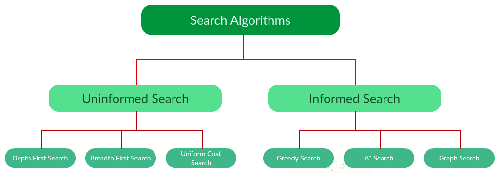
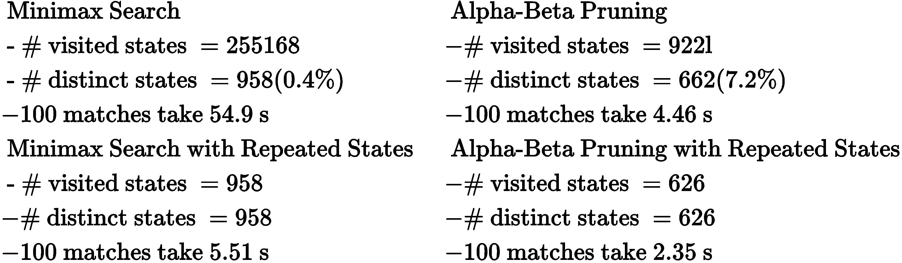
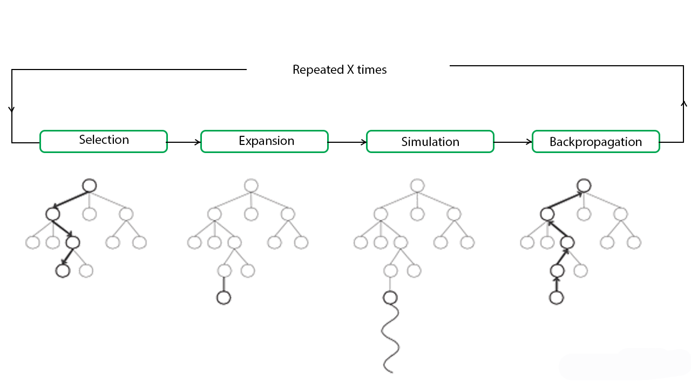
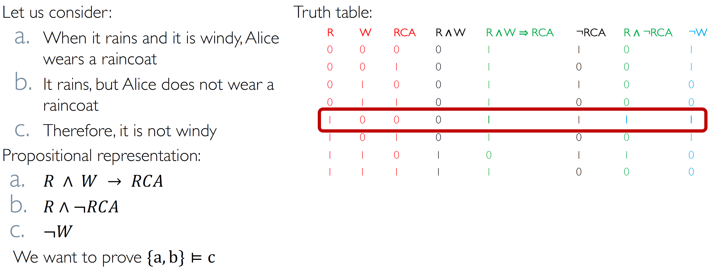
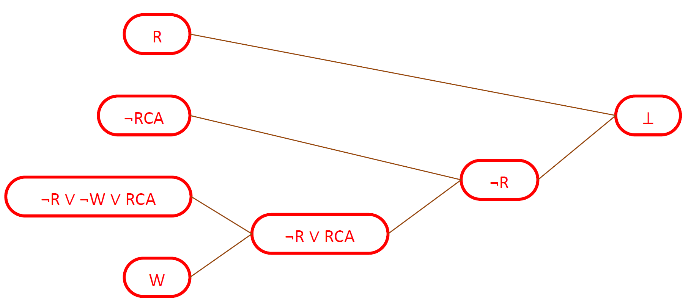

\maketitle
\newpage
\tableofcontents
\newpage

# Introduction

> AI is a crossroad between computer science and engineering

Many definitions of  an 'intelligent software': 

|  | |
|:--:|:--|
| Systems that 'think' as humans | Systems that think rationally  |
| Systems that act as human | Systems that act rationally  |

Note that in the 3rd and 4th definitions you are saying nothing about the internal structure. This is a crucial step in AI.

> It is intelligent not because you are reasoning in a specific way, but because it's acting in a specific way

## Agent 
Agent as unifying paradigm. Agent is an entity that through sensors has perceptions of the enviroment and can perform actions. 
The goal of the AI is to design agents. Agent function f() is a function that turns perceptions into actions. 

### Agent architecture
4 types of agent:

- **Simple Reflex Agent** :
	they're basically if/then conditions. They have a set of rules
- **Reflex Agent with State** :
	a simpe reflex agent with a state model. The man difference is that all the rules/conditions are applied to something more complex 
- **Goal-Based Agent** :
	it's defined a state of the world the agent should reach. We will mostly discuss about this agent 
- **Utility-Based agent** :
	it's like a goal based agent where every possible state has attached with an 'utility value' 

Note that all these types could also learn. There isn't a single approach to build out agents.

## Environment 

- Complete/partially observable 
- Static/dynamic (dynamic when the enviroment maybe is in a different state since the last time the agent saw it)
- Discrete/continuos
- Single agent/multiagent 
- Deterministic/stochastic/indeterministic

# Search Strategies
The idea is to search between many alternatives. Many problems could be formulated in terms of search problem. 
A directed graph that rapresents all the possible states. We can't use graph theory! The state space are too big! 
A problem-solving agent has to find a solution only with a small portion of the graph. We have to simplify the search. To do this we create a 'search tree' from the graph. 
For example: DeepBlue used a tree-search algorithm. In a similar way also AlphaGo.

Strategies to order nodes in the frontier. Yes, all the search strategies are basically 'take a node from the graph and take it to the frontier where it will be analyzed/expanded'.

Evaluation of search strategies:

- completeness: I'm guaranteed to find the solution?
- optimality: does the strategy finds always the optimal solution?
- complexity: performance in memory and computation
- parameters: branching factor and depth of the shallowest goal.

### Main workflow
Extract the node out from the frontier and check if it's the goal state. If it's not, generate all the successors (adding them to the frontier, also called OpenSet). **In case of graph-search and not tree-search, you should check also if the state is repeated (to avoid the cycles).** So to check if a state is repeated, another list is needed and every time during the algorithm a repeated state is found, that one is deleted with all its successors.

> Note that the 'goal test' must be done when the node is extracted, and not when it s generated! 

## Uninformed Search strategies

### Breadth-first (BFS)
All nodes of level k selected before the nodes of level k+1 (the queue of the frontier is implemented as FIFO).
It's always **complete**  but **optimal** only if all the costs are equal (actually the cost of a node has to be a monotone decreasing function of the depth of the node). 

### Depth-first (DFS)
Starts from an successor and the continues to his successor. It always choose the deepest one. When the deepest one is not the solution, it backtracks and choose the second deepest one and so on. (Queue implemented as LIFO).
The problem with depth-first search is that is **not complete**! It could take endless paths (cycles) without finding the solution.  
**Complete for acycle state spaces**. 
**Not optimal**.

Variants of DFS:

- Backtracking 
Slightly variation. When a node is expanded, instead of generating all the possible successors, only one action is executed and only one successor is generated. It reduces the used space

- Depth-limited search 
Basically a depth-first search with a limit depth L where each node is considered as level without any successor.

- Iterative deeping search
A letal combination of BFS and DFS and a better version of the Depth-Limited variant. It's basically the Depth-Limited variant but we increase the depth at every iteration (if no solution is found).
This solution is **complete and optimal** (like BFS) and also has linear memory complexity (like DFS).

### Uniform Cost Search (UCS) 
Instead of inserting all vertices into a priority queue, we insert only one node at time. Extract always minimum path cost. Prioritized frontier. UCS is **complete** and **optimal**  but only if all cost are strictly positive! No problem for loops.

## Informed Search Strategies

In an informed search, a heuristic is a function that estimates how close a state is to the goal state (Lesser the heuristic, closer the goal).
Possible heuristic functions are:

- Manhattan distance
- Euclidean distance
- Octile distance

### Greedy Best-First Search
$$f(n)=h(n)$$
The evaluation function is only the heuristic. **Not complete** and **not optimal**, but in case of search graph is complete. 

### A* search 
$$f(n)=g(n)+h(n)$$
The tree-search version of A* is optimal if $h(n)$ is admissible. It's also optimally efficient:with the same heuristic no algorithm is better. The graph-search version of A* is optimal if $h(n)$ is consistent.

#### Heuristic admissibility
The golden rule for  $h(n)$ is that it has always to **understimate** the cost. 

#### Heuristic consistency
$$h(n) \le c(n, n_1) + h(n_1)$$
When goal states have a heuristic value of zero, consistency implies admissibility.

# Adversarial Search
Typically used in deterministic/stochastic enviroments. 
Multi-agent enviroment, perfect information, 2-players, turn-tracking and 0 sum games.

## Minimax Search 

Based on DFS exploration for tree. 
Variants: 

- Expected MiniMax: Variant is the **expected minimax** that is basically a minimax based on probability: there is a third player between Max and Min that plays random moves (it rapresent the Nature or the Randomness).
- MiniMax with repeated states

## Alpha-Beta Pruning 

Based on MiniMax Algorithm tries to prune much as possible the tree to improve efficient. The goal is to identify that portions of tree that are guaranteed to contain the solutions. 
The main idea is to keep track of highest value for max player along the path ($\alpha$) and the lowest value for min player along the path ($\beta$).

The **golden rule** to remember how to apply MiniMax with $\alpha - \beta$ pruning:

> The max node makes the check on beta to prune (it prunes only if $v \ge \beta$) otherwise it updates the value of alpha (if $v > \alpha$) while the min node makes the check on alpha to prune (only if $v \le \alpha$) otherwise it updates the value of beta (only if $v<\beta$).

## Montecarlo Search
For complex game it's not easy to evaluate the next state and build on the minimax algorithm. So we need a method to evaluate the next move without knowing anything about the game. How?
With **randomness**. With randomness we let chance be our guide to figure out which next move might be the best one to pick.
The MCTS algorithm is based on randomness (the name refers to the gambling district in Monte Carlo).
MCTS randomly sample the solution space and building a 
search tree accordingly. It is often used in games with very large configuration spaces, like Chess or Go. 
MCTS works by iterating four steps: 

- **Selection** :
	a child selection policy is recursively applied to descend through the tree until the most urgent expandable node is reached (a node is expandable if it represents a nonterminal state and has unexpanded children)
- **Expansion** :
	one (or more) child nodes are added to expand the tree, according to the available actions
- **Simulation** :
	a simulation is run from the new node(s) according to the default policy to produce an outcome
- **Backpropagation** :
	the simulation result is propagated up through the selected nodes to update their statistics.

So MCTS use 2 policies: 

- **Tree policy** that selects or creates a leaf node from the nodes already contained within the search tree (selection and expansion).
- **Default policy** plays out the problem (game) from a given non-terminal state to produce a value estimate (simulation).

# Reinforcement learning 
## Machine Learning
Area of AI based on algorithms capable of learning, extracting knowledge. Extract knowledge, they cannot create it. The idea is to build software that can make decisions on new unseen data. We use ML mainly in problems where its too difficult to define rules for the agents. 

> data $\rightarrow$ experience 

## Supervised learning 
Desired outputs. The agent tries to reach them.

## Unsupervised learning 

Just tries to find patterns/regulaties in the data.

## How Reinforcement Learning works

The agent receives rewards based on how it performs. The only goal of the agent is to maximise the long term rewards. The agent needs to find a balance between 'exploitation and exploration' -> there is the 'exploitation and exploration dilemma'. 
There are many policies .. a greedy policy where the agent tries to perform the best rewarding action for each state. A $\epsilon$-greedy policy where the agent with probability $\epsilon$ perform a random action (exploration phase, the agent maybe discovers a better path with this action). 

Also, the enviroment must satisfy the **Markov Property**:

> History leads me here, but the next state and reward depends only on the current state/action . It's also important to design the right Reward Function. 

Q-learning is a famous algorithm used by this class of learning agents. It's based on a **Q table** where the Q value of each state rapresent the 'reward' of the state. 
The Q-table so it composed by all the possible states (rows) and for each state are considered all the possible actions (columns), then we fill each cell with the immediate reward of that action in that states. Later we perform a continue approximation of the reward of the states considering also the long term reward, using this formula: 
$$Q(s, a) \leftarrow (1 - \alpha)Q(s, a) + \alpha( r(s, a) + \gamma(max_{a \in A} \space Q(s',a')))$$
*(in this course we use a slighty simplified version of the Q-learning)*.
Where the the first term is the 'exploitation phase' and the second term is the 'exploration phase' where the agent considered also the long term award. $\alpha$ is the factor that is balancing exploitation and exploration and $\gamma$ is the discount factor: more $\gamma$ is greater and more you are giving importance to the long term reward. 

# Constraints Satisfaction Problem (CSP)
Some problems could be classified as CSP when we can define these elements:

- A set of variables $X_1 ... X_n$
-  For each variable $X_i$ we associate a domain $X_i$ = set of values that $X_i$ can assume 
- The set of constraints $C_1 ... C_n$ which specifies allowable combinations of values. The constaints can be:
	- unary (they involve only one variable),
	- binary (they involve two variables)
	- n-nary
   It's proved that any n-nary constraint can be turned into a set of binary constraints.

#### Constraint propagation.
We use constraints in order to reduce the number of legal values for a variable, which in turn can reduce the legal values for another variable, and so on. 

- 1-consistency (node-consistency): that is based basically on the domains of variables. 
- 2-consistency (**Arc-consistency**): the one we will check using the **AC-3** algorithm. $X_i \rightarrow X_j$ is arc consistency if for each value of $X_i$ exists a value in $X_j$ .
- Path-consistency: extension of the previous to more variables

AC-3 arc consistency algorithm that can be applied only to all CSPs formulated with binary constraints. The algorithm is very intuitive and simple. 

## CSP as Search Problem

An important behavour of the CSPs is that they are commutative! 
This reduces a lot the branching factor on our trees when we try to perform a search tree to solve this kind of problems. 
With this consideration with ended up we can perform a depth search tree giving possible values from the domain to the variables.
Also we could perform the DFS with some variants: 

- **Backtracking**
 
- **Forward Checking**: using **AC-3** each time a variable is assigned. For each variable not assigned that involves X (which is just assigned) is checked the **arc-consistency**. 

- **MRV (Minimum Remaing Values)**: When we try to assign a value to a variable we follow a policy to choose which variables assign and not just take a random one. So we choose the variable with minimum 'legal' values in the domain. 
- **LCV (Least Constraints Value)** : the MRV policy interest the variable choosen for the next assigment. The LCV policy tells us which value assign to the variable: we choose the value that is involved in the less numbe of constraints with other values. 

# Logic Based AI 
We can make AI based on Logic. 
The most important part of an agent based on knowledge is the **knowledge base**, a set of formulas that rapresents the knowledge (we could name them as axioms). 
Talking about logic we have to specify what semantic is and syntax is: 

- Syntax defines which formulas are well done. 
- Semantic defines the truth of a formula in a possible world (model), so it defines the 'meaning' of the formula. 

Entailment (conseguenza logica) $a \models b$ ($\alpha$ entails $\beta$ ) iff in every model where $\alpha$ is true, also $\beta$ is true. 
An inference algorithm is an algorithm which tries to prove an entailment. An inference algorithm has to be sound (finds **only** the formulas that are really entailments) and complete (finds **all** formulas that are logically entaltain).
This is the base to say that every formulas derived from $KB$, if $KB$ is true is also true and in this way we can do inference on our $KB$. 

## Propositional Logic

### Model checking:
A simple algorithm to prove entailments. This reasoning procedure is sound and complete and always terminates, making reasoning in PL decidable. But remember that it works if the models space is finite!
Also MC is inefficient when many propositional symbols are involved, because it has to compute a table of size $2n \times M$, where $n$ is the number of propositional symbols and $M$ is the number of subsentences the appear in the premises and the conclusion.

### DPLL 
Certain applications of PL require an agent to establish whether a set of sentences $\alpha$ is or is not satisfiable (there is an assignment of values to the symbols of $\alpha$ that makes  $\alpha$  true?).

The problem of establishing the satisfiability of a set of propositional sentences is known as SAT. Many interesting problems, including establishing propositional entailment, can be reduced to SAT problems.

- A possible solution of SAT is given by truth tables: $\alpha$ is satisfiable if, and only if, it has truth value 1 in at least one row of its truth table.
- A more efficient method is provided by the DPLL algorithm

The DPLL algorithm is base on the concept of CNF: 

- Conjunctive Normal Form represents a sentence as a conjunction ($\wedge$) of clauses
- a clause is a disjunction ($\cup$) of literals 
- a literal is either a propositional symbol or the negation of a symbol.

Every sentence of PL can be transformed in an equivalent sentence in CNF. 

Said what is a CNF, the DPLL is a backtracking (depth-first) search over models with some heuristics:

- Early termination: stop when all clauses are satisfied: $(A \cup B) \wedge (A \cup \neg C)$ is satisfied by $A=1$ .
- Any clause is falsified
- Pure literals: if all occurrences of a symbol in yet-unsatisfied clauses have the same sign, then give the symbol that value
- Unit clauses: if a clause has a single literal, set the corresponding symbol to satisfy clause: $(A \cup B) \wedge \neg C$ , $C$ must be set to false

Where DPLL is used? 

- Circuit verification: does this VLSI circuit compute the right answer?
- Software verification: does this program compute the right answer?
- Software synthesis: what program computes the right answer?
- Protocol verification: can this security protocol be broken?
- Protocol synthesis: what protocol is secure for this task?
- Planning: next classes

## Theorem Proving 

### Resolution 
Resolution is similar to DPLL (when this is used to establish entailment): it starts from a CNF representation of the premises and the negation of the conclusion.
Propositional resolution is an extremely powerful rule of inference for PL.

#### Forward chaining and backword chaining

Forward chaining is data-driven, automatic, “unconscious” processing, can derive everything that is entailed by the KB, but lots of work is irrelevant to a specific goal. 
FC keeps applying this rule, adding new facts, until nothing more can be added. Forward chaining is sound and complete for KBs composed of definite clauses.

- Soundness: follows from soundness of Modus Ponens 
- Completeness: the algorithm reaches a a fixed point from where no new atomic sentences can be derived. 

Backward chaining is goal-driven, appropriate for problem-solving, its complexity can be much less than linear in the size of the KB. BC works like forward chaining, but backward, starting from the goal, which is a positive literal.

## Planning Agents 
The planning techniques are the union of logic and tree search to find the solution of your problem. The tree search is needed to travel through the tree while the logic is used to rapresent the state: in fact every node is a set of logic formulas. 

### STRIPS
STRIPS is a language for expressing problems and is composed by:

- An initial state
- The goal state: any conjuction of literals. The goal only specifies the subgoals which necessary have to be present in a goal state: so the Closed World Assumption isn't valid. Another way to say that is that the goal state is not 'complete' description of the state.
- A set of actions that can be applied. Each action is described by:
	- preconditions (what must be established before the action is performed)
	- postconditions (what is established after the action is performed)

Some other rules about STRIPS: 

- Unique names assumption: different constants are different objects
- Domain closure assumption: the domains contains only the objects denoted by a constant 
- Closed world assumption: every facts that is not explicitly asserted is false
- Preconditions and Goal cannot contain negative literals.

### PDDL
Planning Domain Definition Language is 'evolution' of STRIPS. PDDL can contains negative literals in goals and preconditions and also it uses variables in the goal.

