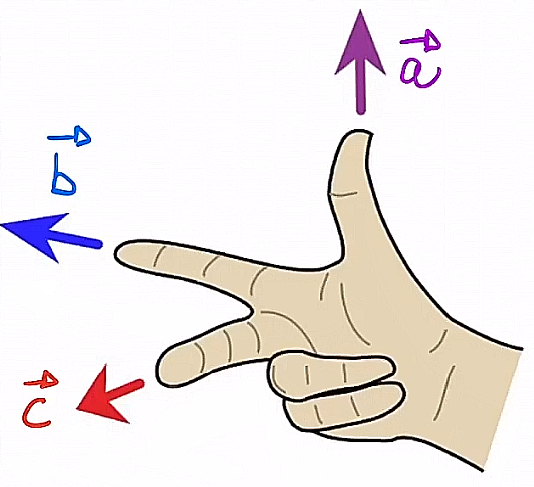
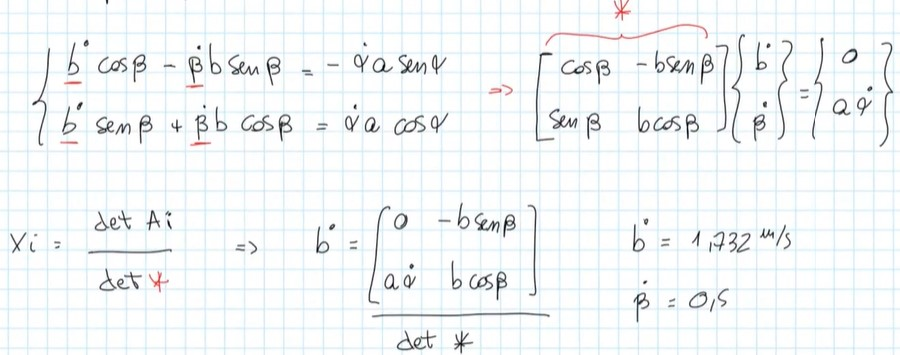
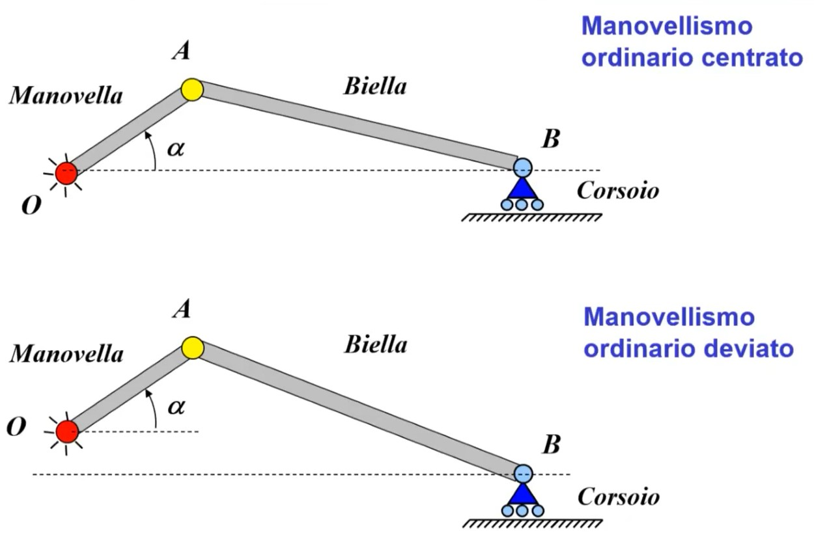
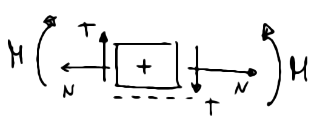
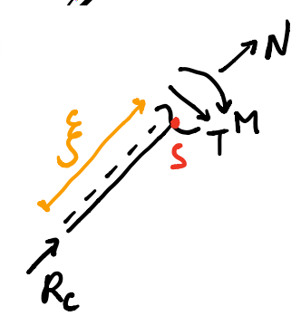

\maketitle
\newpage
\tableofcontents
\newpage

# Cinematica del punto 
## Notazione con Coordinate cartesiane 
$$\vec P = x \vec i +y \vec j$$
$$\vec V = \dot x(t) \vec i + \dot y(t) \vec j$$
Dove $\vec i$ e $\vec j$ sono i vettori unitari del sistema di riferimento (versori).

## Notazione con Numeri Complessi
$$\vec P = x + y i$$
$$\vec V = \dot x(t) + \dot y(t) i$$
Dove $i$ è l'unità immaginaria. Di conseguenza il numero complesso può a sua volta essere scritto con la notazione polare...

## Notazione Polare
$$\vec P=Pe^{\theta i}$$
$$\vec V= \dot Pe^{\theta i} + P \dot \theta i e^{\theta i}$$

## Ripasso prodotto vettoriale e scalare

### Prodotto vettoriale
$$\vec c = \vec b \wedge \vec a$$
Il prodotto vettoriale di due vettori è un terzo vettore con direzione ricavabile tramite la regola della mano destra e modulo $ba \sin(\alpha)$, dove $\alpha$ è l'angolo compreso tra $\vec b$ e $\vec{a}$ . Verrà utilizzato spesso per calcolare la velocità tangenziale di un punto che si muove lungo orbita circolare di raggio R ad esempio e con una certa velocità angolare.

### Prodotto scalare
$$\vec c = \vec b \cdot \vec a$$
Il prodotto scalare di due vettori è uno scalare uguale a $ba \cos(\alpha)$, dove $\alpha$ è l'angolo compreso tra $\vec b$ e $\vec{a}$ . Il prodotto scalare verrà spesso utilizzato per calcolare la potenza di coppie e forze o per calcolare la derivata dell'energia cinetica.

## Ripasso regola di Kramer per sistemi
Comoda in alcuni casi per risparmiare conti.

## Rivals per la velocità

La velocità **assoluta** di un punto qualsiasi di un corpo rigido rispetto a un altro punto qualsiasi $O$ è data dalla sovrapposizione di 2 contributi: 
1) contributo di traslazione di un suo punto arbitrario $O$
2) contributo di rotazione del corpo rigido attorno al punto scelto, rispetto ad un asse perpendicolare al piano del moto 

$$\vec{x} = \vec{v_o} + \vec \omega \wedge(X-O) $$

## Rivals per l'accelerazione

L'accelerazione **assoluta** di un punto qualsiasi di un corpo rigido rispetto ad un altro punto qualsiasi $O$ è data dalla sovrapposizione di 3 contributi: 
1) contributo di traslazione o trascinamento di un suo punto arbitrario $O$
2) accelerazione tangenziale
3) accelerazione centripeta 
$$\vec{x} = \vec{a_o} + \dot {\vec \omega} \wedge(X-O)  + \vec \omega \wedge [\vec \omega \wedge(X-O) ]$$

## Moti relativi per le velocità

$$(P-O) = (O_1 - O) + (P-O_1)$$

scrivendo $(P-O_1)=x_p\vec{i}+y_p\vec{j}$ posso derivare tranqui $(P-O)$ e $(O_1 - O)$ ma non $(P-O_1)$ in quanto i primi 2 avranno fissi i versori $\vec{i}$ e $\vec{j}$ mentre l'ultima componente non avrà i versori fissati, ma essi potranno cambiare  'orientamento' (poichè la terna mobile in $O_1$ può ruotare su sè stessa). 
Dobbiamo calcolare per l'ultima componente la derivata di un prodotto quindi $\leftarrow$ ma questo sarà sbatti. 

$$\dot{x_p}\vec{i}+\dot{y_p}\vec{j}=\dot{x_{o_1}}\vec{i}+\dot{y_{o_1}}\vec{j}+\dot{x_{p_1}}\vec{i}+ \dot{y_{p_1}}\vec{j} + {x_{p_1}}\vec{\dot{i}}  +{y_{p_1}}\vec{\dot{j}}$$
 

La dimostrazione consiste di vedere la terna come 'un corpo rigido' e utilizzare Rivals per le velocità: il tutto per calcolare le 2 derivate rispetto al tempo dei versori del sistema di riferimento mobile. 
Sappiamo per Rivals per le velocità che  $\vec{p} = \vec{v_{o_1}} + \vec \omega \wedge(P- O_1)$ , quindi possiamo eguagliare le equazioni e dire che ${x_{p_1}}\vec{\dot{i}}  +{y_{p_1}}\vec{\dot{j}}$ è esprimibile come $\vec \omega \wedge(P-O_1)$ .
Quindi il contributo dato dalle componenti con $\vec{\dot{i}}$ e $\vec{\dot{j}}$ può essere espresso come un contributo di rotazione rispetto al centro della terna. Nota che $\omega = \dot \phi \vec{k}$ dove $\phi$ è l'angolo dei vettori $\vec i$ e $\vec j$  della terna centrata in $O_1$ rispetto ai vettori **assoluti** della terna centrata in $O$ .

### Formule di Poisson
Quindi eccoci con le **formule di Poisson**:
$$\dot{\vec i} = \vec \omega \wedge \vec{i_1}$$
$$\dot{\vec j}  = \vec \omega \wedge \vec{j_1}$$

e ci consentono di calcolare le 2 derivate rispetto al tempo dei versori del sistema di riferimento mobile. 

Per concludere, la derivata di: 
$$(P-O) = (O_1 - O) + (P-O_1)$$
sarà: 

$$\vec{v_p} = \vec{v_{o_1}} + \vec{v_{p_{rel}}} + \omega \wedge (P-O_1) $$
da notare che il primo e l'ultimo (il terzo) componente della equazione precedente si tratta del cosiddetto **contributo di trascinamento** e può essere visto come "la velocità che avrebbe il punto $p$ se fosse inchiodato con la terna mobile". 

## Teorema dei moti relativi per le accelerazioni (o teo. di Coriolis)

Tenendo in considerazione che  $\omega \wedge (P-O_1)$ derivando sarà $\dot \omega \wedge (P-O_1) +  \omega \wedge \dot{(P-O_1)}$  e che $$\frac{\vec{{v}_{p_{rel}}}}{dt} =  \vec a_{p_{rel}} + \vec \omega \wedge \vec{v_{p_{rel}}}$$
otterremo:
$$\vec{a_p} = \vec{a_{o_1}} +  \dot{ \vec \omega} \wedge (P-O_1) + \vec \omega \wedge [ \vec \omega  \wedge (P-O_1)] + \vec{a_{p_{rel}}} + 2(\vec \omega \wedge \vec{v_{p_{rel}}})$$
che può essere vista come:

$$\vec{a_p} = \vec{a}_{p_{trascinamento}}  + \vec{a_{p_{rel}}} + \vec{a_{p_{coriolis}}}$$

cioè: 

$$\vec{a}_{p_{trascinamento}} =  \vec{a_{o_1}} +  \dot{ \vec \omega} \wedge (P-O_1) + \vec \omega \wedge [ \vec \omega  \wedge (P-O_1)]$$
dove si può evidenziare la componente di traslazione, la componente di accelerazione tangenziale e la componente di accelerazione normale $\vec \omega \wedge [ \vec \omega  \wedge (P-O_1)]$ .

Evidenziamo inoltre la componente di accelerazione di Coriolis $2(\vec \omega \wedge \vec{v_{p_{rel}}})$ la quale si annulla per $\vec \omega =0$ e $\vec v_{rel} =0$ o nel caso in cui $\vec \omega$ e $\vec v_{rel}$ sono paralleli tra loro, situazione possibile solo nello spazio 3D e non nel piano. 

# Cinematica del corpo rigido 

In genere la velocità di un punto di un corpo rigido in moto dipende non solo dalla traslazione di tale corpo ma anche della rotazione. 
In caso di corpo che trasla e basta però la velocità e l’accelerazione saranno uguali in qualsiasi punto.

## Cinematica sistemi meccanici 

### Meccanismi e Equazione di chiusura

Classificazione dei meccanismi in due macrocategorie: 
1) con catena a cinematica aperta: se esiste un corpo connesso unicamente a un solo corpo, quello che lo segue o che lo precede. 
2) con catena a cinematica chiusa: il contrario dell'aperto, ogni membro è collegato sia al corpo che lo precede o che lo segue. 'Il telaio chiude il meccanismo'

Nel caso (1) posso descrivere il moto del sistema considerando la dinamica di un moto relativo a quello di uno dei  corpi che lo compongono. Nel caso (2) si usa una **equazione di chiusura** :)

### Equazione di chiusura
Equazione di chiusura é una equazione vettoriale, espressa generalmente con la notazione dei numeri complessi (notazione polare), la quale esprime la condizione per cui i vettori che rappresentano i corpi all'interno del sistema formano sempre un poligono chiuso. 
In genere tale poligono viene chiuso dal telaio (il telaio é tutto ció a cui i corpi che studiamo si 'fissano', lo possiamo vedere come tutto il mondo esterno) ma non é detto. 
L'equazione di chiusura deve necessariamente per ogni corpo 'avere' un vettore corrispondente, altrimenti si tratta di catena cinematica aperta ed é una semplice equazione vettoriale.

#### Ricordati la convenzione scelta

Il giorno dell'esame ti arriva davanti questo grafico e incominci a fare i tuoi conti... Ti scrivi la tua equazione di chiusura (definizione in seguito) e purtroppo ti trovi una lunghezza negativa. Perchè? 

Non ti accorgi che l'angolo in $O$ è scritto con la convenzione 'contraria' e discorde con l'angolo disegnato in $C$ . 
**Devi mantenere la stessa convenzione durante i tuoi calcoli!** L'angolo in $C$ partirà dalla linea di $F_1$ per intenderci e proseguira fino all'asta $BC$ se vorrai mantenere la convenzione usata in $O$.

#### Quadrilatero articolato 

Cinematismo utilizzato per trasformare un moto rotatorio di un albero nel moto traslatorio di un corsoio o vicerversa. 
1 gdl, come tutti i casi considerati in questo corso. 
Esiste una Regola di Grashof per classificazione dei quadrilateri articolati ma bho... mai usata, vattela a cercare su Wikipedia.

#### Manovellismo ordinario
Composto da:

- manovella
- biella
- corsoio
Serve per trasferire un moto rotatorio in uno traslatorio e viceversa, utilizzato in particolare in motori, compressori e presse. 

Il manovellismo ordinario è a catena cinematica chiusa. Possiamo identificare nel movimento due punti di nostro interesse, che dipendono dall'angolo $\alpha$ .
- PME (Punto Morto Esterno) per $\alpha = 0$ 
- PMI (Punto Morto Interno) per $\alpha = \pi$ 

Possiamo definire un ratio $\lambda$ come $\lambda = \frac{a}{b}$ dove $a$ e $b$ sono rispettivamente la lunghezza della manovella e la lunghezza della biella. Più il ratio è minore di 1 e più il moto del sistema può essere descritto/approssimato trigonometricamente, cioè come un moto armonico. 

Due modi diversi per risolvere il Manovellismo Ordinario: 
- equazione di chiusura: alla fine salterà fuori che ogni punto è sempre descrito da una componente di trascinamento e una di traslazione rispetto alla terna centrata in A (congiunzione tra manovella e biella).
- Jacobiano del moto: definito come un rapporto di velocità: $\frac{v_b}{\dot \alpha}$. Il **Jacobiano** esprime quindi un legame cinematico tra la velocità che ci interessa e la velocità del grado di libertá che mi consente di descrivere il moto del sistema. In caso di 1 gdl il jacobiano é molto comodo.  

Tipico esempio di catena a cinematica aperta: 

# Meccanica statica 

## Statica del punto 

Condizione necessaria e sufficiente per la statica del punto materiale:

$$\sum\limits F_{attive} + F_{reattive} = 0$$

## Statica del corpo rigido

### Corpo rigido
Il corpo rigido è un insieme infinito di punti che ha dimensioni finite. Il corpo rigido è indeformabile, cioè dopo qualsiasi spostamento ci sarà sempre un nuovo sistema di riferimento tale per cui la posizione del corpo rigido del corpo rispetto a tale sistema è identica alla posizione del sistema di rif. iniziale. Inoltre l'indeformabilità del cr implica che la distanza tra i punti rimane fissata, così come gli angoli formati da 2 rette passanti per 2 generiche coppie di punti.

Coordinate corpo rigido:
$$x_a \space x_b \space \varphi$$ 

Condizione necessaria e sufficiente per la statica del punto materiale:

$$\begin{cases}
\sum\limits F_{attive} + F_{reattive} = 0 \newline  \\
\sum\limits M = 0
\end{cases} $$

Abbiamo quindi 3 equazioni scalari (l'equazione della forza si divide in 2 per le componenti). 

### Momenti e coppie

Il momento delle forze attive e reattive rispetto al polo $O$ é : 

$$M_{o}= \sum\limits \vec F \wedge (P_i-O) + \sum\limits \vec{C_j}$$

Cioè il momento di un corpo rispetto al  polo $o$  è la sommatoria di tutti i momenti delle forze e di tutte le coppie di forze. 
Il momento di una forza é il prodotto della rispettiva forza per il braccio (cioé distanza tra punto di applicazione e polo).
Invece una coppia di forze è: 
$$C=\vec{F}\times d$$
Dove $d$ è la distanza di applicazione delle due forze. Abbiamo una coppia di forze ogni volta che ci sono due forze con verso opposto, parallele e stesso modulo applicate in due punti diversi. 

### Vincoli
Ogni vincolo che blocca il movimento è sostituibile con una forza vincolare, tale forza nei nostri esercizi la scomponiamo in due forze ovviamente. Ogni vincolo che blocca la rotazione invece è modellizzabile con un momento. 

Un corpo rigido mentre nello spazio possiede 6 gradi di libertà, nel piano ne ha solo 3: 2 traslazionali (x e y) e uno rotazionale.

### Sistema di corpi rigidi 
Un sistema di corpi rigidi può essere visto come un insieme di CR tra loro opportunatamente vincolati, visti esternamente come un unico corpo rigido chiamato **Telaio** . 
In ogni problema con corpi rigidi soggetti a vincoli si applica la Regola di Gruber.

### Regola di Grubler 
$$\#gdl_{sistema}=\#gdl_{CR} - \#vincoli $$

Dove il numero di gdl (gradi di libertà) di un corpo rigido è 3 . 

Possiamo quindi classificare un sistema di corpi rigidi in base al suo numero di gdl. 
Per $\#gdl \ge 1$ i sistemi vengono chiamati meccanismi, mentre per $\#gdl \le 0$ il sistema non si muove a meno di deformazioni strutturali. In particolare il secondo caso può essere a sua volta diviso in **isostatica** ($\#gdl = 0$) e **iperstatica** ($\#gdl < 0$). 

## Esercizio di statica 

Approccio per esercizi di statica: 
- Spezzare il sistema in $n$ (numero di corpi) parti.
- Per ciascuna parte analizzo le forze che agiscono. Vale il principio di azione e reazione: le azioni presenti su una parte della struttura (ottenuta post separazione) sono uguali e contrarie alle azioni presenti sulla restante parte. Nota bene che a questo punto non analizzo alcuna forza interna. Per calcolare il momento di una forza ci sono due modi: possiamo calcolare la componente perpendicolare al braccio della forza usando la trigonometria oppure (in alcuni casi molto piú comodo) calcolo la distanza della retta di applicazione della forza rispetto al polo scelto. 

- Avrò delle forze incognite, tali forze poi le risolvo 'combinando' le equazioni delle varie parti che ho trovato
- A questo punto ho risolto il punto 1 dell'esercizio di statica. Nel punto 2 di ogni ese. di statica verrà chiesto di analizzare una singola parte del sistema su cui agisce una forza concentrata e disegnare i grafici delle **forze interne** agenti sulla parte. 

### Azioni interne 
I corpi nella realtà potrebbero avere anche delle deformazioni. Vogliamo capire in quali condizioni $\leftarrow$ entriamo in questo ''stato''. Per far ciò ci basiamo su **sezioni** del corpo, cioè punti in cui dividiamo il nostro corpo. 
Inevitabilmente ci saranno delle discontinuitá in ogni forza concentrata per quanto riguarda le azioni interne $N$ e $M$. Se abbiamo momenti concentrati, il momento flettente avrá una discontinuitá ... altrimenti sará continua pure essa! 

*Approccio consigliato da me* : tagliare in due pezzi e partire entrambe le volte dagli estremi per andare verso l'interno. La forza in mezzo la ignori sempre. Se invece per qualche motivo non puoi devi analizzare lungo un'unica direzione $x$: facendo i casi in si è prima della forza concentrata (senza considerarla) e dopo (considerandola).

Convenzione utilizzata in questo corso:

Viene considerato positivo quando esso impone al concio una rotazione oraria, cioè a sinistra del concio il taglio va verso l'alto e a destra verso il basso, mentre è negativo quando esso impone al concio una rotazione anti-oraria.
Se il momento è positivo lo si mette dalle parti delle fibre tese. 
> Equilibrio di rotazione sempre rispetto al punto $P$, cosí per trovare $M$ senza aver d'impiccio $N$ e $T$ .  

Nota bene che $T$ e $N$ vanno calcolate nel sistema di riferimento dell'asta! Quindi se è inclinata tiene bene a mente che $T$ e $N$ saranno inclinate.

## Geometria delle masse 

### Baricentro 
Baricentro come punto in cui é possibile concentrare tutta la masse del corpo rigido, quindi come centro delle forze peso, cioé come punto in cui é possibile ridurre la risultate di tutte le forze. $$x_{g}=\frac{\sum x_{i} m_{i}}{M}$$ e $$y_{g}=\frac{\sum y_{i} m_{i}}{M}$$
Ma non é necessario calcolarlo sempre. Ad esempio il baricentro appartiene sempre all'asse di simmetria (se c'é) o all'intersezione degli assi (se ce né piú di uno) . O ancora si puó calcolare usando la media pesata con le masse dei baricentri delle figure "semplici e note" che compongono il corpo. 

Il baricentro é inoltre il punto con il momento d'inerzia minimo in tutto il corpo. Questo risultato deriva dal **teorema del Trasporto**:
$$J_{P}=J_{G}+m{PG}^2$$

La distribuzione di massa all'interno di un corpo attraverso il momento d'inerzia diventa quantificabile. Le forze di coppia d'inerzia a mo' di spaghettata ci esprimono quanto sia difficile mettere in movimento un corpo. 

Il baricentro di un omogeneo a spessore costante il baricentro coincide con il baricentro geometrico della figura. 
Il baricentro lo possiamo vedere come il punto in cui tutta la massa é concentrata o del punto in cui ogni forza viene applicata. 

Nel caso di moto piano il momento d'inerzia sará sempre rispetto all'asse z. $$J_c = \sum m_i d_i ^2$$
per questo per un sistema di corpi. 
Per un corpo rigido, cioé un insieme infinito di punti materiali. 
$$J_c = \int _ V d^2 \space dm = \int _ V d^2  \rho \space dV  = \int _V (x^2 + y^2) \rho dV$$

Il momento d'inerzia rispetto a un generico polo dipende dal polo mentre il momento d'inerzia del baricentro é una caratteristica del corpo. 

### Teorema di Huygens (teo. del trasporto)

$$J_o = J_G + m \vec{GO}^2$$

la dimostrazione consiste in scrivere il momento $J_o = \int _V (x_g + x_o)^2 + (y_g + y_o)^2) \rho dV$ e poi risolvere l'integrale raccogliendo e facendo considerazioni. Ritroverai, svolgendo i quadrati, esattamente l'equazione scritta sopra, facendo attenzione che $x_g$ e $y_g$ sono costanti e che i doppi prodotti sono nulli. 

In caso di corpo omogeneo a spessore costante, l'integrale di volume diventa un integrale di superficie. 
$$\int _A (x^2 + y^2) \rho h \space dA$$ 

# Attrito

La forza d'attrito è una forza che si oppone al moto **relativo** tra i due corpi. NB: non si oppone al moto del singolo corpo, ma a quello relativo tra i due corpi. $\leftarrow$ per cogliere questo prendi l'esempio dei due corpi a contatto che si muovono nella stessa direzione ma a due velocità diverse. La forza d'attrito è infatti direzionata nello stesso verso del moto dei corpi, ma a verso opposto alla loro velocità relativa. 

## Attrito statico e dinamico
Statico:
$$F_{s} = f_{s}N$$
Dinamico:
$$T_{d} = f_{d}N\cdot \frac{\vec{v_{1}}}{|\vec{v_{2}}|}$$

## Attrito volvente 
Un disco (muovendosi e a causa della deformabilitá del punto di contatto) sarà soggetto avrá una forza infinitesimamente spostata in avanti. Per modellare questa situazione senza abbandonare l'idea di corpi rigidi introduciamo uno spostamento della forza di contatto $N$. Tale spostamento infinitesimale $u$ del punto di applicazione della forza $N$ crea una coppia che si oppone al rotolamento. La cosiddetta coppia di resistenza al rotolamento. $C_r = N u$ 
Il concetto di fondo si basa sempre sull' attrito statico ma nel modello di puro rotolamento non si spiega una dissipazione di energia. Un buontempone ha quindi introdotto un coefficiente $f_v=\frac{u}{R}$  per **giustificare la dissipizazione di potenza nonostante puro rotolamento**.  

Per far ció introduciamo una coppia $C_r$ . Ma perché minchia mi serve? Bhe se non usassi questo modello mi ritroverei 'una potenza in meno' o comunque non saprei calcolare la potenza dissipata dalla forza d'attrito: il punto di applicazione della forza non é riconducibile al baricentro del corpo e soprattuto la velocitá del punto di applicazione della forza é nulla, quindi avrei una potenza nulla (poiché attrito statico!).
Introduciamo quindi una coppia $C_r  = N u$ e una potenza dissipata $W_d = \vec{C_r} \cdot \vec{\omega}$ . 
Alla fine $$F_v=Nf_v$$
Per uniformarci utilizziamo tale coefficiente: $$f_{v}=\frac{u}{R}$$
dove $u$ è lo scostamento dal centro del disco. 

## Verifica di aderenza
L'attrito statica implica la perfetta aderenza tra i due corpi e totale assenza di velocitá relativa tra i due. In genere si ipotizza condizioni di aderenza per poi applicare la disuguaglianza di Coloumb. Se tale disuguaglianza é verificata allora tutto OK, altrimenti KO e sono in attrito dinamico.

### Legge di Coloumb 

$$|T| \le f_s|N|$$
In caso peró di KO allora saremo in condizione di attrito dinamico  e balziamo l'idea di modello della resistenza al rotolamento e la forza $T$ sará determinata dalla equazione di coloumb $T=f_d |N|$ e ci sarà una potenza dissipata dovuta all'attrito dinamico.

# Dinamica 
Due tipi di dinamica: 

- diretta: sono note le forze attive e si determina il moto del sistema.
- inversa: è noto il moto del sistema e si determinano le forze necessarie a mantenere tale moto.

Diversi tipi di approcci alla dinamica: 

- approccio dinamico: 
	- Principio d'Alembert 
- approcci energetici:
	- Principio dei Lavori Virtuali $\leftarrow$ *non considerato in questo corso*
	- Bilancio delle Potenze
	- Teorema dell'Energia Cinetica 
	- Equazioni di Lagrange $\leftarrow$ *non considerate in questo corso*

## Equazioni della dinamica d'Alémbert
$$\begin{cases}\sum\limits F_{a} + F_{r} + F_{in} =0 \newline \sum\limits M + C + M_{in} + C_{in} = 0 \end{cases}$$
In cui le forze d'inerzia (e quindi di conseguenza le coppie di forze d'inerzia e i momenti d'inerzia) sono forze fittizie la cui introduzione ha scopo di giustificare a mo' di spaghettata 'la forza insita nel corpo che si oppone al movimento o si oppone in caso di moto giá presente al rallentamento di esso'. Intuitivamente il momento d'inerzia é quel momento fittizio che si oppone al cambiamento dello stato di rotazione del corpo. 
La forza d'inerzia é quindi descritta come $F_{in}=-Ma$
In caso di corpo con dimensioni non trascurabili la risultante di tutte le forze d'inerzia prodotte sul corpo é $F_{in}=-Ma_g$ 

Wikihow sul principio d'Alèmbert:

1) analisi cinematica del corpo aka trovare l'accellerazione angolare del corpo e del baricentro: mainly using Rivals per le velocità e per le accelerazioni. 
2) principio d'Alembert + forze d'inerzia (e coppia)

## Bilancio delle potenze 
Definiamo la potenza di una forza: 
$$W_{f}= \vec F \cdot \vec v = F \cdot v \cos (\theta)\space [W][\frac{J}{s}]$$

Definiamo la potenza di una coppia: 
$$W_{f}= \vec C \cdot \vec \omega \space [W][\frac{J}{s}]$$

$$ \sum\limits W_{attive} + W_{inerzia} = 0 $$
Non mettiamo le forze reattive poiché le velocità nei vincoli sono nulle: i vincoli non presentano cedimenti né attriti né giochi.

## Teorema dell'Energia Cinetica
Definiamo l'energia cinetica di un punto materiale: 
$$E_{c}= \frac{1}{2}m \vec{v_{G}}\vec{v_{G}}+ \frac{1}{2}\vec{J_G} \vec{\omega}\vec{\omega}$$

Teo. $E_c$ : 
$$ \sum\limits W_{attive} = \frac{d E_c}{dt}  $$

Nota: solo **potenze** di forze/coppie **attive**! NO potenze di forze d'inerzia, NO potenze di forze reattive

$$\frac{E_{c}}{dt} = \frac{1}{2}m \vec{v_{G}}\vec{a_{G \space tan}}+ \frac{1}{2}{J_G} \vec{\omega}\vec{\omega}$$

### Approcci energetici con attrito
A patto di inserire nel computo delle potenze le coppie e forze d'attrito il $BdP$ lo posso usare (così come il Teo $E_c$). 
Teo $E_c$ nella sua versione piú generale : 
$$ \sum\limits W_{attive} + \sum\limits W_{attrito} = \frac{d E_c}{dt}  $$

## BdP e Teorema della $E_c$ sono la stessa cosa

$$\frac{E_{c}}{dt} = \frac{1}{2}m \vec{v_{G}}\vec{a_{G \space tan}}+ \frac{1}{2}{J_G} \vec{\omega}\vec{\omega}$$
$$\frac{E_{c}}{dt} = \frac{1}{2}(2m \vec{v_{G}}\vec{a_{G \space tan}}+ 2 {J_G} \vec{\dot \omega}\vec{\omega})$$
$$\frac{E_{c}}{dt} = m \vec{a_{G t} } \space \vec{v_{G}}+ {J_G} \vec{\dot \omega} \space \vec{\omega}$$
Dove $m \vec{a_{G t} }$ è $-F_{in}$ e $J_{G} \vec{ \dot \omega}$ è $- \vec{C_{in}}$. 

Dunque il Teo. della $E_c$ sta proprio scrivendo:
$$\sum\limits W_{attive}=-\sum\limits W_{inerzia}$$

## Esercizio di dinamica 

L'esercizio d'esame sulla dinamica si risolve quasi sempre in questo modo: 

0) Immaginarsi come il sistema si muova.
1) Identificare un’equazione di chiusura.
2) Trascrivere l’equazione di chiusura in forma complessa, rappresentante lo spostamento.
3) Individuare le incognite risolvendo (separando cioè nelle componenti cartesiane la forma complessa della equazione di chiusura).
4) Derivare la forma complessa ottenendo quindi la chiusura per la velocità.
5) Separare nelle componenti cartesiane l'equazione di chiusura della velocità ed ottenere i termini incogniti (spesso utilizzando i termini incogniti trovati nel punto (3))
6) Derivare una seconda volta la forma complessa, ottenendo quindi l'equazione di chiusura dell'accelerazione.
7) Separare nelle componenti cartesiane l'equazione di chiusura della accellerazione ed ottenere i termini incogniti (spesso utilizzando i termini incogniti trovati nel punto (3) e punto (5))
8) Calcolare potenza totale, sommando i contributi di tutte le forze e coppie applicate a corpi in moto. Per calcolare le potenze servono le velocità trovate nei punti precedenti. Se nei punti precedenti non abbiamo trovato le velocità baricentriche quasi sempre si usa rivals o si effettua qualche deduzione per trovare le incognite d'interesse senza troppi conti.
9) Si calcola l’energia cinetica totale (ricordati le forze/coppie d’inerzia di tutti i corpi con massa). Nel caso di corpo con un perno corrispondente con il baricentro, calcolerai soltanto la componente rotazionale cinetica $\frac{1}{2}J\omega^2$. In caso contrario, cioè quando il baricentro dell'asta non sia nel punto in cui c'è il perno, dovrai calcolare anche la componente traslatoria dell'energia cinetica $\frac{1}{2}mv^2$ . 
10) Si deriva l'energia cinetica.
11) Si usa il bilancio delle potenze, cioè si costruisce una equazione in cui spesso l'unica incognita è quella richiesta dall'esercizio. 
12) Nel punto (11) spesso l'equazione è molto complessa e ricca di termini ma don't panic... si controlla che ogni somma sarà tra stesse grandezze e quindi tra stessi termini con stessa unità di misura. 

## Dinamica puro rotolamento 
Il punto di contatto tra il disco e il piano è il centro di istantanea rotazione $CIR$, cioè dove la velocità istantanea è nulla (ma non l'accelerazione!). A livello di accelerazione avremo una componente tangenziale e una normale, ma **non** quella di Coriolis 'essendo il raggio costante'. L'accelerazione *tangenziale* così come la velocità tangenziale sarà nulla nel *CIR* mentre l'accelerazione normale sarà $\ne 0$ ! 

# MTU 
## Macchina Trasmissione Utilizzatore a 1 gdl
Noi riduciamo il motore ad una coppia equivalente ridotta al motore. $M*_m$ é la coppia ridotta dell'albero motore, che in generale dipende dalla rotazione del motore. 
Questa funzione, questa curva si chiama *curva caratteristica*, ed é appunto caratteristica dal tipo di motore. 
A sua volta l'energia cinetica la riduciamo a un singolo elemento equivalente dotato di inerzia rotazionale $J*_m$ e quindi $E_{c_m} = \frac{1}{2}J*_m \omega ^2$ . Tale elemento sará equivalente alla sommatoria di tutte le inerzie (cioé energie cinetiche) dei corpi lato motore (a monte della trasmissione).
Io quindi posso sempre modellare il motore, nonostante la sua natura, con un albero che gira con velocitá $\omega _ m$ sul quale c'é un volano (cioé un elemento caratterizzato da sola inerzia rotazionale) con inerzia $J^*_m$ su cui agisce una coppia pari ad $M^*_m$ . 

## Curva caratteristica
La curva caratteristica è il plot della funzione della coppia motrice ridotta all'albero motore dipendendete dal regime di rotazione del motore. Quest'utlimo a sua volta dipende dal grado di apertura della valvola che regola l'ingresso della miscela o dalla tensione elettrica nel caso di motori elettrici. 

- Combustione interna: si tratta di una parabola (*Notare come Diesel/benzina hanno principio chimico diverso ma hanno comunque una curva caratteristica molto simile* ).
- Motore elettrico: hanno una curva lineare. Oltre la velocità angolare di sincronismo la coppia motrice diviene negativa. Cioè svolge ruolo di organo frenante. 

## Utilizzatore 
Ovviamente $W_u = \vec{M^*_u} \times \vec{\omega}_u$ che sará uguale alla sommatoria dell'energia cinetica  di tutti i corpi lato utilizzatore. Quindi stesso modello del 'lato motore'. 

Curva caratteristica del utilizzatore può avere diverse forme: 

- lineare: esempio ascensore 
- curva: in caso di fluidi 
- combinazione tra le precedenti: casi più comuni, ad esempio macchina in salita

## Trasmissione
Definisce il rapporto tra la velocità del motore e del utilizzatore. 

## Bdp per MTU
Facendo un bilancio di potenze sulla sola trasmissione otteniamo le seguenti relazioni:

$$W_1 +W_2 +W_p =0$$
$$W_1 = W_m -\frac{dE_{cmotore}}{dt}$$
con $\frac{dE_{cmotore}}{dt} = J^* _m \omega _m \dot \omega _m$ . 
$$W_2 = W_u -\frac{dE_{cutilizzatore}}{dt}$$
Definito il rendimento come segue:
$$ \eta = - \frac{W_{out}}{W_{in}}$$
si ottiene:
$$W_p = -(1 - \eta)W_{in}$$

In condizione di regime sarà:

- in caso di moto diretto: $W_{in}=W_1$ 
- caso moto retrogrado: $W_{in}=W_2$ 

## Teo. Energia Cinetica per MTU
In modo alternativo al Bdp possiamo usare il Teo. Dell'energia cinetica. Ricorda però **che $W_1$ è diversa da $W_m$ così come $W_2$ è diversa da $W_u$ . $W_1$ e $W_2$ contengono infatti anche i contributi dovuti all'energia cinetica.**
Si ricorda in oltre che a regime: $\dot \omega _m = 0$ e $\frac{dEc}{dt} = 0$ .

Teo. $E_c$ : 
$$ W_{motore} + W_{utilizzatore} + W_{perduta} = \frac{d E_c}{dt}  $$
$W_p$ sará sempre negativa, poiché rappresenta attriti. 

## Potenza motrice
$$W_m = M_m \omega _m$$Dove $M_m$ è la coppia motrice. Sia $W_m$ che $W_r$ possono essere negative/positive. In caso di $W_m$ negativa, allora moto retrogrado e il motore funge da freno.

## Potenza resistente
*Nota che $W_r$ è equivalente a $W_u$. 
La potenza resistente è composta da tutte le forze ed attriti agenti sul sistema. In genere sono le forze peso dei corpi, le forze aereodinamiche e le forze d'attrito. 
$$W_r = (Forze \space applicate \space  corpi) \cdot (velocità \space  baricentriche \space)$$

## Potenza perduta
Per la potenza perduta ci dobbiamo per forza appoggiare alle relazioni trovate con il Bdp sulla trasmissione, quindi: 
$$W_p = -(1- \eta )W_{in}$$

# Casi degni di nota terzo esercizio

## Tiro alla fune

Il modo migliore per calcolare il tiro alla fune nella sezione $H-H$ della fune è usando un equilibrio dei momenti nel punto di contatto tra disco e piano inclinato. Devi tenere conto della forza d'inerzia (e quindi del suo braccio $R$ dato che stai facendo un equilibrio dei momenti).
Nel caso in cui ci fosse la forza d'attrito volvente devi rappresentare il discostamento infinitesimo $u$ e considerare tale come braccio del momento generato dalla forza d'attrito (ricordati che puoi usare la relazione $u=f_v R$). 

## Disco collegato a fune all'estremità

Quando un disco si tira dal centro velocità centro disco = velocità del corpo. 
Quando però lo si tira tramite fune collegata alla circonferenza del disco, la velocità baricentrica del disco è la metà dell'esterna. Per dimostrare ciò si usa molto semplicemente Rivals. 

## Condizione di aderenza delle ruote
Se ti da posizione del baricentro rispetto alle ruote hai dati a sufficienza per verificare l’aderenza delle singole ruote, altrimenti consideri il corpo **intero** come un punto materiale. 
In generale però vale sempre che quando calcoli l'aderenza di un corpo, devi tenere conto di tutte le forze e coppie d'inerzia.

Ricordati che la forza d'inerzia si oppone sempre al senso del moto!

## Allo spunto
Allo spunto significa che in partenza. Quindi si ha necessariamente una veriazione dell’energia cinetica. La $\omega$  tende a $0$ ma non è $0$, dunque puoi semplificarla tranquillamente. Inoltre in genere si presuppone che la spinta sia necessaria a spostare il sistema, quindi che $W_1$ sia $> 0$ : questo di conseguenza significa che coppia, velocitá e accelerazione angolare hanno lo stesso segno. 
Raramente si può incontrare un'eccezione a quest'ultima regola (specificato nel testo): cioè quando il motore da coppia allo spunto, ma non abbastanza per vincere la resistenza. In questo caso si ha una coppia positiva ma velocità e accelerazione angolare negativi. 