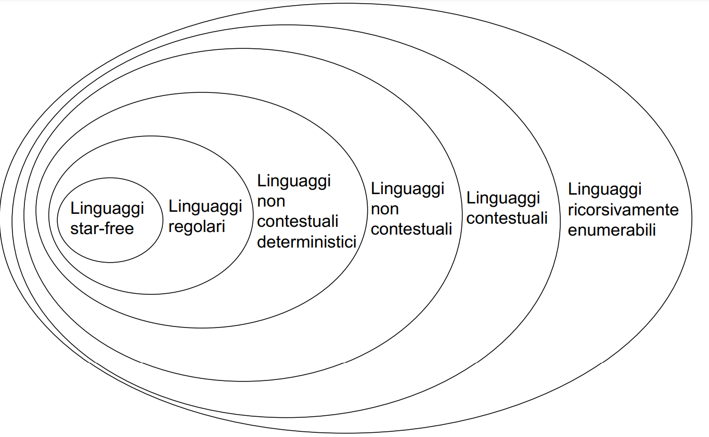

Formalizzare i problemi con un linguaggio.
La FOL (Logica del primo ordine) é utilizzata in AI e in altri campi.. nei nostri esercizi, per definire linguaggi, utilizzeremo logiche più ristrette di FOL:

- MFO (Logica Monadica del Prim'ordine)= come FOL ma con quantificatori solo su variabili. 
- MSO (Logica Monadica del Second'ordine)=con quantificatori anche sui predicati. 

### MFO 

- come logica proposizionale ma con variabili che rappresentano posizioni all'interno della stringa
- in genere nei nostri esercizi possiamo utilizzare abbreviazioni. Esempi di abbreviazioni: (succ(x,y) per dire y=x+1)(last(x))
- **strettamente meno potente degli FSA**
- I linguaggi definiti da MFO non sono chiusi rispetto alla $*$ di Kleen. Quindi diciamo che riconosce i cosidetti linguaggi **star-free**, cioè linguaggi definibili come unione, concatenazione,intersezione, complemento di linguaggi finiti.

MFO non sa riconoscere $$L = \{ a^{2n} , n \in \mathbb N \}$$

#### Esempi MFO
Scrivere una formula di MFO che descrive parole in cui tra 2 simboli $a$ ci deve essere almeno un simbolo $b$. 

$$\forall x,y( x < y \wedge a(x) \cup a(y) \implies \exists z( x < z \wedge z < y \wedge b(z)))$$

Scrivere una formula di MFO che descrive parole in cui i simboli al massimo compaiono una volta sola. 
$$\forall x( a(x) \implies \forall y( x < y \rightarrow \not a(y)))$$
Scrivere una formula di MFO che descrive parole in cui, ogni 10 simboli, al massimo 1 puó essere a. 
$$\forall x,y( y = x + 9 \implies \neg (\exists z1,z2( x \le z1 \wedge z1 < z2 \wedge z2 \le y \wedge a(z1) \wedge a(z2)))$$

### MSO
- identico a MFO ma con la possibilità di quantificare anche i predicati.
- **potente tanto quanto gli FSA e quindi le Grammatiche Regolari**

E' possibile utilizzare la logica anche in maniera ricorsiva, l'importante ovviamente è che non vada in loop all'infinito. 

### Logica di Hoare
La notazione di Hoare serve per specificare opportune **pre-condizioni** e **post-condizioni** per un programma. (In questo caso usiamo FOL).

## Tesi di  Church - Turing

> L'insieme delle funzioni calcolabili coincide con quello delle funzioni calcolabili da una macchina di Turing.

Nessun algoritmo, indipendentemente dallo strumento utilizzato per l'implementazione, può risolvere un problema che non sia risolvibile dalla Macchina di Touring. 
In 80 anni non abbiamo trovato controesempi di questa tesi (che non ha dimostrazione).
NB: **esistono problemi non risolvibili algoritmicamente.**
*Enumerazione algoritmica*: un algoritmo che mi trova tutte le corrispondenze biunivoche tra un certo insieme e l'insieme $\mathbb{N}$.  Cioè mi enumera gli elementi di un certo insieme. 
L'insieme di tutte le MT è enumerabile algoritmicamente: infatti fissati il \#stati e il \#nastri , l'unica cosa che distingue le MT è la funzione $\sigma$ (transizione).
Quindi da ora in poi vedremo le finite MT come delle funzioni $f_i$ .
Utilizzeremo il simbolo $\bot$ per indicare 'l'indefinito' , cioè quando una MT non si ferma/è indefinita per un certo ingresso x. 
 
### Macchina di Touring Universale
 
La MTU è una MT che può emulare qualsiasi altra MT. Essendo le MT finite, e fissato il \# stati e il \# nastri , ricevendo il numero corrispondente della MT, la MTU può identificare la corrispondente funzione di transizione e quindi emulare la $MT_i$ . 
MTU calcola quindi $f(y,x)=g_y(x)$ . 
*Possiamo vedere il computer come una MTU, e una scheda già programmata come una MT.*
MTU nidificate -> macchine virtuali