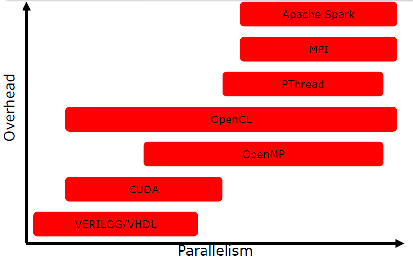

# Why parallel programming? 

Parallel programming can be a powerful tool for improving the performance of code and for taking advantage of the capabilities of modern hardware. 

Main advantages:

- performance
- cheaper than sequential implementation 
- basically the ''big problems'' can only solved by parallel algorithms 

## Brief history of parallel programming 

PP has continued to increase during time driven by the development of new hardware architectures and the need for more computational power. Some of the main steps of PP evolution include:

- (50s and 60s): PP was performed primarily using low-level languages and specialized hardware, and it was typically only used for highly specialized applications.
- (80s and 90s): the development of high-level languages and parallel libraries made it possible applying PP to a wider range of applications.
- (2000s): the widespread adoption of multicore microprocessors began to drive the development of new parallel programming techniques and tools. 
- (10s): the rise of manycore architectures, such as GPUs, led to the development of new parallel programming approaches, such as data parallelism and task parallelism.

Manycore architectures are becoming increasingly common in modern computing, and are often used in applications that require a lot of computational power, such as data analysis, scientific simulations, and machine learning. A GPU, or graphics processing unit, is a type of manycore architecture that is specifically designed for high-performance graphics and parallel computation. GPUs are typically composed of hundreds or thousands of small, simple cores that are optimized for performing the parallel computations required for rendering graphics.

# Independency from architecture and automatic parallelization 

The design of parallel algorithms should be performed independently from the architecture that will be used for their implementation. This is because the performance of a parallel algorithm can vary significantly depending on the hardware on which it is run. 
It is important to design algorithms in a way that is agnostic to the specific hardware. 

## Automatic Parallelization

Automatic parallelization refers to the process of using a compiler or other tool to automatically transform sequential code into parallel code without requiring explicit parallelization directives from the programmer. 

In practice, it is not always possible for the compiler to accurately parallelize code. For example the compiler is not able to infer if 2 pointers of 2 arrays are pointing different region of RAM and are not overlapping while the programmer knows how to design the parallel algorithm. 
So parallelization by hand is predominant and the programmer needs to give hints to the tools. 

## Extensions of sequential languages 

The advantages of using extensions (such as OpenMP or MPI) of sequential languages instead of native parallel languages are many: 

- Familiarity and ease of use
- Interoperability: this can be especially useful for codebases that use a mix of sequential and parallel code.
- Portability: Extensions of sequential languages are often designed to be portable across different platforms and architectures.
    
Overall, the advantages of using extensions of sequential languages instead of native parallel languages depend on the specific needs and goals of the code being developed. 

# Code extensions and languages for parallelism

$$\begin{array}{|c|c|c|c|}
\hline \text { TECHNOLOGY } & \text { TYPE } & \text { YEAR } & \text { AUTHORS } \\
\hline \text { Verilog/VHDL } & \text { Languages } & 1984 / 1987 & \text {US Government }\\
\hline \text { MPI } & \text { Library } & 1994 & \text {MPI Forum}\\
\hline \text { PThread } & \text { Library } & 1995 & \text {IEEE}\\
\hline \text { OpenMP } & \text { C/Fortran Extensions } & 1997  & \text {OpenMP}\\
\hline \text { CUDA } & \text { C Extensions } & 2007 & \text {NVIDIA}\\
\hline \text { OpenCL } & \text { C/C++ Extensions + API } & 2008 & \text {Apple}\\
\hline \text { Apache Spark } & \text { API } & 2014 & \text {Berkeley}\\
\hline
\end{array}$$

Mainly the 3 macro paradigms of parallelism are: 
 
- Single instruction, multiple data: most of the modern GPUs 
- Multiple instruction, single data: experimental
- Multiple instruction, Multiple data: threads running in parallel on different data

$$\begin{array}{|l|l|l|l|}
\hline \text { TECHNOLOGY } & \text { SIMD } & \text { MISD } & \text { MIMD } \\
\hline \text { Verilog/VHDL } & \text { Yes } & \text { Yes } & \text { Yes } \\
\hline \text { MPI } & \text { Yes } & \text { Yes } & \text { Yes } \\
\hline \text { PThread } & \text { Yes } & \text { (Yes) } & \text { Yes } \\
\hline \text { OpenMP } & \text { Yes } & \text { Yes } & \text { Yels } \\
\hline \text { CUDA } & \text { Yes } & \text { No } & \text { Yes) } \\
\hline \text { OpenCL } & \text { Yes } & \text { (Yes) } & \text { Yes } \\
\hline \text { Apache Spark } & \text { Yes } & \text { No } & \text { No } \\
\hline
\end{array}$$

We can classify parallelism over different levels:

- bits level: it is very relevant in hardware implementation of algorithm. 
- instructions level: different instructions executed at the same time on the same core. This type of parallelism can be easily extracted by compilers. 
- tasks level: a logically discrete section of computational work. 

$$\begin{array}{|l|l|l|l|}
\hline \text { TECHNOLOGY } & \text { Bit } & \text { Instruction } & \text { Task } \\
\hline \text { Verilog/VHDL } & \text { Yes } & \text { Yes } & \text { No } \\
\hline \text { MPI } & \text { (Yes) } & \text { (Yes) } & \text { Yes } \\
\hline \text { PThread } & \text { (Yes) } & \text { (Yes) } & \text { Yes } \\
\hline \text { OpenMP } & \text { (Yes) } & \text { (Yes) } & \text { Yes } \\
\hline \text { CUDA } & \text { (Yes) } & \text { No } & \text { (Yes) } \\
\hline \text { OpenCL } & \text { (Yes) } & \text { No } & \text { Yes } \\
\hline \text { Apache Spark } & \text { (Yes) } & \text { No } & \text { (Yes)} \\
\hline
\end{array}$$

{width=50%}

