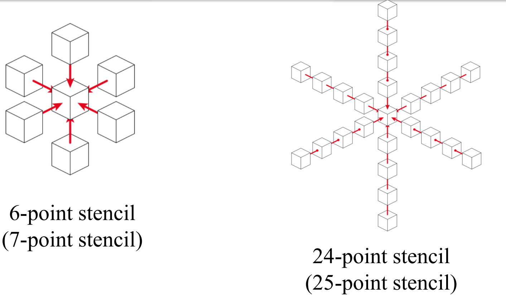
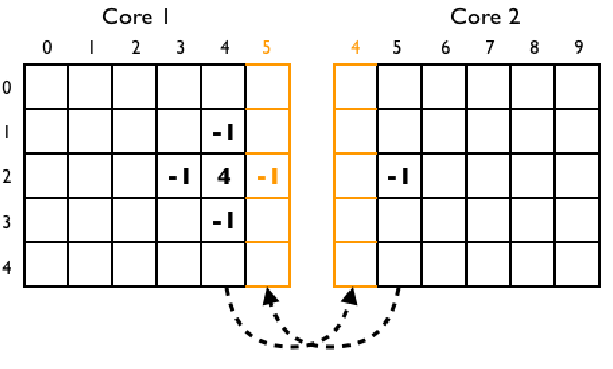
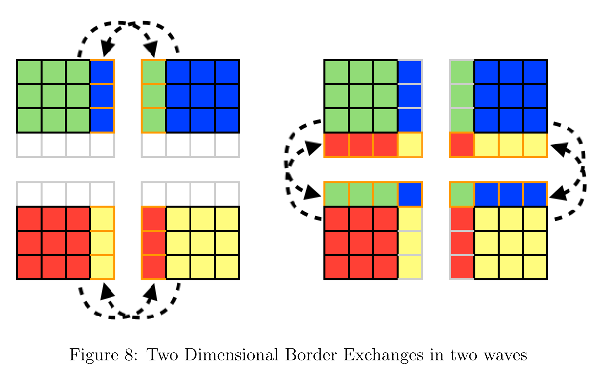
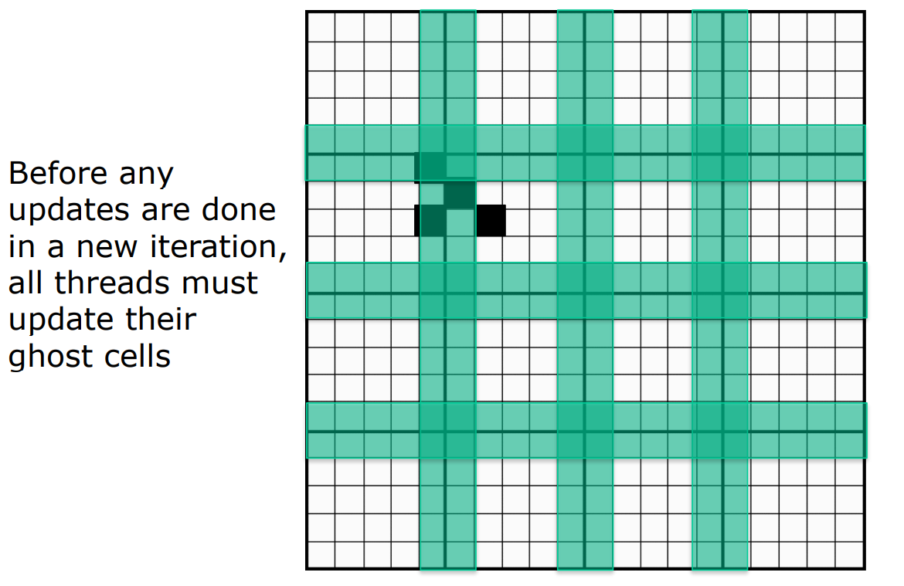
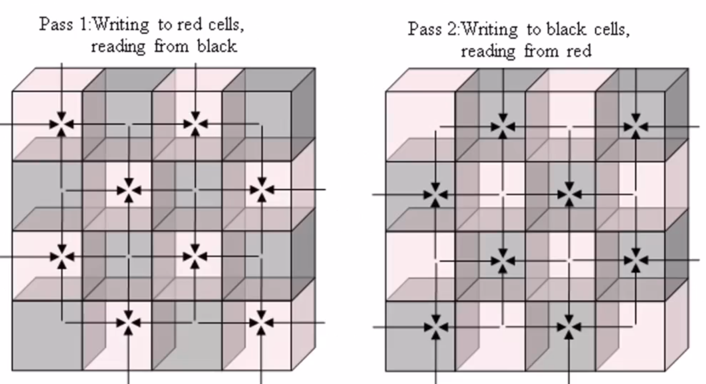
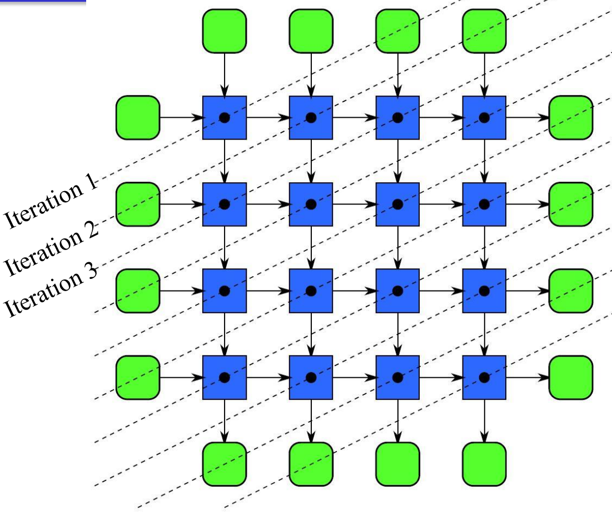
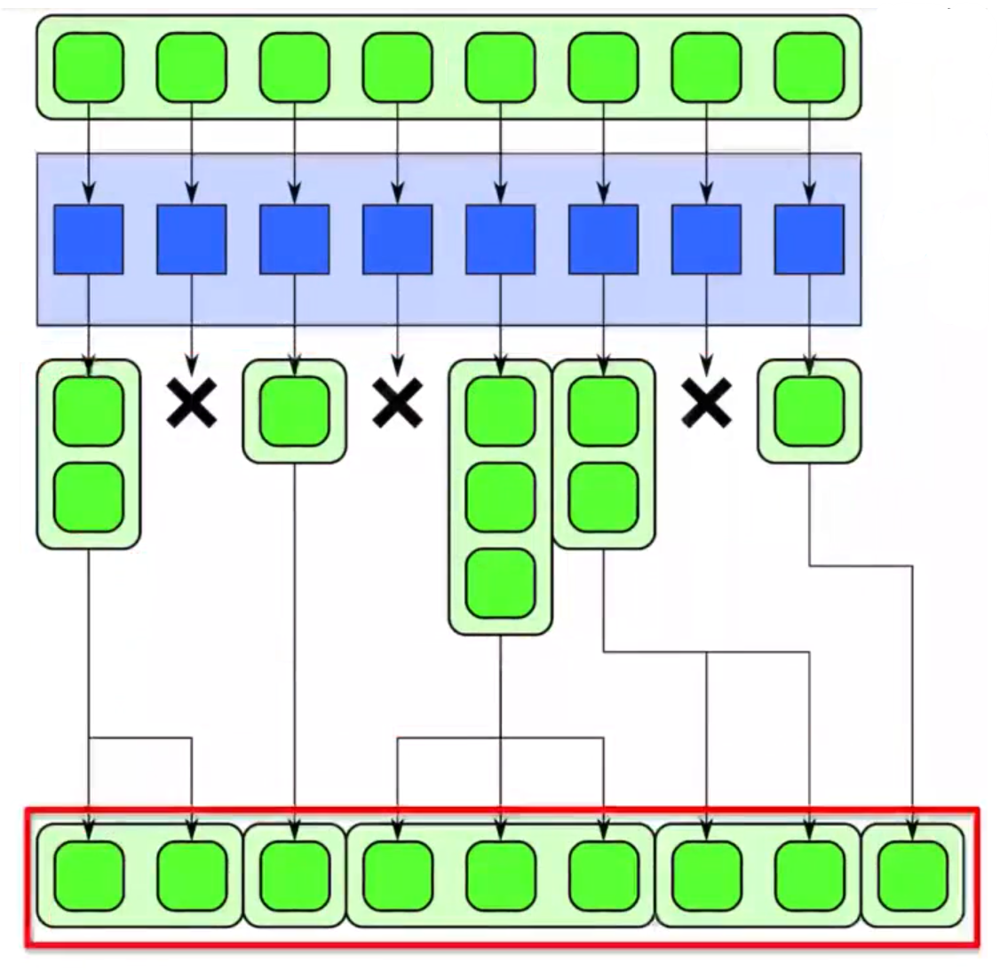

# Parallel Patterns

A Parallel Pattern is a recurring combination of task distribution and data access that solves a specific problem in parallel algorithm design. Patterns are universal, they can be used in any parallel programming system.
Parallel patterns will be classified under these macro-classes: 

- nesting pattern
- parallel control patterns 
- parallel data management patterns
- other patterns

## Nesting Pattern

{width=50%}

## Parallel control patterns 

Recap of **Serial** Control Patterns: 
- sequence pattern
- iteration pattern 
- selection pattern 
- recursion pattern 

### Fork-Join pattern 

{width=50%}

The fork-join pattern is a common parallelization technique used to decompose a sequence pattern into smaller subproblems that can be solved in parallel. The basic idea is to split the original problem into multiple tasks and then combine the results of these tasks to obtain the final solution. 

### Map 

Generally it's difficult to extract parallelism from loops, but we can always do some analysis and find out something. We can parallelize this serial pattern using a map. Obviously only when each iteration is independent of others. 

{width=50%} 

### Stencil

An generalization of the map: a stencil is a function which accesses a set of "neighbors": the neighbors are a set of cells obtained by a fixed "offsets/distance" relative to the output position. Stencils can operate on one dimensional and multidimensional data so the neighborhoods can range from compact to sparse, square to cube, and anything else.

{width=50%} 

{width=50%}

#### Stencil and ghost cells. 

{width=50%}

Since computing the value of each point requires the values of other points these computations are **not** embarrassingly parallel. Specifically, the points at the borders of a chunk require the values of points from the neighboring chunks. 
In order to apply the stencil operation consistently to all points in a computational domain, additional space is allocated for a series of **ghost cells** around the edges of each chunk. These ghost cells form a **halo** around each chunk, containing replicates of the borders of all immediate neighbors. 
**The ghost cells are not updated locally, but provide the necessary stencil values when updating the borders of the chunk.**

{width=50%} 

{width=50%}

The use of ghost cells in stencil parallel applications can improve the accuracy and efficiency of computations but also involves a **trade-off** between **computation** and **communication**. 

{width=50%}

The ghost cells to total cells ratio will rapidly increase causing a greater demand on memory if we increase the number of threads. 

#### Possible optimizations in Stencil pattern

- We could double or triple our **ghost cell boundary**: we do **extra computation** and we reduce the number of border exchanges, decreasing the associated communication overhead. This allows us to perform several iterations without stopping for a ghost cell update.
- Cache optimizations are based on assumptions over cache organization: for example we can assume that rows of a 2D array are contiguous in memory. This means that horizontally related data will tend to belong to the same cache line while vertical offset accesses will most likely result in cache misses.Because of this, we can implement stencil as a series of shift of data: vectorize and shift. Very used for one dimensional stencils and based on the concept of memory-contiguous. 
- **Strip-mining** is an optimization which is based on considerations over cache lines: dividing the overall grid of data that needs to be processed into smaller **strips** can reduce redundant memory accesses and aligns memory accesses with cache lines. 
- A possible **latency hiding** could be to compute interior of stencil while waiting for ghost cell updates.
- In some specific cases (iterative codes in computer simulations of physical systems) **SOR**, or **Successive Over-Relaxation**, could be useful. **Red/Black SOR** is a variant of the SOR method that uses a special ordering of the grid points to speed up the process. Fully parallelizable since in the first step we only read from black and we write on red. Vice versa on second step. We actually "predict" the values of the next iteration when we are in a step...but at least they are completely parallelizable. It consists on an **interpolation** and **approximation**.

{width=20%}

### Reduction 

Reduction combines every element in a collection using an associative function. Why associative? The associative property allows us to ''split'' and change the order of operations of the reduction. addition, multiplication, maximum, minimum and boolean AND, OR, XOR are associative. 

{width=20%} 

Even a single processor can perform ''vectorization". For example without doing any parallelization we can still have a speed up because we can make an operation with 2 elements in a cycle (so we have speedup of 2): 

{width=20%}

In case of multiple 

Reduce example is the dot product is an essential operation in physics, graphics and videogames. 

### Scan

Scan computes all partial reductions of a collection. If the function being used is associative, the scan can be parallelized: it's not obvious at first, because of the dependencies to previous iterations.

{width=30%} 

Two types of scan:

- Inclusive scan: includes current element in partial reduction. 
- Exclusive scan: excludes current element in partial reduction, partial reduction is of all prior elements prior to current element.

### Recurrence 

The recurrence parallel pattern is a more complex version of the map parallel pattern, in which the loop iterations can depend on one another. This means that, unlike in the map pattern, the elements of the input data are not necessarily independent of each other, and the outputs of some elements may be used as inputs to other elements. As a result, the order in which the elements are computed may be important, and the pattern typically involves the use of a serial ordering to ensure that the elements can be computed correctly.
This pattern is used to structure the parallel execution of code that involves recursion. 

This can still be parallelized! ❑ Trick: find a plane that cuts through grid of intermediate result

{width=50% }

## Parallel Data Management Patterns

Serial Data Management Patterns are the classical ones: 

- stack allocation
- heap allocation
- objects 
- random read and write

### Geometric decomposition

Geometric Decomposition is a common pattern to arrange data into subcollections (chunks) which can be overlapped or not. This pattern doesn't necessarily move data, it just gives us another view of it

 

### Gather

We would have to keep data ''local'' and closer to the CPU since performance is often more limited by data movement than by computation. Transferring data across memory layers is costly: can take many cycles. 
Gather reads a collection of data given a collection of indices. Think of a combination of map and random serial reads. The output collection shares the same type as the input collection, but it share the same shape as the indices collection. 

**Read locations provided as input**. 

### Scatter

"combination of map with random writes" . "write locations provided as input"

Scatter is the inverse of gather A set of input and indices is required, but each element of the input is written to the output at the given index instead of read from the input at the given index

This is different from Gather! Race conditions because write of same location are possible. Race conditions can occur when we have two writes to the same location!

**Write locations provided as input**. 

In case of collision we can have some rules like: 

- in case of associative and commutative operators can merge colliders. 
- we could associate to each value a priority. Example of this case in 3D graphics rendering. 
- In case there aren't collisions the output is just a permutation, so no problem. 

### Pack 

Pack is used to eliminate unused space in a collection. Elements marked false are discarded, the remaining elements are placed in a contiguous sequence in the same order.

### Split, bin, unsplit

 

Generalization of **pack** pattern, where the isn't information lose (like pack). 

There is also the **Bin** parallel pattern which is the generalization of split: simply split which support more categories. 

There is also the ''inverse operation'' the unsplit. 

### Pipeline

Pipeline connects tasks in a producer-consumer manner, which is very common. A linear pipeline is the basic pattern idea, but a pipeline in a DAG is also possible. Pipelines are most useful when used with other patterns as they can multiply available parallelism.

## Other Patterns 

- Expand: a combination of pack and map. 
	{width=20%} 
- Superscalar Sequences: write a sequence of tasks, ordered only by dependencies 
- Futures: similar to fork-join, but tasks do not need to be nested hierarchically 
- Speculative Selection: general version of serial selection where the condition and both outcomes can all run in parallel 
- Workpile: general map pattern where each instance of elemental function can generate more instances, adding to the "pile" of work
- Search: finds some data in a collection that meets some criteria
- Segmentation: operations on subdivided, nonoverlapping, non-uniformly sized partitions of 1D collections
- Category Reduction: Given a collection of elements each with a label, find all elements with same label and reduce them

## Part to revise 

The key to parallelism is independence. Map function should be ''pure'' and should not modify shared states, this means perfect independence and determinism, no data-races and no segfaults. 

Maps are very useful. Can sometimes "fuse" together the operations to perform them at once Adds arithmetic intensity, reduces memory/cache usage Ideally, operations can be performed using registers alone

Common strategy: 

1) Divide up the computational domain into sections 2) Work on the sections individually 3) Combine the results.

Possible methods: 

- Divide-and-conquer - Fork-join - Geometric decomposition - Partitions: data divided into non-overlapping equal-size regions - Segmentations: data divided into non-overlapping **not-uniform** regions

# Different way to store things in a parallizable way 

#### Array of structures AoS

an array containg the different instances of a data structure Most logical data organization layout. Extremely difficult to access memory for reads (gathers) and writes (scatters). 

#### Structure of arrays SoA

A single data structure that collects all the instances using many arrays: a single array for each property/attribute of a data structure. In each property/attribute array is stored all the values of all the different instances. Typically better for vectorization and avoidance of false sharing. Separate arrays for each structure-field, keeps memory access contiguous when vectorization is performed over structure instances. 

 

The padding at the end indicates which is the size of a data structure. 

