# Parallel Patterns

A Parallel Pattern is a recurring combination of task distribution and data access that solves a specific problem in parallel algorithm design. Patterns are universal, they can be used in any parallel programming system.

Serial Control Patterns are the classical ones: 
- sequence pattern
- iteration pattern 
- selection pattern 
- recursion pattern 

While the parallel patterns will be classified under these macro-classes: 

- nesting pattern
- parallel control patterns 
- parallel data management patterns
- other patterns

## Nesting Pattern

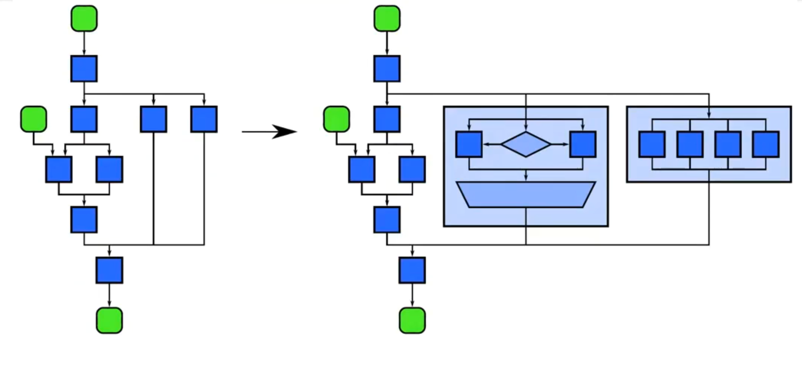{width=50%}

## Parallel control patterns 

### Fork-Join pattern 

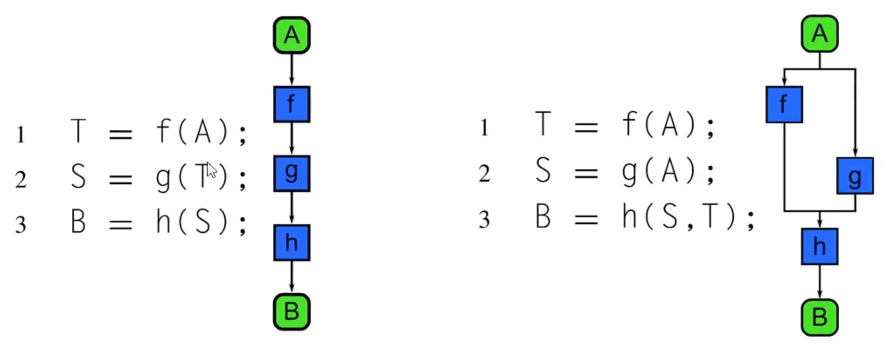{width=50%}

We can replace sequence patterns into '' fork-join '' pattern. 

## Map 

Generally it's difficult to extract parallelism from loops, but we can always do some analysis and find out something. We can parallelize this serial pattern using a map. Obviously only when each iteration is independent of others. 

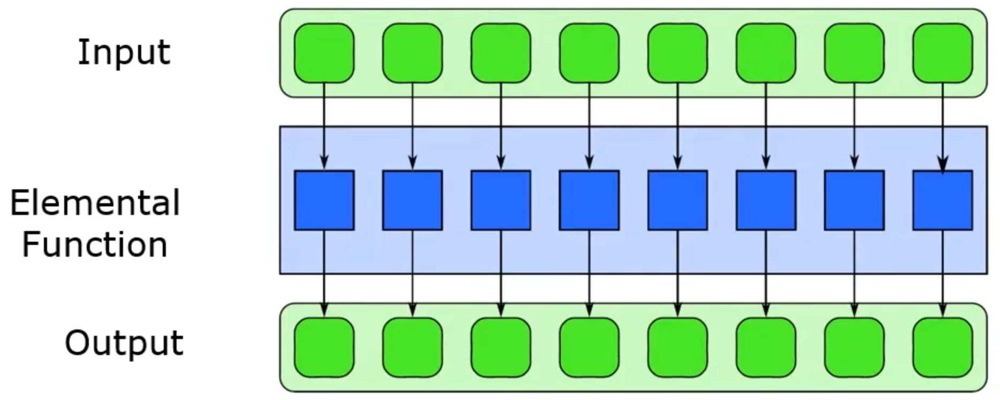 

## Stencil

An generalization of the map is called ''stencil'' : a stencil is an elemental function which accesses a set of "neighbors". Stencil is used with iterative solvers or to evolve a system through time. 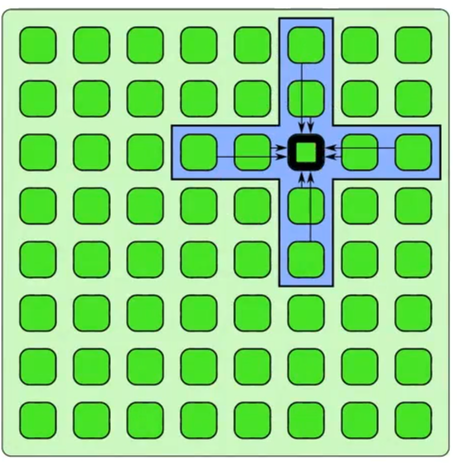{width=20%} 

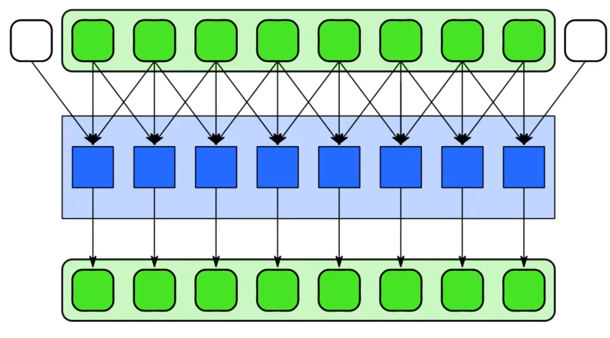

A stencil pattern is a map where each output depends on a' eighborhoo ' of inputs These inputs are a set of fixed offsets relative to the output position A stencil output is a function of a "neighborhood" of elements in an input collection Applies the stencil to select the inputs Data access patterns of stencils are regular Stencil is the "shape" of "neighborhood" Stencil remains the same

Very used in parallel computing. 

Stencils can operate on one dimensional and multidimensional data Stencil neighborhoods can range from compact to sparse, square to cube, and anything else! It is the pattern of the stencil that determines how the stencil operates in an application

2d - 3d dimensional stencils are all possible. 

Iterative codes are ones that update their data in steps At each step, a new value of an element is computed using a formula based on other elements Once all elements are ypdatedg the computation proceeds to the next step or completes Iterative codes are most commonly found in computer simulations of physical systems for scientific and engineering applications Computational fluid dynamics Electromagnetics modeling They are often applied to solve partial differential equations Jacobi iteration Gauss-Seidel iteration ##### Successive over relaxation <- very interesting to parallize. The idea is to find a pattern in how to divide the input to parallize part of the input. 

#### shift implementation: One possible implementation of the stencil pattern includes shifting the input data For each offset in the stencil, we gather a new input vector by shifting the original input by the offset amount

instead of do all the operations together, we just make on thing at time. 

#### Stencil and cache optimization 

Assigning rows to cores: 

- Maximizes horizontal data locality - Assuming vertical offsets in stencil, this will create redundant reads of adjacent rows from each core 

Assigning columns to cores: 

- Redundantly read data from same cache line - Create false sharing as cores write to same cache line

Assigning "strips" to each core can be a better solution in width : an optimization in a stencil computation that groups elements in a way that avoids redundant memory accesses and aligns memory accesses with cache lines. 

this to avoid problem cache sharing between multiple processors. 

Stencil and communication optimizations (ghost cells)

 

green cells are called ghost cells for thread that computes the considered cell. 

Things to consider... What might happen to our ghost cells as we increase the number of threads? • the ghost cells to total cells ratio will rapidly increase causing a greater demand on memory What would be the benefits of using a larger number of ghost cells per thread? Negatives? • in the Game of Life example, we could double or triple our ghost cell boundary, allowing us to perform several iterations without stopping for a ghost cell update

Halo: set of all ghost cells Halo must contain all neighbors needed for one iteration Larger halo (deep halo) Trade off ons and more independence, but... • more redundant computation and more memory used Latency Hiding: Compute interior of stencil while waiting for ghost cell updates

Recurrence paralization 

This can still be parallelized! Trick: find a plane that cuts through grid of intermediate results Previously computed values on one side of plane Values to still be computed on other side of plane Computation proceeds perpendicular to plane through time (this is known as a sweep) This plane is called a separating hyperplane

Only if the recurrencies depends on constant offset of cells. 

Conclusion 92 Examined the stencil and recurrence pattern Both have a regular pattern of com unication and data access In both patterns we can convert a set of offset memory accesses to shifts Stencils can use strip-mining to optimize cache use C) Ghost cells should be considered when stencil data is distributed across different memory spaces

## Reduction 

Reduction combines every element in a collection using an associative function. Why associative? The associative property allows us to ''split'' and change the order of operations of the reduction. addition, multiplication, maximum, minimum and boolean AND, OR, XOR are associative. 

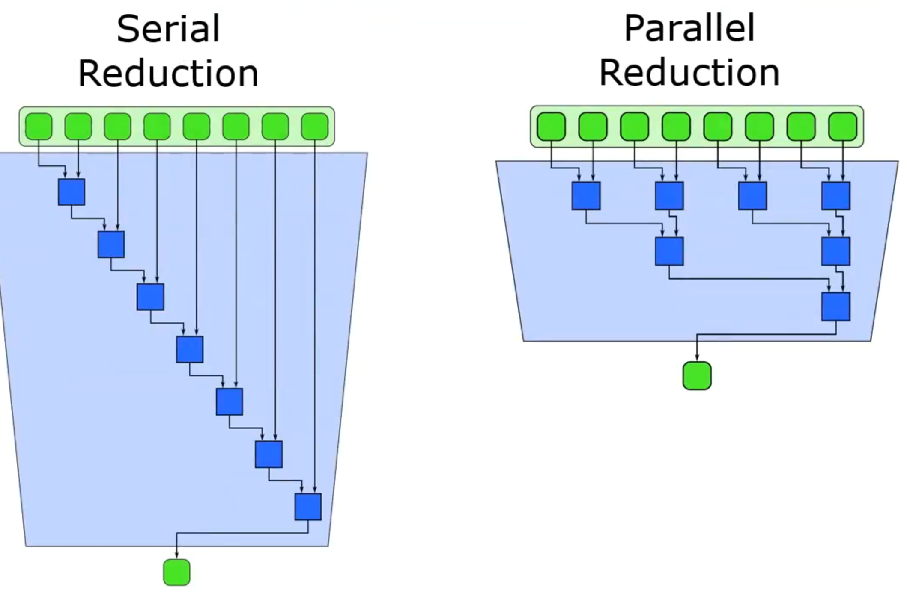{width=20%} 

Even a single processor can perform ''vectorization". For example without doing any parallelization we can still have a speed up because we can make an operation with 2 elements in a cycle (so we have speedup of 2): 

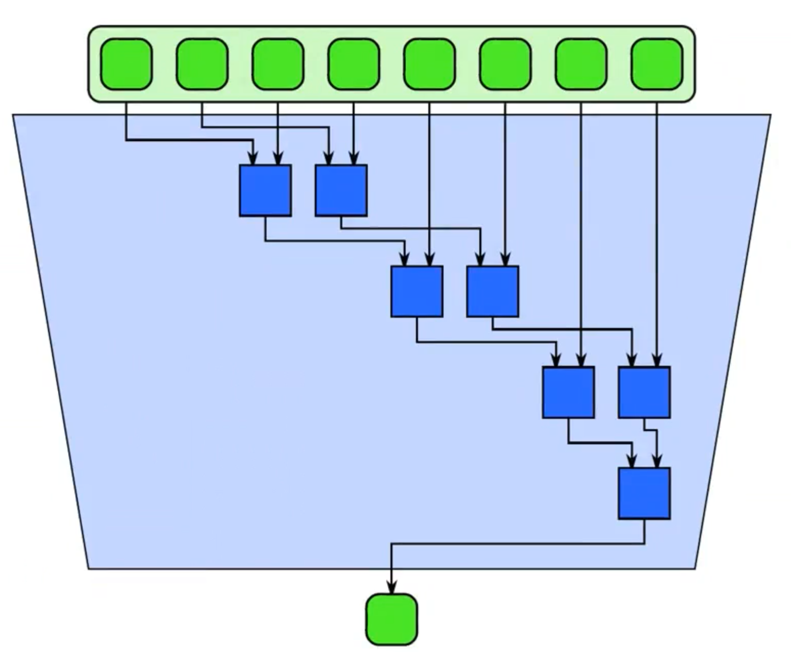{width=20%}

In case of multiple 

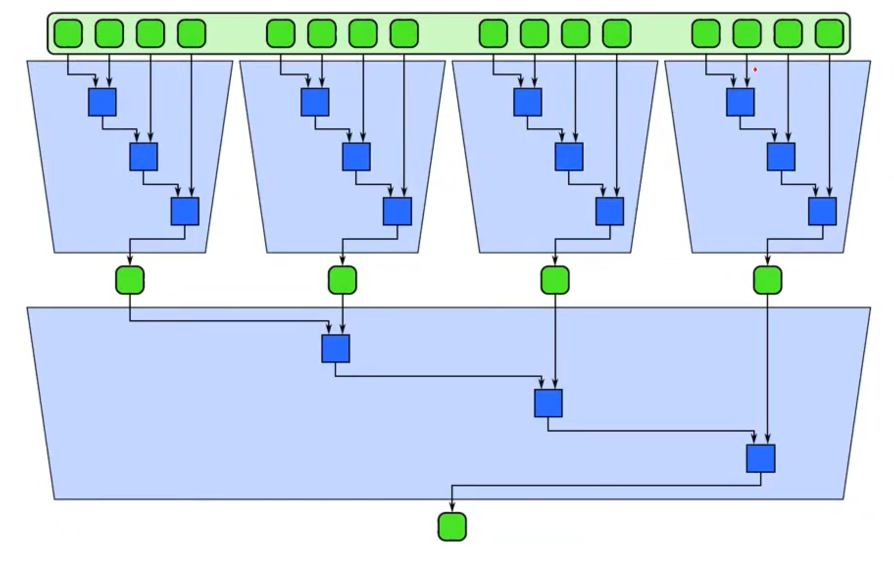

Reduce example is the dot product is an essential operation in physics, graphics and videogames. 

## Scan

computes all partial reduction of a collection For every output in a collection, a reduction of the input up to that point is computed If the function being used is associative, the scan can be parallelized Parallelizing a scan is not obvious at first, because of dependencies to previous iterations in the serial loop A parallel scan will require more operations than a serial version

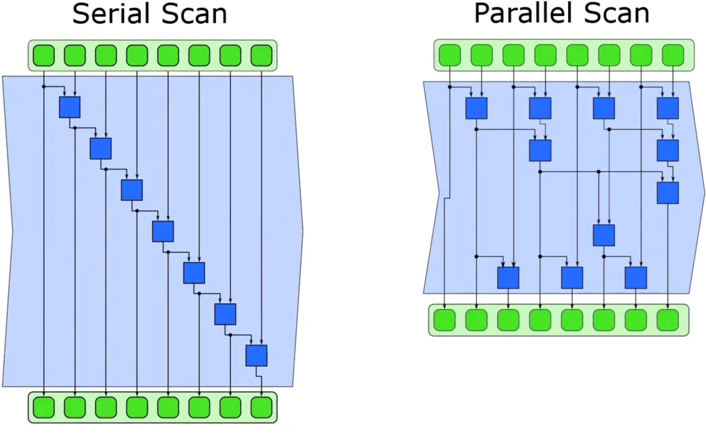{width=20%} 

- Inclusive scan: includes current element in partial reduction - Exclusive scan: excludes current element in partial reduction, partial reduction is of all prior elements prior to current element

### Recurrence 

Recurrence : More complex version of map, where
the loop iterations can depend on one another

Similar to map, but elements can use outputs of
adjacent elements as inputs

For a recurrence to be computable, there must be
a serial ordering of the recurrence elements so
that elements can be computed using previously
computed outputs

The recurrence parallel pattern is a control pattern used in parallel programming. This pattern is used to structure the parallel execution of code that involves recursion, which is a type of repetitive process in which a function calls itself with a modified input in order to produce a result. The recurrence parallel pattern typically involves splitting the input data into smaller pieces, and then using multiple threads or processes to recursively compute the result for each of these pieces in parallel. This allows the computation to be performed more efficiently by leveraging the parallelism of the hardware.

Overall, the recurrence parallel pattern is a useful tool for improving the performance of recursive algorithms in parallel environments. It allows the parallel execution of recursive computations to be easily structured and managed, which can lead to significant performance improvements in many cases.

## Serial and Parallel Data Management Patterns

Parallel data management patterns: 

Pack is used to eliminate unused space in a collection Elements marked false are discarded, the remaining elements are placed in a contiguous sequence in the same order Useful when used with $\text{map}$ . 

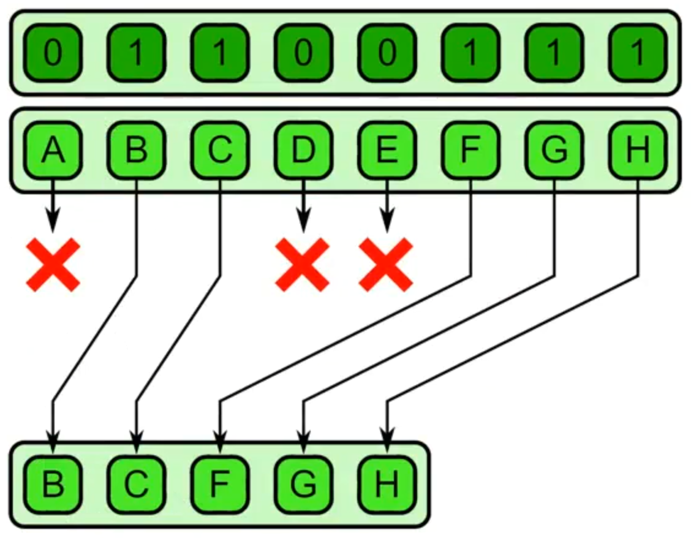

Unpack is the inverse and is used to place elements back in their original locations. 

### pipeline

Pipeline connects tasks in a producer-consumer manner, which is very common. A linear pipeline is the basic pattern idea, but a pipeline in a DAG is also possible. Pipelines are most useful when used with other patterns as they can multiply available parallelism.

### geometric decomposition

Geometric Decomposition - arranges data into subcollections Overlapping and non-overlapping decompositions are possible This pattern doesn't necessarily move data, it just gives us another view of it

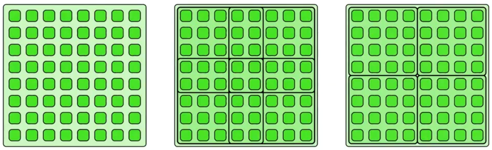 

### Gather

We would have to keep data ''local'' and closer to the CPU since performance is often more limited by data movement than by computation. Transferring data across memory layers is costly: can take many cycles. 

Gather reads a collection of data given a collection of indices. Think of a combination of map and random serial reads. The output collection shares the same type as the input collection, but it share the same shape as the indices collection. 

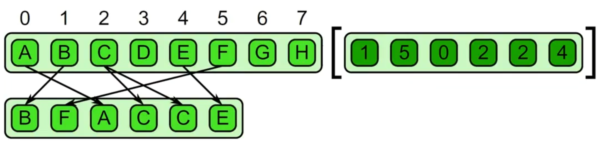

"combination of map with random reads" . "read locations provided as input"

### Scatter

"combination of map with random writes" . "write locations provided as input"

Scatter is the inverse of gather A set of input and indices is required, but each element of the input is written to the output at the given index instead of read from the input at the given index

This is different from Gather! Race conditions because write of same location are possible. Race conditions can occur when we have two writes to the same location!

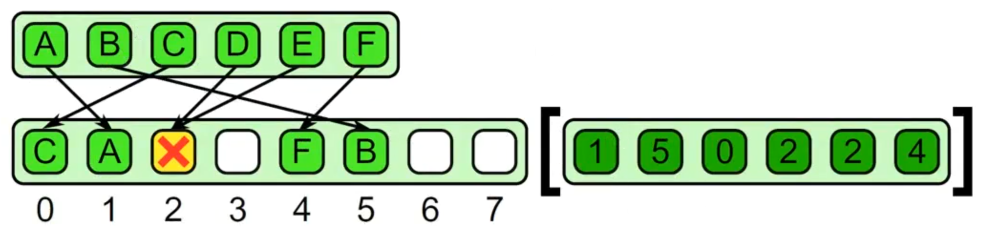

In case of collision we can have some rules like: 

- in case of associative and commutative operators can merge colliders. - we could associate to each value a priority. Example of this case in 3D graphics rendering. 

In case there aren't collisions the output is just a permutation, so no problem. 

# Split

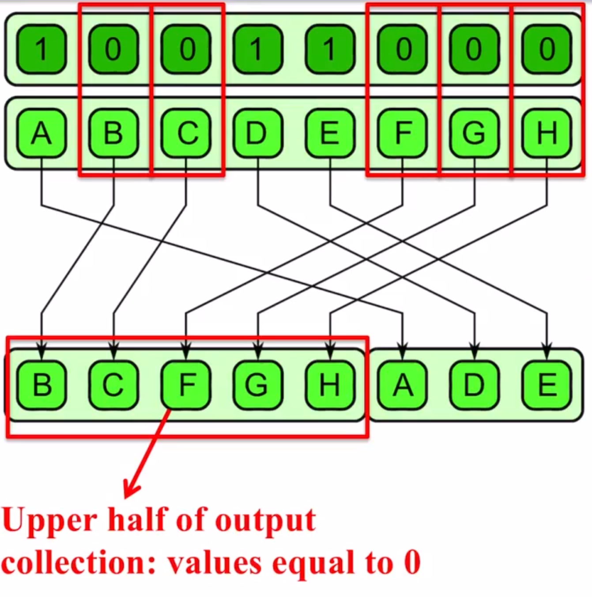 

Generalization of pack pattern, where the isn't information lose (like pack). 

There is also the ''inverse operation'' the unsplit. 

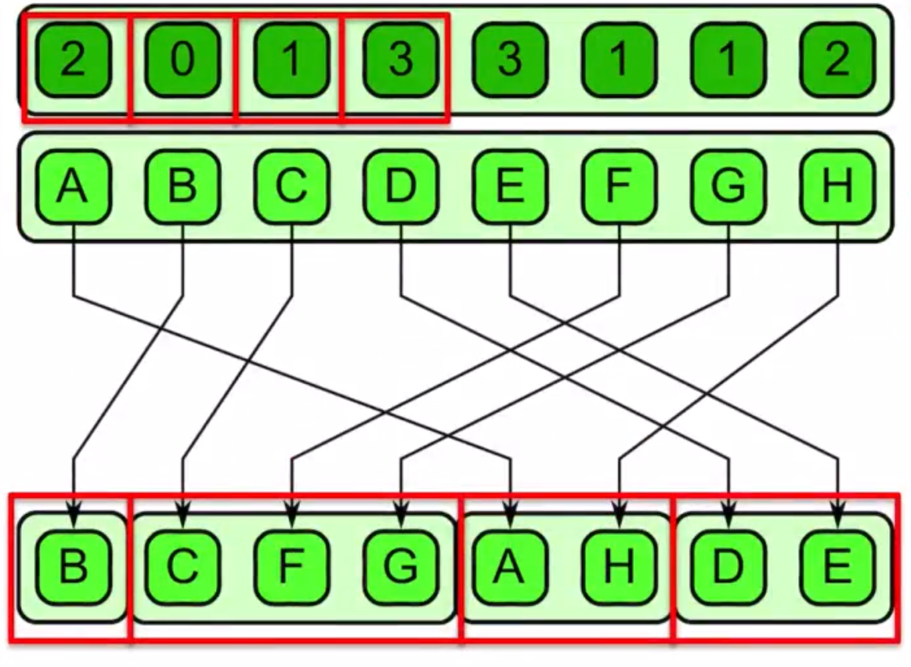

generalization of split with "many classes''. Examples of this is Radix Sort or pattern classification (to classify values).

### Other Patterns 

- Superscalar Sequences: write a sequence of tasks, ordered only by dependencies - Futures: similar to fork-join, but tasks do not need to be nested hierarchically - Speculative Selection: general version of serial selection where the condition and both outcomes can all run in parallel - Workpile: general map pattern where each instance of elemental function can generate more instances, adding to the "pile" of work - Search: finds some data in a collection that meets some criteria - Segmentation: operations on subdivided, nonoverlapping, non-uniformly sized partitions of 1D collections - Expand: a combination of pack and map - Category Reduction: Given a collection of elements each with a label, find all elements with same label and reduce them

The main concept of the map is that " I can apply the operation to each element of the collection without dependencies between the elements. 

The key to parallelism is independence. Map function should be ''pure'' and should not modify shared states, this means perfect independence and determinism, no data-races and no segfaults. 

Maps are very useful. Can sometimes "fuse" together the operations to perform them at once Adds arithmetic intensity, reduces memory/cache usage Ideally, operations can be performed using registers alone

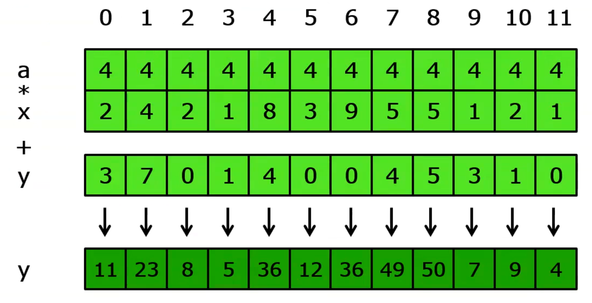

Common strategy: 

1) Divide up the computational domain into sections 2) Work on the sections individually 3) Combine the results.

Possible methods: 

- Divide-and-conquer - Fork-join - Geometric decomposition - Partitions: data divided into non-overlapping equal-size regions - Segmentations: data divided into non-overlapping **not-uniform** regions

# Different way to store things in a parallizable way 

#### Array of structures AoS

an array containg the different instances of a data structure Most logical data organization layout. Extremely difficult to access memory for reads (gathers) and writes (scatters). 

#### Structure of arrays SoA

A single data structure that collects all the instances using many arrays: a single array for each property/attribute of a data structure. In each property/attribute array is stored all the values of all the different instances. tipically better for vectorization and avoidance of false sharing. Separate arrays for each structure-field, keeps memory access contiguos when vectorization is performed over structure instances. 

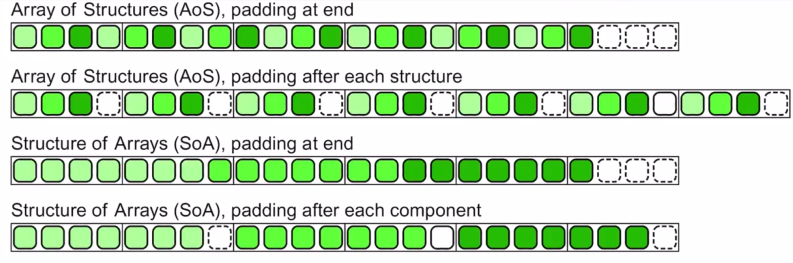 

The padding at the end indicates which is the size of a data structure. 

