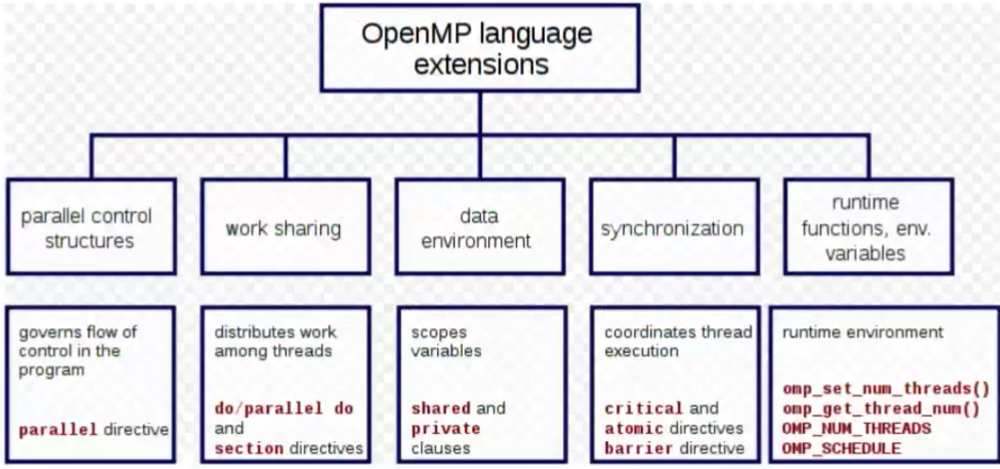

# OpenMP 

OpenMP is an API for multi-platform shared memory multiprocessing programming. 
OpenMP uses a fork-join model, where a master thread forks a specified number of slave threads (so there is a hierarchy of threads). The programmer can define a scheduling policy for the tasks. OpenMP provides directives to spawn threads, assign tasks, and manage synchronization. Variables defined outside a parallel region are visible to all threads in the team, while variables defined inside are private to each thread unless otherwise specified. 

Note that OpenMP is an abstraction layer that provides a high-level interface for specifying parallelism, but the actual implementation of the parallelism may vary depending on the compiler and the target platform.

````Cpp
//this:
#pragma omp parallel num_threads(8) {...}
//might become: 
for(i=0;i<8;i++){
	pthread_create (...);
}   
for(i=0;i<8;i++){
	pthread_join (...);
}  
````

Under the hood, a compiler that supports OpenMP may replace the OpenMP directives with code that uses another programming model, such as Pthreads, to implement the parallelism.
For this it's also important to know that if the compiler does not support OpenMP, the directives will be treated as comments and ignored. This is because OpenMP directives are preprocessor directives, and they are only processed by the compiler if the compiler supports OpenMP. 
Nested parallelism is also possible in OpenMP, where a team of threads can create its own sub-teams of threads to perform additional parallel tasks.


## Overview of OpenMP

 


### Clauses 

In OpenMP, clauses are used within directives to control how the directive behaves. For example, the `private` clause can be used to make a variable private to each thread, and the `schedule` clause can be used to control loop iteration distribution among threads. There are many different types of clauses that can be used to control various aspects of behavior, such as thread scheduling, memory allocation, and synchronization.

### Directives

The directives allow the programmer to specify which loops and regions of code can be executed concurrently by multiple threads.

````cpp 
#pragma omp <name> [list of clauses]
````
 
Preprocessor directives called pragma (pragmatic information). 

## Main directives 

### Parallel directive

````Cpp
#pragma omp parallel [clause, ...] 
{
/* parallel section */ 
}
````
The main thread spawns a team of slave threads and becomes the master (thread number 0 in the within the team.
Some important clauses that can be used with this directive are:

- `if(condition)`: This clause allows to specify a condition that must be satisfied in order for the region of code to be executed in parallel. 
````cpp
#pragma omp parallel if(n > 1)
{
    // Code to be executed in parallel
}
````

- `num_threads(n)`: This clause specifies the number of threads that should be spawned to execute the code in the parallel region. If this clause is not used, the number of threads will be determined by the OpenMP runtime.
````cpp
#pragma omp parallel num_threads(4)
{
    // Code to be executed in parallel by 4 threads
}
````

- `default(shared|none)`: This clause specifies the default data scope for variables in the parallel region. If `default(shared)` is used, all variables in the region will be shared by default, meaning that they can be accessed and modified by all threads. If `default(none)` is used, no variables will be shared by default, and the programmer must explicitly specify which variables should be shared using the `shared` clause. For example:

````cpp
#pragma omp parallel default(shared)
{
    // All variables are shared by default
}
````

- `reduction(operator:list)`: This clause is used to specify a reduction operation, which combines the values of a variable computed by multiple threads into a single result. The `operator` specifies the reduction operator (e.g. `+`, `*`, `min`, etc.), and `list` is a list of variables that should be reduced. For example:
````cpp
#pragma omp parallel for reduction(+:sum)
for (int i = 0; i < n; i++)
{
    sum += a[i];
}
````
In this example, the `reduction` clause specifies that the values of the `sum` variable computed by each thread should be added together to produce the final result. This can be more efficient than having each thread update a shared `sum` variable, as it avoids the need for synchronization.

The number of threads in a parallel region is determined evaluating the following factors, in order of precedence:  

- Evaluation of the ```if``` clause: obviously if it's false, no threads will be instanced 
- Value of the ```num_threads``` clause 
- Use of the ```omp_set_num_threads()``` library function 
- Setting of the ```OMP_NUM_THREADS``` environment variable
- Implementation default, example the number of CPUs on a node.

### For directive

````C++
#pragma omp for [clauses...]  
<for_loop>
```` 

Parallelize execution of iterations of the cycle with the assumption that iterations number are static (they are not modified during runtime) and there are no data dependencies in the loop. 
Most important clauses: ```schedule (type [ , chunk])``` describes how iterations of the loop are divided among the threads in the team:
````Cpp
#pragma omp for schedule (type [ ,chunk]) 
<for_loop>   
````

Where:
- `type` specifies the type of scheduling to be used:
	- `static`: specifies that iterations should be divided into equal-sized chunks. Eventually it is possible to divide into chunks of size `chunk` using the respective field.
	- `dynamic`: the loop iterations dynamically scheduled among threads. The default chunk size is 1 but you can specify.
- `chunk` specifies the size of the chunk of iterations that should be assigned to each thread.

````Cpp
#pragma omp for schedule(static, 10)
for (int i = 0; i < n; i++) {
  // loop body
}
````


### Sections

The directive to achieve MIMD parallelism of the application. Closed sections of code that are divided among the threads and executed concurrently. 

````CPP
#pragma omp sections [clause...]   
	#pragma omp section   
		{ / * code section 1 * / }   
	#pragma omp section   
		{ / * code section 2 * / }
````


### Single and master directive

````CPP
#pragma omp single [clauses...]
{ / * code section   * / } 

#pragma omp master   
{ / * code section   * / } 
````

```single``` specifies that a section of a code is executed only by a single thread; the choice on the thread is implementation dependent. 
```master``` specifies that a section of a code is executed only by the master thread, no implied barrier at the end. 

### Critical Directive

````cpp
#pragma omp parallel
{
  // instructions to be executed by each thread

  // critical directive
  #pragma omp critical
  {
    // instructions to be executed by one thread at a time
  }

  // after the critical section
}

````

The critical directive specifies a region of code that must be executed by only one thread at time. The name is used as as global identifier. Different critical sections with the same name are considered as the same region. It's a concept very similar to the mutex stuff.


### Barrier directive

````cpp
#pragma omp parallel
{
  // instructions to be executed by each thread

  // barrier directive
  #pragma omp barrier

  // instructions to be executed by each thread after the barrier
}
````

It's a directive used to synchronized all threads. All threads will wait the others before proceed over the barrier. 


### Atomic directive

````cpp
#pragma omp parallel
{
  // instructions to be executed by each thread

  // atomic directive
  #pragma omp atomic
  shared_variable += 1;

  // instructions to be executed by each thread after the atomic operation
}
````

The atomic directive enforces atomic access to a specific storage location. Different aspects of the statements are performed atomically depending on the clauses: ```read``` , ```write``` , ```update``` are possible clauses. 


The OpenMP Data Scope Attribute Clauses are used to explicitly define how variables (shared by default) should be scoped. 

### Scope of variables <= important

- private: ```#pragma omp <name> private (list)``` to have vars private for each thread. Each variable is uninitialized, we need ```firstprivate``` to specify that each var is initialized with the value of the variable, because it exists before the parallel construct. ```lastprivate``` specifies that the "final" variable is set equal to the private version of the thread which executes the final iteration or last section. 
- shared 
- reduction: ```#pragma omp <name> reduction (operator: list)``` in a loop this kind of variables aggregates a value that depends on each iteration of the loop but not by their order. Possible operators are: ```+ * - ^  &&  || min max``` . 

### Task directive 

 The task directive is another work-sharing specifies a work unit which may be executed or deferred to another thread in the same team Tasks are composed of code + data environment Data are initialized at creation time Each thread encountering the pragma in its dynamic scope creates a task Tasks execution can be tied (default) or untied to the thread that created the task using the dedicated clause 
 
````cpp
#pragma omp task [clause, ...]  
{  /* structured block */ }
````

The depend clause enforces constraints on the scheduling of tasks by modeling data dependencies:

````cpp
#pragma omp task depend (dependence—type: locator-list)   
{ /* structured block */ }
````

The tasks are put into a task pool and picked by idle threads. Using dependencies we can explicit an execution order. 

````cpp
#pragma omp taskwait  //barrier for tasks completion
#pragma omp taskyield //used inside a task, interrupts execution 
````

### extra stuff

- ```void omp_set_num_threads (int num threads)``` Sets the number of threads that will be used in the next parallel region 
- ```double omp_get_wtime()``` Provides a wall clock timing routine, use it in pairs to see how much time passes between calls 
- ```double omp_get_wtick()``` Returns the precision of the timer used by the previous function.


