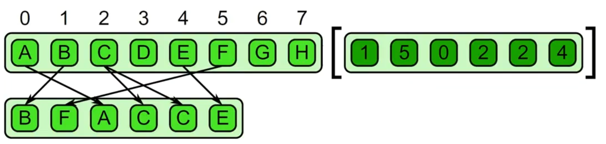

 Why parallel programming? 

- time saving
- money saving 
- basically the ''big problems'' can only solved by parallel algorithms 

There is also automatic parallelization: where sequential algorithms (at high level code) are automatically parallelized in high efficiency assembly instructions. 

The compiler is not able to know if for example 2 pointers of 2 arrays are pointing different region of RAM and are not overlapping.
Complete automatic
parallelization is (at the
moment?) not feasible

Tools are not able to
extract all the available
parallelism from a
specification designed
to be executed in
sequential way

at the moment Parallelization by hand. The programmer needs to give hints to the tools...
There are three critical aspects:
Which
type
of parallelism has to be considered
How to
design
the parallel algorithm
•
Trying to parallelize existing sequential
algorithms
•
From scratch
How to
provide information
about the
parallelism to the tools

There is not a single kind of parallelism:
Instruction Parallelism
Data Parallelism
- combination of them 

single instruction, single data (all the single core architectures)
single instruction, multiple data (most of the modern GPUs)
multiple instruction, single data (experimental)
multiple instruction, multiple data (pthread or running in parallel on different data)

We can classify parallelism over different levels:

- bits level: It is very relevant in Hardware Implementation of
algorithm. 
- instructions level: Different instructions executed at the same time on the same core. Supported by multiple execution units, pipeline, vector, SIMD units etc. This type of parallelism can be easily extracted by
compilers
- tasks level: Task: a logically discrete section of computational work. Typically a program or program like set of instructions that is executed by a processor supported by shared memory and cache mechanisms. Usually difficult to be automatically extracted. 

Design a «good» parallel algorithm by extracting
all the available parallelism is not enough
not
all the extracted parallelism is
exploitable
on a real architecture

We need to consider which parallelism is available
on the considered architecture
Non suitable parallelism can introduce
overhead

Real architectures differ so much that now
compilers are not able to fill the gap between an
abstract model and real implementation
Optimized applications can not be generated
starting from generic parallel code
Code extensions have been specialized for
particular types
of applications/architectures

$$\begin{array}{|c|c|c|c|}
\hline \text { TECHNOLOGY } & \text { TYPE } & \text { YEAR } & \text { AUTHORS } \\
\hline \text { Verilog/VHDL } & \text { Languages } & 1984 / 1987 & \text {US Government }\\
\hline \text { MPI } & \text { Library } & 1994 & \text {MPI Forum}\\
\hline \text { PThread } & \text { Library } & 1995 & \text {IEEE}\\
\hline \text { OpenMP } & \text { C/Fortran Extensions } & 1997  & \text {OpenMP}\\
\hline \text { CUDA } & \text { C Extensions } & 2007 & \text {NVIDIA}\\
\hline \text { OpenCL } & \text { C/C++ Extensions + API } & 2008 & \text {Apple}\\
\hline \text { Apache Spark } & \text { API } & 2014 & \text {Berkeley}\\
\hline
\end{array}$$

$$\begin{array}{|l|l|l|l|}
\hline \text { TECHNOLOGY } & \text { Bit } & \text { Instruction } & \text { Task } \\
\hline \text { Verilog/VHDL } & \text { Yes } & \text { Yes } & \text { No } \\
\hline \text { MPI } & \text { (Yes) } & \text { (Yes) } & \text { Yes } \\
\hline \text { PThread } & \text { (Yes) } & \text { (Yes) } & \text { Yes } \\
\hline \text { OpenMP } & \text { (Yes) } & \text { (Yes) } & \text { Yes } \\
\hline \text { CUDA } & \text { (Yes) } & \text { No } & \text { (Yes) } \\
\hline \text { OpenCL } & \text { (Yes) } & \text { No } & \text { Yes } \\
\hline \text { Apache Spark } & \text { (Yes) } & \text { No } & \text { (Yes)} \\
\hline
\end{array}$$

$$\begin{array}{|l|l|l|l|}
\hline \text { TECHNOLOGY } & \text { SIMD } & \text { MISD } & \text { MIMD } \\
\hline \text { Verilog/VHDL } & \text { Yes } & \text { Yes } & \text { Yes } \\
\hline \text { MPI } & \text { Yes } & \text { Yes } & \text { Yes } \\
\hline \text { PThread } & \text { Yes } & \text { (Yes) } & \text { Yes } \\
\hline \text { OpenMP } & \text { Yes } & \text { Yes } & \text { Yels } \\
\hline \text { CUDA } & \text { Yes } & \text { No } & \text { Yes) } \\
\hline \text { OpenCL } & \text { Yes } & \text { (Yes) } & \text { Yes } \\
\hline \text { Apache Spark } & \text { Yes } & \text { No } & \text { No } \\
\hline
\end{array}$$

# Parallel programming pt 2

PThread is working very low level: threads management very explicit! 
CUDA is very similar to OPENCL, since the last one is a try to extend CUDA to all types of architectures and not only Nvidia. 

We can classify technologies and libraries looking if the management of memory/communications are implicitly/explicitly . 

# Parallel Programming 3 

A Parallel Pattern is a recurring combination of task distribution and data access that solves a specific problem in parallel algorithm design. Patterns are universal, they can be used in any parallel programming system.

## From Serial Control Patterns to Parallel Control Patterns 

### Nesting Pattern

### Sequence

We can replace sequence patterns into '' fork-join '' pattern. 

### Selection

We can speed up the computation, computing both a and b independently. 

### Iteration 

 

Generally it's difficult to extract parallelism from loops, but we can always do some analysis and find out something. 

We can parallelize this serial pattern using a map. Obviously only when each iteration is independent of others. 

 

An generalization of the map is called ''stencil'' : a stencil is an elemental function which accesses a set of "neighbors". Stencil is used with iterative solvers or to evolve a system through time. 
{width=20%} 

Stencil: 

--- 

Reduction combines every element in a collection using an associative function. Why associative? The associative property allows us to ''split'' and change the order of operations of the reduction. addition, multiplication,  maximum, minimum and boolean AND, OR, XOR are associative. 

{width=20%} 

Even a single processor can perform ''vectorization". For example without doing any parallelization  we can still have a speed up because we can make an operation with 2 elements in a cycle (so we have speedup of 2): 

{width=20%}

In case of multiple 

Reduce example is the dot product is an essential operation in physics, graphics and videogames. 

Scan: computes all partial reduction of a collection For every output in a collection, a reduction of the input up to that point is computed
If the function being used is associative, the scan can be parallelized
Parallelizing a scan is not obvious at first, because of dependencies to previous iterations in the serial loop
A parallel scan will require more operations than a serial version

{width=20%} 

- Inclusive scan: includes current element in partial reduction
- Exclusive scan: excludes current element in partial reduction, partial reduction is of all prior elements prior to current element

### Recursion  

Recursion is a dynamic version of nesting. Tail recursion is a special recursion that can be converted into iterations. 

## Serial and Parallel Data Management Patterns

Parallel data management patterns: 

Pack is used to eliminate unused space in a collection
Elements marked false are discarded, the remaining elements are placed in a contiguous sequence in the same order
Useful when used with $\text{map}$ . 

Unpack is the inverse and is used to place elements back in their original locations. 

### pipeline

Pipeline connects tasks in a producer-consumer manner, which is very common.  A linear pipeline is the basic pattern idea, but a pipeline in a DAG is also possible. Pipelines are most useful when used with other patterns as they can multiply available parallelism.

### geometric decomposition

Geometric Decomposition - arranges data into subcollections
Overlapping and non-overlapping decompositions are possible
This pattern doesn't necessarily move data, it just gives us another view of it

 

### Gather

We would have to keep data ''local'' and closer to the CPU since performance is often more limited by data movement than by computation.  Transferring data across memory layers is costly: can take many cycles. 

Gather reads a collection of data given a collection of indices. Think of a combination of map and random serial reads. The output collection shares the same type as the input collection, but it share the same shape as the indices collection. 

"combination of map with random reads" . 
"read locations provided as input"

### Scatter

"combination of map with random writes" . 
"write locations provided as input"

Scatter is the inverse of gather
A set of input and indices is required, but each element of the input is written to the output at the given index instead of read from the input at the given index

This is different from Gather! Race conditions because write of same location are possible. Race conditions can occur when we have two writes to the same location!

In case of collision we can have some rules like: 

- in case of associative and commutative operators can merge colliders. 
- we could associate to each value a priority. Example of this case in 3D graphics rendering. 

### Other Patterns 

Superscalar Sequences: write a sequence of tasks, ordered only by dependencies
Futures: similar to fork-join, but tasks do not need to be nested hierarchically
Speculative Selection: general version of serial selection where the condition and both outcomes can all run in parallel
Workpile: general map pattern where each instance of elemental function can generate more instances, adding to the "pile" of work
Search: finds some data in a collection that meets some criteria
Segmentation: operations on subdivided, nonoverlapping, non-uniformly sized partitions of 1D collections
Expand: a combination of pack and map
Category Reduction: Given a collection of elements each with a label, find all elements with same label and reduce them

The main concept of the map is that " I can apply the operation to each element of the collection without dependencies between the elements. 

The key to parallelism is independence. Map function should be ''pure'' and should not modify shared states, this means perfect independence and determinism, no data-races and no segfaults. 

Maps are very useful. Can sometimes "fuse" together the operations to perform them at once
Adds arithmetic intensity, reduces memory/cache usage Ideally, operations can be performed using registers alone

