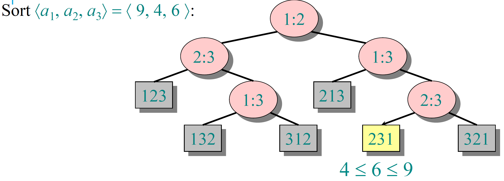
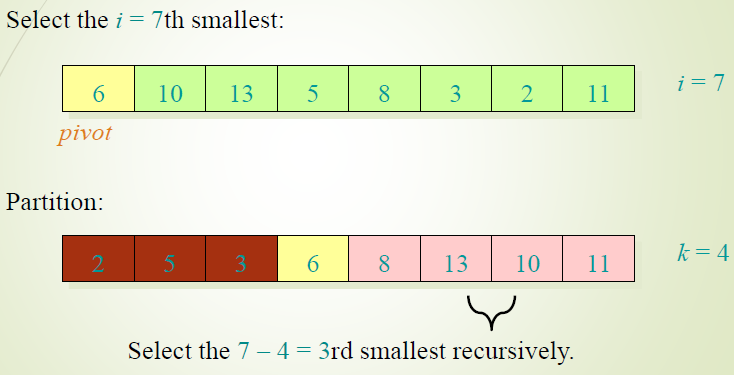

# Sorting 

All the sorting algorithms we have seen so far are comparison sorts : they use comparisons to determine the relative order of elements.
We can prove using a decision-tree view of the problem that the  the tree represents the sorting algorithm and it splits whenever it compares two elements.

Some properties about this kind of tree: 

- The tree contains the comparisons along all possible instruction traces
- The running time of the algorithm is the length of the path taken
- Worst-case running time is the height of tree
- Since the leaves are $n!$ because there are $n!$ possible permutations of the initial array and a binary tree has $\le 2^h$ we can solve $n! \le 2^h$ to find $h \ge n \log (n)$ .  

So Heapsort and merge sort are asymptotically optimal comparison sorting algorithms and it's not possible to build better sorting algorithms **based on comparisons**. 
Since Counting Sort is not based on comparison, it can perform better results than others sorting algorithms. It is also stable: it preserves the input order. 

# Quicksort randomized

The worst case occurs every time the 2 partition are not balanced. For example if the input is already sorted or reverse sorted, using the Lomuto's partition, the pivot will always on min or max element.  Because of this one of the two partition will be empty. In case of this unlucky event repeated all the times, we have $O(n^2)$ . We can 'keep away' this unlucky case randomizing the original vector or partition around a random pivot. 

# Radix Sort

Radix sort is fast for large inputs but quicksort is still a viable option due to its locality that allows to better exploit the steep cache hierarchies of modern processors and result in better overall performances for most uses.

**Radix sort** is a non-comparative sorting algorithm: it avoids comparison by sorting on least significant digits first. It is also called **bucket sort** and **digital sort**.
The cool thing about this algorithm is that we can use Counting Sort as the auxiliary stable sort because the limit domain of each sorting (0-9). 
Correctness of Radix Sort proved by induction on digit position. 
Also we can split each word of $b$ in group of digits, so that we can divide a word in $r$ groups. The best way to divide each word is in $r=\log n$ where $n$ is the number of words. In this way, the total complexity is $T(n)=\Theta(dn)$ where $n$ is the number of words and $d$ the length of each word. 
In practice, radix sort is fast for **large inputs**, as well as simple to code.  

# Randomized selection algorithm

In statistics, the $k_{th}$ **order statistic** of a statistical sample is equal to its $k_{th}$-smallest value. 
Quickselect is the best-known selection algorithm and it's basically Quicksort. 
We don't do recursive calls to both the partitions of quick-sort but just to the one where we will know there is the $i-th$ element. How do we know where there is the $i-th$ element? Simply remember that in quicksort the position of the pivot after the iteration is the final one, even if the algorithm has not finished! 

So we can proceed searching the $i-th$ element recursively without ordering all the array.     
Average case: $\Theta(n)$ but worst case is $\Theta (n^2)$ that is worst than sorting! 
The demonstration of the complexity is similar to quicksort but with the difference that the recursion it will be applied only 1:
Lucky case: $$T(n)=T \left ( \frac{1}{10}n \right) + \Theta (n) = \Theta (n)$$
Not so lucky case: $$T(n)=T \left ( \frac{9}{10}n \right) + \Theta (n) = \left\{ \text{Master theorem case 3:} \log _{\frac{10}{9}}1=0= \Theta (1) \right\} \text{ so } T(n)=\Theta (n)$$
Unlucky case: $$T(n)=T ( n -1) + \Theta (n) = \Theta (n^2)$$

## Deterministic version
 
A possible way to guaranteed that the smallest partition is not empty we could group all the elements in groups of 5 each and find the median of each group. Then select as pivot the median of the median group. 

Developing the recurrence :

1. Divide the $n$ elements into groups of 5. Find the median of each 5-element group by rote.
2. **Recursively** select the median $x$ of the medians to be the pivot.
3. Partition around the pivot $x$.  Let $k = rank(x)$
4. if  $i = k$ then return $x$ else if  repeat step _2_ recursively search the $i_{th}$ element in the lower or the $(i-k)_{th}$ element in the upper part

Looking visually the structure created using groups of 5 we can find some interesting properties over the array and we can say that the recurrence can assume that step 4 takes time $T (\frac{3}{4}n)$ in the worst case.
So the complexity is: 
$$T(n)=T\left(\frac{1}{5} n\right)+T\left(\frac{3}{4} n\right)+\Theta(n)$$
Since the work at each level of recursion is a constant fraction ($\frac{19}{20}$) smaller, the work per level is a geometric series dominated by the linear work at the root (this is always true, it's not the average case ... it's deterministic). So for this fact, it's theoretically better than quicksort but in practice, this algorithm runs slowly, because the constant in front of n is large. So the randomized algorithm is far more practical.