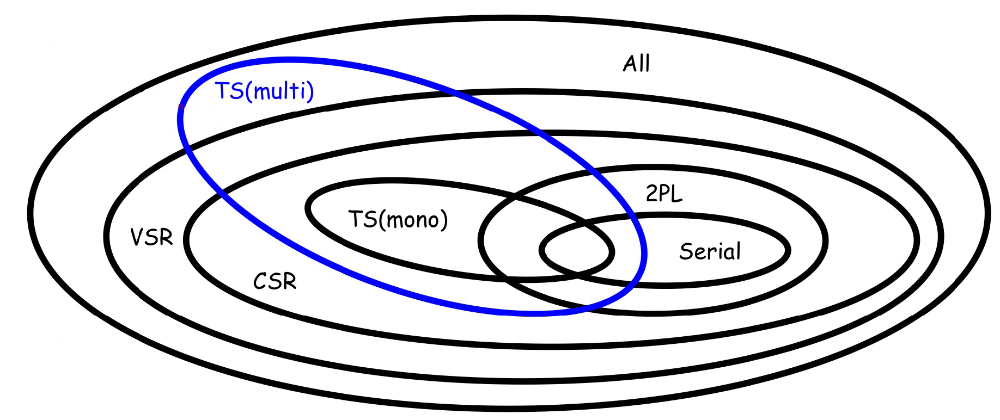

**DBMS is a system capable of managing data collections. 
You will not have the possibility to change the tables schema! Often you have to adapt to old schema. 

> The most useful assets of a company is not software, is data! You can rebuild software, not data.

Ranking data? Look how Google solved that problem finding a very efficient way to do it.

- Main topics:
1. DB architecture/technologies (concurrency control etc.)
2. Triggers
3. ORM and JPA
4. Physical DBs/Query optimization
5. Ranking and skylines


# Transactions

Banking and Booking apps are the killer apps. 

Transaction 

A transaction is an indivisible unit of execution
An elementary, atomic unit of work performed by an
application
• Each transaction is conceptually encapsulated within two
commands:
• begin transaction
• end transaction
• Within a transaction, one of the commands below is
executed (exactly once) to signal the end of the transaction:
• commit-work (commit)
• rollback-work (abort)
• In case of a rollback, the work performed must be undone, brin
> The undo function is one of the most difficult command ever invented. 

Transactional systems have 'undo function' inside! They have to have a rollback function.  

consistency 
A transaction must satisfy the DB integrity
constraints
Always catch expection! You are not the owner of the DB, maybe you aren't the one who will raise that exception. 

isolation
The execution of a transaction must be independent of
the concurrent execution of other transactions

durability Recovery management


# Concurrency 
Lost update r1 - r2 - w2 - w1 • An update is applied from a state that ignores a preceding update, which is lost 
• Dirty read r1 - w1 - r2 - abort1 - w2 
• An uncommitted value is used to update the data 
• Nonrepeatable read r1 - r2 - w2 - r1 • Someone else updates a previously read value 
• Phantom update r1 - r2 - w2 - r1 
• Someone else updates data that contributes to a previously valid constraint 
• Phantom insert r1 - w2(new data) - r1 
• Someone else inserts data that contributes to a previously read datum

Model: an abstraction of a system, object or process, which purposely disregards details to simplify the investigation of relevant properties


Operation: a read or write of a specific datum by a specific transaction • NB: the schedule notation omits the program variables • r1(x) = r1(x à .) • w1(x) = w1(. à x) • r1(x) and r1(y) are different operations • r1(x) and r2(x) are different operations • w1(x) and w2(x) are different operations • Schedule: a sequence of operations performed by concurrent transactions that respects the order of operations of each transaction


Scheduler and serial schedule ? 

Serializable schedule

all schedules/serializable/serial schedule


View-serializability • Preliminary definitions: • ri (x) reads-from wj (x) in a schedule S when wj (x) precedes ri (x) and there is no wk(x) in S between ri (x) and wj (x) • wi (x) in a schedule S is a final write if it is the last write on x that occurs in S • Two schedules are view-equivalent (Si »V Sj ) if: they have 1) the same operations, 2) the same reads-from relationship, and 3) the same final writes • A schedule is view-serializable if it is view-equivalent to a serial schedule of the same transactions • The class of view-serializable schedules is named VSR

Bad concurrency patterns are rejected by view-serializability. 


Conflict-equivalence CSR

Two schedules are conflict-equivalent (Si »C Sj ) if : • Si and Sj contain the same operations and in all the conflicting pairs the transactions occur in the same order • A schedule is conflict-serializable iff it is conflictequivalent to a serial schedule of the same transactions • The class of conflict-serializable schedules is named CSR


Is done with a conflict graph that has: • One node for each transaction Ti • One arc from Ti to Tj if there exists at least one conflict between an operation oi of Ti and an operation oj of Tj such that oi precedes oj • Theorem: • A schedule is in CSR if and only if its conflict graph is acyclic




# 26 09 

Optimistic 

smaller index -> older transaction 

RTM(x) index of last reader
WTM(x) index of last writer 
FOR EACH OBJECT


The scheduler receives read/write requests tagged with the timestamp of the requesting transaction . You use the age in order to resolve potential conflicts. 

We reject if 
R_ts(x) ts < WTM(x)
w ts x ): ts < RTM(x) or ts < WTM(x) the request is


The simple rule of TS concurrency control is the simplest one, we will see other ways. 

Reducing kill rate: Thomas Rule
If ts < RTM(x) as before 
Else, if ts < WTM(x) then our write is "obsolete": it can be skipped

Rationale: skipping a write on an object that has already been
written by a younger transaction, without killing the transaction. 

This versions are not really implemented, they are just a little step to build some fundamentals. 


# Multiversion Concurrency Control

Since every DBMS have to guarantee an 'undo command' it's very 'natural and logic' use a multiversioned system. (It's used actually). 
Idea: writes generate new versions, reads access the "right" version.  
$WTM_1(x) \dots WTM_N(x)$ are the versions, sorted from oldest to youngest.

$r_{ts}(x)$ is always accepted. A copy $x_k$ is selected for reading such that:
- If $ts \ge WTM_N (x)$, then $k = N$
- else $WTM_k (x) \le ts < WTM_{k+1}(x)$ 

$w_{ts}(x)$:
- If $ts < RTM(x)$ the request is rejected
- Else a new version is created for timestamp $ts$ and $N$ is incremented

We are complicating a lot the implementation but in change we now have a huge benefit: the read will be always accepted. 


# Triggers 

•	Use triggers to guarantee that when a specific operation is performed, related actions are performed
•	Do not define triggers that duplicate features already built into the DBMS. For example, do not define triggers to reject bad data if you can do the same checking through aeclarative integrity constraints 
Limit the size of triggers. If the logic for your trigger requires much more than 60 lines of code, it is better to include most of the code in a stored procedure and call the procedure from the trigger. Use triggers only for centralized, global operations that should be fired for the triggering statement, regardless of which user or database application issues the statement. Avoid recursive triggers if not absolutely necessary. Trigger may•
: : :  fire recursively until the DBMs runs out of memory. 

Use triggers : : : · .Yro guarantee properties of data that cannot be specified by means of integrity constraints 


Importante perché solitamente ci sono tante applicazioni diverse che
accedono allo stesso DB. Quindi se ho qualche regola da far rispettare
in generale è molto meglio averla nel DB che a livello Applicativo nelle
diverse applicazioni. Potrebbero crearsi inconsistenze e casini.


Triggers are powerfull but also complicated because cascading policies. 
They could be bugs in triggers obviously, also because a **cascading** triggers: a trigger activates another trigger. Some systems block cascading of triggers. Also it could happen **recursive cascading** . 


````SQL
CREATE TRIGGER [schema_name.]_trigger_name 
{ BEFORE | AFTER | INSTEAD OF } {INSERT |  UPDATE | DELETE} ON schema_name
{ FOR EACH ROW}
BEGIN 
{ WHEN ....}
UPDATE schema_name SET attribute_name = .... 
{ WHERE .... }
END;
````

````sql 
DROP TRIGGER trigger_name;
````

````SQL

INSERT INTO NAMES 
VALUES (23,"rick");

SELECT * FROM NAMES;
````


sito per esercitarsi: [Online SQL Compiler (tutorialspoint.com)](https://www.tutorialspoint.com/execute_sql_online.php) 

usi la keyword new per selezionare la nuova entry

> Remember that every time you have an update, you usually also have a 'where'


````sql
SELECT * FROM table1 AS X JOIN table2 AS Y ON X.attribute=Y.attribute
````


Also exist 'IF EXISTS ... ELSE ... '


Cascading is generally bad and in some DBMS is even forbidden. 


### Termination analysis

Draw down the triggering graph where each node is atrigger and each arc from a trigger i to j is present only if T_i effects may activate T_j . 

## View Materialization 

When a view is mentioned in a SELECT query the query
processor rewrites the query using the view definition,
so that the actually executed query only uses the base
tables of the view
•
When the queries to a view are more frequent than the
updates on the base tables that change the view
content, then view materialization can be an option
•
Storing the results of the query that defines a the view in a
table
•
Some systems support the CREATE MATERIALIZED
VIEW command, which makes the view automatically
materialized by the DBMS
•
An alternative is to implement the materialization by
means of triggers


[JPA Introduction - javatpoint](https://www.javatpoint.com/jpa-introduction)


JPA auto-generates SQL code from Java code, creating correspondence between Java objects and DB tuples. This is called ORM (Object-relational mapping): 

- classes are tables
- objects instances are tables rows (tuples)
- the physical memory address of an objects is the primary key of the tuple 
- references to other objects are the foreign keys 
- methods are triggers 

````Java
//entity manager interface 
public void persist (Object entity) //creates an entity instance in the database 
public <T> T find (Class<T> entityClass, Object primaryKey) //find an entity instance by its primary key 
public void remove (Object entity); //removes the entity instance from the DB 
public void refresh (Object entity); //resets the entity instance from the DB 
//JPA uses a 'Persistence Context' as middleware between Java and the DB. This is like a cache and maybe sometimes you want to force changes: 
public void flush(); 
````

By default entities are mapped to tables with the same name and their fields to columns with the same names, but you can always change it using some annotations: 

````Java
@Entity @Table(name="SUPERHEROS")
public class Superhero {

@Column(name="REAL_NAME",nullable=false)
private String real_name;
@Transient 
private boolean isInJusticeLeague; //transient attributes are attributes that are not persisted 
...
}
````

All relationships in JPA are unidirectional, the only way to make bidirectional relationships is using two 'paired' unidirectional mappings.

- Many-to-one 
- One-to-many
- One-to-one
- Many-to-many

Sometimes @ManyToOne relationship are not necessary and they can be mapped only for consistency. 

# JPA exercises 

DB del 17/10 praticamente ho guardato 1 quarto della spiegazione ... c'è da leggere i riassunti e sistemare questo. 

When the
fetch mode is not specified, by default:
•
A single
valued relationship is fetched eagerly
•
Collection
valued relationships are loaded lazily 


So eager -> when there aren't many elements and you can load them runtime when needed. Few data. For small cardinality

So Lazy -> a lot of data. 


First of all you make a class for each entity. 

mapped by specify which foreign key defines this entity. 


There is also cascade type:

- PERSIST
- REFRESH
- REMOVE
- MERGE
- DETACH

### One to many

````Java
@Entity
public class B{
@Id private int id
@OneToMany(mappedBy = "b", fetch= FetchType.EAGER, cascade = CascadeType.REMOVE)
private List<A> a; //actually not only lists .. but any kind of collections 
...
}

//On the other side:

@Entity
public class A{
@Id @GeneratedValue(strategy=GenerationType.AUTO)
private int id;

@ManyToOne
@JoinColumn (name="b_fk") //the column where there is the foreign key
private B b;
...
}
````


### Many to many 

In a ManyToMany mapping there is no FK column. Such a mapping is implemented by means of a join table (aka bridge table).
ManyToMany annotation must come with the mappedBy element.


Map example


We can't have a traditional join table with 2 columns because we have 3 attributes: so we use a map ```Map<Product, Integer>``` . 

````Java
@Entity 
public class Order implements Serializable{
// ...

@ElementCollection(fetch = FetchType.EAGER) 
@CollectionTable(name = "product_order", 
						joinColumns = @JoinColumn(name = “orderId")) //orderId is the ID of the owner's entity 
@MapKeyJoinColumn(name = "productId") 
@Column(name = "quantity")
private Map<Product, Integer> products;

//...
}

//ON THE OTHER SIDE: 
												  
@Entity
public class Product implements Serializable {
@Id @GeneratedValue (strategy = GenerationType.AUTO)
private int productId;
private int unitPrice;

@ManyToMany // this is optional
@JoinTable (name = "product_order",
	joinColumns = @JoinColumn (name = "productId"),
							inverseJoinColumns = @JoinColumn (name = "orderId"))
private List<Order> orders; // owner of the relation

// ...	
}
```` 

# Check the above code when you do this exercise 

Using this solution you will have (on DB side) a rich table with 3 columns. An alternative solution to this is to make manually a 'bridge entity' . 

You have to use the keyword ```@Embeddable``` (over the class) and a ```@EmbeddedId``` over the primary key of this new bridge entity, which will also contain the ID of the other two entities using ```@MapsId("id1")``` before  ```@JoinColumn(name = "id1")``` and ```@MapsId("id2") ... ``` .  


# Physical DB

Primary structure: it contains all the tuplesof a table
•
Main purpose: to store the table content
•
Secondary structures: are used to index primary structures, and only contain the values of some fields.


Three main types of data access structures:
 
- Sequential structures
- Hash-based structures
- Tree-based structures

$$\begin{array}{|l|l|l|}
\hline & \text { Primary } & \text { Secondary } \\
\hline \text { Sequential structures } & \text { Typical } & \text { Not used } \\
\hline \text { Hash-based structures } & \begin{array}{l}
\text { In some DBMSs (e.g., Oracle } \\
\text { hash clusters, IDM DB2 } \\
\text { "organize by hash" tables) }
\end{array} & \text { Frequent } \\
\hline \text { Tree-based structures } & \text { Obsolete/rare } & \text { Typical } \\
\hline
\end{array}$$

Blocks: the "physical" components of files
•
Tuples: the "logical" components of tables
•
The size of a block is typically fixedand depends on the file system and on how the disk is formatted
•
The size of a tuple (also called record) depends on the database design and is typically variablewithin a file


Operations are performed in main memory and affect pages (in the buffer). 
Operations are:

- Insertion and update of a tuple
- Deletion of a tuple
- Access to a field of a particular tuple, which is identified according to an offset w.r.t. the beginning of the tuple and the length of the field itself (stored in the page dictionary). 


# Sequential structures


The default are not sorting data and it will never happen a shifting operation. 

# heap 
Entry-sequenced sequential (a.k.a. heap) structure 
Effective for
•
Insertion, which does not require shifting
•
Space occupancy, as it uses all the blocks available for files and all the space within the blocks
•
Sequentialreading and writing (select * from T)
•
Especially if the disk blocks are contiguous (seek & latency times reduced)
•
Only if all (or most of) the file is to be accessed
•
Non-optimal for
•
Searching specific data units (select * from T where…)
•
may require scanning the whole structure
•
But with indexes can be used efficiently
•
Updates that increase the size of a tuple (“shifts” required)
•
Shift may require storage in another block
•
Alternative approach: delete old version and insert new one

$$\begin{array}{|l|l|l|}
\hline & \text { Entry-sequenced } & \text { Sequentially-ordered } \\
\hline \text { INSERT } & \text { Efficient } & \text { Not efficient } \\
\hline \text { UPDATE } & \begin{array}{l}
\text { Efficient (if data size } \\
\text { increases } \rightarrow \text { delete }+\text { insert } \\
\text { the new version) }
\end{array} & \begin{array}{l}
\text { Not efficient if data size } \\
\text { increases }
\end{array} \\
\hline \begin{array}{l}
\text { DELETE }
\end{array} & \text { "Invalid" } & \text { "Invalid" } \\
\hline \text { TUPLE SIZE } & \text { Fixed or variable } & \text { Fixed or variable } \\
\hline \begin{array}{l}
\text { SELECT * FROM T } \\
\text { WHERE key } \ldots
\end{array} & \text { Not efficient } & \\
\hline
\end{array}$$


# Hash based structures

Good for point query and bad for range queries (because the lack of sorting). 

 I/O operations = 

statistical estimations 

The modern systems use statistics to choose between B+ systems or hash or sequential ones. 


# Indexes 

Ausiliary 

Don’t get confused:
•
Primary key: set of attributes that uniquely identify a tuple (minimal, unique, not null)
•
Does not imply access path
•
In SQL “PRIMARY KEY” defines a constraint
•
Implemented by means of an index
•
Search key: set of attributes used in an index to speed up tuple location
•
Physical implementation of access structures
•
Defines a common access path
•
Each search key value is associated with one or more pointers
•
May be unique (one p

$$\begin{array}{|l|l|l|l|l|}
\hline
\text { Type of Index } & \text { Type of structure } & \text { Search Key } & \text { Density } & \begin{array}{l}
\text { How } \\
\text { many }
\end{array} \\
\hline \text { Primary } & \begin{array}{l}
\text { Sequentially } \\
\text { ordered } \\
\text { with SK = OK }
\end{array} & \text { Unique } & \text { Dense or sparse } & \begin{array}{l}
\text { One per } \\
\text { table }
\end{array} \\
\hline \begin{array}{l}
\text { Secondary }
\end{array} & \begin{array}{l}
\text { Entry sequenced } \\
\text { or Sequentially } \\
\text { ordered with SK } \\
\text { != OK }
\end{array} & \begin{array}{l}
\text { Unique and } \\
\text { non unique }
\end{array} & \begin{array}{l}
\text { Dense (not } \\
\text { possible to scan } \\
\text { primary data } \\
\text { structure wrt SK) }
\end{array} & \begin{array}{l}
\text { Many per } \\
\text { table }
\end{array} \\
\hline \text { Clustering } & \begin{array}{l}
\text { Sequentially } \\
\text { ordered with SK }= \\
\text { OK }
\end{array} & \text { Non unique } & \text { Typically sparse } & \begin{array}{l}
\text { One per } \\
\text { table }
\end{array} \\
\hline
\end{array}$$

Smaller than primary data structures, can be loaded in main memory
Support point/range queries and sorted scans efficiently
But less efficient that hash structures for point queries. BUT: adding indexes to tables means that the DBMS has to update the index too after an insert update or delete operation. Indexes do not come for free, they may slow down data changing operations.

# B + 

