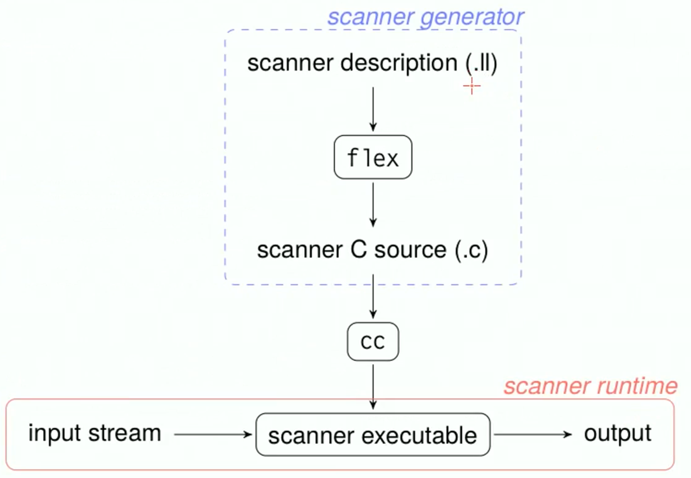

# Lab 1 from Cattaneo

Lab is 20% of the exam. 

Some applications: 
- The standard regular expression syntax 
- Standard unix tools for text editing 
- Parser generation with flex and bison 
- The internal organization and workflow of a real-world compiler 
- How to modify and extend a simple compiler called ACSE

Regex basics:
- ```x``` the ```x``` character 
- ```.``` any character except newline
- ```[xyz]``` means ```x``` or ```y``` or ```z``` 
- ```[a-z]``` any character between ```a``` and ```z``` 
- ```[^a-z]``` any character except those between ```a``` and ```z```

Said ```R``` a regular expression:
- ```RS``` concatenation of ```R``` and ```S```
- ```R|S``` either ```R``` or ```S``` 
- ```R*``` zero or more occurrences of ```R```
- ```R+``` one or more occurrences of ```R``` 
- ```R?``` zero or one occurrence of ```R ```
- ```R{m,n}``` a number or ```R``` occurrences ranging from ```n``` to ```m ```
- ```R{n,}``` at least n occurrences 
- ```R{n}``` exactly n occurrences of ```R```

## Flex 

It's implemented as non-deterministic finite state automaton. 



- definitions: where you can declare useful REs
- rules: most important part where you bind RE combinations to actions 
- user code: C code

Each part is separated by ```%%```  


Longest matching rule 
The flex scanner in case of more than one match (with more one rules) the longer match will always win: if a longer regular expression match an expression and then others regular expression match subsets of the expression, the longer rule willl have precedence. 

the first rule 


# Byson

Semantic of an input is the semantic analysis. 
Syntactic analysis does not determine the meaning of the input. It just make a syntax tree.
Byson, from a grammar, create a code that parse a source code/file that corrisponds with that grammar. So basically Byson using the LALR algorithm builds LR parsers. 

- prologue: useful place where to put header file inclusions and variable declarations
- definitions
- rules 
- user code 
````C
%{
//prologue and headers 
}%
// definitions
%%
//rules like a context-free grammar 
not_terminal : terminal1 
				   | terminal2 TOKEN_A  
				   | terminal3 { /* C code */ }
%%
//user code
````


(very similar to Flex). 

Very similar to grammar ... uppercase tokens are non terminals and lowercase tokens are terminals symbols. 

You can add semantic actions for each grammar rule. 

Byson uses bottom-up parsing: it always gives precedence to the inner-most rule. 

