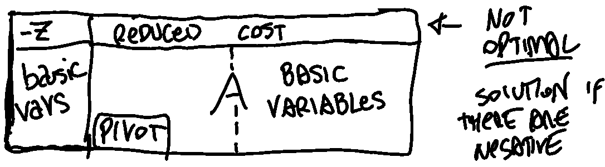

# Geometry of Linear Programming Problem 

feasible region 

vertices 

moving along each vertex 

canonical form and standard form 

transformations using slack variables

matrix notation and algebra stuff 

### Foundamental theorem of LP 

# Simplex Algorithm 

List of basic solutions and at each iteration, we move from a basic feasible solution to a neighbour basic feasible solution. 

We know that a basic feasible solution is an optimal one looking if all reduced costs have positive coefficients. 
The simplex method with Bland's rule terminates after $\leq\left(\begin{array}{c} n \\ m \end{array}\right)$ iterations where $n$ is the number of decision variables and $m$ is the number of constraints. <- CORREGGERE IL NOME M E N 

### Tableu method with Bland's Rule

 

1) considering the canonical form, build the corresponding Tableu:
$$\left\{\begin{array}{c}
z=c^T x \\
A x=b
\end{array}\right.$$ $$\begin{array}{|l|ll|}
\hline 0 & & c^{\prime} (x_1 & \cdots & x_n) & \\
\hline b & & A & \\
\hline
\end{array}$$
	note that the first column contains the right hand side of the objective function and the right side vector.
2) while the coefficients are negative you continue to perform the pivoting operation switching the basic variables in the first column with non basic variables:
	1) the pivoting operation consist in selecting a **non negative** $a_{ij}$ from $A$ in the Tableu corresponding to the left most negative coefficient (column $j$) of the objective function (first line) and with the minimum ratio $\frac{a_{0j}}{a_{ij}}$ . 
	2) divide the whole row $i$ of the pivot by $a_{ij}$  
	3) subtract the others row (even the obj function) by the values of the row $i$ of the pivot $a_{ij}$  multiple by a value $k$  
	4) the value $k$ differs for each row and it's choose to make all the coefficients in the pivot column $j$ equal to zero. $$\begin{aligned}
&\begin{array}{|llll|l|}
\hline 1 & 1 & 1 & 0 & 6 \\
2 & 1 & 0 & 1 & 8 \\
\hline
\end{array}\\
&\text{after pivoting on } a_{10} : 
\\ &\begin{array}{|cccc|c|}
\hline 0 & 1 / 2 & 1 & -1 / 2 & 2 \\
1 & 1 / 2 & 0 & 1 / 2 & 4 \\
\hline
\end{array}
\end{aligned}$$
	5) during each pivoting you always have a feasible solution but with the difference that you have turned a negative coefficient in the reduced cost into a $0$ . 

## 2 Phase 

The problem is already in standard form.

Since a feasible basic solution is not evident, we apply the two-phase simplex method

The goal of the first phase is to find an initial basic feasible solution of the original LP problem, if it exists, or to establish that it is infeasible. This is achieved by solving the following auxiliary LP problem
where an artificial variable yi is introduced for each equality constraint

We express the basic variables w.r.t. the nonbasic ones

According to Bland’s rule, we pick as nonbasic variable to enter the basis the variable with smallest index

Since the reduced costs for the nonbasic variables are all nonnegative, Phase I stops, proving that the feasible region of the original problem is nonempty, and yielding an initial basic feasible solution with the basic variable

Change objective function and eventually re-change it replacing all the variables to have the non-basic variable explicit. 
Removing from the tableau the columns of the auxiliary variables, we obtain

Since the reduced costs are all nonnegative, the algorithm terminates and it yields the optimal solution

# Dual Problem 

$$\begin{array}{|c|c|}
\hline \text { MIN problem } & \text { MAX problem } \\
\hline \text { variables } & \text { constraints } \\
\hline \text { constraints } & \text { variables } \\
\hline \text { cost vector } & \text { right hand side (b) } \\
\hline \text { right hand side (b) } & \text { cost vector } \\
\hline \text{CONSTRAINTS }A_i x \ge b & y_i \ge 0 \\
\hline \text{CONSTRAINTS }A_i x \le b & y_i \le 0 \\
\hline  x_i \ge 0 & \text{CONSTRAINT }yA^{i} \le c \\
\hline  x_i \le 0 & \text{CONSTRAINT }yA^{i} \ge c \\
\hline  x/y \text { unrestricted} & \text{CONSTRAINT }A_i (y/x) = c \\
\hline
\end{array}$$

complementary slackness conditions

$$y_1(a^{T}_i x - b_i)=0$$

