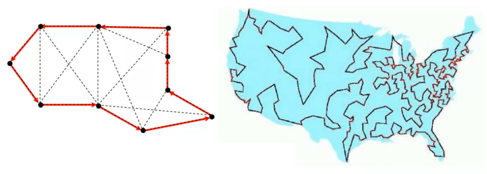

# Polynomial algorithms

An algorithm used to solve a problem, is defined as polynomial if it requires, in the worst case, a polynomial number of elementary operations $f(n)=O(n^d)$ , where $d$ is a constant and $n$ the "size" of the problem (more formally the number of bits necessary to encode it). 

Why polynomial algorithms are better? 

|  | present computer | 100 times faster | 1000 times faster |
| :---: | :---: | :---: | :---: |
| $n$ | p1 | 100 p1 | 1000 p1 |
| $n^2$ | p2 | 10 p2 | 31.6 p2 |
| $n^5$ | p3 | 2.5 p3 | 3.98 p3 |
| $2^n$ | p4 | p4+6 | p4+9 |
| $3^n$ | p5 | p5+4 | p5+6 |

*size of the largest solvable instance in 1 h* 

## NP-completeness theory 

[13.Seminario Api](../../../BSc(ITA)/Algoritmi%20e%20Principi%20dell'Informatica/src/13.Seminario%20Api.md) 

Traveling Salesman problem is the problem to find a circuit of minimum total cost which visits every node exactly once in a directed graph with a cost for each arc.  

NP-complete problems are some of the most difficult problems to solve in computer science, and finding efficient algorithms for them is a major open problem. Despite this, they have important applications in a variety of fields, including optimization, scheduling, and constraint satisfaction.

The term "completeness" in this context refers to the fact that an NP-complete problem (or NP-hard) is "complete" within the class NP in the sense that every other problem in NP can be reduced to it. This means that if any NP-complete problem can be solved efficiently, then all problems in NP can be solved efficiently.

NP-hardness of a problem is a very strong evidence that it is inherently difficult but that does not mean that it cannot admit a polynomial time algorithm (it's a open problem).  

How can we prove that a problem is NP-complete? Making the reductions from all NP problems (even those which have not been conceived yet) seems impractical Exploit the transitivity of ∝ make the reduction from a known NP-complete problem

