https://docs.google.com/spreadsheets/u/1/d/e/2PACX-1vRbfc9IS3b-qYzE-EJUxXl0nKOWEjKD_L6CmMggIEVe3rz-mU_i1hgRx3yP7E87dg/pubhtml?gid=1284356776&single=true

# Introduction to software engineering

Why software engineering is important? Software is everywhere and our society is now totally dependent on software-intensive systems. Society could not function without software.

## Software lifecycles 

Waterfall lifecycle: As a reaction to the many problems: traditional “waterfall” model identify phases and activities force linear progression from a phase to the next. No returns (they are harmful), better planning and control, standardize outputs (artifacts) from each phase. Software like manufacturing. 

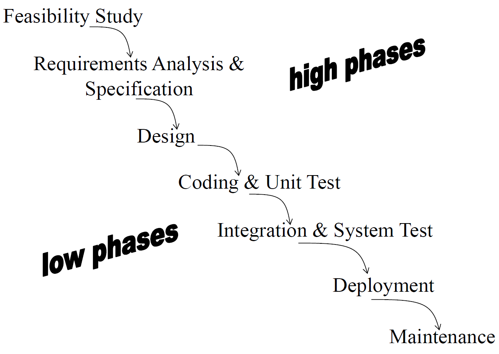
Feasibility study & project estimation
Cost/benefits analysis
Determines whether the project should be started (e.g., buy vs
make), possible alternatives, needed resources
Produces a Feasibility Study Document
	Preliminary problem description
	Scenarios describing possible solutions
	Costs and schedule for the different alternatives
-


Req. analysis and specification

Analyze the domain in which the application takes place
Identify requirements
Derive specifications for the software
	Requires an interaction with the user
	Requires an understanding of the properties of the domain
Produces a Requirements Analysis and Specification
Document (RASD)

Design
Defines the software architecture
	Components (modules)
	Relations among components
	Interactions among components
Goal
	Support concurrent development, separate responsibilities

Produces the Design Document


Coding&Unit level quality assurance
Each module is implemented using the chosen
programming language
Each module is tested in isolation by the module
developer
Inspection can be used as an additional quality
assurance approach
Programs include their documentation


Integration&System test
Modules are integrated into (sub)systems and integrated
(sub)systems are tested
This phase and the previous one may be integrated in an
incremental implementation scheme
Complete system test needed to verify overall properties
Sometimes we have alpha test and beta test


Maintenance


validation -> are we building the right product? It depends by the users / stakeholders . 

verification -> are we building the product right?


Nowadays:
- scrum
- extreme programming
- DevOps: infinite loop (more a set of practices than a production process)

based on incremental releases

2 macro areas in this course: requirements and design documents


# Requirements Engineering (RE)

22/9/2022

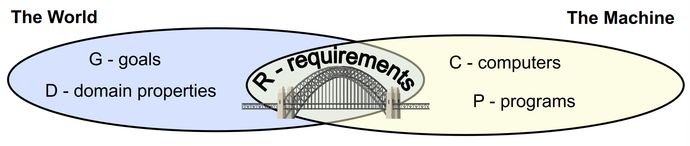

Some definitions:

- **The machine** is the portion of system to be developed typically, software and hardware.
- **The world** is the portion of the real-world affected by the machine. 
- **Phenomena** can be **shared** between world and machine. Shared phenomena can be controlled by the machine and observed by the world, or viceversa.
- **D** = Domain assumptions are descriptive assertions assumed to hold in the world. They are real world properties and they don't depend on the machine.
- **G** = Goals are assertions formulated in terms of world phenomena. 
- **R** = Requirements are assertions formulated in terms of shared phenomena. 

The requirements are complete if :

1) **R** ensures satisfaction of the goals **G** in the context of the domain properties   
2) **G** adequately capture all the stakeholders’s needs  
3) **D** represents valid properties/assumptions about the world

When the domain assumptions **D** are wrong the software design could lead to disasters. Note that we are not talking about bugs on the code: problems could caused purely because bad design of the software. 

RE is a relatively young domain, there's no consensus on terminology yet, in particular about what is a requirement.

The boundary between the World & the Machine is generally not given at the start of a development project .
The purpose of a RE activity is to:

- to identify the real goals of the project 
- to explore alternative ways to satisfy the goals, through alternative pairs (Req, Dom) such that Req and Dom always satisfy G 
- to evaluate the strengths and risks of each alternative interfaces between the world and the machine


## Steps to solve first exercise typology 

1) (Trivial) Give a name to the use case: the use case is the flow of events in the system
2) Find the actors  
3) Then concentrate on the flow of events using informal natural language:
	- entry conditions
	- exit conditions: use case terminates when the following condition holds
4) Exceptions (Describe what happens if things go wrong) 
5) Special requirements (Nonfunctional Requirements, Constraints)

Some notes:

- Note that each use case may lead to one or more requirements.
- We should separate as much as possible different activities. It's better to keep concerns separated. For example a generic use case of an app will probably need the user logged in before posting a useless meme. But in the activity of posting the meme, we will not specify **in the flow of events** the action of 'logging in' , but only in the entry conditions. 
- Requirements identification needs to take into account the needs of many stakeholders: identify priorities of requirements is the task of a requirement engineer. 
- Implementations concerns are not related to a Requirement Engineer. The RE only focus on 'the world' not the machine. 
- the requirement validation is not 'a monolitich static step'. You continue to search error: the earlier you catch the errors, the earlier you can fix them. 

associations are rapresented by lines. You can have association between actors and use cases. 

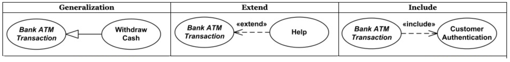

[Alloy](Alloy.md) 

# Software Design

Architecture is a transferable abstraction of a system.  The architecture manifests the earliest set of design decisions:

- it introduces design constraints on implementation
- it introduces organizational structure 
- it inhibits or enables quality attributes 

# Architectural style 

## Layered style

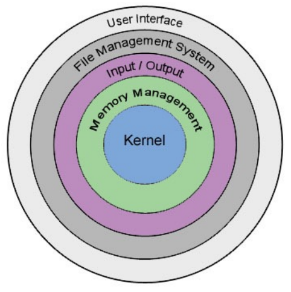

Layers archtecture enable separation of concerns, claryfying the main focuses of each layer. Each layer can be considered 'independent' from the others. Layered style can be used when it is possible to identify a specific (bounded) concern for each layer and clearly communication protocol between layers.

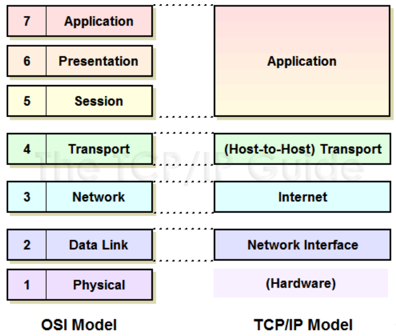

## Client/Server

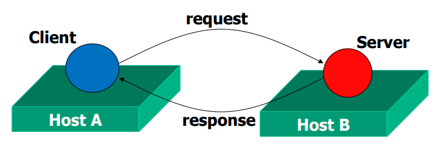

A client-server architecture is a kind of layered architecture with two layers (also called tiers).

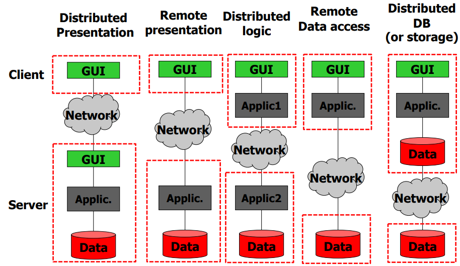


### Three-tier architecture


Note how the middle tier plays 2 roles (server and client). 

## Event-based systems

This kind of style is popular in distributed systems (systems heavily distributed and decentralized). 

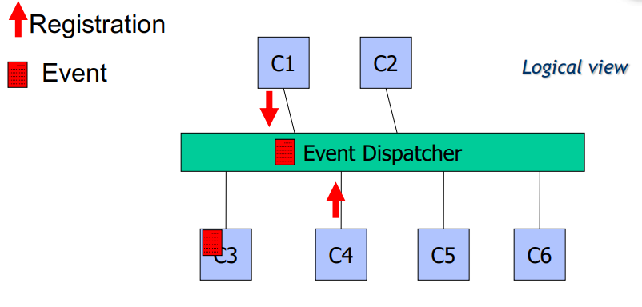

There are producers of events and consumers of evens and everything is coordinated by an event dispatcher:

- components can "register to" or  "send events"  
- events are broadcast to all registered components by the event dispatcher

Since publishers/subscribers are decoupled, addition/deletion of components is easy. The main problem is the scalability since the event dispatcher may become a bottleneck (under high workloads). Also notice that the architecture has an asynchronous nature so the ordering of events is not guaranteed.

## Service-oriented architecture (SOA)

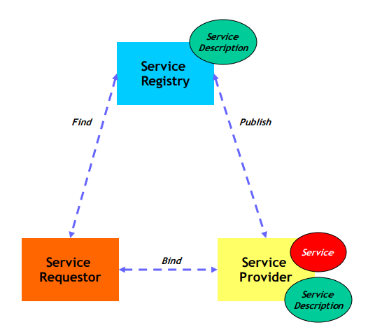

Services offered through a API. 

## Microservice architectural style

Each service uses its own technology stack and it's isolated. 

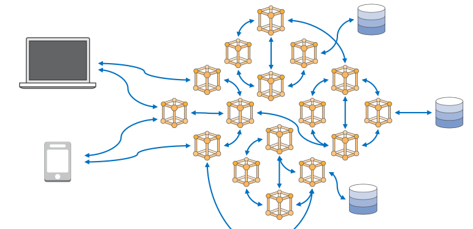

Microservices architecture is very resilience and scalable. Each service has its own software repository and there is no cross-dependencies between codebases. 
While monolithic systems are often big and complex and their replacement is risky and costly; replacing a microservice implementation is much easier. 

# Analysis of architectures

A couple of parameters:

- Mean Time to Repair ($MTTR$): time between the occurrence of a fault and service recovery, also known as the mean downtime.
- Mean Time To Failures ($MTTF$): time between the recovery from one incident and the occurrence of the next incident, also known as uptime. 
- Mean Time Between Failures ($MTBF$): Mean time between the occurrences of two consecutive incidents


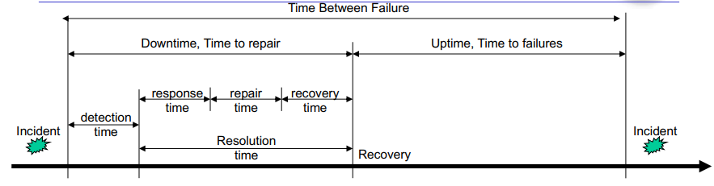

The we can define availability:


$$A = \frac{MTTF}{(MTTF+MTTR)}$$

The probability that a component is working properly at time (actual uptime).

Reliability: means that the service is available for an agreed period without interruptions (frequency of interruptions). 


$$R = e - \lambda t  \text{ where } \lambda = \frac{1}{MTTF}$$


Note that a system could be available for 99% of time but have a lack of reliability since it continues to 'crash' and quickly restart. 


# 03 11 

Example of sequence UML diagram. 

An example with two examples. One asynchronous and the other one synchronous. online/offline difference. 


Example of 3 components in series, so the total availability is the multiplication of all the 3 components availability. 

Then the example of parallelize the weakest component of the chain to increase the availability. 

# UML models


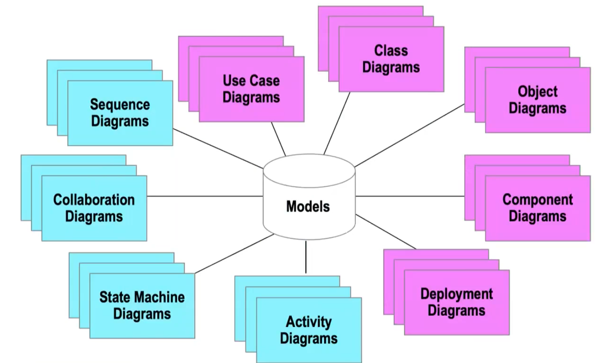


Objects diagrams is the Class diagram with only distances. It is used to show links between instances. 

Composite Structure Diagram captures the internal modular structure of a component. You can described nested components, bus and ports. Exist tools that mechanically extract structure diagrams from class diagrams. Strong focused on low-level details. Developed by architects and used by programmers. 

Component Diagram used to show interfaces between components. 

Deployment Diagram captures topology of a system: hardware, software and communications protocol between them. It is used to specify the distribution of components and identify performance bottlenecks. 

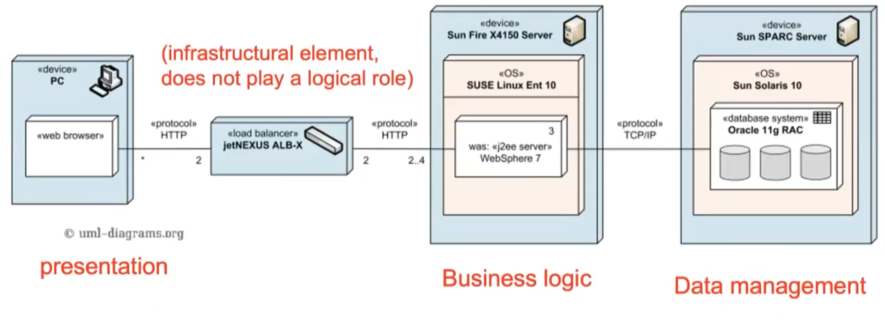

Sequence Diagram used to describe behavior time-oriented. Focused on internal message exchange among components. It is used to show the control flow and illustrate typical scenarios. 


The top-down design generally produces more elegant systems but the individual components reuse is rare. The bottom up design is a bit rough end result, but it's very efficient since we re-use components and it s generally quicker. 

In real life generally is used a trade-off between the two approaches. 

# JEE

JEE is a software framework. 
A software framework facilitates and speeds the software development up through pre-built blocks. The framework itself forces some architectural styles, design patterns and design principles. Any library is also a software framework.
An integrated collection of components, set of specifications, conventions and principles. Frameworks follow the open-closed design principle. 

JEE, Java Platform Enterprise Edition is a Java based software framework for development of Enterprise Applications (EA). 
EAs often deal with huge amount of data. 
Generally EAs involve source control stuff, multi-threading, synchronization, concurrency, transaction processing, distributed system, messaging and service management. 

JEE: 

- Enterprise JavaBean (EJB): server-side components that implement the main business logic of the application 
- Java Persistence API (JPA): manages data base connectivity, relational data management, execution of queries. 
- Java Messaging Service (JMS) common interface for message protocols to implement communication among distributed systems
- Java Transaction API (JTA): specifies standard interfaces between a transaction manager and the parties involved in a distributed transaction system

JEE follows a multi-tier architecture:

- Client tier 
- Web tier 
- Business tier 
- Enterprise Information System tier (it also includes DBMS and other technologies)

Tier = logical group of components that are served for a specific purpose. 

Component = self-contained software units deployed onto the tiers of a EA. 

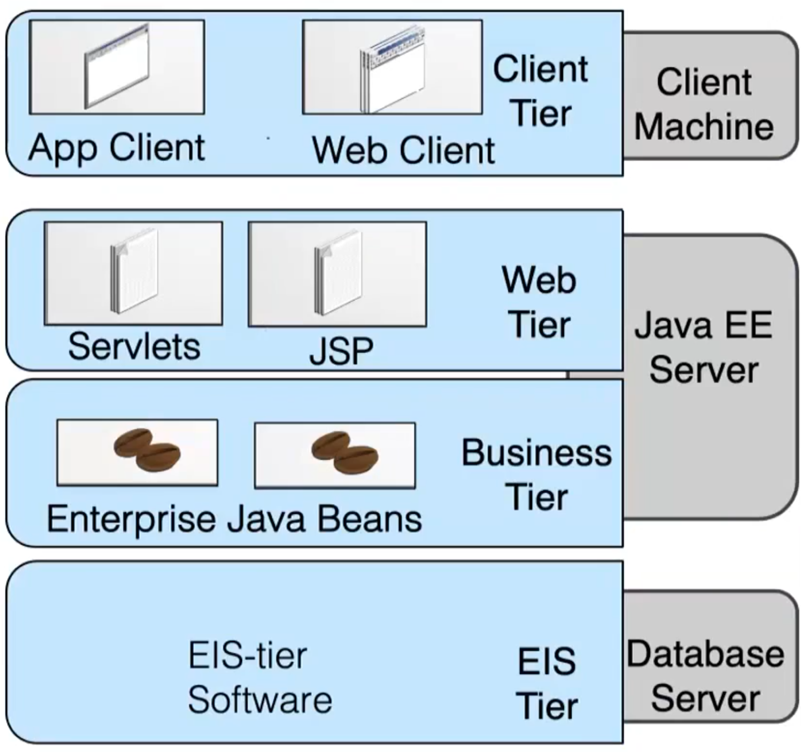


### Client tier

Java applets are dead because security concerns (client tier). 

When the UI is complex it's possible to build a client machine. 

Application clients container 


### Web tier 

Servlets a small server-side Java application. HttpServlet acts as a middleware between request coming from a http client 

Java Server Pages JSP are a ''going to death'' technology but still are not deprecated. 


Modern web applications use oftenly this stack: 

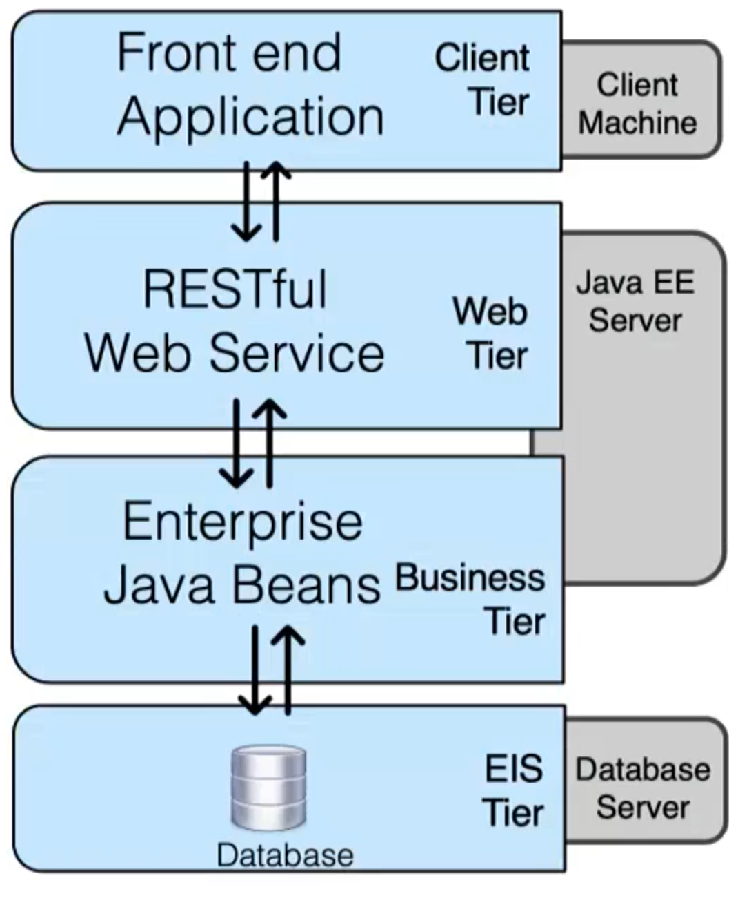

The business and web tier expose APIs to interact with business functions Communication uses the HTTP protocol The web clients use the APIs (e.g., HTML/JavaScript frontend, using frameworks such as AngularJS, Backbone.js, React). 

### Business tier 

$$\begin{array}{|l|l|}
\hline \text { Enterprise Bean Type } & \text { Purpose } \\
\hline \text { Session } & \begin{array}{l}
\text { Performs a task upon client requests; tasks } \\
\text { typically invoked by the servlets }
\end{array} \\
\hline \text { Message-driven } & \begin{array}{l}
\text { Acts as a listener for a particular messages, } \\
\text { such as the Java Message Service API }
\end{array} \\
\hline
\end{array}$$ 
The session Bean is more used and it encapsulates the business logic that can be invoked programmatically by a client. Session beans are of three types: 

- Stateful Session Beans: each stateful bean has only one client and there is a ''conversational state''. When the session bean terminates, it is no longer associated with that client. Example when you are buying a ticket. 
- Stateless Session Beans: there is no maintain any kind of ''conversational state'' , there is just a reply to a a request. 
- Singleton Session Beans: unique bean, generally used to keep system level configurations. 


## Platform Mechanisms

Injection mechanism simplify the code and decouples the creation/usage of existing components. 
Two types:

- Resource Injection: in a distributed environments it is used to access objects physically maintain by others machines/servers. There is a JNDI (Java Naming and Directory Interface) that provides mapping from an unique name to an instance. 
- Dependency Injection: since we typically have object creation tightly coupled with their usage (the classical object creation in Java).  

$$\begin{array}{|l|c|c|}
\hline \space & \text { Resource Injection} & \text { Dependency Injection } \\
\hline \text { Can Inject JNDI Resources Directly } & \text { Yes } & \text { No } \\
\hline \text { Can Inject Regular Classes Directly } & \text { No } & \text { Yes } \\
\hline \text { Resolves By } & \text { Resource Name } & \text { Type } \\
\hline \text { Type safe } & \text { No } & \text { Yes } \\
\hline
\end{array}$$


### JEE Resource Management 

JEE servers achieve heavy workloads with good performance using two commons distributed systems: 

- instance pooling: it consists in avoiding continue creation/deletion of objects using a ''pool'' . Mainly used for stateless and message-driven beans.
- activation/passivation: the EJB container "passivates" a stateful bean when it is in "idle" state and "activates" (recover) it whenever it is needed. Mainly used for stateful beans and it's convenient since the time between two requests by the client is usually bigger than the service time. 

## JWW APIs 

Java Messaging Service (JMS) is composed by: 

- JMS provider: exchanger 
- JMS client: source and target components 
- Messages: objects exchanged between components. 

Messages: 

- P2P (point-to-point): queues, senders and receivers. Senders put each message into a specific queue, receivers pull messages from the queue. Each message has at most one consumer. It's an asynchronous communication: senders are not forced to wait for answers. 
- Publish/subscribe: components topics which groups messages, publishers and subscribers. Topics do not keep the messages, they only broadcast them to subscribers (so subscribers can only access the messages generated after their subscription). Each message can have multiple consumers. 

# JPA

JEE specification and API that simplifies the interaction with back-end databases providing support for relational/SQL/NoSQL databases. 
JPA provides an object-oriented view of the DB tables (entities in the ER model): 

- A table in the DB is represented by a class 
- Table rows are instances of this class Columns map to fields (attributes) 
- Relations between two tables are defined by properties that are common in the two classes 
- Multiplicity of a relation is declared using annotations

@Entity annotation is mandatory, @Id indicates the primary key 

```Java
@OneToOne   
@JoinColumn ( name  = "mailID") 
private MainlingAddress address;

//in MainlingAddress there the attributed annotated as ''@Id" is called "mailID"
````


Entities are managed by EntityManager declared in this way: 
````Java
@PersistenceContext   
private EntityManager em;  
````
and it can be used to make queries like for example this selection: 
````Java
public Product findProduct(int productid) {   
	return em.find(Product.class, productid); 
	}
````

Mainly there are two EM patterns: 

- direct access
- DAO (Data Access Object): better separation and better design for change. It works like an interface so that you can have for example multiple database backends that are encapsulated by the DAO. 

## DD document 

1) Introduction   
	- Scope: reviews the domain and product, summary of main architectural choices
	- Definitions, acronyms, abbreviations   
	- Reference documents   
	- Overview   
2) Architectural Design   
	- Overview: high-level components and interactions   
	- Component view: components and interfaces description
	- Deployment view: infrastructure description  
	- Component interfaces: more detailed description of each interface
	- Runtime view: dynamics of interactions  
	- Selected architectural styles and patterns   
	- Other design decisions
3) User Interface Design: overview of UIs  
4) Requirements traceability   
5) Implementation, Integration and test Plan: order in which you plan to implement all the stuff   
6) Effort Spent   
7) References


# Verification and Validation 


Verification along the entire development process, not just at the end. 
Programs do not display a “continuous” behavior and verifying the function in one point does not tell us anything about other points. 

- Human error: human action that results in software containing a defect or fault 
- System error: bug, there is a difference between observed output and the theoretically value 
- System Failure: Inability of a system or component to perform a required functionality 

Two main approaches: 

- ANALYSIS (usually, static technique) analytic study of properties 
Based on identification of pairs of variables definitions and use. Typically used by compilers to check for possible errors and to make optimizations. Pessimistic approach, some problems may actually be false positives. 1. Derive control flow graph 2. Derive def and use sets for every node 3. Identify pairs of def-use Can be used to check if variable is guaranteed to be initialized or if variable is never used. Symbolic execution Values are expressed over symbols, executing statements computes new expressions. In case of branches, execution is performed only for a specified path.


- TESTING (dynamic technique) experimenting with behavior of the products sampling behaviors find “counterexamples”

Test case is a set of inputs of the system, along with the expected outcome (given hypothesis on state of the system). Test set is a set of test cases. Test cases can be generate randomly or systematically

TESTING

- Randomly: random testing It is "blind", it does not "look for bugs” But it can be effective as it allows testers to generate and execute hundreds of thousand of test cases Using statistics it can be a powerful tool 
- Systematically: systematic testing Use characteristics/structure of the software artifacts (e.g., code) – white-box testing Use information on the behavior of the system (e.g., specifications) – black-box testing

Unit testing 
Conducted directly by the developers on single units of code. Component may not work in isolation, so drivers and stubs are needed (this is called scaffolding). Unit testing should be done as soon as possible. 

Integration testing 
Aimed to test interfaces and modules interactions. Example of integration faults are: • Inconsistent interpretation of parameters • Violations of capacity or size limits • Side effects on resources • Omitted or misunderstood functionality • Nonfunctional properties (e.g. performance issues) • Dynamic mismatches Integration plan is an important part of the test plan, which is part of the project plan. Big Bang testing All integration testing done at the end, no scaffolding required. Very bad, it has an high cost of repair (bugs found early cost less to be fixed). Incremental testing Integration testing is done while component are released, even at early stages.

The only good aspect of the random approach is that you can systematically generate a lot of cases, but this is not very effective without some good criterion. 
The "reasoned approach" follow the same practices studied in [Software Engineering 1 course](../../../BSc(ITA)/Ingegneria%20del%20Software/Ingegneria%20del%20Software.md) in the bachelor, in the [testing](../../../BSc(ITA)/Ingegneria%20del%20Software/src/10.Testing.md) chapter: 
- edge coverage criterion 
- condition coverage criterion 
- path coverage


testing activities: 

- Unit Testing Conducted by the developers themselves Aimed at testing sections of code
- Integration Testing Aimed at exercising interfaces modules’ interactions. Possible integration testing could be: 
	- Inconsistent interpretation of parameters or values 
	- Violations of value domains, capacity, or size limits 
	- Side effects on parameters or resources 
	- Omitted or misunderstood functionality 
	- Nonfunctional properties Example
	- Dynamic mismatches

How to achieve integration & testing Big bang (better to avoid it) Incrementally (facilitates bug tracking)

An extreme and desperate approach: Test only after integrating all modules Does not require stubs/drivers/oracles The only excuse, and a bad one Minimum observability, diagnosability, efficacy, feedback High cost of repair

Incrementally: it occurs while components are released. Applicable in different ways: 
	- Top-down/Bottom-up
	- Threads: A “thread” is a portion of several modules that together provide a uservisible program feature
	- Critical modules: prioritize riskiest modules, identified by a risk assessment 


Structural strategies (bottom up and top down) are  But thread and critical modules testing provide better process visibility, especially in complex systems.

System testing is a complete test over the final system. It's a complex phase where you have to "simulate" the environment to make a correct "black-box" testing. The purpose is to identify bottlenecks and benchmarking with load testing. 


scaffolding?


Black box testing a state machine 

If the system acts like a state machine (there are states and transactions between them) there are 2 criterion of coverage: 

- Coverage of States: the test cases must collectively reach all the states
- Coverage of Transactions: the test cases must collectively reach all the transactions


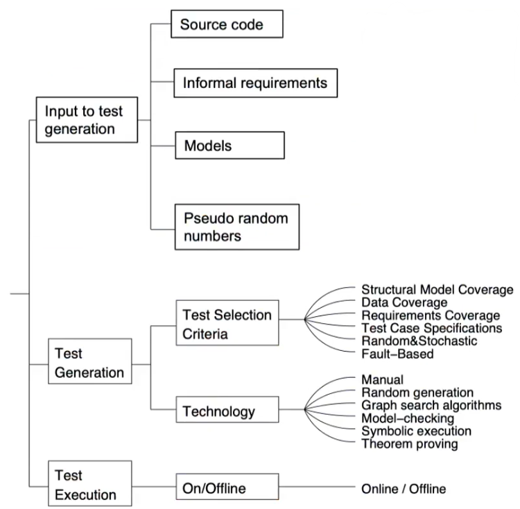

ANALYSIS 

A family of techniques which don't involve the actual execution of software. Two main approaches:

- Manual review: (informal) Review is an in-depth examination of some work product by one or more reviewers. Product is anything produced for the lifecycle, i.e., requirements, plans, design, code, test cases, documentation, manuals, everything! two types:
	- Reviews between peers 
	- Inspections: ?? 
- Automated static analysis: a formal evaluation technique (systematic) in which software requirements, design, or code are examined in detail by a person or group other than the author to detect faults, violations of development standards, and other problems. Different types: 
	- data flow analysis: focused on usage of variables and possible errors related to them. Typically used by compilers and note that in general not errors, but symptoms of possible errors: 
	 - a variable is initialized when used
	 - a variable assigned and then never used
	 - a variable always get a new value before being used

	to automate these checks? Derive the control flow diagram Identify points where variables are defined and used. Identify def-use pairs and analyse the pairs to answer to questions Using basically algorithms that explore the graph and check the variables. 
	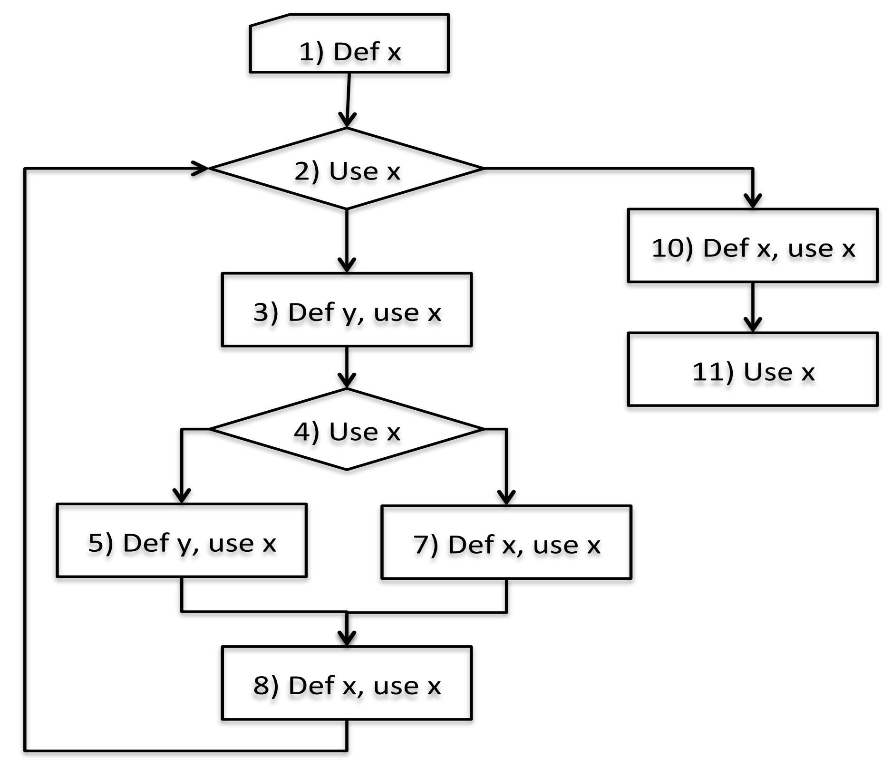


# Project Management

1. Initiating 
2. Planning 
3. Executing 
4. Monitoring and controlling
5. Closing 


## Initiating 

- Define the project
- Define initial scope
- Estimate cost and resources
- Define the stakeholders


## Planning

- Scope management plan: defining, validating and controlling scope
- **Schedule planning**: how schedule is developed, managed, executed and controlled 
- **Cost and Effort estimation** 
- Quality management plan: quality standards, quality assurance and control 
- Change management plan 
- Communication management plan 
- **Risk management plan**: identify risks and plan responses

### Schedule planning 

Tasks are activities which must be completed to achive the project goal. Milestones are points in the schedule where progress can be assessed. Deliverables are work products delivered to the customer (e.g documents).

Break down project in tasks 2. Define dependencies between tasks 3. Define lag time between dependencies (even negative). 

Different dependencies: 

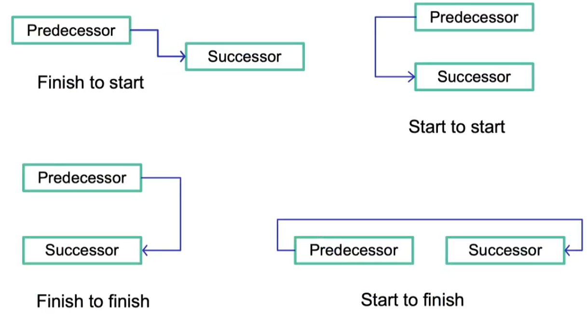 

The critical path is a sequence of tasks that runs from the start to the end of the project. Changes to task on the critical path changes the project finish date. A task is critical if it cannot float earlier or later.

The dependencies can be: 

- mandatory 
- discretionary 
- external: outside project's team control (ex: waiting 3rd party component completion before integration)
- internal

and also: 

- Flexible: dynamic deadline (as soon as possible .. )
- Partial flexible: bounded deadline (start no earlier than / finish no later than) 
- Inflexible: (must occur on specific time interval)

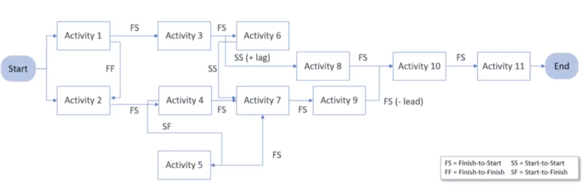 

GANTT chart

It can be detailed and automatically generated: 

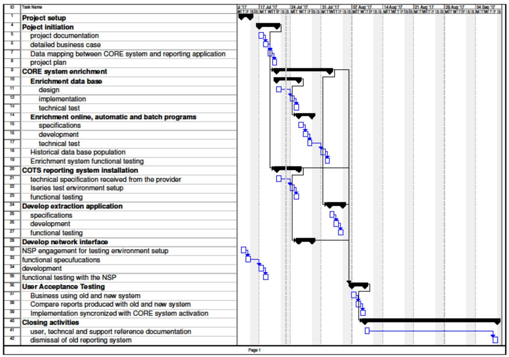

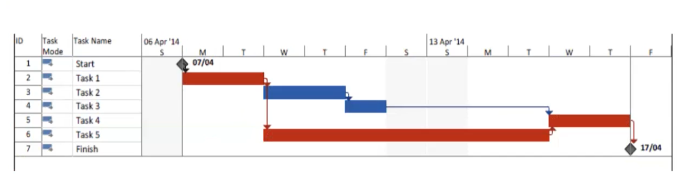 

### Cost and Effort estimation

Two types of techniques:

- experience-based techniques: based on past projects
- algorithmic cost modelling: estimation using mathematical function. 

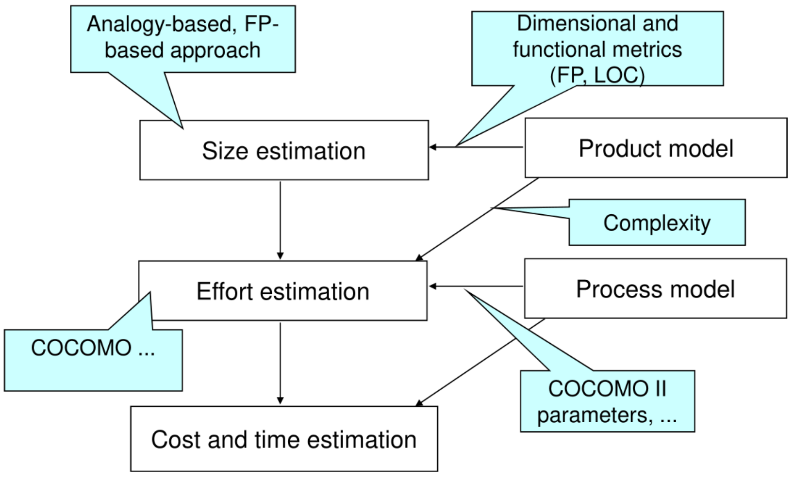 

There are specific techniques that can be used for product model and process model (mathematical description of the process): 

- Function Points: based on a combination of program characteristics 
- COCOMO II : another software cost estimation model widely used. It is based on a set of algorithms that use factors such as the size of the project and the level of reuse of existing software to estimate the cost and effort required to develop a new software. 

### Risk Management 

Risk is an uncertain event that if occurs can impact the achievement of objectives. 

- Risk cause is the source of the risk:
	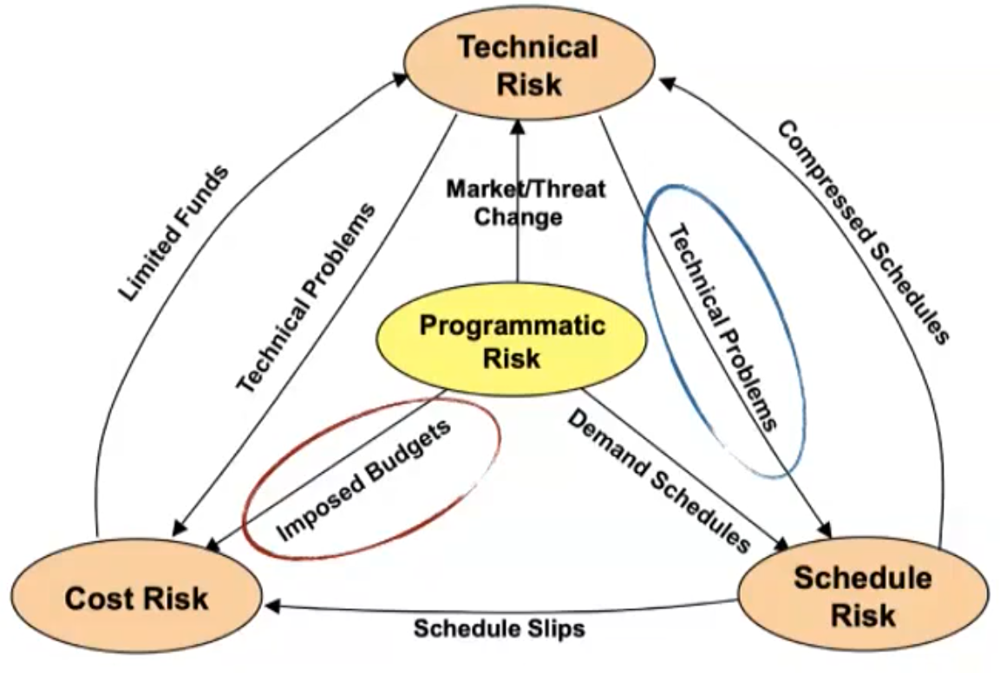 
- Risk event: uncertain event that might follow the cause
- Risk effect: how the objectives might be affected by the risk event 

Steps for risk management: 

1. Define roles and responsibilities 
2. Identify possible risks with template: 
	if ?situation? then ?consequence? for ?stakeholders? 
3. Give probability (high, low, medium) to each risk 
4. Develop a risk response plan 
5. Define a budget for unknown risks 

## Executing 

The main steps of launching a project:

- holding a kick-off meeting
- acquiring and managing the project team and resources
- acquiring equipment and materials
- executing the plans
- performing the work according to the Work Breakdown Structure (WBS)
- controlling and monitoring the progress of the project.

## Monitoring and controlling

Monitoring involves collecting data on the current status of a project to identify any deviations from the initial plan. Controlling involves implementing corrective actions to get the project back on track. 
Controlling can increase risks, but there are techniques:

- fast-tracking: push tasks to occur faster than they would, no cost increase but higher risk)
- crashing: shorten the tasks on the critical path by adding new resources (increasing costs) 

If neither the schedule, budget, nor resources are negotiable, the scope of the project may need to be reduced by eliminating certain tasks.

### Earned Value Analysis (EVA) monitoring methodology 

Very simple and stupid methodology.


# Closing

- Ensure project acceptance 
- Track project performance
- Lessons learned
- Close contracts
- Release resources