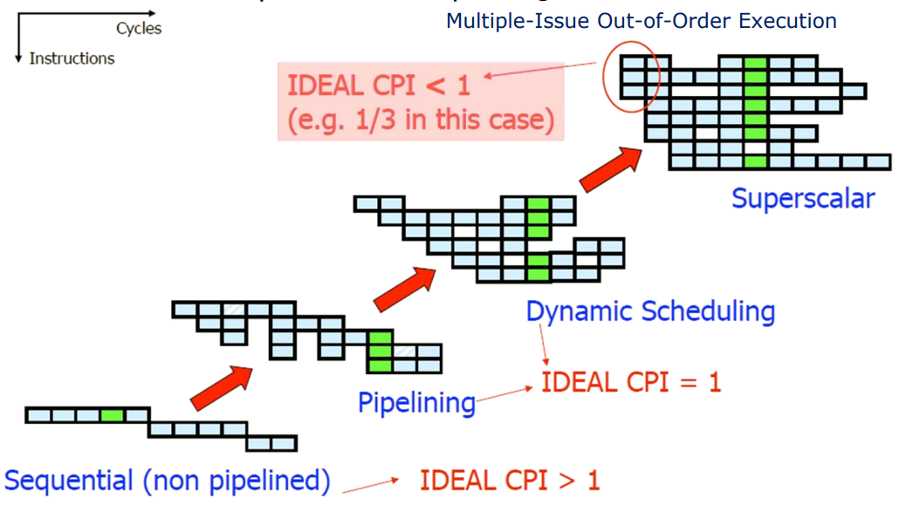
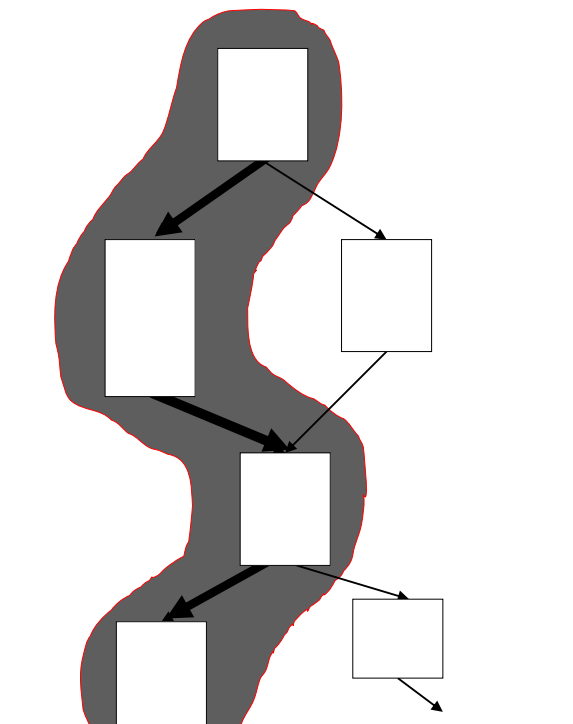

The whole first part of the course would be instruction level parallelism.

Of course, there is a lot of complexity in that regard.

But the basic concept for having ILP is that you have a pipeline.

And I might have multiple instructions working independently.

And if I have multiple instructions, I can have that the whole pipeline is operating at the same time on different instructions.

So I can have, if I have four stations, I suppose, I can have at most four instructions that are fulfilling the pipeline.

ISA = Instruction Set Architecture

MIPS ISA is also another important feature, is that it is a fixed length ISA.

Which means that all the instructions have the same length.

Is this the same for every kind of ISA?
ARM like MIPS, it's a fixed length.
It's a RISC architecture.

Which means that ARM tries to have that each operation takes one clock cycle.
So it's closely related to MIPS.

Do you know another ISA which is not like this? X86.

It's X86, which is a CISC ISA.

X86 has fields that say the next part of the instruction will be a certain amount of bytes.

Internally, it becomes RISC, but our code is CISC.

The other huge part of an architecture...
Broadly speaking, in an architecture, you have a certain part that operates on data, which is called the data path.

And then you have the control path.

Control path is instead the one that controls the operation.

So how does those operations work and when those operations have to start, how can I handle the instruction level parallelism? The controller is a part that is not very much considered, but it's something that makes a real difference in an architecture.

Because you can exploit and take advantage of a certain component if you have a good controller.

And in a CPU, it's a part that really limits or pushes the performance of a CPU.

Looking at a different perspective, here is how the MIPS data path appears.

In a multi-stage pipeline, the first stage is instruction fetch, where instructions are retrieved. The next stage is decode, which determines what operations the instructions entail and sets up the CPU to perform those computations. The execution phase follows, where arithmetic logic operations take place. The memory stage accesses main memory or cache hierarchy. Lastly, the result of the computation is written back to the register file.

And what is your best friend? It would be this timing diagram, where we can really see what is ILP.

Theoretically speaking, at cycle 5, we have that four stages of our pipeline are all busy.

We do have three kinds of hazards.

Structural Hazards: Attempt to use the same resource from different instructions simultaneously Example: Single memory for instructions and data

Data Hazards: Attempt to use a result before it is ready Example: Instruction depending on a result of a previous instruction still in the pipeline

Control Hazards: Attempt to make a decision on the next instruction to execute before the condition is evaluated Example: Conditional branch execution

- - -

This lecture focuses on two main parts.

Thread level parallelism
instruction level parallelism

C has an explicit mechanism to parallelize your code.

Which is multi-threading.

And multi-threading is something not related to the underlying architecture.

It's agnostic.

Okay? So, right now, let's focus on our single core architecture.

We have to know that we do have superscalar architectures.

I simplified, of course, everything.

But we will reach a point where this will be clear.

And we will reach a point where we will be incrementally a kind of architecture like this.

Since the topic of this lecture is multitreading, we will see how we can go beyond by exploiting a different kind of parallelism, which is thread level parallelism.

Superscalar architecture?

A superscalar architecture is a type of computer processor design that enables the execution of multiple instructions in parallel within a single clock cycle. In superscalar architecture, the CPU has multiple execution units that can perform independent operations concurrently.
Superscalar architectures are commonly used in modern high-performance processors, including those found in desktop computers, servers, and mobile devices.

So, multiprocess is easier, not really. We don't have that something can happen, we are very happy, and that's it.
But multi-threading is not exactly the same way, because each thread has its own context, that might have data shared with a thread with another.

How do we deal with multiple process and multiple threads?

So how do we deal, strictly constraining the scenario, with multi-threading? What is the main issue, in your opinion, about multi-threading?

Multi-threading has a huge cost to pay, because each thread has its own context.

So that means that we have to have multiple contexts that can be possibly active at the same time.

So, it's all about how do we switch the context.

Sorry? Give each thread a time of execution.
This is exactly related to the concept of fine-grained multi-threading, where each thread has the same amount of time and we continuously switch from one thread to the other.

Of course, if there are issues in the execution in this way, we can hide the latency of accessing, for example, the memory, because are you familiar with the concept of memory hierarchy?

Computer architecture has multiple levels of hierarchies, which can significantly impact performance. For example, accessing the hard disk can take up to a second, while accessing a register takes just one clock cycle or one nanosecond. This difference in latency can be crucial to the speed of the system.
That's the difference, broadly speaking.

The problem is that in this way, we are always guaranteeing the same time to each thread.But this might increase the latency.
It's the same principle as because our architecture and our instruction always take the same amount of clock cycle in our RISC architecture, even though some instruction might take fewer.
We sacrifice the latency of the single instruction to increase the overall throughput of our architecture.

There is a times for for the registers, for the instruction buffer, for the program counter logic and the cache and TLB store buffers.
Those components are replicated.

This example of fine-grained multithreading architecture is showing us that we have to replicate other components to handle the context and be always ready to switch.

Then there are a lot of details that complicate, further more, how to handle them.

This is basically it for the fine-grained multithreading.

Instead of having threads that each time are switched, we have that we keep the thread executing for a certain amount of time.

And this is interesting because it opens to a different strategy because we can visualize it in this way.

Coarse-grained multithreading architecture right now are not used that much.

If we look at single process architecture, we have seen superscalar in its basic version, fine-grained multithreading and coarse-grained multithreading.

Can we do better? Yes? Basically, it is always trying to build up more and more high-performing architecture.

Because, for example, with coarse-grained multithreading, we have to flush our pipeline, we have the risk of making it starving.

On the fine-grain, we have two issue windows, completely empty.

Which means that we are not doing anything.

Of course, I'm not stressed that much up to now, but the idea here is to combine thread-level parallelism and instruction-level parallelism.

So that we can take advantage of the resources of those components that are not used.

So that we can have other threads that begin the execution if there are available resources.

And in this way, we try to increase the utilization of our architecture more and more.

We try to exploit and squeeze more performance.

And this technique that combines both thread-level parallelism and instruction-level parallelism is called simultaneous multithreading.

Try to dynamically adapt based on a set of techniques that we will see afterwards.

The basic and the most important concept of GPUs is simultaneous multithreading.

So GPUs are not just a simile.

So GPUs are also simultaneous multithreading.

It's what makes those architectures extremely advanced.

Because it's not just a single level of parallelism.

- - -

* SISD - Single Instruction Single Data : Uniprocessor systems
* MISD - Multiple Instruction Single Data: no practical configuration and no commercial systems
* SIMD - Single Instruction Multiple Data

* Simple programming model, low overhead,
flexibility, custom integrated circuits

* MIMD - Multiple Instruction Multiple Data: Scalable, fault tolerant, off-the-shelf micros

- - -

And so the question here is how can we adapt and deal with such complexity, with such changing workloads? With heterogeneous systems.

Because what is happening is that we are trying to create and combine, as we will see in just a few seconds, different kind of system.

* In computer architecture, different systems are combined to achieve the most performance.
* The processor alone is not enough for tasks such as playing games in 4K or streaming on Twitch.
* GPUs are a common addition to systems, but they are heterogeneous systems with specialized components like tensor cores and ray tracing cores.
* FPGAs are another type of system that integrates different hardware components like logic lookup tables and on-chip memories.

- - -

Instruction Level Parallelism

Parallelism with simple tecnique. But since it's simple, three hazards:

* **Structural Hazards**: Attempt to use the same resource from different instructions simultaneously. Example: Single memory for instructions and data
* **Data Hazards**: Attempt to use a result before it is ready. Example: Instruction depending on a result of a previous instruction still in the pipeline
* **Control Hazards**: Attempt to make a decision on the next instruction to execute before the condition is evaluated Example: Conditional branch execution

$$\text{Pipeline Speedup} = \frac{\text{Pipeline Depth}}{\text{1 + Pipe Stall Cycles per Instruction due to Branches}}$$

$$\text{Pipeline Speedup} = \frac{\text{Pipeline Depth}}{\text{1 + Branch Frequency \* Branch Penalty}}$$

To feed the pipeline we need to fetch a new instruction at each clock cycle, but the branch decision (to change or not change the PC) is taken during the MEM stage. This delay to determine the correct instruction to fetch is called Control Hazard or Conditional Branch Hazard If a branch changes the PC to its target address, it is a taken branch If a branch falls through, it is not taken or untaken.

* Without forwarding: To stall the pipeline until the branch decision is taken (stalling until resolution) and then fetch the correct instruction flow.

{width=50%}

With forwarding, to reduce stalling time.

{width=50%}

Early Evaluation of the Program Counter PC. Update the PC register
as soon as possible in the pipeline during ID stage. Move a sort of controller of the branch outcome before the execute stage, inside the decode stage.

With the branch decision made during ID stage, there is a reduction of the cost associated with each branch (branch penalty): We need only one-clock-cycle stall after each branch Or a flush of only one instruction following the branch

One-cycle-delay for every branch still yields a performance loss of 10% to 30% depending on the branch frequency

{width=50%}

But note that this has an "issue".. anticipating the evaluation of the PC has its 'cons'.
{width=50%}

## Branch Prediction Techniques

In every cases, care must be taken not to change the processor state until the branch is definitely known.

### Static Branch Prediction Techniques

The actions for a branch are fixed for each branch during the entire execution. The actions are fixed at compile time. Static Branch Prediction is used in processors where the expectation is that the branch behavior is highly predictable at compile time.
Static Branch Prediction can also be used to assist dynamic predictors.
Five static branch prediction techniques:

* Branch Always Not Taken (**Predicted-Not-Taken**)
* Branch Always Taken (**Predicted-Taken**)
* Backward Taken Forward Not Taken (**BTFNT**): examples are all the branches at the end of loops, it's assumed the backward-going branches are always taken.
* **Profile-Driven Prediction**: The branch prediction is based on profiling information collected from earlier runs. The method can use compiler hints.
* **Delayed Branch**:The compiler statically schedules an independent instruction in the branch delay slot. If we assume a branch delay of one-cycle (as for MIPS), we have one-delay slot. Three different ways:
    * From before: an instruction is taken (which it's known to not affects the data flow) from before the branch instruction and it's executed not before but after the branch instruction.
    * From target: an instruction is taken from the target of the branch. Usually used when the branch is taken with high probability, such as loop branches (backward branches).
    * From fall-through:This strategy is preferred when the branch is not taken with high probability, such as forward branches.

In general, the compilers are able to fill about 50% of delayed branch slots with valid and useful instructions, the remaining slots are filled with nops. In deeply pipeline, the delayed branch is longer that one cycle: many slots must be filled for every branch, thus it is more difficult to fill all the slots with useful instructions. The main limitations on delayed branch scheduling arise from: The restrictions on the instructions that can be scheduled in the delay slot. The ability of the compiler to statically predict the outcome of the branch.

### Dynamic Branch Prediction Techniques

The decision causing the branch prediction can change during the program execution.

The decision causing the branch prediction can change during the program execution.

Basic Idea: To use the past branch behavior to predict the future.

Two important point:

* Outcome
* Target: Branch Target Buffer (Branch Target Predictor) is a cache storing the predicted branch target address for the next instruction after a branch. Nothing more than a lookup table.

Branch History Table (or Branch Prediction Buffer):

Table containing 1 bit for each entry that says whether the branch was recently taken (1) or not (0).

A 1-bit saturating counter (essentially a flip-flop "Flip-flop (electronics)")) records the last outcome of the branch. This is the most simple version of dynamic branch predictor possible, although it is not very accurate.

A 2-bit saturating counter is a state machine with four states

Correlating Branch Predictors

An idea the behavior of recent branches are correlated, that is the recent behavior of other branches rather than just the current branch (we are trying to predict) can influence the prediction of the current branch.

Correlating Branch Predictors - In general (m, n) correlating predictor records last m branches to choose from 2 m BHTs, each of which is a n-bit predictor

The first level history is recorded in one (or more) k-bit shift register called Branch History Register (BHR), which records the outcomes of the k most recent branches

The second level history is recorded in one (or more) tables called Pattern History Table (PHT) of two-bit saturating counters

The BHR is used to index the PHT to select which 2-bit counter to use.

Each branch history table tracks all the k most recent branches. Using all these tables, it's possible to lookup patterns in the PHT, it's possible to select the BHR with the most similar aspect of the current execution flow (looking the previous branches outcomes) and use the prediction of that BHR.

The solutions to the branch prediction problem are a lot .

In theory 2-BHT is always best than 1-BHT but it's not always the case, it depends.

CHECK BHT EXERCISES !!

- - -

13-03 exe

Recall MIPS with forwarding

* EX/EX path
* MEM/EX path
* MEM/MEM path

In principle EX/ID is not needed since what it's computed in EX is not useful in ID stage. But if there is early branch evaluation it might be useful.

- - -

15-03

ILP = Potential overlap of execution among unrelated instructions

Pipeline CPI = Ideal pipeline CPI + Structural Stalls + Data Hazard Stalls Ideal pipeline CPI: measure of the maximum performance attainable by the implementation

Move forward a more complex architecture.
Pipelining becomes complex when we want high performance in the presence of:

* Long latency or partially pipelined floating-point units
* Multiple function and memory units
* Memory systems with variable access time
* Precise exception (divisions by zero, underflow and overflow at hardware level)

What about mixing Integer and Floating point operations?
Floating point operations take more clocks than the integer ones and so they have more latency. The implementation of floating point operations leads to the introduction of a new pipeline. The pipeline moves from balanced stages to multicycles to effectively deal with floating point operations. This change is necessary because floating point operations require more complex computations that cannot be handled efficiently in a single cycle.

General purpose registers (**GPRs**) contain information being manipulated by the user program currently running.Floating-point registers (**FPRs**) hold numeric values associated with some exponent.

Example of complex pipeline with floating point functional units:

An instruction will only enter the ISSUE stage if it does not cause a WAR or WAW hazard.
Only one instruction can be issued at a time, and in the case multiple instructions are ready, the oldest one will go first. So ISSUE stage can be seen as an infinite buffer, RAW can enter and will be solved here.

We can imagine that ISSUE is a data structure which can keep tracks all the operations.

FP ALU take 2 clocks

## Scheduling

In order to achieve higher performance from a given architecture, it is necessary to extract more parallelism from programs. This is done by detecting and solving dependencies between instructions, and scheduling them in a way that maximizes parallel execution within the available resources. Dependences among instructions are crucial for determining the amount of parallelism in a program, and if two instructions are dependent, they cannot be executed in parallel and must be executed in order or partially overlapped. Three different types of dependences:

* Name Dependences: Name dependence occurs when 2 instructions use the same register or memory location (called name), but there is no flow of data between the instructions associated with that name.
* Data Dependences (or True Data Dependences): RAW, WAW, or WAR. The actual hazard and the number of stalls to eliminate the hazards are a property of the pipeline.
* Control Dependences

It's obvious, but remember that dependencies are properties of the program.

# Instruction Level Parallelism

Two strategies to support ILP:

* **Static Scheduling**: Rely on software for identifying potential parallelism.
* **Dynamic Scheduling**: Depend on the hardware to locate parallelism. The hardware reorders the instruction execution to reduce pipeline stalls while maintaining data flow and exception behavior. Main advantages:
    * It enables handling some cases where dependences are unknown at compile time
    * It simplifies the compiler complexity
    * It allows compiled code to run efficiently on a different pipeline.
    Those advantages are gained at a cost:
    * A significant increase in hardware complexity
    * Increased power consumption
    * Could generate imprecise exception

There are **limits of static scheduling** in advanced computer architectures.

* Unpredictable Branches: the compiler can't know ahead of time which branch will be taken. As a result, it cannot optimize the instructions that precede the branch.
* Variable Memory Latency: cache misses can result in delays as the processor waits for data to be fetched from memory. Compiler can't predict which memory blocks will be in cache at any given time. So it cannot optimize the instructions that rely on the data in memory.
* Code Size Explosion: Static scheduling can also result in a code size explosion. As we schedule instructions, we may need to insert more instructions to handle dependencies and ensure proper execution order.
* Compiler Complexity: static scheduling can also increase compiler complexity. The compiler must analyze the code for dependencies and optimize the instruction scheduling accordingly.

**Hardware intensive approaches dominate desktop and server markets**.

In summary, to solve ILP (Instruction Level Parallelism), we use pipelining as starting point to improve a sequential architecture. Dynamic scheduling is necessary to improve performance. To overcome the limitations of single-issue out-of-order execution, a Superscalar architecture is employed.

- - -

aca del 22/03

Pipeline CPI = Ideal pipeline CPI + Structural Stalls + Data Hazard Stalls + Control Stalls

where:

Structural stalls: HW cannot support this combination of instructions

data hazard stalls: : Instruction depends on result of prior instruction still in the pipeline

control hazards: Caused by delay between the fetching of instructions and decisions about changes in control flow (branches, jumps, exceptions)

ILP is a technique used to overlap machine operations such as addition, multiplication, loading, and storing to speed up their execution. **ILP is transparent to the user.**

## VLIW architecture

VLIW (Very Long Instruction Word) is a CPU architectural style that overlaps the execution of multiple machine-level operations within a single flow of control.
VLIW is used for **exploiting instruction-level parallelism (ILP) in programs, especially, for performing more than one basic (primitive) instruction at a time**.

Multiple operations packed into one instruction

Try to keep pipeline full (in single issue pipelines) or utilize all FUs in each cycle (in VLIW) as much as possible to reach better ILP and therefore higher parallel speedups.

A VLIW instruction can be thought of as several RISC instructions joined together.

VLIW: Pros and Cons

Pros:

* Simple HW
* Easy to extend the # FUs
* Good compilers can effectively detect parallelism

Cons:

* Huge number of registers to keep active the FUs
* Large data transport capacity between FUs and register files and between register files and memory
* High bandwidth between i-cache and fetch unit
* large code size
* binary compatibility

### VLIW for static scheduling

VLIW Compiler has the responsibility of maximizing parallel execution through the exploitation of ILP and LLP. To achieve this, the compiler must schedule instructions according to time constraints and dependencies among tasks. This mapping ensures intra-instruction parallelism while avoiding data hazards and minimizing the total execution time for the program. The VLIW Compiler typically separates operations with explicit NOPs to guarantee no interlocks.

Static detection and resolution of dependences ( static scheduling): accomplished by the compiler  dependences are avoided by code reordering. Output of the compiler: reordered into dependencyfree code.

Typical example: VLIW (Very Long Instruction Word) processors expect dependency-free code

Static Scheduling methods:

* Simple code motion
* Loop unrolling & loop peeling
* Software pipeline
* Global code scheduling (across basic block)
    * Trace scheduling
    * Superblock scheduling
    * Hyperblock scheduling
    * Speculative Trace scheduling

Simple code motion is just moving code instructions.

Loop Execution: Unrolling exposes more computation that can be scheduled to minimize stalls.
If there aren't loop-carried dependencies we can "unroll" the interations of any loop and perform them in a parallel way.

Software pipelining pushes even further this idea, permetting the loop iterations that are executed parallely to also be pipelined.

Global code scheduling (across basic block)

A trace is a portion of the code/control flow ... it's basically a branch path.

Use profiling feedback or compiler heuristics to find common branch paths

Trace scheduling cannot proceed beyond a loop barrier

Traces scheduling schedules traces in order of decreasing probability of being executed

So, most frequently executed traces get better schedules
Traces are scheduled as if they were basic blocks.

It then **adds compensation code at the entry and exit of each trace to compensate for any effects that out-of-order execution may have had**.

- - -

29-03

# Dynamic scheduling

: Depend on the hardware to locate parallelism

Problem: data dependences that cannot be hidden with bypassing or forwarding cause hardware stalls of the pipeline

allow instructions behind a stall to proceed

HW rearranges the instruction execution to reduce stalls

Enables out-of-order execution and completion (commit)

Out-of order execution introduces possibility of WAR, WAW data hazards.

Suppose a data structure keeps track of all the instructions in all the functional units

A SCOREBOARD: A Data Structure for Correct Issues Keeps track of the status of Functional Units

CDC6600 Scoreboard: Introduced in the CDC 6600 (the world's fastest computer from 1964 to 1969)

Four Stages of Scoreboard Control

The ID stage is divide into:

* Issue: decode and check structural hazard
* Read Operands: wait until no data hazards

In-order issue BUT out-of-order read-operands

So imagine if three issues execution writing (commiting) ...
all our architectures are in order issues

The crucial idea: preserved the order of the issues (instructions) but each instructions read the operands out of order. When the source operands are available, the scoreboard tells the functional unit to proceed to read the operands from the registers and begin execution. RAW hazards are resolved dynamically in this step, and instructions may be sent into execution out of order.

Issue: Decode instructions & check for structural hazards. Instructions read the operands in an out of order way.

* Instructions issued in program order (for hazard checking)
* If a functional unit for the instruction is free and no other active instruction has the same destination register (WAW), the scoreboard issues the instruction to the functional unit and updates its internal data structure.
* If a structural or a WAW hazard exists, then the instruction issue stalls, and no further instructions will issue until these hazards are cleared.

Read operands: Wait until no data hazards, then read operands. An operand can be used as a source operand if:

* No active instruction, which was issued earlier, will write it.
* A functional unit is currently writing its value in a register.

The third phase is the execution. FUs are characterized by **latency** (the effective time used to complete one operation) and the **initiation interval** (the number of cycles that must elapse between issuing two operations to the same functional unit).

4th stage: once the scoreboard is aware that the functional unit has completed execution, the scoreboard checks for **WAR** hazards. If none, it writes results. If WAR, then it stalls the instruction.
For example here

Here the scoreboard would stall `SUBD` in the `WB` stage, **at the end of the execution phase**.

Scoreboard keeps track of dependences and state of operations

So recap:

ISSUE (IN-ORDER): check for WAW
READ OPERANDS (OUT-OF-ORDER): RAW
WRITEBACK (OUT-OF-ORDER): WAR

Scoreboard structure:

* Instruction status
Example (each numeber is the clock cycle)
| Instruction |  | j | k | Issue | Read Operands | Exec Completion |Write Resul |
| :---: | :---: | :---: | :---: | :---: | :---: | :---: | :---: |
| LD | F6 | 34+ | R2 | 1 | 2 | 3 | 4 |
| LD | F2 | 45+ | R3 | 5 | 6 | 7 | 8 |
| MULTD | F0 | F2 | F4 | 6 | 9 | 19 | 20 |
| SUBD | F8 | F6 | F2 | 7 | 9 | 11 | 12 |
| DIVD | F1 | F0 | F6 | 8 | 21 | 61 | 62 |
| ADDD | F6 | F8 | F2 | 13 | 14 | 16 | 22 |

In this case:

Integer: 1 clock cycles
Multi: 10 cc
Add: 2cc
Divide: 40cc

* Functional Unit status: we track only registers information ... if they are not registers but come from the memory is not a problem. 
    * `busy` indicating unit status
    * `Op` for operation type
    * `Fi` for destination register
    * `Fj` and `Fk` for source registers
    * `Qj` and `Qk` for the functional units outputting the source registers
    * `Rj` and `Rk` for flags indicating if the `Fj` and `Fk` registers are ready.
* Register result status: Indicates which functional unit will write each register. Blank if no pending instructions will write that register

(note that you start counting the decrease of the clock latency used by operations from the reading operands )

Workflow -> each functional unit has some latency which differs .. generally multiply is more than integer operations/loads and the divide is more than multiply. each instruction at Read Operands stage can be executed out of orders and each operation has to wait that the necessary registers are free

"The lecture is about advanced architectures, and we start by discussing the workflow. Each functional unit in a processor has a different latency, with multiplication taking longer than integer operations/loads and division taking longer than multiplication. Instructions can be executed out of order at the Read Operands stage, however, each operation must wait for the necessary registers to become free."

Everything is out of order except the Issue phase. 

You have to check the "pool" of function units. 