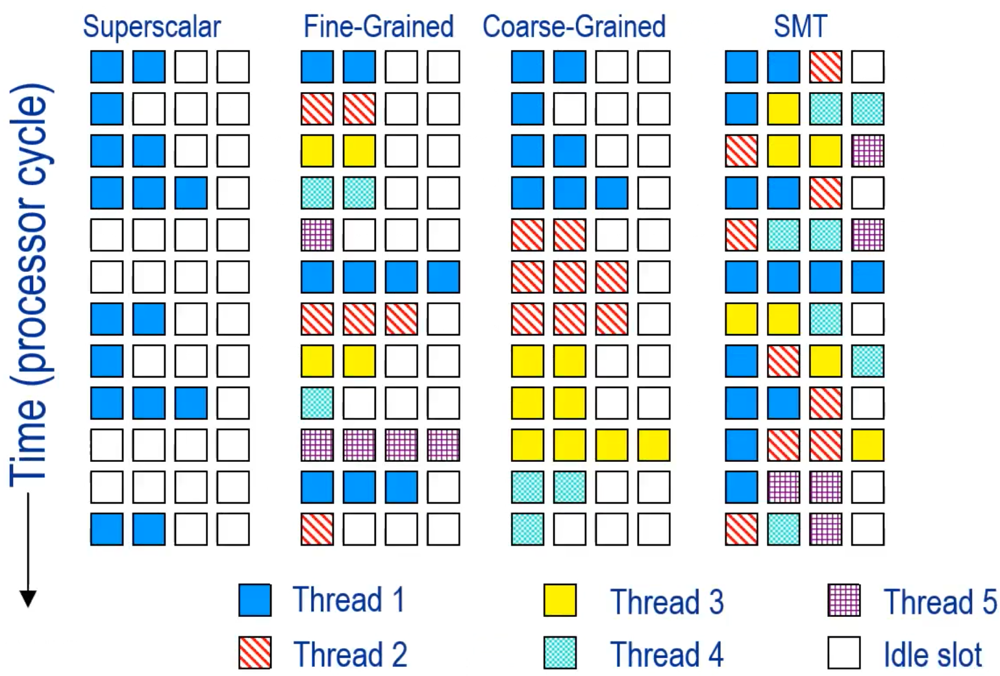
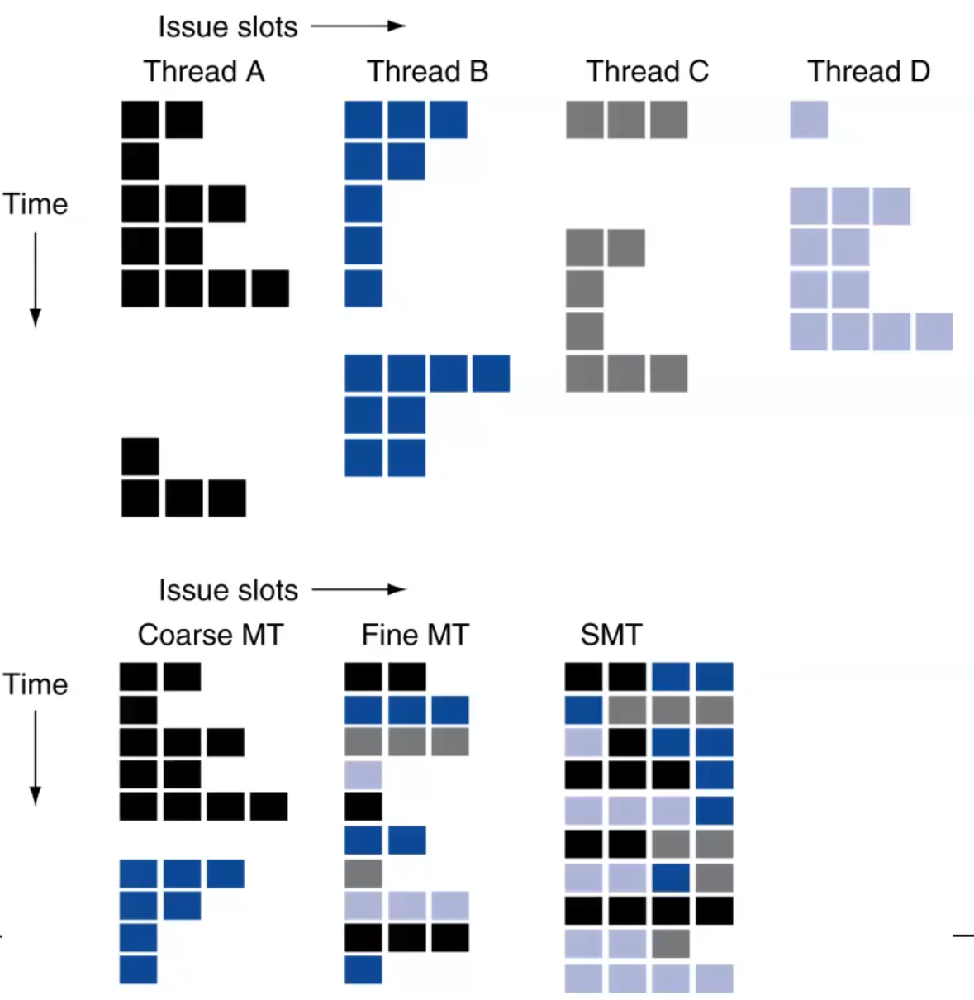

This lecture focuses on two main parts.

Thread level parallelism
instruction level parallelism

C has an explicit mechanism to parallelize your code.

Which is multi-threading.

And multi-threading is something not related to the underlying architecture.

It's agnostic.

Okay? So, right now, let's focus on our single core architecture.

We have to know that we do have superscalar architectures.

I simplified, of course, everything.

But we will reach a point where this will be clear.

And we will reach a point where we will be incrementally a kind of architecture like this.

Since the topic of this lecture is multitreading, we will see how we can go beyond by exploiting a different kind of parallelism, which is thread level parallelism.

Superscalar architecture?

A superscalar architecture is a type of computer processor design that enables the execution of multiple instructions in parallel within a single clock cycle. In superscalar architecture, the CPU has multiple execution units that can perform independent operations concurrently.
Superscalar architectures are commonly used in modern high-performance processors, including those found in desktop computers, servers, and mobile devices.

So, multiprocess is easier, not really. We don't have that something can happen, we are very happy, and that's it.
But multi-threading is not exactly the same way, because each thread has its own context, that might have data shared with a thread with another.

How do we deal with multiple process and multiple threads?

So how do we deal, strictly constraining the scenario, with multi-threading? What is the main issue, in your opinion, about multi-threading?

Multi-threading has a huge cost to pay, because each thread has its own context.

So that means that we have to have multiple contexts that can be possibly active at the same time.

So, it's all about how do we switch the context.

Sorry? Give each thread a time of execution.
This is exactly related to the concept of fine-grained multi-threading, where each thread has the same amount of time and we continuously switch from one thread to the other.

Of course, if there are issues in the execution in this way, we can hide the latency of accessing, for example, the memory, because are you familiar with the concept of memory hierarchy?

Computer architecture has multiple levels of hierarchies, which can significantly impact performance. For example, accessing the hard disk can take up to a second, while accessing a register takes just one clock cycle or one nanosecond. This difference in latency can be crucial to the speed of the system.
That's the difference, broadly speaking.

The problem is that in this way, we are always guaranteeing the same time to each thread.But this might increase the latency.
It's the same principle as because our architecture and our instruction always take the same amount of clock cycle in our RISC architecture, even though some instruction might take fewer.
We sacrifice the latency of the single instruction to increase the overall throughput of our architecture.

There is a times for for the registers, for the instruction buffer, for the program counter logic and the cache and TLB store buffers.
Those components are replicated.

This example of fine-grained multithreading architecture is showing us that we have to replicate other components to handle the context and be always ready to switch.

Then there are a lot of details that complicate, further more, how to handle them.

This is basically it for the fine-grained multithreading.

Instead of having threads that each time are switched, we have that we keep the thread executing for a certain amount of time.

And this is interesting because it opens to a different strategy because we can visualize it in this way.

Coarse-grained multithreading architecture right now are not used that much.

If we look at single process architecture, we have seen superscalar in its basic version, fine-grained multithreading and coarse-grained multithreading.

Can we do better? Yes? Basically, it is always trying to build up more and more high-performing architecture.

Because, for example, with coarse-grained multithreading, we have to flush our pipeline, we have the risk of making it starving.

On the fine-grain, we have two issue windows, completely empty.

Which means that we are not doing anything.

Of course, I'm not stressed that much up to now, but the idea here is to combine thread-level parallelism and instruction-level parallelism.

So that we can take advantage of the resources of those components that are not used.

So that we can have other threads that begin the execution if there are available resources.

And in this way, we try to increase the utilization of our architecture more and more.

We try to exploit and squeeze more performance.

And this technique that combines both thread-level parallelism and instruction-level parallelism is called simultaneous multithreading.

Try to dynamically adapt based on a set of techniques that we will see afterwards.

The basic and the most important concept of GPUs is simultaneous multithreading.

So GPUs are not just a simile.

So GPUs are also simultaneous multithreading.

It's what makes those architectures extremely advanced.

Because it's not just a single level of parallelism.

And so the question here is how can we adapt and deal with such complexity, with such changing workloads? With heterogeneous systems.

Because what is happening is that we are trying to create and combine, as we will see in just a few seconds, different kind of system.

* In computer architecture, different systems are combined to achieve the most performance.
* The processor alone is not enough for tasks such as playing games in 4K or streaming on Twitch.
* GPUs are a common addition to systems, but they are heterogeneous systems with specialized components like tensor cores and ray tracing cores.
* FPGAs are another type of system that integrates different hardware components like logic lookup tables and on-chip memories.
