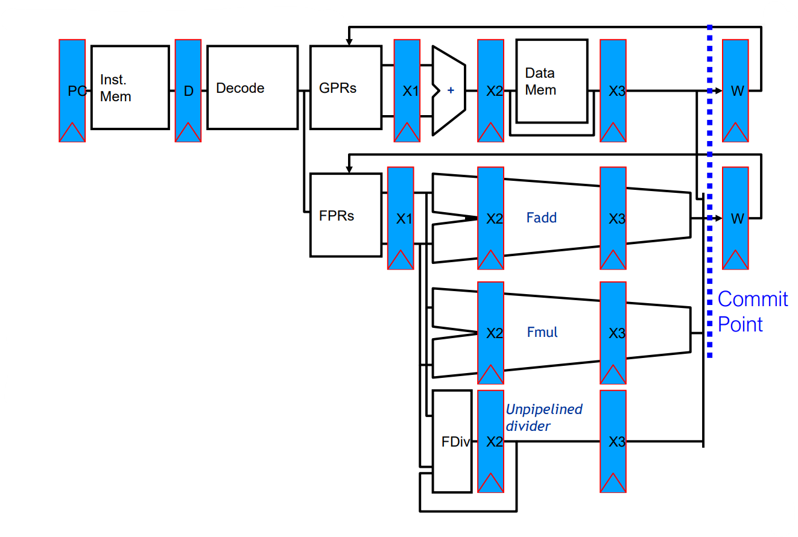

* SISD - Single Instruction Single Data : Uniprocessor systems
* MISD - Multiple Instruction Single Data: no practical configuration and no commercial systems
* SIMD - Single Instruction Multiple Data

* Simple programming model, low overhead,
flexibility, custom integrated circuits

* MIMD - Multiple Instruction Multiple Data: Scalable, fault tolerant, off-the-shelf micros

# Instruction Level Parallelism

Two strategies to support ILP:

* **Static Scheduling**: Rely on software for identifying potential parallelism.
* **Dynamic Scheduling**: Depend on the hardware to locate parallelism. The hardware reorders the instruction execution to reduce pipeline stalls while maintaining data flow and exception behavior. Main advantages:
    * It enables handling some cases where dependences are unknown at compile time
    * It simplifies the compiler complexity
    * It allows compiled code to run efficiently on a different pipeline.
    Those advantages are gained at a cost:
    * A significant increase in hardware complexity
    * Increased power consumption
    * Could generate imprecise exception

There are **limits of static scheduling** in advanced computer architectures.

* Unpredictable Branches: the compiler can't know ahead of time which branch will be taken. As a result, it cannot optimize the instructions that precede the branch.
* Variable Memory Latency: cache misses can result in delays as the processor waits for data to be fetched from memory. Compiler can't predict which memory blocks will be in cache at any given time. So it cannot optimize the instructions that rely on the data in memory.
* Code Size Explosion: Static scheduling can also result in a code size explosion. As we schedule instructions, we may need to insert more instructions to handle dependencies and ensure proper execution order.
* Compiler Complexity: static scheduling can also increase compiler complexity. The compiler must analyze the code for dependencies and optimize the instruction scheduling accordingly.

**Hardware intensive approaches dominate desktop and server markets**.

In summary, to solve ILP (Instruction Level Parallelism), we use pipelining as starting point to improve a sequential architecture. Dynamic scheduling is necessary to improve performance. To overcome the limitations of single-issue out-of-order execution, a Superscalar architecture is employed.

ILP = Potential overlap of execution among unrelated instructions

Pipeline CPI = Ideal pipeline CPI + Structural Stalls + Data Hazard Stalls Ideal pipeline CPI: measure of the maximum performance attainable by the implementation

Move forward a more complex architecture.
Pipelining becomes complex when we want high performance in the presence of:

* Long latency or partially pipelined floating-point units
* Multiple function and memory units
* Memory systems with variable access time
* Precise exception (divisions by zero, underflow and overflow at hardware level)

What about mixing Integer and Floating point operations?
Floating point operations take more clocks than the integer ones and so they have more latency. The implementation of floating point operations leads to the introduction of a new pipeline. The pipeline moves from balanced stages to multicycles to effectively deal with floating point operations. This change is necessary because floating point operations require more complex computations that cannot be handled efficiently in a single cycle.

General purpose registers (**GPRs**) contain information being manipulated by the user program currently running.Floating-point registers (**FPRs**) hold numeric values associated with some exponent.

Example of complex pipeline with floating point functional units:

An instruction will only enter the ISSUE stage if it does not cause a WAR or WAW hazard.
Only one instruction can be issued at a time, and in the case multiple instructions are ready, the oldest one will go first. So ISSUE stage can be seen as an infinite buffer, RAW can enter and will be solved here.

We can imagine that ISSUE is a data structure which can keep tracks all the operations.

FP ALU take 2 clocks

Pipeline CPI = Ideal pipeline CPI + Structural Stalls + Data Hazard Stalls + Control Stalls

where:

Structural stalls: HW cannot support this combination of instructions

data hazard stalls: : Instruction depends on result of prior instruction still in the pipeline

control hazards: Caused by delay between the fetching of instructions and decisions about changes in control flow (branches, jumps, exceptions)

ILP is a technique used to overlap machine operations such as addition, multiplication, loading, and storing to speed up their execution. **ILP is transparent to the user.**