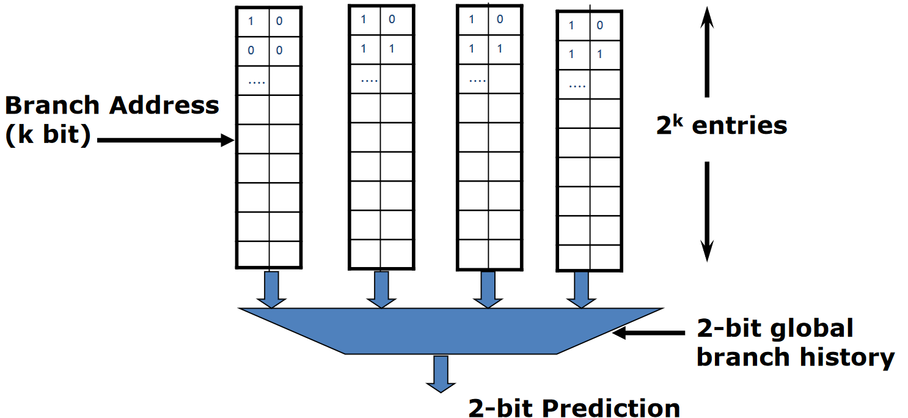
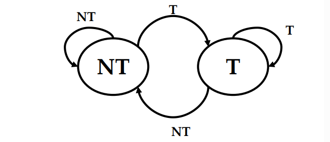
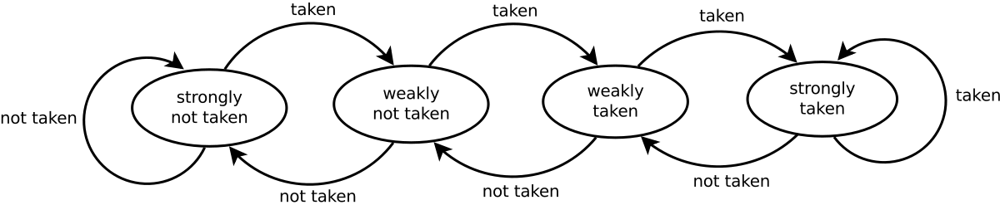
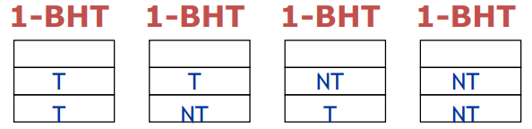

# Branch Prediction Techniques

To make the best guess at branch direction, speculation is used.

### Static Branch Prediction Techniques

With Static Branch Prediction the actions taken by the CPU at each branch are fixed at **compile** time. This technique is used in processors where the expectation is that the branch behavior is highly predictable at compile time.
Five static branch prediction techniques:

* Branch Always Not Taken (**Predicted-Not-Taken**)
* Branch Always Taken (**Predicted-Taken**)
* Backward Taken Forward Not Taken (**BTFNT**): examples are all the branches at the end of loops, it's assumed the backward-going branches are always taken.
* **Profile-Driven Prediction**: The branch prediction is based on profiling information collected from earlier runs. The method can use compiler hints.
* **Delayed Branch**:The compiler statically schedules an independent instruction in the branch delay slot. If we assume a branch delay of one-cycle (as for MIPS), we have one-delay slot. Three different ways:
    * **From before**: an instruction is taken (which it's known to not affects the data flow) from before the branch instruction and it's executed not before but after the branch instruction.
    * **From target**: an instruction is taken from the target of the branch. Usually used when the branch is taken with high probability, such as loop branches (backward branches).
    * **From fall-through**:This strategy is preferred when the branch is not taken with high probability, such as forward branches.

In general, the compilers are able to fill about 50% of delayed branch slots with valid and useful instructions, the remaining slots are filled with NOPs. The main limitations on delayed branch scheduling arise from: the restrictions on the instructions that can be scheduled in the delay slot. 

### Dynamic Branch Prediction Techniques

Dynamic branch prediction helps to predict the outcome of a branch instruction dynamically adapting to the program, using the past behavior. The idea is to use a **Branch History Table**. A **BHT** is a "cache" which contains 1 (or 2) bits for each entry (which is an hash of the branch address (indeed since it is an hash collisions are possible)) to indicate if the branch was recently taken. 

## Branch History Table

A simple version of BHT uses a 1-bit saturating counter:

{width=45%}

A 2-bit saturating counter is a state machine with four states.

Generally if there are nested loops (like 99% of code) the 2-BHT is a better option since it's proved that in average gives better performance.
In this case, the holy rule is: 

> "Best of 1-BHT is worst than worst-case of 2-BHT"

However, in **no**-nested loops situations, 1-BHT is not always outperformed by the 2-BHT!

We can both consider any problem with a collision between the branch addresses or not. If 2 branch addresses do not collide:

 

Otherwise the possible initializations are: 

A further expansion of this idea is that **recent branches may exhibit correlated behavior**. The n-bit-BHT technique only considers the branch's history, while an (m,n) **Correlating Branch** predictor takes into account the behavior of the previous m branches. Both a Branch History Register (BHR) and a Pattern History Table (PHT) can be used, with the PHT lookup selecting the most similar pattern to the recent branch execution flow and predicting based on that BHR.

## Early Evaluation

Branch prediction predicts the outcome of a branch, but knowing the true outcome as soon as possible is even more useful for better performance.
**Early evaluation** consists in moving an ALU for conditions to the ID stage to achieve early evaluation of conditions, reducing bubbles (stalls) needed. 

Early evaluation leads to data hazards when same registers are accessed by consecutive instructions, where the second one is a branch. This approach doesn't fully eliminate stalls as one stall is still needed before IF of next instruction.
The Early Evaluation of PC requires additional stalls if a comparison register is a destination of preceding ALU or load instructions, with two stalls needed if it's an immediately preceding load instruction.

