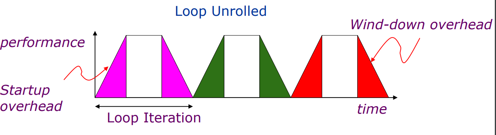
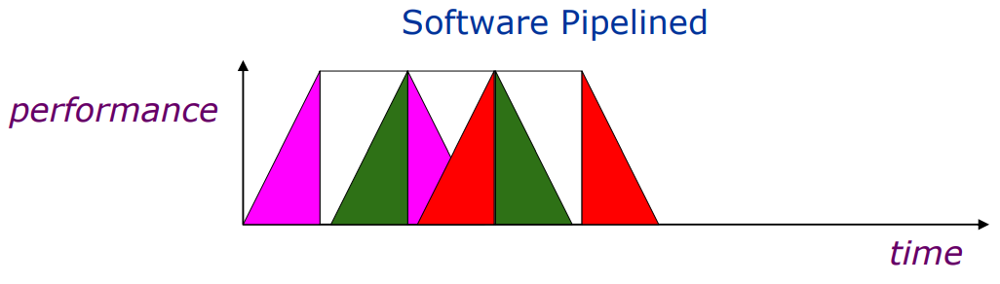
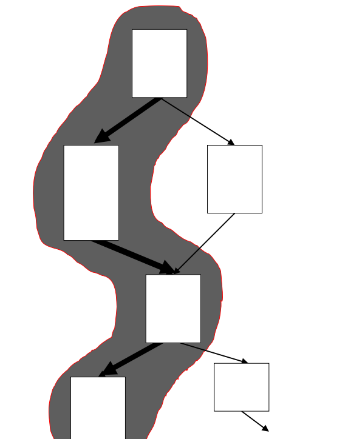
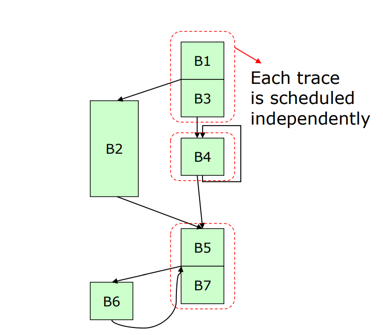

# VLIW 

VLIW (Very Long Instruction Word) is a CPU architectural style that overlaps the execution of multiple machine-level operations within a single flow of control.
VLIW is used for **exploiting instruction-level parallelism (ILP) in programs, especially, for performing more than one basic (primitive) instruction at a time**.

Multiple operations packed into one instruction

Try to keep pipeline full (in single issue pipelines) or utilize all FUs in each cycle (in VLIW) as much as possible to reach better ILP and therefore higher parallel speedups.

A VLIW instruction can be thought of as several RISC instructions joined together.

VLIW: Pros and Cons

Pros:

* Simple HW
* Easy to extend the # FUs
* Good compilers can effectively detect parallelism

Cons:

* Huge number of registers to keep active the FUs
* Large data transport capacity between FUs and register files and between register files and memory
* High bandwidth between i-cache and fetch unit
* large code size
* binary compatibility

### VLIW for static scheduling

VLIW Compiler has the responsibility of maximizing parallel execution through the exploitation of ILP and LLP. To achieve this, the compiler must schedule instructions according to time constraints and dependencies among tasks. This mapping ensures intra-instruction parallelism while avoiding data hazards and minimizing the total execution time for the program. The VLIW Compiler typically separates operations with explicit NOPs to guarantee no interlocks.

Static detection and resolution of dependences ( static scheduling): accomplished by the compiler  dependences are avoided by code reordering. Output of the compiler: reordered into dependencyfree code.

Typical example: VLIW (Very Long Instruction Word) processors expect dependency-free code

Static Scheduling methods:

* Simple code motion
* Loop unrolling & loop peeling
* Software pipeline
* Global code scheduling (across basic block)
    * Trace scheduling
    * Superblock scheduling
    * Hyperblock scheduling
    * Speculative Trace scheduling

Simple code motion is just moving code instructions.

Loop Execution: Unrolling exposes more computation that can be scheduled to minimize stalls.
If there aren't loop-carried dependencies we can "unroll" the interations of any loop and perform them in a parallel way.

Software pipelining pushes even further this idea, permetting the loop iterations that are executed parallely to also be pipelined.

Global code scheduling (across basic block)

A trace is a portion of the code/control flow ... it's basically a branch path.

Use profiling feedback or compiler heuristics to find common branch paths

Trace scheduling cannot proceed beyond a loop barrier

Traces scheduling schedules traces in order of decreasing probability of being executed

So, most frequently executed traces get better schedules
Traces are scheduled as if they were basic blocks.

It then **adds compensation code at the entry and exit of each trace to compensate for any effects that out-of-order execution may have had**.