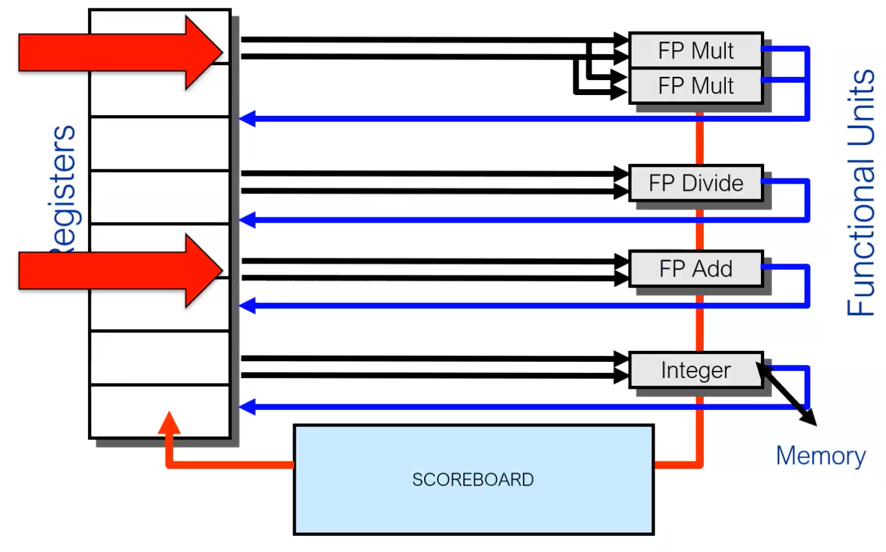

# Dynamic scheduling

: Depend on the hardware to locate parallelism

Problem: data dependences that cannot be hidden with bypassing or forwarding cause hardware stalls of the pipeline

allow instructions behind a stall to proceed

HW rearranges the instruction execution to reduce stalls

Enables out-of-order execution and completion (commit)

Out-of order execution introduces possibility of WAR, WAW data hazards.

Suppose a data structure keeps track of all the instructions in all the functional units


### Scoreboard 

- in-order issue
- out-of-order read operands
- out-of-order execution
- out-of-order completion
- no forwarding
- Control is centralized into the Scoreboard

Simpliefied view: 


| ISSUE | READ OPERAND | EXE COMPLETE | WB |
| :---: | :---: | :---: | :---: |
| Decode instruction; | Read operands; | Operate on operands; | Finish exec; |
| Structural FUs check; WAW checks | WAR if need to read RAW check; | Notify Scoreboard on Completion; | WAR \&Struct check (FUs will hold results); Can overlap issue/read\&write 4 Structural Hazard; |


A SCOREBOARD: A Data Structure for Correct Issues Keeps track of the status of Functional Units.

CDC6600 Scoreboard: Introduced in the CDC 6600 (the world's fastest computer from 1964 to 1969)


Four Stages of Scoreboard Control

The ID stage is divide into:

* Issue: decode and check structural hazard
* Read Operands: wait until no data hazards

In-order issue BUT out-of-order read-operands

So imagine if three issues execution writing (commiting) ...
all our architectures are in order issues

The crucial idea: preserved the order of the issues (instructions) but each instructions read the operands out of order. When the source operands are available, the scoreboard tells the functional unit to proceed to read the operands from the registers and begin execution. RAW hazards are resolved dynamically in this step, and instructions may be sent into execution out of order.

Issue: Decode instructions & check for structural hazards. Instructions read the operands in an out of order way.

* Instructions issued in program order (for hazard checking)
* If a functional unit for the instruction is free and no other active instruction has the same destination register (WAW), the scoreboard issues the instruction to the functional unit and updates its internal data structure.
* If a structural or a WAW hazard exists, then the instruction issue stalls, and no further instructions will issue until these hazards are cleared.

Read operands: Wait until no data hazards, then read operands. An operand can be used as a source operand if:

* No active instruction, which was issued earlier, will write it.
* A functional unit is currently writing its value in a register.

The third phase is the execution. FUs are characterized by **latency** (the effective time used to complete one operation) and the **initiation interval** (the number of cycles that must elapse between issuing two operations to the same functional unit).

4th stage: once the scoreboard is aware that the functional unit has completed execution, the scoreboard checks for **WAR** hazards. If none, it writes results. If WAR, then it stalls the instruction.
For example here


Here the scoreboard would stall `SUBD` in the `WB` stage, **at the end of the execution phase**.

Scoreboard keeps track of dependences and state of operations

So recap:

ISSUE (IN-ORDER): check for WAW
READ OPERANDS (OUT-OF-ORDER): RAW
WRITEBACK (OUT-OF-ORDER): WAR

## Scoreboard structure:


* Instruction status
Example (each numeber is the clock cycle)
| Instruction |  | j | k | Issue | Read Operands | Exec Completion |Write Resul |
| :---: | :---: | :---: | :---: | :---: | :---: | :---: | :---: |
| LD | F6 | 34+ | R2 | 1 | 2 | 3 | 4 |
| LD | F2 | 45+ | R3 | 5 | 6 | 7 | 8 |
| MULTD | F0 | F2 | F4 | 6 | 9 | 19 | 20 |
| SUBD | F8 | F6 | F2 | 7 | 9 | 11 | 12 |
| DIVD | F1 | F0 | F6 | 8 | 21 | 61 | 62 |
| ADDD | F6 | F8 | F2 | 13 | 14 | 16 | 22 |

In this case:

Integer: 1 clock cycles
Multi: 10 cc
Add: 2cc
Divide: 40cc


* Functional Unit status: we track only registers information ... if they are not registers but come from the memory is not a problem. 
    * `busy` indicating unit status
    * `Op` for operation type
    * `Fi` for destination register
    * `Fj` and `Fk` for source registers
    * `Qj` and `Qk` for the functional units outputting the source registers
    * `Rj` and `Rk` for flags indicating if the `Fj` and `Fk` registers are ready.
* Register result status: Indicates which functional unit will write each register. Blank if no pending instructions will write that register


(note that you start counting the decrease of the clock latency used by operations from the reading operands )


Workflow -> each functional unit has some latency which differs .. generally multiply is more than integer operations/loads and the divide is more than multiply. each instruction at Read Operands stage can be executed out of orders and each operation has to wait that the necessary registers are free

"The lecture is about advanced architectures, and we start by discussing the workflow. Each functional unit in a processor has a different latency, with multiplication taking longer than integer operations/loads and division taking longer than multiplication. Instructions can be executed out of order at the Read Operands stage, however, each operation must wait for the necessary registers to become free."


Everything is out of order except the Issue phase. 


You have to check the "pool" of function units. 


scoreboard with renaming: 

| ISSUE | READ OPERAND | EXE COMPLETE | WB |
| :---: | :---: | :---: | :---: |
| $\begin{array}{c}\text { Decode } \\\text { instruction; } \\\text { allocate new } \\\text { physical register } \\\text { for result }\end{array}$ | Read operands; | Operate on operands; | Finish exec; |
| $\begin{array}{c}\text { Structural FUs } \\\text { check; } \\\text { WAW-checks; } \\\text { free physical } \\\text { registers check }\end{array}$ | $\begin{array}{c}\text { RAW check; } \\\text { WAR if need to-read }\end{array}$ | $\begin{array}{c}\text { Notify Scoreboard on } \\\text { completion; }\end{array}$ | $\begin{array}{c}\text { WAR \& Struct check } \\\text { (FUs will hold results); } \\\text { Can overlap } \\\text { issue/read\&write; }\end{array}$ |


---

## Lec8 Dynamic Scheduling TOMASULO 

The idea in spaghettata mode is: I want to dynamically schedule some operation before others. Why? It can happen that an instruction $A$ is blocking another instruction $B$ because everything is pipelined and the operands of $A$ are used somewhere. If $B$ has its operands available, we would like to execute it (control flow permitting). To do this we would like to "save" $A$ so that we can execute later, when the resources will be available. To do so we need buffers . These buffers are called "Reservation Stations". The mechanism of "How damn will the saved operation be woken up?" is based on a "broadcast system" called "Common Data Bus".

Main features: 

- Like scoreboard the goal is the same: high performance w/o special compilers.
- Decentralization of the control unit distributing the buffers among FUs (vs. centralized in scoreboard)
- **register renaming** is a technique that abstracts logical registers from physical registers. Every logical register has a set of physical registers associated with it.
- Register Renaming allows to avoid WAR and WAW hazards
- The concept explained in spaghettata mode: "I'm a FU and I'm waiting for an operand which is used atm by another FU. I can **abstract** over the register and use something like a **pointer**"
- Reservation stations (RS) allow for register renaming. 
- RS permit the CPU to fetch and re-use a data value as soon as it has been computed, rather than waiting for it to be stored in a register and re-read.
- Registers names which are currently used by other FU, are removed ("renamed") in Reservation Stations


- IN-ORDER ISSUE
- OUT-OF-ORDER EXECUTION
- OUT-OF-ORDER COMPLETION
- REGISTER RENAMING based on Reservation Stations to avoid WAR and WAW hazards
- Results dispatched to RESERVATION STATIONS and to RF through the Common Data Bus
- Control is distributed on Reservation Stations
- Reservation Stations offer a sort of data forwarding!


### 17 - 04 

data dependences that cannot be hidden with bypassing or forwarding cause hardware stalls of the pipeline • Solution: allow instructions behind a stall to proceed – HW rearranges the instruction execution to reduce stalls • Enables out-of-order execution and completion (commit) – Out-of order execution introduces possibility of WAR, WAW data hazards.

Suppose a data structure keeps track of all the instructions in all the functional units The following checks need to be made before the Issue stage can dispatch an instruction • Is the required function unit available? • Is the input data available? → RAW? • Is it safe to write the destination? → WAR? WAW? • Is there a structural conflict at the WB stage?


Execution Process of Scoreboard: 

- **Issue**: fu is free (structural) and check WAW
- **Read operands**: checks availability of source operands and resolve RAW hazards dynamically with out-of-order execution
- **Execution**: fu notifies the scoreboard when the instruction is completed
- **Write result**: scoreboard checks WAR hazards and stalls the completing instruction if necessary

Issue always in order, execution out of order. This is an in-order-issue architecture. 

### Tomasulo pipeline 

| ISSUE | EXECUTION | WRITE |
| :---: | :---: | :---: |
|   Get Instruction from  Queue and Rename  Registers  | Execute and Watch CDB| Write on CDB|
|   Structural RSs check WAW and WAR solved  by Renaming  (!!!in-order-issue!!!) |   Check for Struct on FUs RAW delaying Struct check on CDB |   (FUs will hold results unless  CDB free)  RSs/FUs marked free  |


### Tomasulo 

another approach to eliminate stalls. 

It combines scoreboard with register renaming. 
Execution Process of Scoreboard: 

- **Issue**: it sends operands to the reservation station and performs register renaming.
- **Execution**: executes when operands on CDB are available 
- **Write result**: When result is available, write it to the CDB


example


| Instruction | ISSUE | $\begin{array}{c}\text { START } \\\text { EXE }\end{array}$ | WB | Hazards Type | RSi | Unit |
| :--- | :---: | :---: | :---: | :---: | :---: | :---: |
| I1: LD $F1, 0($R1) | $\mathbf{1}$ | $\mathbf{2}$ | $\mathbf{5}$ |  | RS1 | LDU1 |
| I2: FADD $F2, $F2, $F3 | $\mathbf{2}$ | $\mathbf{3}$ | $\mathbf{6}$ |  | RS4 | FPU1 |
| I3: ADDI $R3, $R3, 8 | $\mathbf{3}$ | $\mathbf{4}$ | $\mathbf{7}$ | Struct CDB | RS7 | ALU1 |
| I4: LD $F4, 0(R2) | $\mathbf{4}$ | $\mathbf{5}$ | $\mathbf{8}$ |  | RS2 | LDU2 |
| 15: FADD $F5, $F4, $F2 | $\mathbf{5}$ | $\mathbf{9}$ | $\mathbf{1 2}$ | RAW $F4, RAW $F2 | RS5 | FPU1 |
| I6: FMULT $F6, $F1, $F4 | $\mathbf{6}$ | $\mathbf{9}$ | $\mathbf{1 3}$ | RAW $F4, Struct CDB | RS6 | FPU2 |
| 17: ADDI $R5, $R5, 1 | $\mathbf{7}$ | $\mathbf{8}$ | $\mathbf{9}$ |  | RS8 | ALU1 |
| I8: LD $R6, 0($R4) | $\mathbf{8}$ | $\mathbf{9}$ | $\mathbf{1 4}$ | Struct CDB | RS1 | LDU1 |
| I9: SD $F6, 0($R5) | $\mathbf{9}$ | $\mathbf{1 4}$ | $\mathbf{1 7}$ | RAW $F6 | RS2 | LDU2 |
| I10: SD $F5, 0($R6) | $\mathbf{1 0}$ | $\mathbf{1 5}$ | $\mathbf{1 8}$ | RAW $F5, RAW $R6 | RS3 | LDU1 |


### Register renaming  From wikipedia: 

```c
r1 = m[1024]
r1 = r1 + 2
m[1032] = r1
r1 = m[2048]
r1 = r1 + 4
m[2056] = r1
```

The instructions in the final three lines are independent of the first three instructions, but the processor cannot finish `r1 = m[2048]` until the preceding `m[1032] = r1` is done.
This restriction is eliminated by changing the names of some of the registers:

```c
r1 = m[1024]
r1 = r1 + 2
m[1032] = r1
r2 = m[2048]
r2 = r2 + 4
m[2056] = r2
```

In addition to eliminating data dependencies between instructions, register renaming provides several other advantages: it allows for speculative execution, stalls reduction, instruction scheduling semplification and reduction of explicit load and store operations. 
