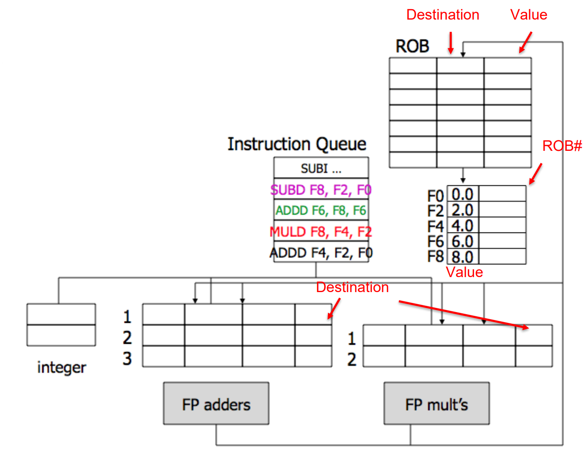

# HW-based speculation 

HW-based Speculation combines what we have seen so far in this course + Speculation:

- Dynamic Branch Prediction 
- Dynamic Scheduling
- Speculation

Speculation consists to issue and execute instructions dependent on a branch before the branch outcome is known to allow instructions to execute out-of-order but to force them to commit in-order. 

When an instruction is no longer speculative, we allow it to update the register file or memory (instruction commit).
Outcome of branches is speculated and program is executed as if speculation was correct.
Out of order means always "buffer". In this case we use a "**Reorder Buffer**" which holds instructions in FIFO order. 
Each entry holds program counter, instruction type, destination register specifier and value if any, and exception status (info often compressed to save hardware). 

The reorder buffer is added over Tomasulo Algorithm: 

1. Issue: 
	- Get instruction from FP Op Queue 
	- If reservation station and reorder buffer slot are free, issue instruction and send operands and reorder buffer number for destination. 
	- This stage is sometimes called "dispatch".

2. Execution: 
	- Operate on operands (EX) 
	- When both operands are ready, then execute. 
	- If not ready, watch CDB for the result. 
	- When both are in reservation station, execute. 
	- Checks RAW 
	- This stage is sometimes called "issue".

3. Write result: 
	- Finish execution (WB) 
	- Write on Common Data Bus to all awaiting FUs and reorder buffer. 
	- Mark reservation station available. 

4. **Commit**: 
	- Update register with reorder result 
	- When instruction at the head of the reorder buffer and result present, update register with the result (or store to memory). 
	- Remove instruction from reorder buffer. 
	- Mispredicted branch flushes reorder buffer. 

"Instead of processing instructions strictly in the sequential program order, the CPU executes them as soon as all required resources are available. While the execution unit of the current operation is occupied, other execution units can run ahead."

{width=50%}

With Tomasulo we are still bounded by branches ! Tomasulo permits out of order execution of instruction that **surely** are executed. ReOrder Buffer permits to handle branches using speculation, since the fundamental concept is to have a buffer where we can temporaly store already executed instruction that are commited depending on the outcome of the branch. 

Tomasulo with ROB 

| ISSUE | EXECUTION | WRITE | Сомміт |
| :---: | :---: | :---: | :---: |
|   Get Instruction  from Queue and  Rename  Registers  Add Instruction  to ROB  |   Execute and Watch  CDB |  Write on CDB Write on ROB  |   Update register with  result (or store to  memory) remove Instr from  ROB  |
|  Structural RSs  check Structural ROB  check WAW and WAR  solved by  Renaming  (!!!in-order-  issue!!!) |   Check for Struct on  FUs RAW delaying Struct check on CDB |   (FUs will hold results  unless CDB free)  RSs/FUs marked free  |  In-order commit Mispredicted branch  flushes ROB  |