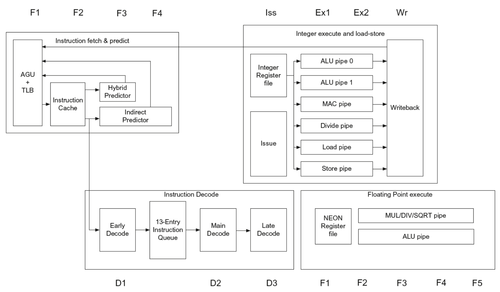

* SISD - Single Instruction Single Data : Uniprocessor systems
* MISD - Multiple Instruction Single Data: no practical configuration and no commercial systems
* SIMD - Single Instruction Multiple Data

* Simple programming model, low overhead,
flexibility, custom integrated circuits

* MIMD - Multiple Instruction Multiple Data: Scalable, fault tolerant, off-the-shelf micros

A scalar architecture can let instructions from different threads to be executed at
the same clock cycle. FALSE! A scalar architecture is a single issue architecture.

Limits of ILP Exploiting

Instruction Level Parallelism cannot be squeezed beyond a certain point.

 

Dynamic scheduling is very expensive, and also very hard to design

and to verify

 

Register renaming also has its limits: using a bottomless buffer for

names is not a realistic idea, and ultimaltely does not resolve all

conflicts

 
Jump and branch predictions are not 100% accurate

  

We have still to deal with latency in memory

  

In case of superscalar architectures, we cannot issue too many

instructions at the same time: we still have to deal with hazards

  

ILP is not parallel processing! The first is just pipeline operations

to enhance throughput, the second is a non-user-transparent way of

executing programs.

Temporal Multithreading:

  

The parallelism is put in place by

switching between tasks over time and preemptively, in order to give

the illusion of parallelization. This is not really hardware

multithreading, because the maximum number of tasks (processes, threads)

in execution at the very same time is always one.

  

Fine grain parallelism: each instruction is followed by another

thread instruction. This hides short and long stalls, because a

stalled thread "leaves the pipeline free" for another thread. The

overall completion rate of threads is lowered, though.

  

Coarse grain parallelism: switch between threads only when a long

stall is asked from a thread. This enables the threads to interleave

in a more efficent way.

Superscalar architecture enables the execution of multiple independent instructions in parallel within a single clock cycle. This design is commonly used in modern high-performance processors but remember that superscalar processors **can't fully exploit the ILP** in programs due to architectural limits like data dependencies: there is always a limit of parallelization of dependent instructions.  
Also multi-threading has a high cost due to each thread having its own context and there are different techniques to achieve it:

- **Fine-grained** multithreading involves switching between different threads at a very fine level of granularity, such as after every instruction. This allows for maximum utilization of resources but can also lead to increased overhead due to **frequent context switching**.
- **Coarse-grained** multithreading involves switching between different threads at a coarser level of granularity, such as after completing a group of instructions from one thread before moving on to another thread. This reduces the overhead associated with context switching but may not fully utilize available resources.
- **Simultaneous multithreading** (SMT) is similar to fine-grained multithreading but goes further by allowing multiple instructions from different threads to be executed simultaneously within each clock cycle.

 
Obviously there are drawbacks in each approach:

- **Fine-grain** multithreading has empty issue windows, causing idle time. 
- **Coarse-grained** multithreading architecture is not commonly used, since it requires flushing the pipeline and can result in starvation. 
- **SMT** requires more complex hardware than either fine- or coarse-grained multithreading but can provide higher levels of parallelism and better resource utilization.

What actually happens in real world? Basically different systems are combined to achieve the most performance: for example cpu alone is not enough for tasks such as playing games in 4K or streaming on Twitch: GPUs are a common addition to systems. FPGAs are another type of system that integrates different hardware components like logic lookup tables and on-chip memories.

## Superscalar Architecture 

Superscalar architectures allow for multiple instructions to be executed per clock cycle, but this has limitations. ILP has an upper bound: 

- Dynamic scheduling and register renaming are expensive and have limits.
- Jump and branch predictions are not always accurate
- Memory latency is a huge issue. 
- Hazards must also be considered in superscalar architectures. 

This depends on technology and complexity, and power consumption and design complexity are also relevant. SISD architectures have hit this upper bound, and alternative architectures must be explored for increased performance: SIMD, MIMD, MISD.

Theoretically, a perfect dynamic-scheduled CPU should be able to predict all branches perfectly, look arbitrarily far ahead to find a set of instructions to issue, rename all register uses to avoid all kinds of hazards, determine and rename data dependencies among instructions, handle memory dependencies among issuing instructions, and provide enough replicated functional units to allow all ready instructions to issue. 
**Window size** affects the number of comparisons necessary to determine RAW dependences, if the size of the windows is $n$ and we have an infinite number of registers we should need $n^2 - n$ comparisons. A window size of $32$ to $200$ can result in over $2400$ comparisons.

|                                | IBM Power 5 (2004-2006)  Dual core @ 1.5-2.3 GHz               |  
| ------------------------------ | -------------------------------------------------------------- |
| Instructions Issued per  clock | 4                                                                  |
| Instruction Window Size        | 200                                                               |
| Renaming Registers             | 48 integer + 40 FP                                                  |
| Branch Prediction              | 2 \%  to 6\% misprediction  (Tournament Branch  Predictor)        |
| Cache                          | L1 (32KI+32KD)/core  L2 1.875MB/core  L3 36 MB/chip (off chip)      |

Choosing which instructions can be executed every cycle for CPUs is a complex decision due to the high number of permutations. This results in longer computation time and lower processor frequency. Therefore, the best approach is to select the architecture that best suits your objectives, as it involves making trade-offs.

### Raspberry Pi 3 CPU: ARM Cortex-a53 pipeline

Increasing performance often means increasing power consumption. The focus should be on energy efficiency: 
> "Is a technique increases power consumption at a rate faster than it increases performance?"

Multiple issue processors are not energy efficient as the logic overhead incurred in issuing multiple instructions grows faster than the issue rate.

[09.Parallel Programming](../../Advanced%20Algorithms%20and%20Parallel%20Programming/src/09.Parallel%20Programming.md) 

It was announced October 30, 2012[[2]](https://en.wikipedia.org/wiki/ARM_Cortex-A53#cite_note-announce-2) and is marketed by ARM as either a stand-alone, more [energy-efficient](https://en.wikipedia.org/wiki/Performance_per_watt "Performance per watt") alternative to the more powerful Cortex-A57 microarchitecture, or to be used alongside a more powerful microarchitecture in a [big.LITTLE](https://en.wikipedia.org/wiki/ARM_big.LITTLE "ARM big.LITTLE") configuration.

**ARM big.LITTLE** is a [heterogeneous computing](https://en.wikipedia.org/wiki/Heterogeneous_computing "Heterogeneous computing") architecture developed by [ARM Holdings](https://en.wikipedia.org/wiki/ARM_Holdings "ARM Holdings"), coupling relatively battery-saving and slower processor cores (_LITTLE_) with relatively more powerful and power-hungry ones (_big_). Typically, only one "side" or the other will be active at once, but all [cores](https://en.wikipedia.org/wiki/Processor_core "Processor core") have access to the same memory regions

The ARM big.LITTLE architecture, considering the fact that is a multicore
architecture where the cores are sharing the same ISA, cannot be considered a
heterogenous architecture.
Circle the right answer: True False
Answer 1.2
FALSE! The (at least) two cores are different, therefore, it’s an heterogenous
architecture even if they are sharing the same ISA.

