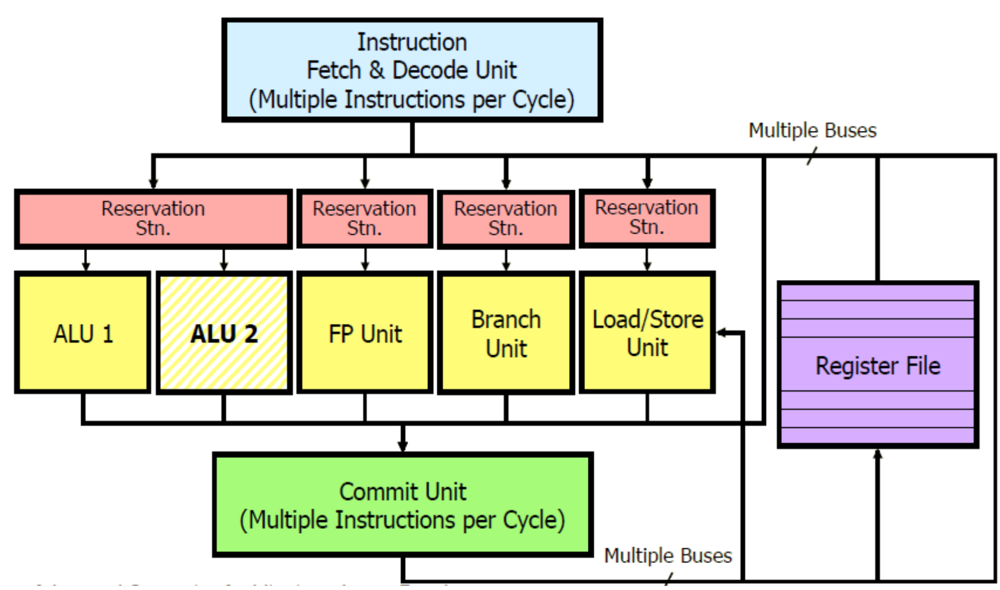
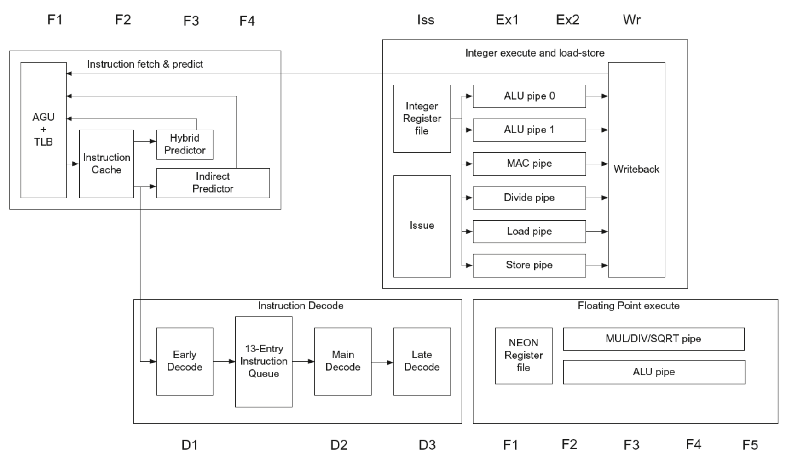
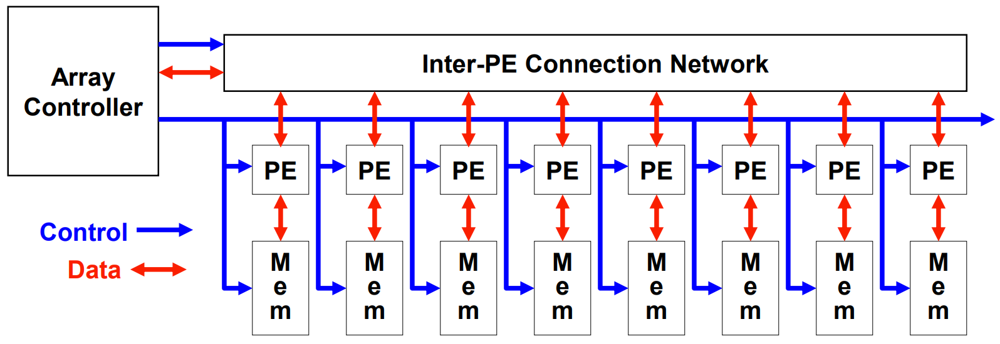
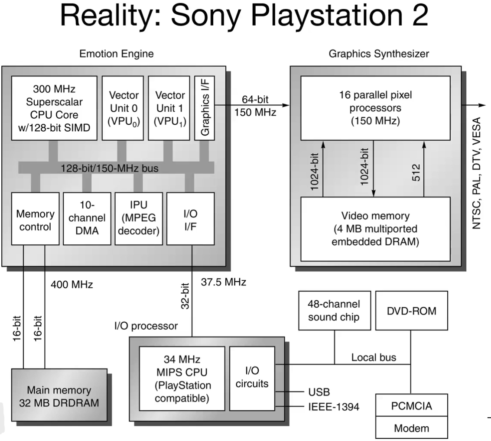
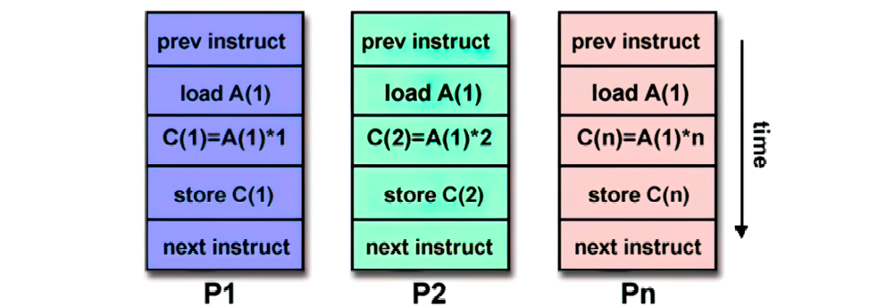
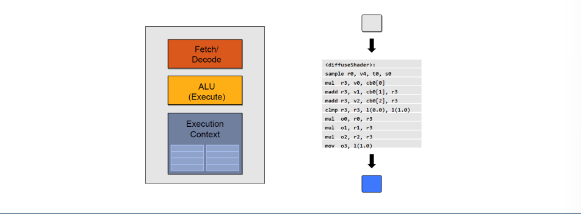
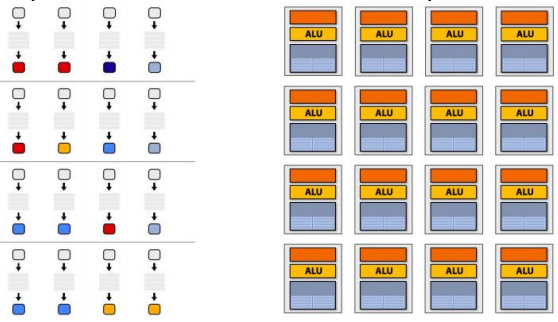
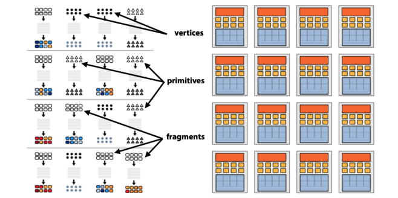
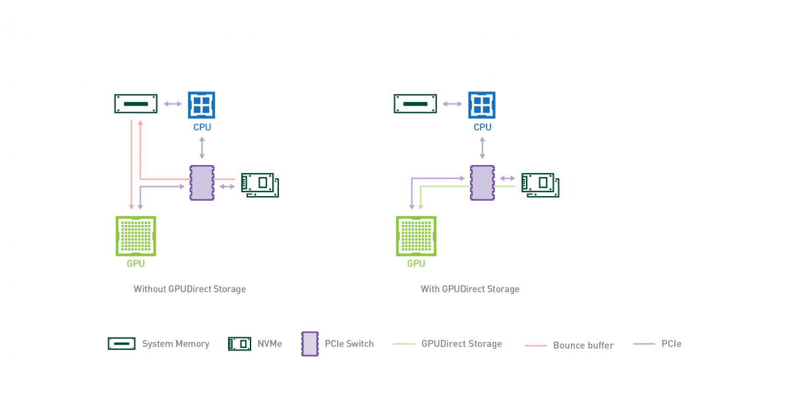
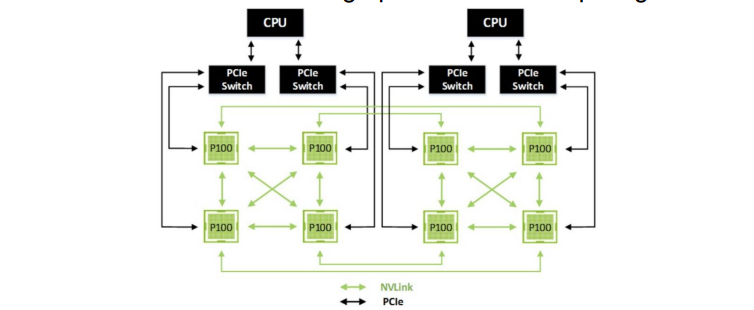

# Parallel Architectures

## Superscalar Architecture 

Superscalar architectures allow for multiple instructions to be executed per clock cycle, but this has limitations. ILP has an upper bound: 

- Dynamic scheduling and register renaming are expensive and have limits.
- Jump and branch predictions are not always accurate
- Memory latency is a huge issue. 
- Hazards must also be considered in superscalar architectures. 

This depends on technology and complexity, and power consumption and design complexity are also relevant. SISD architectures have hit this upper bound, and alternative architectures must be explored for increased performance: SIMD, MIMD, MISD.

Theoretically, a perfect dynamic-scheduled CPU should be able to predict all branches perfectly, look arbitrarily far ahead to find a set of instructions to issue, rename all register uses to avoid all kinds of hazards, determine and rename data dependencies among instructions, handle memory dependencies among issuing instructions, and provide enough replicated functional units to allow all ready instructions to issue. 
**Window size** affects the number of comparisons necessary to determine RAW dependences, if the size of the windows is $n$ and we have an infinite number of registers we should need $n^2 - n$ comparisons. A window size of $32$ to $200$ can result in over $2400$ comparisons.

|                                | IBM Power 5 (2004-2006)  Dual core @ 1.5-2.3 GHz               |  
| ------------------------------ | -------------------------------------------------------------- |
| Instructions Issued per  clock | 4                                                                  |
| Instruction Window Size        | 200                                                               |
| Renaming Registers             | 48 integer + 40 FP                                                  |
| Branch Prediction              | 2 \%  to 6\% misprediction  (Tournament Branch  Predictor)        |
| Cache                          | L1 (32KI+32KD)/core  L2 1.875MB/core  L3 36 MB/chip (off chip)      |

Choosing which instructions can be executed every cycle for CPUs is a complex decision due to the high number of permutations. This results in longer computation time and lower processor frequency. Therefore, the best approach is to select the architecture that best suits your objectives, as it involves making trade-offs.

### Raspberry Pi 3 CPU: ARM Cortex-a53 pipeline

Increasing performance often means increasing power consumption. The focus should be on energy efficiency: 
> "Is a technique increases power consumption at a rate faster than it increases performance?"

Multiple issue processors are not energy efficient as the logic overhead incurred in issuing multiple instructions grows faster than the issue rate.

[09.Parallel Programming](../../Advanced%20Algorithms%20and%20Parallel%20Programming/src/09.Parallel%20Programming.md) 

## SIMD 

Vector computation (SIMD) requires each processing element to have its own memory space and necessitates vectorized architecture on multiple levels including registers, buses, and I/O ports. Vectorization can savee time by summing up an entire loop in a single vector instruction, if iterations are independent. A notable example of complex vectorized architecture is Sony Playstation 2, which combines a graphics synthesizer similar to a modern GPU with a CPU that features a superscalar architecture with two vector units, a sort of SIMD extension to the cpu.

### PS2 SIMD

Vector ISAs require vector instructions that handle multi-dimensional memory and processing. VISAs are compact, scalable and expressive. A single instruction bundles several operations, implying more memory access and data independency. 

Vector applications limited to scientific computing?

- Multimedia processing including compression, graphics, audio synthesis, and image processing
- Standard benchmark kernels such as Matrix Multiply, FFT
- Lossy and Lossless compression techniques
- Cryptography algorithms
- Speech and handwriting recognition
- Operating systems, Networking, Databases, Language run-time support

## MIMD 

Nowadays, the most common type of parallel computer are MIMD. MIMD architectures allow for multiple instructions to execute at the same time on different data, which can lead to super different computations on the same chip. MIMD processors can be arrays of processors that work asynchronously on different data, including homogeneous and heterogeneous architectures, as well as clusters of independent machines. 
Highlights:

#### The console war between Xbox 360 and Playstation 3

The console war between Microsoft's Xbox 360 and Sony's Playstation 3 influenced the development of their respective architectures. Both systems used IBM's Powercore as the main processor, but the approaches differed: 

- Sony used the **Cell** processor, which contained a single 64-bit Power core and 8 specialized SIMD coprocessors. This enabled additional vector processing without changing the main CPU's ISA. 
- Microsoft's **Xenon** processor was composed of **three identical CPUs**, each containing its own SIMD extension, which modified the ISA.

Completely different approaches, one more oriented with a SIMB approach, the other more oriented with MIMD since three different CPUs. 

> "If you program the software having in mind how the architecture is designed you will always gain better performance"

In a period of resurgence of applications /such as graphics, machine vision, speech recognition, machine learning and similar stuff, which requires large numerical computations that are often trivially data parallel SIMD-based architectures are most efficient way to execute these algorithms. 

> Nvidia ceo statement it's not just a matter of waiting for more transistor but designing the architecture, every part of the stack, from the hardware to the software to get more performance. 

## GPUs 

GPU in computers:

- In the 90s, high computational power in video games was needed, GPUs born
- GPUs also accelerate general-purpose computing functions with similar characteristics to graphics computing
- Extensive data parallelism
- Few control instructions
- Many math operations
- Few synchronization

A GPU simple core is very simple. 

GPU is a throughput-oriented architecture. This means that the latency of the single stream is increased but the overall throughput is increased as well. As a result, the latency of the overall task execution is decreased. The interleaving of streams is managed by an HW scheduler and large register files are used to store execution contexts.

### GPU pipeline

Computer graphics is parallel by nature and fragments, vertices and pixels are processed independently, meaning the function is executed for each fragment.

- Nvidia CUDA architecture is built around a scalable array of multithreaded Streaming Multiprocessors (SMs). 
- A CUDA program distributes kernel grid blocks to multiprocessors with available execution capacity. 
- Multiple thread blocks can execute concurrently on a single multiprocessor. 

The "warp" concept, introduced with the Fermi architecture, executes threads in groups of 32 threads. Similarly to Fermi architecture, Kepler's one incorporates register scoreboarding for long-latency operations and inter-warp scheduling decisions, similar to Fermi.

The CPU/GPU transmission bandwidth is a critical factor in this process. GPUDirect technology enables direct access to GPU memory from other devices, resulting in faster data transfer without involving the CPU's memory. 

In a similar way, Nvidia developed a technology to increase data transfer speed between multi-GPU architectures used in high performance computing.

### Tensor Cores

**Half** precision floating point instructions have been introduced, which are useful for **deep learning**. From NVIDIA Volta (2017) **Tensor Cores** were introduced, cores specifically designed for:

- Matrix multiplication and accumulation
- Very specific for DNN applications 

In 2020, the Nvidia Ampere architecture introduced changes to Tensor Cores allowing for boosted tensor operations through **matrix sparsity** exploitation. Ampere introduces the concept of *fine-grained structured sparsity* which basically skips the computation of zero values.The primary alternative to _fine-grained sparsity_ is through the organization of matrix entries/network weights in groups, such as vectors or blocks. This _coarse-grained sparsity_ allows regular access pattern and locality, making the computation amenable for GPUs.

Nvidia Ampere architecture in 2020 introduced changes to Tensor Cores, enabling boosted tensor operations by exploiting **matrix sparsity**. *Fine-grained structured sparsity* skips the computation of zero values for efficiency. Another interesting introduction of Ampere was the **virtualization** of GPUs, particularly interesting for **cloud's service providers** where a single GPU can be partitioned in 7 separate virtual GPUs. 

