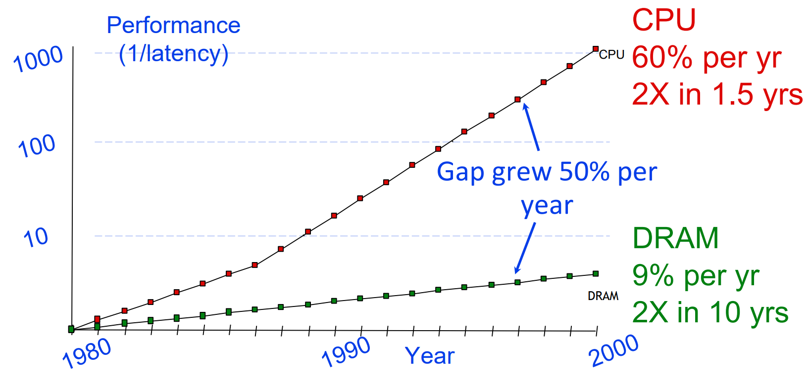
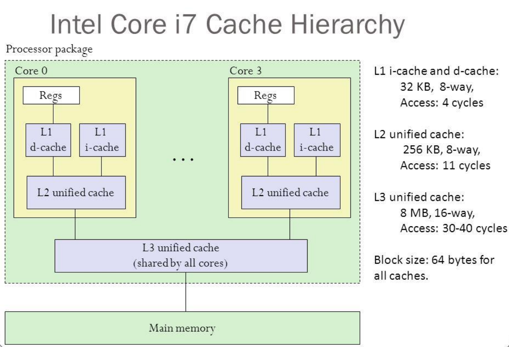
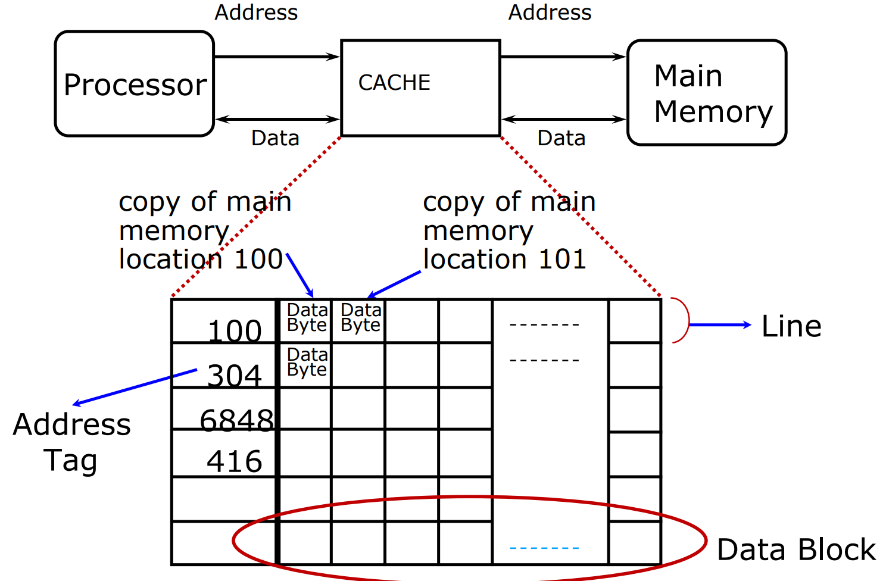
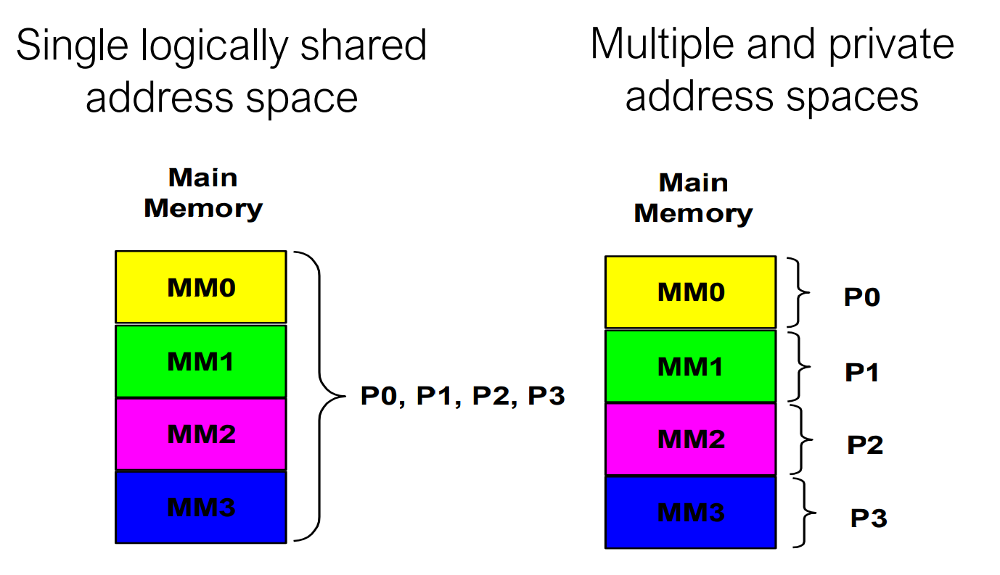
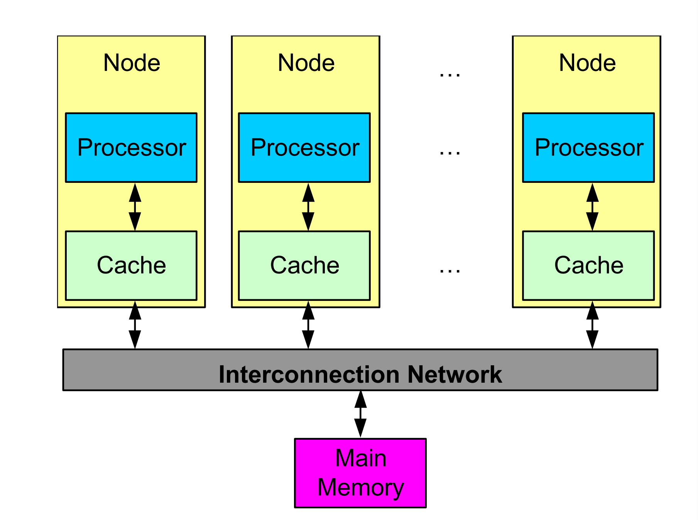
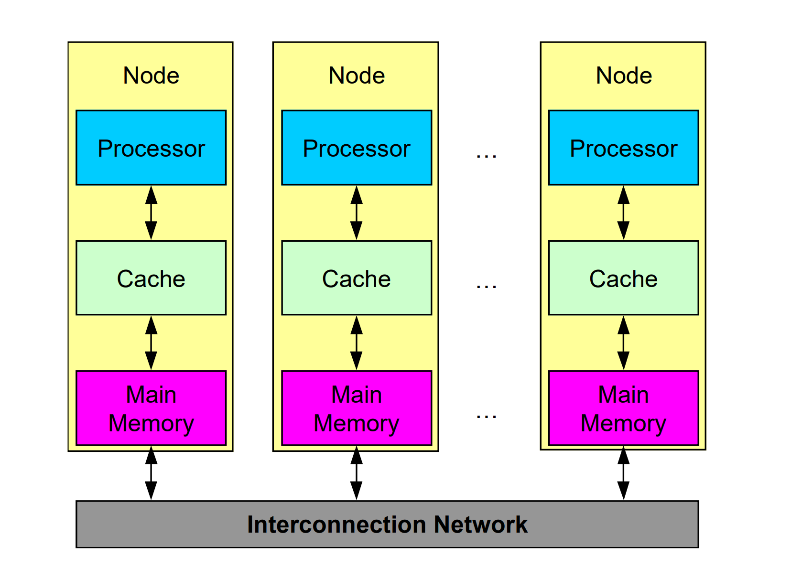
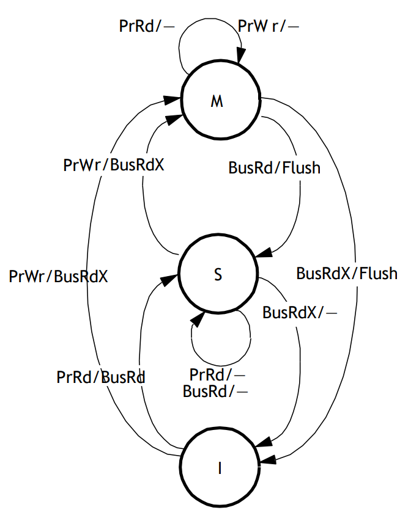
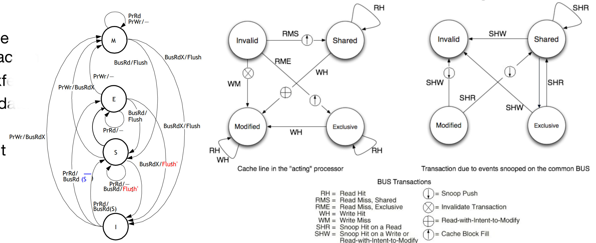

# Memory Hierarchy

Both the centralized memory and the distributed memory models can be 
used to implement a shared-memory architecture

The origin of a lot of problem: 

Developing a **memory hierarchy** is crucial in multi-core processors to improve memory access speed and create an illusion of a large, fast, and cheap memory.

The Principle of Locality states that programs access only a small portion of the address space at any given time. There are two predictable properties of memory references: 

- **temporal locality** means that if a location is referenced, it is likely to be referenced again in the near future. This is observed in loops or reuse. 
- **spatial locality** states that if a location is referenced it is likely that locations near it will be referenced in the near future. This is observed in straight line code or array access.
 

## Cache 

Direct-Mapped cache

Fully Associative Cache 

2-Way set-associative cache 

- Block is minimum quantum of caching.
- Index selects which set to look in.
- Tag used to identify actual copy.
- Data select field used to select data within block.

Increasing block size can have disadvantages such as fewer blocks leading to more conflicts and wastage of bandwidth.

On a write operation, if there is a cache hit, then write-through involves writing to both cache and memory, which generally results in higher traffic but simplifies cache coherence. On the other hand, write-back involves writing to cache only and memory is written only when the entry is evicted, reducing traffic with the help of a dirty bit per block. When there is a cache miss, write-allocate can either fetch into cache or not depending on the scenario.

Common combinations are write-through with no write-allocate and write-back with write-allocate.

|                                 |                           Write-Through                            |                                       Write-Back                                       |
|:-------------------------------:|:------------------------------------------------------------------:|:--------------------------------------------------------------------------------------:|
|             Policy              | Data written to cache  block  also written to lower-  level memory | Write data only to  the cache  Update lower leve  when a block falls  out of the cache |
|              Debug              |                                Easy                                |                                          Hard                                          |
| Do read misses  produce writes? |                                 No                                 |                                          Yes                                           |
| Do repeated  writes make it to  |                                Yes                                 |                                           No                                           |

Write buffer 

Holds data awaiting write-through to lower level memory

1. Reduce Misses via Larger Block Size 
2. Reduce Misses via Higher Associativity 
3. Reducing Misses via a “Victim Cache”: a sort of additional cache similar of L1. 
4. Reducing Misses via “Pseudo-Associativity” 
5. Reducing Misses by Hardware Prefetching of Instructions & Data
6. Reducing Misses by Compiler-controlled Prefetching Data
7. Reducing Misses by Compiler Optimizations

Reduce the miss penalty -> Basic Idea: to introduce a second level cache 

Reduce the time to hit in the cache.

The concepts of addressing space (single/multiple) and the physical memory organization (centralized/distributed) are orthogonal to each other. Shared memory does not mean that there is a single centralized memory.

## Memory Address Space Model

Two types of architectures: 

- Shared Memory: single logically shared address space. Any processor can reference any memory location. Multiple processors can refer to same physical address in memory. 
	- Advantages of SM: Implicit communication (loads/stores) Low overhead when cached 
	- Disadvantages of Shared Memory: Complex to build in way that scales well Requires synchronization operations Hard to control data placement within caching system
- Message Passing: multiple and private address spaces. Processors communicate through send/receive primitives. Each processor's memory is disjoint and cannot be addressed by other processors.
	- Advantages of Message Passing Explicit Communication (sending/receiving of messages) Easier to control data placement (no automatic caching)
	- Disadvantages of Message Passing Message passing overhead can be quite high More complex to program Introduces question of reception technique (interrupts/polling)

### Physical Memory Organization

Centralized shared-memory architectures at most few dozen processor chips (< 100 cores) Large caches, single memory multiple banks Often called symmetric multiprocessors (SMP) and the style of architecture called Uniform Memory Access (UMA)

SMP architecture is a centralized shared-memory architecture with few dozen processor chips, and it usually has less than 100 cores. It adopts the Uniform Memory Access (UMA) style, where large caches and multiple banks share a single memory. 

In the SMP architecture, the performance increase with additional processors is not proportional as shared memory requires synchronization between multiple processors, causing contention. 

To handle this problem, cache coherency protocols are used to ensure that different caches have the same values for the same address. As the number of cores and caches increases in the SMP architecture, the bus or interconnect can become a bottleneck, eventually limiting performance. 

Therefore, for scalability, other architectures such as NUMA (Non-Uniform Memory Access) and distributed-memory parallel systems are used. NUMA has local and remote memory, and processors attached to local memory usually have lower access latencies. Distributed-memory systems have memory distributed across nodes, and each node has its processors.

To support large processor counts, distributed memory architectures are used. These architectures require high-bandwidth interconnect, however, data communication among processors can be a problem due to Non-Uniform Memory Access (NUMA).

### Bus-Based: Symmetric Shared Memory

### Cache Coherence 

Copies of a variable can be present in multiple caches A write by one processor may not become visible to others The use of multiple copies of same data introduces a new problem: cache coherence.

Coherence and consistency are complementary concepts in computer architectures. The problem of memory consistency can be solved through the use of cache coherence protocols, which ensure that each processor has a consistent view of memory.

Coherence defines the behavior of reads and writes to the same memory location, while consistency defines the behavior of reads and writes with respect to accesses to other memory locations.

The problem of memory consistency arises when different processors have different views of memory due to caching. This can lead to inconsistencies and errors in the system. One way to solve this problem is through the use of cache coherence protocols, which ensure that each processor has a consistent view of memory.

To achieve coherence, the assumption is made that a write does not complete until all processors have seen the effect of that write. Additionally, processors are not allowed to change the order of any write with respect to any other memory access. For example, if a processor writes A followed by B, any processor that sees the new value of B must also see the new value of A.

## Cache Coherency Protocols in Multiprocessors

Two classes of protocols: 

- Snooping Protocols: all cache controllers monitor (**snoop**) on the bus to determine whether or not they have a copy of the block requested on the bus and respond accordingly. 
	- Write-Invalidate Protocol: The writing processor issues an invalidation signal over the bus to cause all copies in other caches to be invalidated before changing its local copy. This scheme allows multiple readers but only a single writer.
	- Write-Update or Write-Broadcast Protocol: 
- Directory-Based Protocols

 
 
 
Write-Invalidate Protocol

Write-Invalidate Protocol, Write-Back Cache
- Each block of memory is in one of three states:
	- Clean in all caches and up-to-date in memory (Shared)
	- OR Dirty in exactly one cache (Exclusive)
	- OR Not in any caches
- Each cache block can be in one of three states:
	- Clean (or Shared) (read only): the block is clean (not modified) and can be read
	- Dirty (or Modified or Exclusive) : cache has only copy, its writeable, and dirty (block cannot be shared)
	- Invalid : block contains no valid data

MSI Invalidate Protocol

Three States: “M” : “Modified” “S” : “Shared” “I” : “Invalid” Read obtains block in “shared” even if only cache copy Obtain exclusive ownership before writing BusRdx causes others to invalidate (demote) If M in another cache, will flush BusRdx even if hit in S promote to M (upgrade) What about replacement? S->I, M->I

Complications for the basic MSI protocol: Operations are not atomic

MESI

Extensions: Add exclusive state to indicate clean block in only one cache (MESI protocol)

MESI Protocol: Write-Invalidate Each cache block can be in one of four states: 

- Modified : the block is dirty and cannot be shared; cache has only copy, its writeable. 
- (NEW STATE) Exclusive : the block is clean and cache has only copy; 
- Shared: the block is clean and other copies of the block are in cache; 
- Invalid : block contains no valid data Add exclusive state to distinguish exclusive (writable) and owned (written)

States of cache lines with MESI

| | Modified | Exclusive | Shared | Invalid |
| :---: | :---:  | :---: | :---: | :---: |
| Line valid? | Yes | Yes | Yes | No |
|  Copy in  memory...  |  Has to be  updated  | Valid | Valid | - |
|  Other copies in  other caches?  | No | No | Maybe (yes?) | Maybe |
|  A write on this  line...  | Access the BUS | Access the BUS |  Access the BUS  and Update the  cache  |  Direct access to  the BUS |

In both S and E, the memory has an up-to-date version of the data A write to a E block does not require to send the invalidation signal on the bus, since no other copies of the block are in cache. A write to a S block implies the invalidation of the other copies of the block in cache.

from exe: 

"we keep the block has much as possible and we don't update the main memory"

  
when a processor reads a block "owns" by another processor, the block will be "shared" and also the main memory will update it. 

When a block which is shared is updated, an invalid signal will be sent to other processors and the data in memory will not be updated. 

When a block is loaded to the cache for a read it will be marked exclusive if no other processor is sharing it. 