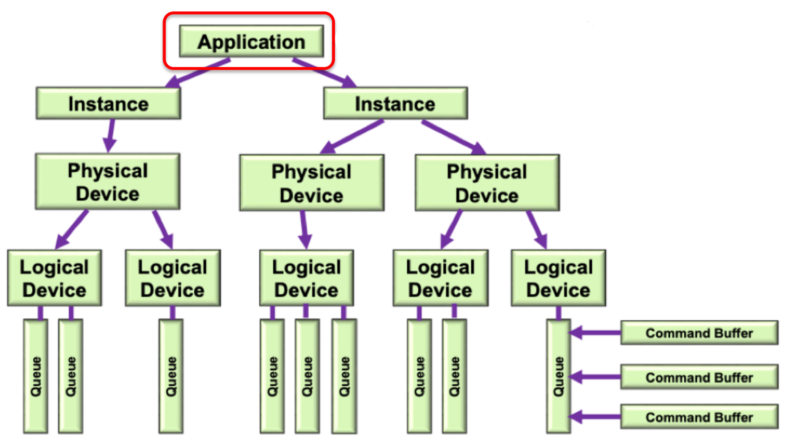
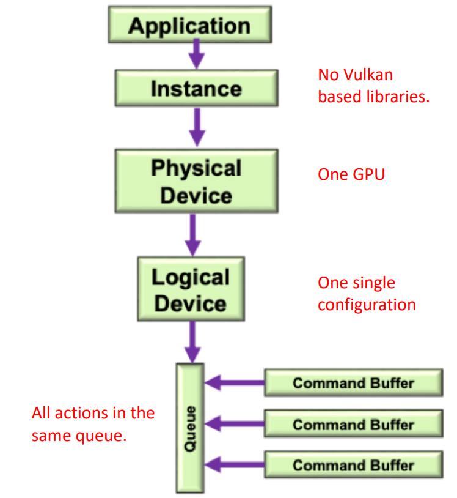
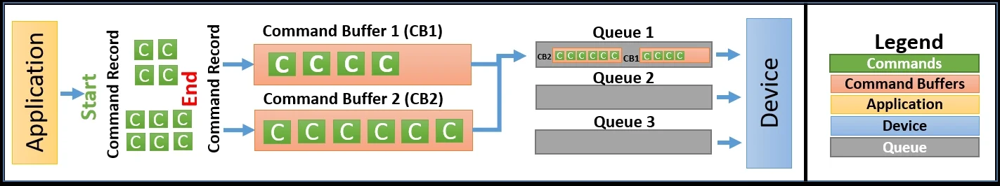
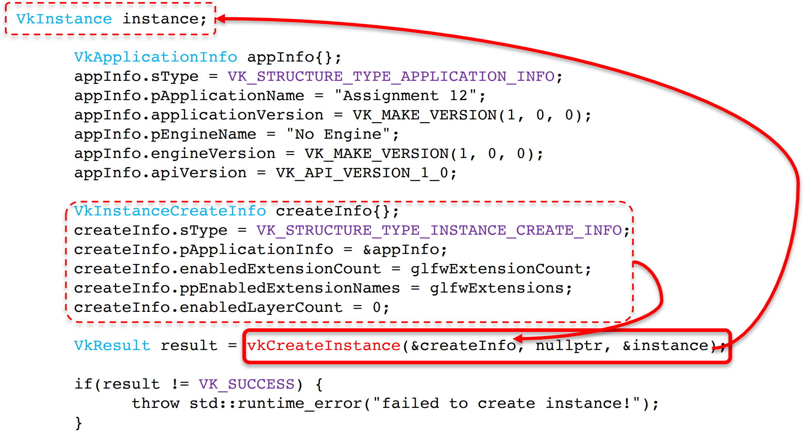

https://vulkan.lunarg.com/sdk/home

https://vulkan-tutorial.com/Development_environment

https://github.com/glfw/glfw

After installing the Vulkan SDK on Linux, you can find the SDK files in the installation directory. The default installation directory is `/usr/share/vulkan`

Vulkan SDK includes several tools and libraries that you can use to develop Vulkan applications, such as:

-   `vulkaninfo`: A command-line tool that displays information about the Vulkan implementation and the available graphics devices.
    
-   `GLFW`: A library that provides a simple API for creating windows, contexts, and handling input. It also includes support for Vulkan.
    
-   `Vulkan Memory Allocator`: A library that provides an easy-to-use interface for managing Vulkan memory.
    
-   `SPIRV-Tools`: A set of tools for working with SPIR-V shader modules.

To get started with developing Vulkan applications using VS Code, you can follow these steps:
	
1.  Install the C/C++ extension for VS Code.
2.  Create a new C/C++ project and configure it to use the Vulkan SDK.
3.  Write your Vulkan application code and build it using a build system such as CMake.
4.  Run your application and test it on your Vulkan-capable graphics device.


Following the tutorial on:
https://vulkan-tutorial.com/Development_environment
Install your own Vulkan development environment.


There are two Makefiles, one that compiles the shaders and doesn't do it. Just copy the needed one into the _Makefile_ file. Then just change _DIR_ and _NAME_ with the directory name and the main file name of the assignment (ex. DIR=A01, NAME=Assignment01). Then open a terminal and type:

make

The Makefile works by using the `make` command to read the rules and dependencies defined in the Makefile and then executing the commands necessary to build the program. When `make` is run, it compares the timestamps of the source files and the build artifacts to determine which files need to be recompiled and which ones can be reused, which can help save time and avoid unnecessary recompilation.

One of the main benefits of using a Makefile is that it can automate the build process and make it easier to manage complex projects with multiple files and dependencies. It can also help ensure that the build process is consistent across different platforms and configurations.

Linux: 

```shell
DIR=./A00
NAME=A00

ifndef DIR
$(error DIR is not set)
endif

ifndef NAME
$(error NAME is not set)
endif

FILEPATH=$(DIR)/$(NAME)
CFLAGS = -std=c++17 -O3
INCLUDE = -I$(DIR)/headers
LDFLAGS = -lglfw -lvulkan -ldl -lpthread -lX11 -lXxf86vm -lXrandr -lXi

all: clean build test  

build: $(FILEPATH).cpp
	g++ $(CFLAGS) -o $(FILEPATH) $(FILEPATH).cpp $(INCLUDE) $(LDFLAGS)

test: $(FILEPATH)
	cd $(DIR) && "./$(NAME)"

clean:
	rm -f $(FILEPATH)
```

Windows, Cmakefile:

```
set($ENV{VULKAN_SDK} "C:/VulkanSDK/1.3.239.0") # Vulkan SDK  
set(GLFW "C:/VulkanSDK/libs/glfw-3.3.8.bin.WIN64") # GLFW  
set(GLM "C:/VulkanSDK/libs/glm") # GLM  
list(APPEND INCLUDE_DIRS "${GLFW}/include" ${GLM} ../A03/headers)  
list(APPEND LINK_LIBS "${GLFW}/lib-mingw-w64/libglfw3.a")  
set(PROJ_NAME A06)  
set(MAIN A06.cpp)  
#########################################################  
  
cmake_minimum_required(VERSION 3.24)  
project(${PROJ_NAME} LANGUAGES CXX)  
set(CMAKE_CXX_STANDARD 17)  
add_executable(${PROJ_NAME} ${MAIN})  
find_package(Vulkan REQUIRED)  
foreach(dir IN LISTS Vulkan_INCLUDE_DIR INCLUDE_DIRS)  
    target_include_directories(${PROJ_NAME} PUBLIC ${dir})  
endforeach()  
  
target_compile_features(${PROJ_NAME} PRIVATE cxx_std_17)  
foreach(lib IN LISTS Vulkan_LIBRARIES LINK_LIBS)  
    target_link_libraries(${PROJ_NAME} ${lib})  
endforeach()
```


--- 


GLFW is an Open Source, multiplatform library for OpenGL and Vulkan development. It provides an API for creating windows, receiving input and events. GLFW is written in C and supports Windows, macOS and Linux.

Whenever a window is created, a `GLFWwindow*` object is returned. Such object must be stored in a variable that will be used in subsequent calls to the library. 

```cpp
window = gIfwCreateWindow(WIDTH,HEIGHT,"Vulkan", nuttptr, nullptr);
```

Key presses can be detected using the ``glfwGetKey(window, GLFW_KEY_xxx)`` function. It returns ``true`` if the requested key has been pressed since the last call to the same method. 

````cpp
if(glfwGetKey(window, GLFW_KEY_ESCAPE)) {  
   glfwSetWindowShouldClose(window, GL_TRUE);  
}
````


```cpp
if (glfwGetKey(window, GLFW_KEY_D)) {
    CamPos += MOVE_SPEED * glm::vec3(CamDir[0]) * deltaT;
}
if (glfwGetKey(window, GLFW_KEY_A)) {
    CamPos -= MOVE_SPEED * glm::vec3(CamDir[0]) * deltaT;
}
if (glfwGetKey(window, GLFW_KEY_F)) {
    CamPos -= MOVE_SPEED * glm::vec3(CamDir[1]) * deltaT;
}
if (glfwGetKey(window, GLFW_KEY_R)) {
    CamPos += MOVE_SPEED * glm::vec3(CamDir[1]) * deltaT;
}
if (glfwGetKey(window, GLFW_KEY_S)) {
    CamPos += MOVE_SPEED * glm::vec3(CamDir[2]) * deltaT;
}
if (glfwGetKey(window, GLFW_KEY_W)) {
    CamPos -= MOVE_SPEED * glm::vec3(CamDir[2]) * deltaT;
}
```


Here all possible keycodes in glfw: 

https://www.glfw.org/docs/3.3/group__keys.html

To convert the mouse motion into two axis values (i.e. in the `[-1..+1]` range), a simple difference with the previous location, divided by a larger value representing the movement resolution, can be implemented. This should depend on the size of the window, but in simpler applications can be a constant.

INSERT CODE HERE

Although `GLFW` has functions for accessing the system clock, `C++` has a standard interface called that can be used to read the current time in high resolution.

`#include<chrono> ` 

# Cpp recalls with Vulkan

typedef glm::mat4 mat;

using namespace glm;


## Static variable 

When a variable is declared as static, space for **it gets allocated for the lifetime of the program**. Even if the function is called multiple times, space for the static variable is allocated only once and the value of variable in the previous call gets carried through the next function call.


# Vulkan study 


https://web.engr.oregonstate.edu/~mjb/vulkan/ 

Vulkan prioritizes resource optimization, making it a powerful tool for users. However, this comes with the disadvantage of increased setup complexity. In order to fully utilize Vulkan features in an application, several essential steps are required. 

````cpp
void run() {
	initWindow(); //create the O.S. window
	initVulkan(); //set up Vulkan resources
	initApp(); //loads and set up app. elements
	mainLoop(); //the update / render cycle of the app.
	cleanup(); //release all the resources
}
````

In a desktop system, such as MS Windows, MacOS or Linux, the presentation surface will always be contained inside a Window.
GLFW allows to open window in a host independent way. Before opening a window, GLFW should be initialized. 

````cpp
glfwInit();
glfwWindowHint(GLFW_CLIENT_API,GLFW_NO_API);
window=glfwCreateWindow(WIDTH,HEIGHT,"Title",nullptr,nullptr);
````


## Vulkan architecture 

Vulkan can support AI computation as well as computer graphics. It allows for multiple instances to be run within a single application, each optimized for a specific purpose. These instances can utilize different software libraries simultaneously, with each library exploiting the GPUs through Vulkan. This enables each library to function independently from the others.




TO WATCH: https://www.youtube.com/watch?v=DRl-3c3OJLU 

GPUs (physical devices) are represented by physical devices. If a system has multiple GPUs, an application can use them in parallel or pick the most suitable one. Logical devices enable different GPU configurations for various purposes, so that different settings can coexist for the same device. 
But most of the times just one physical device is enough. 

{width=50%}

To increase parallelization, Vulkan employs queues for all operations. As a result, processes for creating a new image can begin even before the previous one ends. Users can ask for as many queues as they like and manage their synchronization. Vulkan operations are stored in Command Buffers, which are transferred into GPU memory. Each queue may handle several command buffers, to allow different threads running on separate cores recording commands in parallel, and to reduce the CPU to GPU memory transfer to only parts that need to be updated.



A specific Vulkan deployment can add a set of **Extension Layers**, that can be used to expose O.S. specific or device specific functions. These functions allow Vulkan to work in a given environment, or to access special hardware features.


Most of the Vulkan procedures use the same pattern: they require a pointer to a data structure containing the parameters (first parameter), and return another pointer to a structure containing the result (last parameter).




The minimal loop just waits for the user to close the window with the glfwWindowShouldClose(…) and the repeatedly calls the glfwPollEvents() command to check if there has been some input from the user

````cpp
void mainLoop() { 
	while (!glfwWindowShouldClose(window)){ 
		glfwPollEvents(); 
	}
}
````


## Vulkan presentation surface


