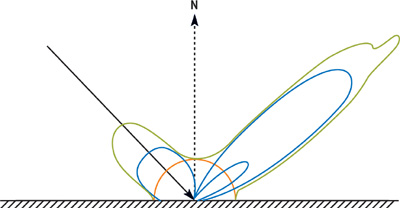
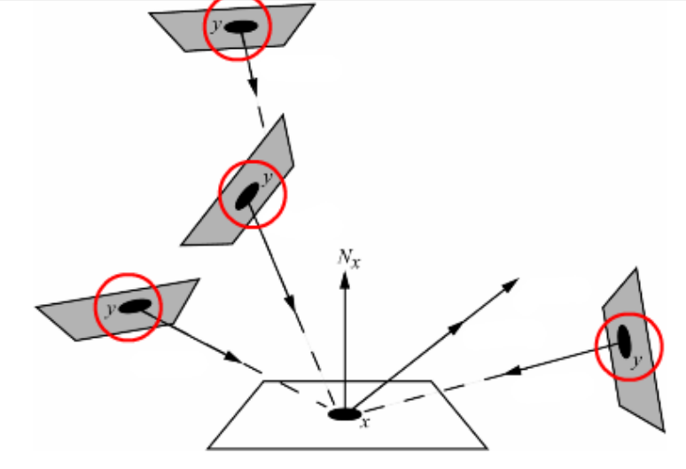

# Rendering 

Rendering creates the illusion of illumination using light sources and the surface features of 3D objects.
Some physical background: 

- **Energy** (expressed in Joules $J$) measures the total light emitted by a surface in all the directions during a time interval.
- **Power** (measured in Watts $W = J \cdot s^{-1}$ ) is the instantaneous light energy (emitted by a surface in all the directions in a given time instant).
- **Irradiance** is the fraction of power emitted by a point of a surface (in a given time instant). It is measured in $\frac{W}{m^2}$ . 
- **Radiance** measures the energy emitted in a given time instant from a point of a surface in a given direction. It is measured in $\frac{W}{m^2 \cdot sr}$. $sr$ are **steradians**: the unit of measure for the solid-angle. 

Rendering basically it's the process which determines radiance received in each point (each pixel) of projection plane based on direction of corresponding projection ray.  

## The Bidirectional Reflectance Distribution Function

Bidirectional Reflectance Distribution Function simulates material properties. 

$$f_r(\theta _i,\phi _i , \theta _r , \phi _r)=f_r(\omega _i, \omega _r)$$

The function tells how much irradiance from the incoming angle, is reflected to an outgoing angle.
It's called "bidirectional" since the value of function remains unchanged if ingoing and outgoing directions are swapped.
Energy is conservated means that the BRDF cannot increase the total irradiance that leaves a point on a surface. BRDF implies conservation of energy: it cannot increase the total irradiance leaving a point on a surface.

https://developer.nvidia.com/gpugems/gpugems/part-iii-materials/chapter-18-spatial-brdfs

## The rendering equation 

The BRDF allows relating together the irradiance in all the directions for all the points of the objects composing a scene. This relation is called the rendering equation:

$$
\begin{aligned}
& L\left(x, \omega_r\right)=L_e\left(x, \omega_r\right)+ \\
& \quad \int L(y, \vec{yx}) f_r\left(x, \vec{yx}, \omega_r\right) G(x, y) V(x, y) d y
\end{aligned}
$$

$L_e$ is the light that an object can eventually emit, while the integral accounts for the light that hits the considered point $x$ from all the points $y$ of the surfaces of all the objects and lights in the scene. Factor $G(x, y)=\frac{\cos \theta_x \cos \theta_y}{r_{x y}^2}$ encodes the geometric relation between points $x$ and $y$. 
It considers both the relative orientation and the distance of the two points, and it is defined in the following way. The two $cos()$ terms accounts for the angle relative to the respective normal vectors, and $r_{xy}^2$ represents the squared distance of the two points. term $V(x,y)$ considers the visibility between points $x$ and $y$: $V(x,y) = 1$ if the two points can see each other, and $V(x,y) = 0$ if point y is hidden by some other object in between. Term $V(x,y)$ allows for the computation of shadows, and makes sure that in each input direction at most a single object is considered.

The integral also includes other points of the same object to allow the computation of effects such as self-shadowing or selfreflection.
Rendering equation's incognita is $L(x, \omega)$ since it appears on both sides of the equation. Therefore, the rendering equation is an integral equation of the second kind.

$$
\varphi(x)=f(x)+\lambda \int_a^b K(x, t) \varphi(t) d t .
$$

Note that the rendering equation is repeated for every wavelength $\lambda$ of the light: usually this means that the equation is repeated for the three different RGB channels.

$$
\begin{aligned}
& L\left(x, \omega_r, \lambda\right)=L_e\left(x, \omega_r, \lambda\right)+ \\
& \quad \int L(y, y x, \lambda) f_r\left(x, y x, \omega_r, \lambda\right) G(x, y) V(x, y) d y
\end{aligned}
$$

# Extensions to rendering equation 

Rendering equation computes reflections, shadows, matte and glossy materials but cannot simulate gases or transparent objects like glass and water. The BDRF and the rendering equations have been extended:

- BTDF: Bidirectional Transmittance Distribution Function 
- Bidirectional Scattering Distribution Function: usually the angles for the BRDF and BTDF do not overlap, they are included in a single function.
- BSSRDF: Bidirectional surface reflectance distribution function: the rendering equation now integrates over all the points of an object to compute the quantity of lights that exits from a give position.

# Rendering in practice 

Rendering equations are complex to solve and require advanced discretization techniques. However, there are simpler approximations to the rendering equation that give good results with reasonable complexity. Vulkan supports some of these techniques with specific types of pipelines.
Techniques for approximating the rendering equation:

- Scan-line rendering
- Ray casting
- Ray tracing
- Radiosity
- Montecarlo techniques

## Pipelines

To create an image on screen from mesh data, we follow a sequence of operations called a **Pipeline**. The Pipeline is similar in Vulkan, OpenGL, Metal, and Microsoft DirectX 12.

The actions taken in each stage of the pipeline can be either fixed by Vulkan or programmed. Algorithms running in the programmable stages of the pipeline are called Shaders. 
Vulkan versions support four pipeline types:

- Graphic pipelines
- Ray-tracing pipelines
- Mesh shading pipelines
- Compute pipelines

# Shaders

Shaders are written in high level languages, such as: 

- GLSL (openGL Shading Language) 
- HLSL (High Level Shading Language

Both languages can be used in Vulkan. The **Standard, Portable Intermediate Representation** - V (SPIR-V) is an intermediate language for defining shaders.

Each shader is compiled a shader into SPIR-V
