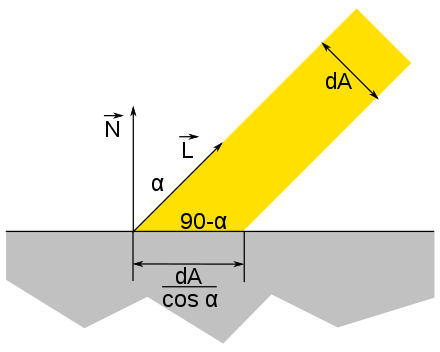

The BRDF used for scan line rendering does not fulfill the energy conservation property in most of the cases.

Generally, the BRDF is expressed as the sum of two terms:

- The diffuse reflection: main color of the object 
- The specular reflection: shiny objects tend to reflect the incoming light in a particular angle, called the specular direction

$$f_{r}\left(x, \overrightarrow{l x}, \omega_{r}\right)=f_{d i f f u s e}\left(x, \overrightarrow{l x}, \omega_{r}\right)+f_{s p e c u l a r}\left(x, \overrightarrow{l x}, \omega_{r}\right)$$

In scan-line rendering, values of the BRDF for each color frequency, and for both the diffuse and specular components, are in the range $[0,1]$. Since the influence of lights values can lead to values larger than $1$, at the end of the computation $\operatorname{clamp}$ function is applied.
Newer rendering techniques permits **HDR** perform more advanced computation, allowing values outside the $[0,1]$ range: the final color is then mapped into the range at the end of the process, using suitable **non-linear functions**.

In this course we will present the following diffuse reflection models:

-   Lambert
-   Oren-Nayar
-   Toon

And the following specular reflection models:

-   Phong specular reflection
-   Blinn specular reflection
-   Ward
-   Cook-Torrance specular reflection
-   Toon

## Lambert

The reflection is calculated by taking the dot product of the surface's unit normal vector, $\mathbf{N}$, and a normalized light-direction vector, $\mathbf{L}$, pointing from the surface to the light source. This number is then multiplied by the color of the surface and the intensity of the light hitting the surface. 

When a face is on the opposite direction with respect to a light source, it cannot be illuminated despite of the angle. To make this happen for back faces, clamping the value at zero simply avoids illuminating the faces. In Lambert diffuse model, the viewing angle has no effect, and the final image depends only on the position of the objects and on the direction the lights.
The rendering equations becomes :

$$\begin{gathered}
L\left(x, \omega_{r}\right)=\boldsymbol{l} * \boldsymbol{m}_{D} \cdot \operatorname{clamp}\left(\boldsymbol{d} \cdot \boldsymbol{n}_{x}\right) \\
L\left(x, \omega_{r}\right)=\boldsymbol{l} * \boldsymbol{m}_{D} \cdot \operatorname{clamp}\left(\frac{\boldsymbol{p}-\boldsymbol{x}}{|\boldsymbol{p}-\boldsymbol{x}|} \cdot \boldsymbol{n}_{x}\right)
\end{gathered}$$

with $m_D$ is a vector that expresses the capability of a material to perform the Lambert reflection for each of the three primary color frequencies RGB $m_{D}=\left(m_{R}, m_{G}, m_{B}\right)$ . 

## Phong 

