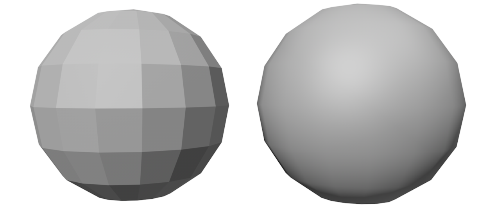

# Smooth shading 

The two most common smooth shading techniques are: 

- **Gouraud shading** (per-vertex)
- **Phong shading** (per-pixel)

The two methods however tends to give the same result when considering geometries composed by many vertices, since in this case, the area of each triangle is just a few pixel wide.

### Gouraud shading

A vertex is encoded with 6 values, defining position and direction of the surface normal $\boldsymbol{v}=\left(x, y, z, n_x, n_y, n_z\right)$. Gouraud shading computes the colors of the vertices, then interpolates them for inner triangle pixels.
The Gouraud technique may produce artifacts on the image, and cannot capture specific lighting conditions: this happens because interpolation might miss some of the details that appear between the vertices. 

### Phong shading 

{width=50%}

- Computes color of each internal pixel separately
- Per-pixel shading algorithm
- Vertex normal vectors are interpolated to approximate surface normal in internal points of triangle

Interpolation is performed by considering the x, y, z components of the normal vector separately.

If all the faces that share the same vertex have a different normal vector direction, the edges appear to be sharp. This is the case for example of the cube.

ote that in this case, for the vertices on the ring: • The one belonging to the cap, will have normal oriented along the y-axis. • The one belonging to the side, will be directed outside, along the radius of the cap, with they y-axis component equal to zero. • Each vertex will be shared by at least two triangles.