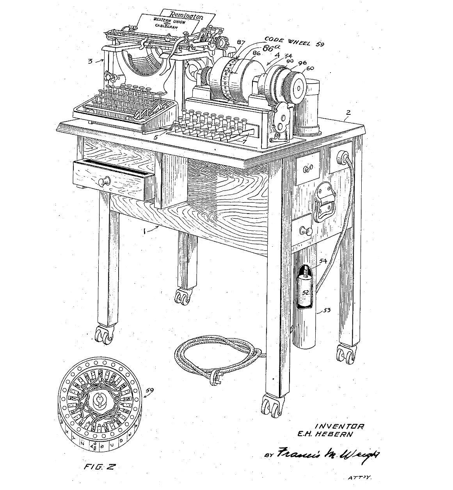
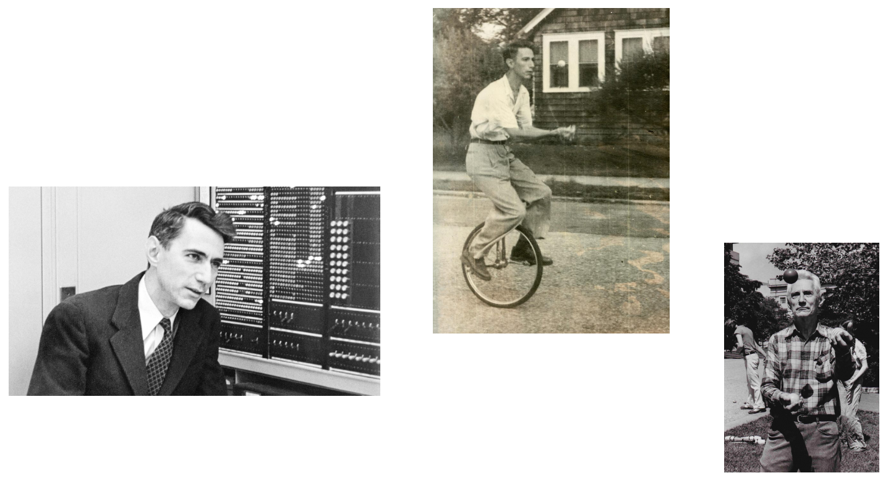
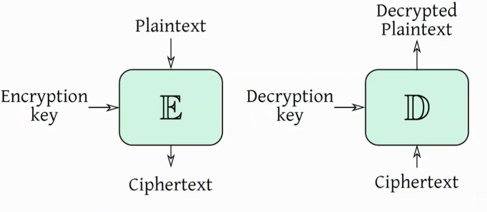
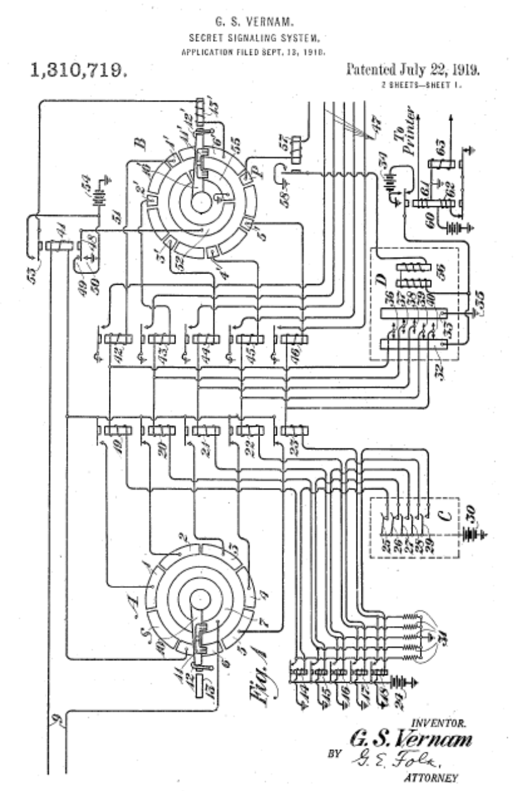
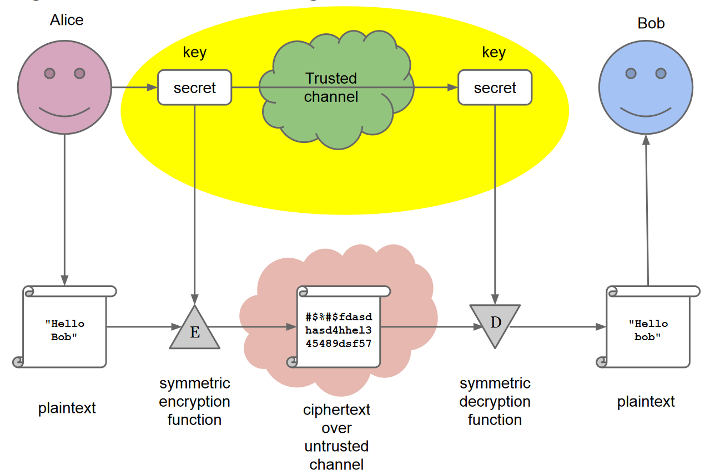

Exercitation note: 

Ransom-ware -> Loss of business-critical data (e.g., key intellectual property) so that the company is not able to produce the (specialized) goods anymore. Countermeasure: Backups 

We will cover the basics of cryptography that are relevant to discussions about system security. Our focus will be on providing a simplified introduction to this topic

# History 

Cryptography has a rich history that dates back to the earliest forms of written communication. The use of cryptography was primarily for military purposes, but there were also some Renaissance-era studies. For instance, Gabriele de Lavinde wrote a manual in 1379, and Leonardo da Vinci used mirror writing. In 1925, Italian Army General Luigi Sacco wrote a famous book, "Nozioni di crittografia," which was one of the last non-formalized exercises in cryptography.

Kerchoff's six principles for a good cipher were published in 1883 and they are principles still valid today: 

1) It must be practically, if not mathematically, unbreakable  
2) It should be possible to make it public, even to the enemy  
3) The key must be communicable without written notes and changeable whenever the correspondants want 
4) It must be applicable to telegraphic communication  
5) It must be portable, and should be operable by a single person  
6) Finally, given the operating environment, it should be easy to use, it shouldn’t impose excessive mental load, nor require a large set of rules to be known

Mechanical computation changed cryptography in the early 20th century. The first rotor machine was designed by Ed Hebern in 1917, and it became popularized during WWII by the German Enigma. 

{width=50%}

Cryptanalysts at Bletchley Park, including Turing, were credited for their key role in winning the war.

Later Shannon first formalized cryptography in his 1949 paper "Communication theory of secrecy systems." He proved that a mathematically unbreakable cipher exists. 

{width=70%}

Nash in 1955 sent a classified letter to NSA that said computationally secure ciphers were also acceptable: "It's not necessary a theoretical perfect cipher .. a cipher which is breakable only with a huge computational effort is also acceptable". 

# Definitions 

- Plaintext space $P$: set of possible messages $ptx \in P$   
- Old times: words in some human-readable alphabet, modern times $\{0, 1\}$  
- Ciphertext space $C$: set of possible ciphertext $ctx \in C$  
- Usually ciphertexts are larger (texts are expanded for security implications)  
- Key space $K$: set of possible keys  

{width=70%}

A perfect cipher, for all $ptx \in P$ and $ctx \in C$ , $P(ptx sent = ptx) = P(ptx sent = ptx | ctx sent = ctx)$ .  In other words: seeing  a ciphertext $ctx$ gives us no information on what the plaintext $ptx$ is. 

Theorem (Shannon 1949)

Any symmetric cipher $<P, K, C, E, D>$ with $|P| = |K| = |C|$ is perfectly secure if and only if:

- every key is used with probability $\frac{1}{|K|}$ : basically all the keys have the same probability to be the key used
- $\forall(\mathrm{ptx}, \mathrm{ct} x) \in \mathbf{P} \times \mathbf{C}, \exists ! k \in \mathbf{K} \text { s.t. } \mathbb{E}(p \operatorname{ptx}, k)=\operatorname{ctx}$ : it exists a unique key that maps the $ptx$ into $ctx$ . 

The OTP is a minimal perfect cipher, achieved through XOR of a message and a random key of the same size, which can never be reused. So the perfect cipher exists but actually is not possible to use in practice. 

{width=50%}

### A easy way to understand the concept of perfect cipher (introduction to bruteforce)

M = UGO (21 7 15) 
K=+3 
C = XJR (24 10 18) 

In the case of the non-perfect cipher example, the attacker would need to bruteforce all possible keys by shifting each letter and comparing it to a dictionary of known words or phrases to find the correct key. 

“Toy” Perfect Cipher Example 
M = UGO (21 7 15) 
K=+5+2+2 
C = ZIQ (22 9 18) 

Bruteforcing...For each letter try all k=-1-1-1, -1-1-2,.....-26-26-26
However, in the case of a perfect cipher example, the attacker would obtain all possible combinations of the three letters, which are equally probable to be the original text.

A real (non perfect) cryptosystem is broken if there is a way to break it that is faster than brute forcing.

NOT PERFECT -> len(k) < len(M) -> k is reused

... 

computationally perfect ciphers. 

--- 

# Symmetric Encryption

{width=70%}

The basic idea of encryption:

- Use a key $K$ (also known as shared) to encrypt plaintext into ciphertext
- Use the same key $K$ to decrypt the ciphertext back into plaintext

Issues with encryption:

- The key is shared ...  we cannot send the key on the same channel as the message.
- An off-band transmission mechanism is needed.
- Scalability problem: a $n$ system needs  $O(n^2)$ keys 

# Asymmetric Encryption 

