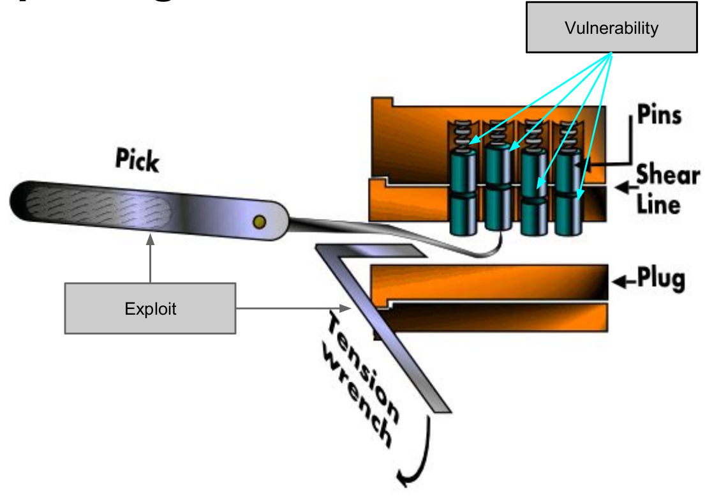

## CIA paradigm

- Confidentiality: information can be accessed only by authorized entities, unauthorized people can not have access to it (can be seen as privacy). 
- Integrity: consistency and trustworthiness of information over its entire lifecycle
- Availability: information must be available to all the authorized parties without external constraints

Vulnerability: something that allows to violate one of the constraints of the CIA paradigm.

Exploit: a specific way to use one or more vulnerabilities to accomplish a specific objective that violates the constraints. 

Vulnerabilities and exploits happen in different moments. 

Exploit is the "thing" you use to **exploit** the vulnerabilities. 

- Security Level: the threats against the asset 
- Protection Level: the security measures to protect the asset 

- Asset: identifies what is valuable for someone (an organization)
- Threat: potential violation of CIA

Attackers, hackers, pirates, ..., are very distinct concepts and should not be confused.

- Threat Agent: whoever/whatever may cause an attack to occur
- Attacker: whoever/whatever performs the attack.
- Hacker: someone with an advanced understanding of computers and computer networks, and willingness to learn "everything."
- Black hats/cracker: malicious hackers.

> No system is invulnerable.

Security is a complex engineering problem which can be summarize as "Risk Management" since it's a problem where "risks" are everything and it's possible to control only the vulnerabilities. 

$$Risk = Asset * Vulnerabilities * Threats$$

Like any other engineering problem we have our "trust and assumptions" which define our boundaries. 

A system with limited vulnerabilities but with a high threat level may be less secure than a system with many vulnerabilities but with low threat level.

