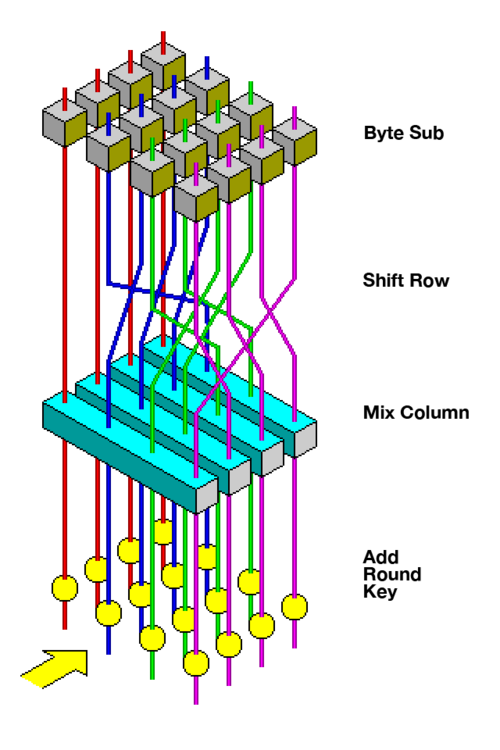
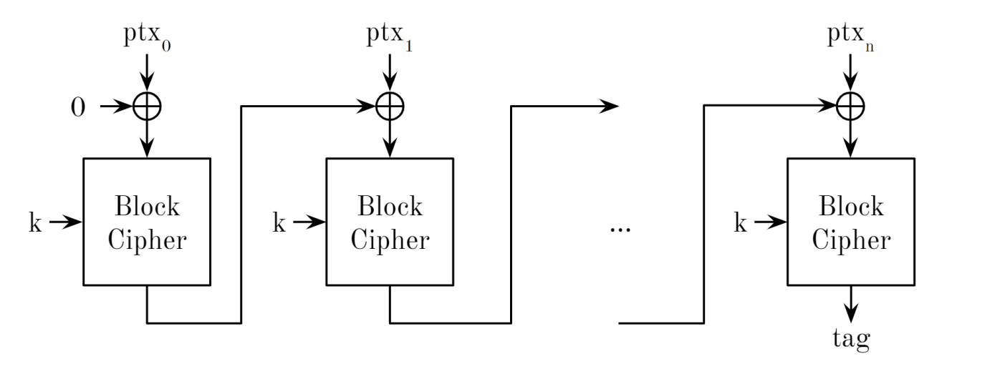
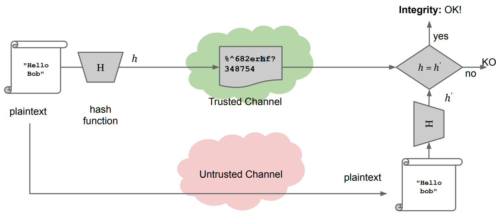
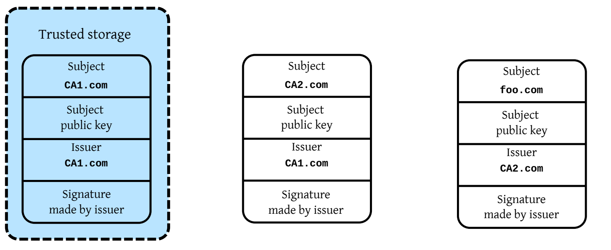
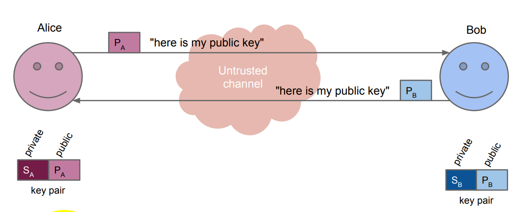
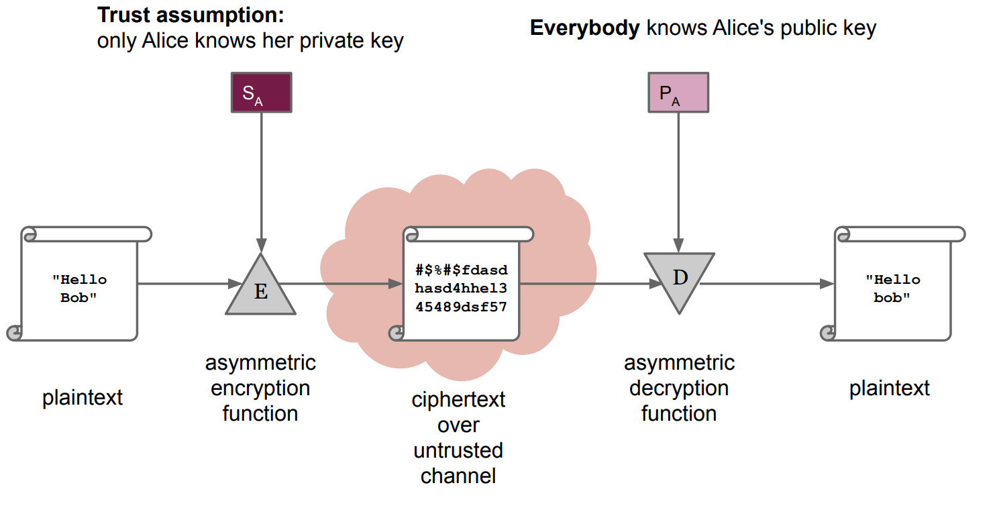

# Foundations of Cryptography

We will cover the basics of cryptography that are relevant to discussions about system security. Our focus will be on providing a simplified introduction to this topic

# History 

Cryptography has a rich history that dates back to the earliest forms of written communication. The use of cryptography was primarily for military purposes, but there were also some Renaissance-era studies. For instance, Gabriele de Lavinde wrote a manual in 1379, and Leonardo da Vinci used mirror writing. In 1925, Italian Army General Luigi Sacco wrote a famous book, "Nozioni di crittografia," which was one of the last non-formalized exercises in cryptography.

Kerchoff's six principles for a good cipher were published in 1883 and they are principles still valid today: 

1) It must be practically, if not mathematically, unbreakable  
2) It should be possible to make it public, even to the enemy  
3) The key must be communicable without written notes and changeable whenever the correspondants want 
4) It must be applicable to telegraphic communication  
5) It must be portable, and should be operable by a single person  
6) Finally, given the operating environment, it should be easy to use, it shouldn't impose excessive mental load, nor require a large set of rules to be known

Mechanical computation changed cryptography in the early 20th century. The first rotor machine was designed by Ed Hebern in 1917, and it became popularized during WWII by the German Enigma. 

{width=50%}

Cryptanalysts at Bletchley Park, including Turing, were credited for their key role in winning the war.

Later Shannon first formalized cryptography in his 1949 paper "Communication theory of secrecy systems." He proved that a mathematically unbreakable cipher exists. 

{width=70%}

Nash in 1955 sent a classified letter to NSA that said computationally secure ciphers were also acceptable: "It's not necessary a theoretical perfect cipher .. a cipher which is breakable only with a huge computational effort is also acceptable". 

# Definitions 

- Plaintext space $P$: set of possible messages $ptx \in P$   
- Old times: words in some human-readable alphabet, modern times $\{0, 1\}$  
- Ciphertext space $C$: set of possible ciphertext $ctx \in C$  
- Usually ciphertexts are larger (texts are expanded for security implications)  
- Key space $K$: set of possible keys  

{width=70%}

A perfect cipher, for all $ptx \in P$ and $ctx \in C$ , $P(ptx sent = ptx) = P(ptx sent = ptx | ctx sent = ctx)$ .  In other words: seeing  a ciphertext $ctx$ gives us no information on what the plaintext $ptx$ is. 

Theorem (Shannon 1949)

Any symmetric cipher $<P, K, C, E, D>$ with $|P| = |K| = |C|$ is perfectly secure if and only if:

- every key is used with probability $\frac{1}{|K|}$ : basically all the keys have the same probability to be the key used
- $\forall(\mathrm{ptx}, \mathrm{ct} x) \in \mathbf{P} \times \mathbf{C}, \exists ! k \in \mathbf{K} \text { s.t. } \mathbb{E}(p \operatorname{ptx}, k)=\operatorname{ctx}$ : it exists a unique key that maps the $ptx$ into $ctx$ . 

The OTP (one time pad) is a minimal perfect cipher, achieved through XOR of a message and a random key of the same size, which can never be reused. So the perfect cipher exists but actually is not possible to use in practice. 

{width=50%}

### A easy way to understand the concept of perfect cipher (introduction to bruteforce)

M = UGO (21 7 15) 
K=+3 
C = XJR (24 10 18) 

In the case of the non-perfect cipher example, the attacker would need to bruteforce all possible keys by shifting each letter and comparing it to a dictionary of known words or phrases to find the correct key. 

"Toy" Perfect Cipher Example 
M = UGO (21 7 15) 
K=+5+2+2 
C = ZIQ (22 9 18) 

Bruteforcing...For each letter try all k=-1-1-1, -1-1-2,.....-26-26-26
However, in the case of a perfect cipher example, the attacker would obtain all possible combinations of the three letters, which are equally probable to be the original text.

A real (non perfect) cryptosystem is broken if there is a way to break it that is faster than brute forcing.

NOT PERFECT -> len(k) < len(M) -> k is reused

In real life algorithms the same key is re-used more than once: this is why algorithms are not perfect, furthermore the key is the only unknown thing (the algorithm must be known). At this point, the attacker in order to break the algorithm has to find the key, and all real world algorithms are vulnerable to brute-force attacks, which means trying all possible keys until a well-formed output is found

Brute-force is the upper bound to the robustness of an algorithm, it is the worst case scenario to apply (most time-consuming method) in order to break an algorithm

computationally perfect ciphers. 

A secure cipher is a cipher that is computational hard to break.

## Computationally secure cryptography 

Our road from perfect ciphers to pseudo-random generators: 

0. Random Functions: functions that take an input and produce an output that is not easily predictable. The output of the function appears to be random, even if the input is known.
1. Pseudo Random Functions (PRF): A function that appears to be random, but is actually deterministic and produces the same output for the same input. This is just a RF which can be used in practice. 
2. Pseudo Random Number Generator (PRNG): A deterministic function that generates a sequence of random-looking numbers from a seed or key $\{0,1\}^\lambda \rightarrow\{0,1\}^{\lambda+n}$ where $n$ is called stretch of the PRNG. Is called "pseudorandom" since it's truly random and are deterministic, meaning that given the same seed, the same sequence of numbers will be produced every time.
3. Cryptographically Secure Pseudo Random Number Generator (CSPRNG): Cryptographically Safe Pseudorandom Number Generator (CSPRNG) is a PRNG whose output cannot be distinguished from an uniform random sampling of ${0, 1}^{\lambda +n}$ in $O(poly(\lambda))$ time. This function stretch the key you use. It's not a perfect tool but it's a practical tool.  
4. Pseudo Random Permutations (PRP) (also called Block cipher): a function which mantains input/output length (permutation) is more managable: $\{ 0,1 \}^{\text{len}} \rightarrow \{ 0,1 \}^{\text{len}}$. It is uniquely identified by the value of the seed (useful to think the seed as a key). It's not possible to tell apart in $O(poly(\lambda))$ from a Random Function $RF$. Operatively speaking acts on a block of bits outputs another one of the same size which looks unrelated (but actually is since it's pseudo random). 

{width=50%}

A block cipher is said to be broken if, without knowing the key, the plaintext can be derived from the ciphertext with less than $2^{\lambda}$ operations. Which means that it's broken if exists a way to broke it that is not a bruteforce technique. 
The standard algorithm is now Advanced Encryption Standard (AES). In AES, the block has a length of 128 bits, and the key can be 128, 192 or 256 bits long.

{width=50%}

## Electronic Codebook

A first attempt to encryption with PRPs are ECB, which are based on the idea of split-and-encrypt.

{width=50%}

This method is fast and parallelizable, but if the original message has repeated blocks, the corresponding outputs will also be repeated, revealing important information to attackers.

## Counter (CTR) Mode

This method uses a counter and encryption to generate a unique output. The counter can start at any number and an increment other than 1 can be used, but 1 is both secure and efficient.

{width=50%}

## Raising the requirements: known-plaintext attack 

Thanks for the counter mode we have achieved confidentially under the hypothesis of a ciphertext-only attack. 
Increase the requirements: the attacker knows a set of plaintexts which can be encrypted. 
This is so-called known-plaintext attack. In a known-plaintext attack, the attacker knows at least a sample of couples (ptx, ctx), where ctx is the encryption of ptx and wants to understand the one which is being encrypted. 

Feels strange but an example of a known-plaintext attack occurred during WWII when Alan Turing discovered that repetitive messages in the Enigma code corresponded to the greeting used in messages to Adolf Hitler. By exploiting this weakness in the encryption algorithm, he was able to decipher many German messages. 

Some ideas to solve this: 

- manipulate the key every time it is used
- choose each time a different number (called nonce) as starting point of the counter
- symmetric ratcheting

The exploited main idea is always the same: adding an extra source of pseudo-randomness. 

{width=50%}

### Symmetric Ratcheting

The idea takes the name form the mechanical component: a plugin to the cipher tool creates a different key for each block starting from a single original key (a seed). "Every single time you call it you move the ratchet". 
As the ratchet can only turn on one side but cannot turn back, it's not possible to roll-back the procedure once you delete the value carried by the green arrows. 

{width=50%}

## Integrity 

To ensure data integrity, we can append a Message Authentication Code (MAC) to the message. The MAC acts as a tag that an attacker cannot forge and it's used to guarantee that the message has not been tampered.
From an high-level pov the idea is: 

- `computeMAC(string, key) = tag` 
- `verifyMAC(string, tag, key) = {true|false}``

CBC-MAC is a technique that uses an encrypted tag of the message, which cannot be decrypted by the receiver. Block ciphers are connected in cascade in a way that each input is XORed with the respective section of the message. 

{width=50%}

Calculating message tags is time-consuming and costly. Ensuring file integrity requires comparing it bit by bit with an intact copy or reading it entirely to compute a MAC. This is not possible in practice. There is a minimum number of bits required to encode a given content without losing information. Is it possible to create something similar to the ideal situation? Using Cryptographic Hash Functions. Obviously they are not perfect and there is trade-off . The trade-off here is that knowing Shannon Theory we know that every file has a lower bound of compression. 

{width=50%}

The main idea is to have a hash function that can hash any binary stream in a way that is difficult for attackers to create collisions between different objects. 
A good hash function should be resistant to:

1) first preimage attack: inverting $H$. given $d = H(s)$ find $s$  should take $O(2^d)$ hash computations. 
2) second preimage attack: finding a different $s$ that produces the same digest. Knowing $d, H(s)$ find another object $j \ne s$ with same $H(j)=d$  should take $O(2^d)$ hash computations.  
3) Collisions: finding two different inputs with the same hash. Find two objects $s \ne r$ which $H(s) \ne H(r)$ . 

Nowadays, past functions like `SHA-1` (Google found a collission with two pdf files) and `MD5` (this one is totally broken) have been shown to be flawed, but currently, the unbroken and widely standardized `SHA-2` and `SHA-3` can produce 256, 384, or 512-bit digests. SHA-3 exists because SHA-2 utilizes mechanisms from flawed functions.
Where are used hash functions? Hash functions are widely used for various purposes such as document signature, HTTPS certificate, version control (git), and ensuring data integrity in backup systems.
Command `certutil -hashfile 42.pdf SHA256` uses the `certutil` Windows tool to calculate the `SHA256` (`SHA-2` variant) hash value of `42.pdf`. 

## Authencity 

We’d like to be able to verify the authenticity of a piece of data without a pre-shared secret. With an asymmetric cipher, we can actually provide authenticity.
To guarantee that the sender of the message is the same as the one who originally transmitted the public key we can use a **Digital Signature**. But a practical issue of this is that encrypt large documents is slow.
A solution to slow encryption are **Cryptographic Hash Functions**: generating a fixed-length string of bytes where a change in the input message will result in a completely different output.

The RSA standard, other than confidentiality, is built to provide authenticity as well: it ensures that the **message sender is who they claim to be**.

## PKI CA chain 

Cautionary (obvious) note: In both asymmetric encryption and digital signatures, it is crucial to bind the public key to the correct user identity.

How to achieve this? 

This can be achieved by using a Public Key Infrastructure (PKI) that employs a trusted third party called a Certification Authority (CA). The CA issues digital certificates that bind an identity to a public key. 
The CA digitally **signs** these certificates and employs a private key to do so. This creates a **chain of certificates**, known as the** Certificate Chain**. At some point in the chain, a self-signed certificate is used (**Root of trust**), which must be trusted a priori.

Generally CA is already installed in a system/browser. The root CA's list can be checked in a system, and all the root certificates installed within it are trusted when an OS is trusted. 

The private key is the most important asset. If it is stolen or compromised it can't be destroyed but it's possible to revoke the digital certificate itself using one of the Certificate Revocation Lists that are stored online. The problem is that CRL cannot be verified offline, which poses another security issue.

## Some fundamentals of Information Theory

It's possible to mathematically quantify the difficulty of guessing a changed secret string between two entities using a random variable $X$.
The amount of information which can be transmitted depends on the distribution of $X$. 

$$H(X)=\sum _{i=0}^{n-1} = - p_i log_b (p_i)$$

The entropy $H(X)$ is a good way to express the hardness to guess a string.  
Compression of bitstrings without loss is impossible: cryptographic hashes discard some information.

## Italian digital signatures framework 

Italian Digital Signatures Framework:

- Introduced in 1997, one of the first in EU.
- Current EU framework inspired by it.
- Consisted of a list of screened CAs, with only those meeting requirements accepted.
- Around 10 selected CAs each created their own digital signature application.
- All standards used strong cryptographic algorithms.
- Vulnerabilities emerged in the applications developed by each CA, making them susceptible to attack.
- Fake digital signatures can be produced if the application producing them is attacked.

Two bugs that emerged were (issues encountered were due to implementation problems or document format, not the cryptography used):

- **Fields of Pain** affected CA software in 2002, which allowed the signing of Word documents with dynamic fields (macros) without warning. Since macros are just code, a file with them will always have the same hash, even if the resulting visual content is different. Microsoft released a patch to disable macros to address this issue. However, digitally signing a document will still present deeper issues, as documents opened in different formats may display different content. 
- **Firma&Cifra** bug was discovered in 2012 when it became possible to create and verify signatures with fake certificates. The digital certificate, certification chain, and root CA certificate must be checked online to verify a signature offline. However, the bug was due to PKCS#7 not performing verification, which allowed a fake certificate to be imported into the secured storage area.

--- 

# Symmetric Encryption

{width=70%}

The basic idea of encryption:

- Use a key $K$ (also known as shared) to encrypt plaintext into ciphertext
- Use the same key $K$ to decrypt the ciphertext back into plaintext

Issues with encryption:

- The key is shared ...  we cannot send the key on the same channel as the message.
- An off-band transmission mechanism is needed.
- Scalability problem: a $n$ system needs  $O(n^2)$ keys 

# Asymmetric Encryption 

{width=50%}

And doing this we can provide authencity: 

{width=50%}

We can use only asymmetric cryptosystems but in practice it would be inefficient since they are much slower compared to symmetric cryptosystems. 
The solution is to use hybrid encryption schemes, where asymmetric schemes are used for key transport/agreement and symmetric schemes are used for encrypting the data. This approach combines the best of both worlds and is the basis of all modern secure transport protocols.
