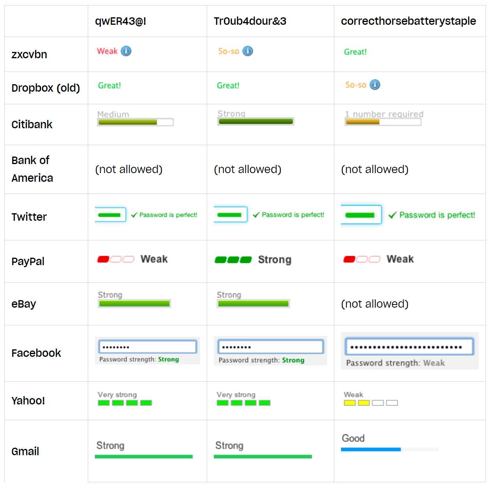
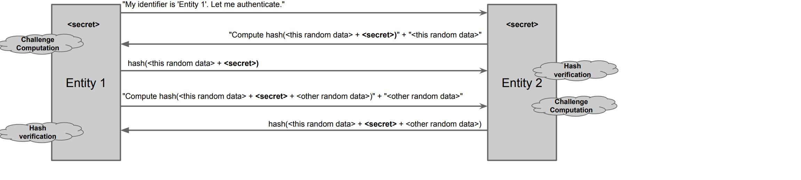

Three (or four) Factors of Authentication:

1) Something that the entity knows (to know)
2) Something that the entity has
3) Something that the entity is (biometrical)
4) (Multi-factor authentication uses two or three factors)

Human authentication is a usability problem.

# To know factor: passwords

Why passwords are appealing?

- Low cost
- Easy deployment
- Low technical barrier 

Disadvantages of password-based authentication:

- Secrets can be easily stolen or snooped
- Passwords can be easily guessed
- Passwords can be cracked through enumeration

Countermeasures:

- Change or expire frequently
- Are long and contain a variety of characters
- Are not based on any personal information of the user

But countermeasures have costs and humans are not machines:

- They are inherently unable to keep secrets
- It is hard to remember complex passwords

Password estimators don't really estimate correctly what is a good password:

# Some problems with passwords 

## Secure Password Exchange

How to minimize the risk that the password is stolen? Challenge-Response scheme is the solution. Shift from the problem to "have and pass the password" to demonstrate to have the password. 

Random data is important to hide the hash of the secret and protect against replay attacks.

## Secure Password Storage

- Use cryptographic protection: never store passwords in clear text, implement hashing and salting techniques: salting involves adding a random nonce to a password and it ensures that different users' identical passwords have distinct hashes.
- Access control policies
- Never disclose secrets in password-recovery schemes
- It's necessary to minimize the cache of the clear password

# To have factor: tokens

Advantages: 

- Human factor: forgetting a password is more common than losing a physical key.
- Relatively low cost 
- Provides a good level of security 

| Disadvantages | Countermeasures |
| :--- | :---: |
| Hard to deploy, | none |
| can be lost or stolen. | use with second factor. |

Some examples: 

- OTP: One-time password generators
- Smart cards (also with embedded reader in USB keys)
- TOTP: software that implements the same functionality of password generators

# To Be factor: biometric

Advantages:

- High level of security
- No extra hardware required to carry around since are physical characteristics

|       Disadvantages        |  Countermeasures   |
|:--------------------------:|:------------------:|
|       Hard to deploy       |        none        |
|   probabilistic matching   |        none        |
|    invasive measurement    |        none        |
|       can be cloned        |        none        |
| bio-characteristics change |  re-measure often  |
|    privacy sensitivity     | secure the process |
|  users with disabilities   |   need alternate   |

Some examples: 

- Fingerprints
- Face geometry
- Retina scan
- DNA 
- Voice analysis: not really used since its not "stable feature". 