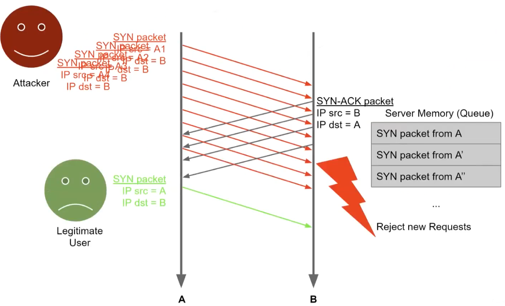
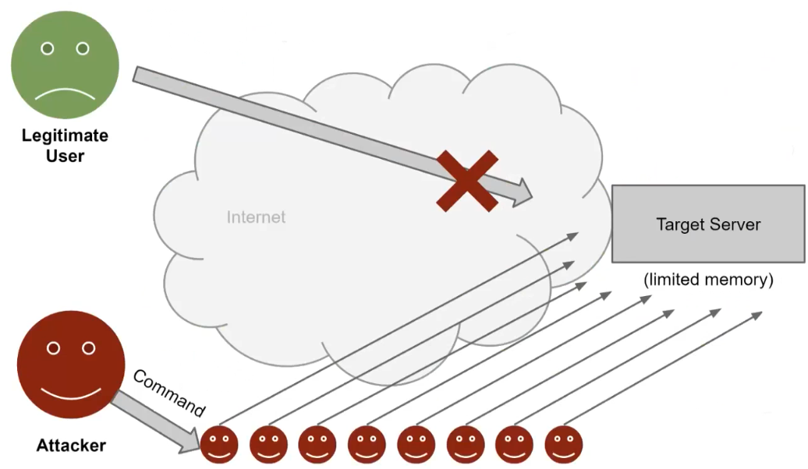
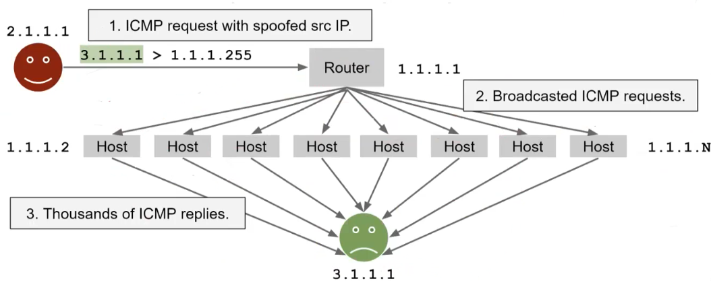
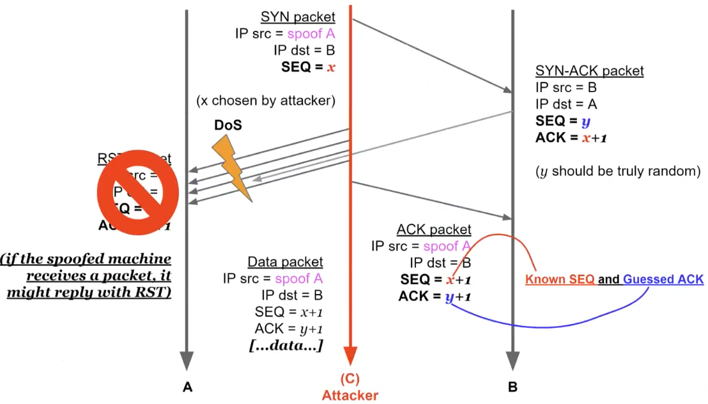
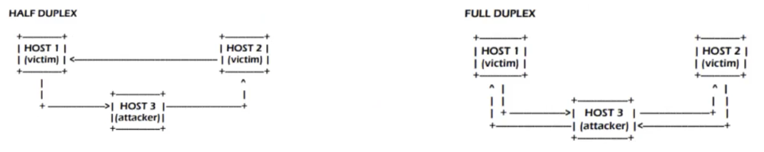

# Network Security 

## Recalls 

## Network protocol attacks

We can distinguish 3 main types of attacks:
- Denial of Service (DoS): make a service unavailable (against availability)
	- killer-packets: malicious packets crafted in specifically to make the application/OS that reads them to crash or become unresponsive.
	- flooding: sending tons of requests to choke the connection to the service.
- Sniffing: abusive reading of network packets (against confidentiality)
- Spoofing: forging of network packets (against integrity and authenticity)

ICMP? 

The main takeaway here is that flooding attacks cannot be eliminated completely.

The second category of DoS attacks is flooding. This cannot really be avoided, if the attacker has more bandwidth than the server he is trying to attack it will become unreachable.  
Where is the security problem here, if it cannot be avoided? If there is a way for the attacker to multiply his effort in doing the attack, e.g. the attacker uses `x` amount of resources but consumes `Nx` resources on the server. We want to take away the possibility of having that multiplier.

Example: SYN flood  
Exploits the three way handshake of TCP. The idea is:
- attacker: sends a lot of SYN packets with spoofed source IP and never acks them
  - resources used: bandwidth
- server: needs to reply with SYN-ACK and store in a queue all pending connections
  - resources used: bandwidth + memory

Once the queue to store half opened connections is full, other requests from legitimate users are dropped. The multiplier here is that the server also needs to use memory to store the connections and this becomes the limiting factor.  
The problem here, as we said before, is that this attack cannot really be avoided because it is exactly how TCP is supposed to work. We can only try to mitigate it by taking away the multiplier (store connections in memory).

#### Distributed DoS (DDoS)
In this case the attacker can control a large number of machines (e.g. a botnet) and have them send requests to a target server to consume its bandwidth. The multiplier is in those machines that the attacker controls, sending one packet/command will be multiplied by the number of machines.

an example is:

which nowadays works only inside the LAN. and also the RAM's of devices theoretically can support such overload. 

Many protocols on the internet have characteristics that make them suitable for DoS and DDoS attacks (they have some built in multiplier):
- DNS
- NTP
- NetBIOS
- ...

BAF (Bandwith Amplification Factor) = multiplier of response payload to request payload

| Protocol   | all   | BAF 50 | PAF 10 | all  | Scenario                     |
| ---------- | ----- | ------ | ------ | ---- | ---------------------------- |
| SNMP v2    | 6.3   | 8.6    | 11.3   | 1.00 | GetBulk request              |
| NTP        | 556.9 | 1083.2 | 4670.0 | 3.84 | Request client statistics    |
| DNS NS     | 54.6  | 76.7   | 98.3   | 2.08 | ANY lookup at author. NS     |
| DNS OR     | 28.7  | 41.2   | 64.1   | 1.32 | ANY lookup at open resolv.   |
| NetBios    | 3.8   | 4.5    | 4.9    | 1.00 | Name resolution              |
| SSDP       | 30.8  | 40.4   | 75.9   | 9.92 | SEARCH request               |
| CharGen    | 358.8 | n / a  | n / a  | 1.00 | Character generation request |
| QOTD       | 140.3 | n / a  | n / a  | 1.00 | Quote request                |
| BitTorrent | 3.8   | 5.3    | 10.3   | 1.58 | File search                  |
| Kad        | 16.3  | 21.5   | 22.7   | 1.00 | Peer list exchange           |
| Quake 3    | 63.9  | 74.9   | 82.8   | 1.01 | Server info exchange         |
| Steam      | 5.5   | 6.9    | 14.7   | 1.12 | Server info exchange         |
| ZAv2       | 36.0  | 36.6   | 41.1   | 1.02 | Peer list and cmd exchange   |
| Sality     | 37.3  | 37.9   | 38.4   | 1.00 | URL list exchange            |
| Gameover   | 45.4  | 45.9   | 46.2   | 5.39 | Peer and proxy exchange      |

### Sniffing and spoofing

Often used in combination: spoof an machine (for example a gateway) to sniff packets of the lan or in general to act as man in the middle. 

#### ARP spoofing  

Spoof the MAC address of an ARP reply. Since there is no check, the machine who made the ARP request will trust the first answer that comes, also poisoning the ARP cache with the address of the attacker. Now the attacker can use this to pretend being someone else.  
Possible mitigations are:
- include a random nonce in each request
- anomaly detection: if someone is constantly sending out ARP replies is weird.
- address conflict: the correct reply will eventually reach the host that could notice the conflict and alert the user.  

Why are those measures not taken?

- simplicity is key since ARP is a basic functionality in every network communication
- local network is supposed to be safe enough
- historical reasons (different scenarios, different trade-offs between security and costs)

#### MAC flooding

Fill the [CAM table](https://en.wikipedia.org/wiki/Forwarding_information_base) of switches by sending tons of spoofed packets. The objective is to make them behave as hubs and broadcast every packet. Used to be able to read packets in different sections of the network.  
Mitigation:  
Port security, tell the switch roughly how many hosts are supposed to be connected to some port and refuse to save more addresses.

Switches use CAM tables to know (i.e., cache) which MAC addresses are on which ports
Dsniff (macof) can generate 155k spoofed packets a minute: fills the CAM table in seconds (MAC flooding)
CAM table full: cannot cache ARP replies and must forward everything to every port (like a hub does).

Mitigation: PORT Security (CISCO terminology)

In general ARP cache recordes each single entity and the association between IP and Mac Address. 

#### Spanning Tree Protocol (SPT) abuse

Design for switch network

SPT organize the topology of the network to increase effiency. 

The [BPDU](https://en.wikipedia.org/wiki/Bridge_Protocol_Data_Unit) packets used by switches to build the spanning tree are not authenticated for intercompatibility reasons and so they can be forged or manipulated to change the shape of the tree. This can allow an attacker to redirect packets to section of the network that he can listen to.

BPDU packets are not authenticated, so, an attacker can change the shape of the tree for sniffing or ARP spoofing purposes.

#### IP address spoofing

Since the source IP of a packet is not authenticated it can be modified by an attacker:

- UDP/ICMP: easy since it's stateless: each packet is independent from the previous ones. The attacker only needs a way to see the replies because they will be sent to the spoofed host. If it is not possible then it's called *blind spoofing*
- TCP (blind spoofing so attackers outside the network): more complex since there is a handshake to crack. The sequence number of TCP handshakes is Initial Sequence Number. Randomly generated.  

- TCP hijacking: if the attacker can sniff the packets everything changes. The attacker performs a Man in the middle (MITM) attack. Different types of MITM:

Broad category of attacks where the attacker is able to impersonate the server w.r.t. the client and vice versa. Must always be aware of this possibility (e.g. what happens if the attacker is able to ARP spoof the address of the default gateway?).  
We can have two types: half and full duplex.  

#### DNS cache poisoning

The objective is to poison the cache of a non authoritative name server to have a symbolic name associated with an IP chosen by the attacker.  
The basic mechanism is:
- attacker makes a recursive query to the victim's DNS server
- the victim DNS server (the non authoritative one) contacts the authoritative server
- the attacker impersonates the authoritative server and replies with the address that he wants
  - needs to sniff the query id somehow
  - needs to reply first
- the victim trusts the answer and stores it in the DNS cache (*poisoned*)

From now on all client asking to resolve DNS to that compromised server will be redirected to the attacker.

The query id can be sniffed or guessed if the mechanism that generates it is predictable (2008 Kaminsky).

#### DHCP poisoning

DHCP is another **unauthenticated** protocol since it needs to work without any configuration. The attacker can spoof the DHCP answer to manipulate the information sent to the client:
- IP address assigned
- DNS server
- default gateway

Of course the attacker needs to be on the local network and reply first.

#### ICMP redirect

ICMP the one of the ping, (echo request and echo reply) it's also useful for ICMP redirectused by gateways to inform the hosts about "better" route to a particular destination.

There is a message in ICMP called *redirect* that is used by routers to communicate to hosts the existence of a better route for a certain destination and have them update their routing table with the new gateway for that route. 

An attacker can forge those messages and:

- redirect the host to another malicious gateway
- perform a denial of service attack
- establishing an half duplex MITM

Also in this case the attacker needs to be on the same network. Modern OS ignore by default ICMP redirect messages.

#### Route mangling

Similar concept of altering the spanning tree but for routers. Attacker can advertise better routes for certain traffic and having it redirected to those routes. Can also happen by accident if some service provider routers are configured incorrectly (e.g. advertise very cheap routes). [More here](https://en.wikipedia.org/wiki/BGP_hijacking).

Whatr happens on the internet it's possible to manage the routes \

an example is during 911 attack where the in twin towers there was an important data center which connects europe to usa. 

this kinds of things are possible because of such protocols 

IGRP, RIP, OSPF: no/weak authentication EIGRP, BGP: authentication available but seldom used (see next slide).

## Firewalls 

### Stateless 

Firewalls are network access control systems that verify packets flowing through them. A firewall is a computer which can be considered as a stupid “bouncer at the door”. 
There are different types of firewalls, such as:

- Stateless Packet Filters
- Stateful Packet Filters

The main difference between the two is that the stateful one keeps track of connections and not just packets. This makes deny rules safer but the performance is bounded by connections and not by packets.

## Network Design 

To secure a network, we split the network by privileges zones and we use firewalls to regulate access. The DMZ zone can host public servers (web, FTP, public DNS server, intake SMTP) and is assumed to be exposed as the internet. 

### VPNs 

We can also use a VPN to build an encrypted overlay connection on top of a public network to ensure the confidentiality, integrity, and availability of data transmitted. 

A VPN can be configured in: 

- Full tunnelling where every packet goes through the tunnel.
- Split tunnelling where the traffic to the Corporate Network is routed through the VPN, while the other traffic goes to the ISP.
