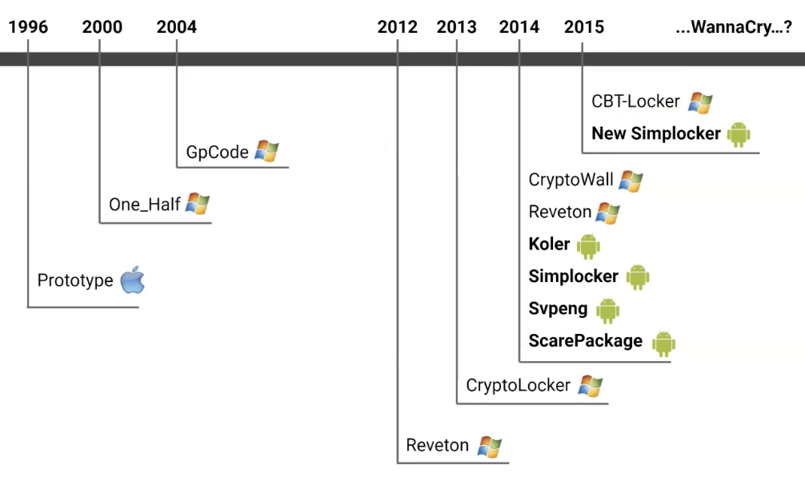

# Malware

Malware violates security policy and can be classified in three types:

- Virus: self-replicates but needs a host program.
- Worms: spread through vulnerabilities or social engineering.
- Trojan: looks benign but has a hidden malicious program and allows remote control.

## A brief history of malwares 

- 1971: Creeper, the first self-replicating program, on PDP-10
- 1981: First outbreak of Elk Cloner on Apple II floppy disks
- 1983: First documented experimental virus (Fred Cohen's work; name coined by Len Adleman)
- 1987: Christmas worm (mass mailer) hit IBM Mainframes, replicating at 500,000/hr; paralyzed many networks
- 1988: Internet worm (Nov 2): created by Robert Morris Jr.; birth of CERT
- 1995: Concept virus, the first macro virus
- 1998: Back Orifice, trojan for IRC to demonstrate the lack of security in MS systems
- 1999: Melissa virus, a large-scale email macro-virus
- 1999 - First DDoS attacks via trojaned machines (zombies)
- 1999 - Kernel Rootkits become public (Knark, modification of system call table)
- 2000 - ILOVEYOU (large-scale email worm) - Social Engineering
- 2001 - Code Red (large-scale, exploit-based worm)
- 2003 - SQL Slammer worm (extremely fast propagation through UDP)
- 2004+ Malware that create botnet infrastructures (e.g., Storm Worm, Torpig, Koobface, Conficker, Stuxnet) 
- 2010+ Scareware, Ransomware and State-sponsored malware

Cryptocurrencies helped the diffusion of ransomware after 2012. 

## Infection techniques

Viruses can be divided on the basis of their infection technique:

- **File infectors**
	- parasitic virus: change entry point
	- overwrite program
	- cavity virus: inject code in unused sections of the program
- **Boot viruses**: virus infects boot sectors by overwriting MBR to load virus in memory before OS.
- **Macro viruses**: a computer virus written in the same macro language used to create software programs such as Microsoft Excel or Word. Virus persistence in documents leads to difficulty in removal and potential re-infection.

Worms use tecniques such as: 

- various methods to spread, such as email and social networks. 
- mass scanners: send the worm to random IP addresses using mass scanners, which have become more effective due to the crowded nature of the internet. 

Botnets are networks of compromised machines. Botnets can be used to make different illegal activities, like information and identity theft, but also are very useful for spamming and DDoS attacks.

## Anti-malware

Theoretically anti-malware software cannot directly detect if a virus can spread or not. Therefore, they use a blacklisting approach to block known malware samples. These results are basically derived from the [Halting Problem](../../../BSc(italian)/Algoritmi%20e%20Principi%20dell'Informatica/src/07.Computabilità.md#Halting%20Problem). 

Two main ways of analyzing malware: 

- static: analyze the code directly after disassembly
- dynamic: observe its behavior in a sandbox

## Virus obfuscation techniques

Try to hide malware in order to make it difficult to detect. Mainly two approaches:

- **Polymorphism**: change layout of the malware at every infection by encrypting it with a different key. It's main feature is the presence of a **decryption routine**. Encrypt and decrypt at each time the malware with a different key is useful since it's like there are multiple versions of the same code with the same semantic. This fucks anti-malwares since they cannot use signature analysis. 
- **Metamorphism**: create different versions of the code that looks different but have the same behavior: 
	  - inserting nops
	  - reordering sections
	  - inserting useless instructions

Other malware general stealth techniques: 

- Entry point obfuscation: hijack control of the program later. Similar to:
- Dormant period technique in which they don't do anything
- event triggered: do not do anything until it receives a command from its C&C server.
- anti-virtualization: where the malware tries to evade the sandbox of antivirus or the virtualized environment created in a security lab. 
- Packing: combination of all last listed techniques. 
- Rootkits: A rootkit is an approach to make malwares which consists in creating a root user on a machine, allowing the hacker to use other parts of the rootkit to damage the system. There are two categories of rootkits: 
	- user level: easy to build and detect
	- kernel space. difficult to build and can only be detected from a different machine. Removing BIOS-level rootkits is almost impossible, except by changing hardware, but it's outside the threat model of most people.
