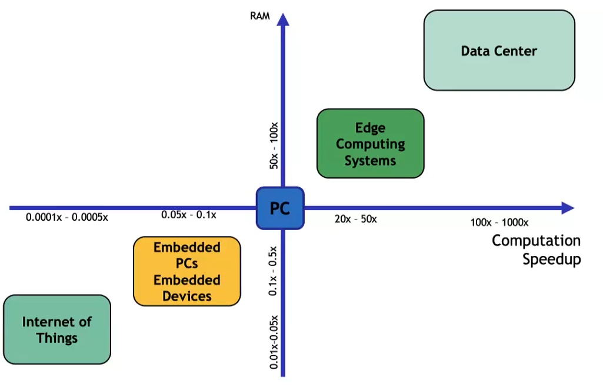
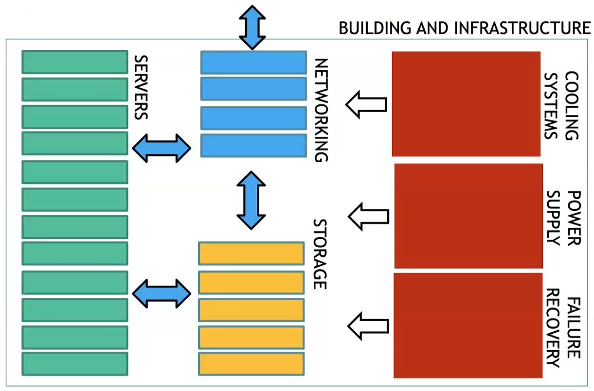
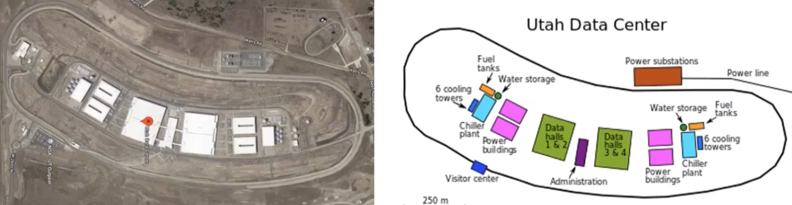
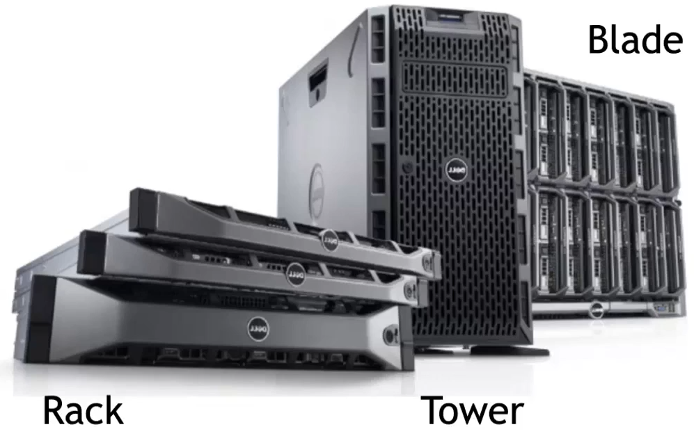

## Data centers 

Web application with thin client application configuration: 

| ADVANTAGES                                        |     DISADVANTAGES         |
| :---: | :--:|        
| Lower IT costs                                    | Require a constant Internet connection (so not work well with low-speed connections and latency problem) |
| High performance, "unlimited" storage capacity and backup | Privacy and security issues                                                          |
|       Device independence (no need to manually configure ...) |                    High Power Consumption                                                                   |

The key has been virtualization. Warehouse-scale Computer Infrastructure which powers VMs. 

Example of Warehouse-scale Computer Infrastructure: 

---

Virtualization has been crucial to make datacenters reals. 

WSCs use a relatively homogeneous hardware and
system software platform to simplify management and reduce cost. 

Warehouse-scale Computer

{width=50%}

TOWER 
| PROs  | CONs| 
|---|----|
| Scalability and ease of upgrade | Consumes a lot of space |
| Cost-effective (cheapest servers) | Provides a basic level of performance |
| Cools easily (low component density) | Complicated cable management|

RACK SERVER
| PROs                        | CONs        |
| --------------------------- | ----------- |
| Failure containment         | Power usage |
| Simplified cable management |         Maintenance    |
| Cost-effective                            |             |

BLADE SERVER 

| PROs                                                               | CONs                                                 |
| ------------------------------------------------------------------ | ---------------------------------------------------- |
| Load balancing and failover                                        | Expensive configuration                              |
| Centralized management, all blades connected to a single interface | high component density -> effort to avoid overheated |
| Cabling                                                            |                                                      |
|                              Size and form-factor                                      |                                                      |

Blade servers are a new and advanced type of server that can be described as a hybrid rack server. These servers are housed in blade enclosures, creating a blade system. Blade servers are the smallest type of server available, making them ideal for conserving space.

--- 

28 feb 

In recent years, deep learning models have become increasingly popular and have driven the development of specialized hardware for machine learning applications. The compute requirements for AI training have been doubling every 3.5 months since 2013, which is faster than the expected rate of Moore's Law. To meet these growing compute demands, data centers use specialized hardware accelerators such as GPUs, TPUs, and FPGAs. These accelerators provide high performance and efficient processing for deep learning workloads. GPUs have been widely used for deep learning since they provide high processing power and are well-suited for parallel computing tasks. TPUs were specifically designed by Google to accelerate deep learning tasks and perform matrix operations more efficiently than GPUs or CPUs. FPGAs, on the other hand, offer flexibility and can be programmed for specific tasks, making them a good choice for custom hardware design.

### CPU and GPU 

{width=65%}

The generic workflow of training a DNN on multiple GPUs consists:

{width=50%}

The performance of synchronous systems is constrained by the slowest learner and the slowest messages in the network. Since the communication phase is a crucial aspect, a high-performance network can facilitate swift reconciliation of parameters across learners. In DNN training, a possible solution to the bottleneck in CPU-GPU workflow is to use NVlink, which allows GPUs to communicate without passing data to the host CPU. In a CPU-GPU configuration, a CPU host is connected to an accelerator tray with several GPUs attached via PCIe. The GPUs within the tray are linked using high-bandwidth interconnects such as NVlink.

{width=50%}

### TPU 

-   TPUs are specialized hardware designed for machine learning (ML) workloads that perform integer operations with reduced precision, allowing them to process large amounts of data more efficiently than GPUs or CPUs.
-   TPUs excel at performing the types of matrix operations commonly used in deep learning models.
-   By using TPUs, Google is able to train and run ML models faster and at a lower cost than using general-purpose hardware.
-   TensorFlow is a custom-built integrated circuit tailored specifically for ML and has been powering Google data centers since 2015, along with CPUs and GPUs.
-   Tensors are the basic unit of operation in TensorFlow and represent n-dimensional matrices.
-   Each Tensor core in TensorFlow has an array for matrix computations (MXU) and a high bandwidth memory (HBM) connection to store parameters and intermediate values during computation.
-   TPUv3 is the first liquid-cooled accelerator in Google’s data center.

### Field-Programmable Gate Array (FPGA)

{width=50%}

-   Field-Programmable Gate Arrays (FPGAs) are arrays of logic gates that can be programmed by the user
-   FPGAs consist of configurable logic blocks (CLBs) that are interconnected to implement common functions with high flexibility
-   VHDL and Verilog are hardware description languages used to describe hardware using text-based schematics with components and interconnections.

{width=50%}

|     | Advantages | Disadvantages |
| --- | ---------- | ------------- |
| CPU | Easy to be programmed and * support any programming framework. | Most suited for simple models that do not take long to train and for small models with small training set.               |
| GPU |   Ideal for applications in which data need to be processed in parallel like the pixels of images or videos. | Programmed in languages like CUDA and OpenCL and therefore provide limited flexibility compared to CPUs. |
| TPU | Very fast at performing dense . vector and matrix computations  and are specialized on running very « fast ML workloads | For applications and models based on TensorFlow/PyTorch/ JAX Lower flexibility compared to CPUs and GPUs |
| FPGA | Higher performance, lower cost . and lower power consumption compared to other options like . CPUs and GPU | Programmed using OpenCL and High-level Synthesis (HLS). Limited flexibility compared to other platforms. |

Hardest part of AI isn’t AI

{width=50%}

--- 

# storage

SSD good for random reads but issues with random writes. 

HDD always more used in datacenters. 
