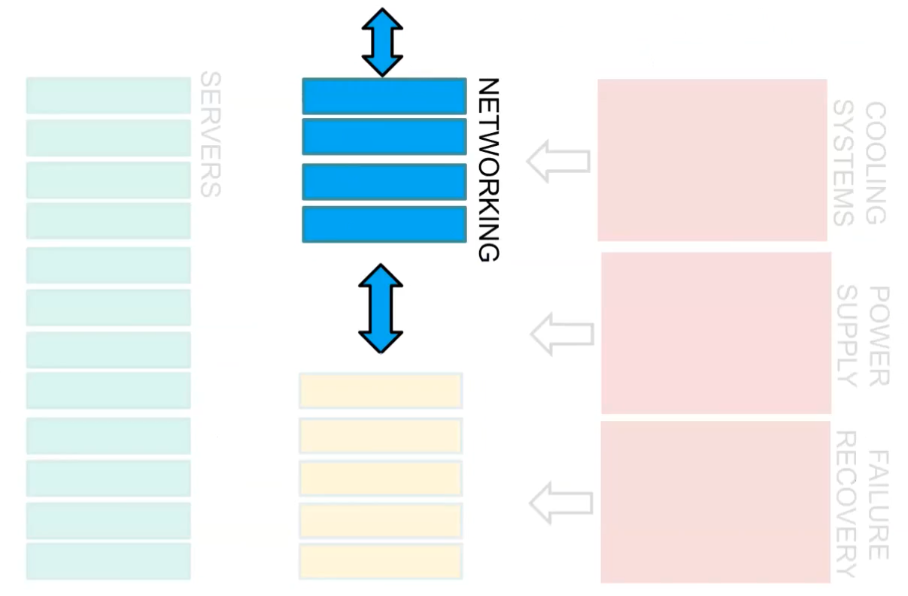

Lesson with (Maier)

Some context: 

- In the early days of computing, computers weren't connected in a network.
- Eventually, networking protocols were developed and the most widely used one is TCP/IP.
- The evolution of computing infrastructures can be presented in the following steps: client-server, web applications, microservices and datacenters/warehouse scale computing. 
- In terms of horizontal scaling, networking lacks a straightforward solution. 
- Increasing the leaf bandwidth is simple: doubling the number of servers will provide twice the network ports and bandwidth. 
- However, if every server needs to communicate with the others, **bisection bandwidth** must be considered. 

## Bisection bandwidth 

Bisection bandwidth is the bandwidth across the narrowest line that divides the cluster into two parts equally, and it is important for characterizing the network capacity.

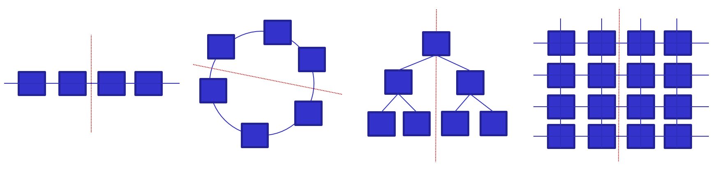

Data center's networking can be classified in the following ways: 

- **Switch-centric** (also called router-centric): alle the nodes are implemented as specialized hardware which can manage traffic performing packet forwarding.
- **Server-centric**: Uses servers with multiple Network Interface Cards (NICs) to act as switches in addition to performing other computational functions. This approach might cause slow performance.
- **Hybrid architectures**: combining switches and servers for packet forwarding is a current trend in computing infrastructures, but it can be expensive. 

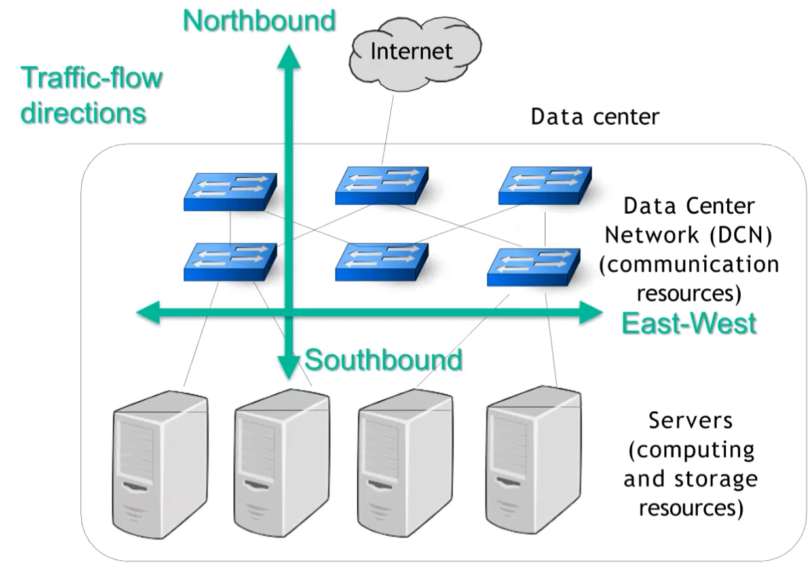

East-West traffic is generally bigger than North-South traffic. Some examples: 

- Cloud storage requires at least 3 copies of the same data for resilience, usually 2 in the same rack and 1 in another rack. 
- VM migration. 
- Network Function Virtualization (NFV): Data may be processed through a sequence of VMs such as firewall, web server, parental control, accounting server.

Examples of east-west traffic: 

- **Unicast**: point to point (VM migration, data backup, stream data processing)
- **Multicast**: one-to-many (software update, data replication for reliability, OS image provision for VM)
- **Incast**: many-to-one communication (reduce phase in MapReduce, merging tables in databases)

# Switch-centric

## Switch-centric: Classical 3-tier architecture

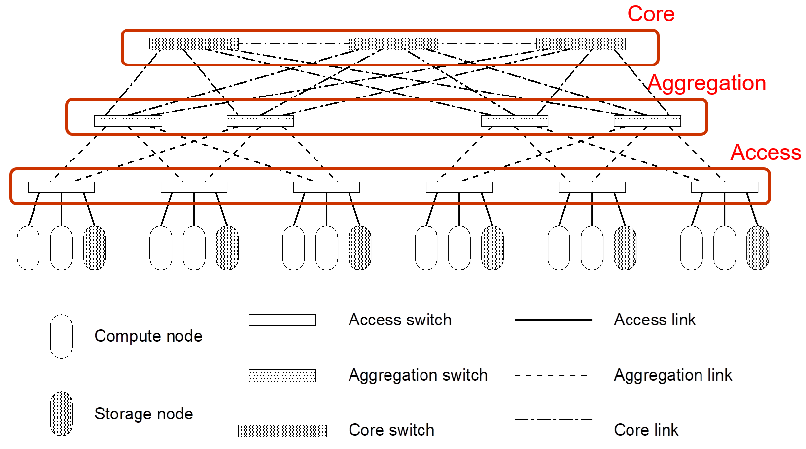

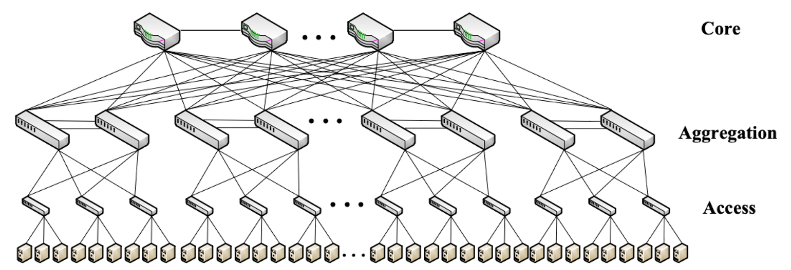

Three layer architecture reflects the topology of the data center.

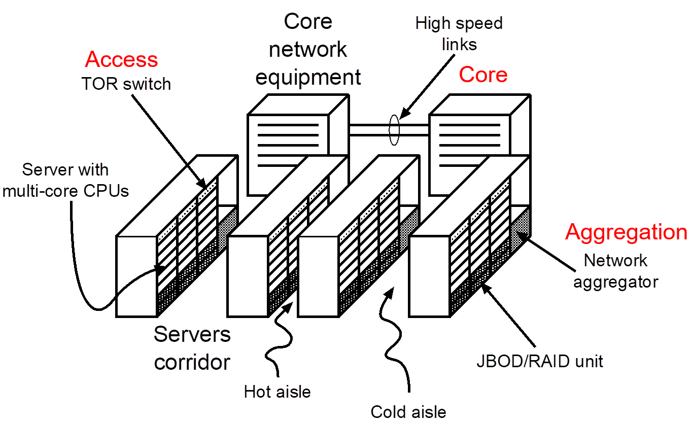

Typically approach to networking in a generic rack: in a rack, all servers are connected to a ToR access switch. the servers and the ToR switch are colocated in the same rack

{width=50%}

Aggregation switches are either in dedicated racks or shared racks with other Top-of-Rack (ToR) switches and servers. This setup has limited scalability and can lead to higher complexity for switch management.

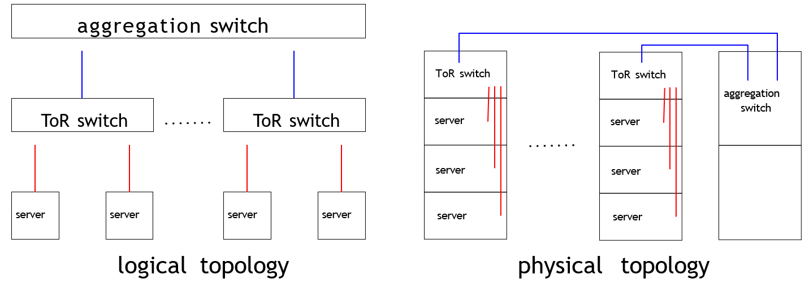{width=50%}

End-of-Row (EoR) is an alternative to Top-of-Rack (ToR) where an aggregation switch is placed at the end of a line of racks, one per corridor. Servers in one rack are directly connected to the aggregation switch in another rack. However, EoR requires aggregation switches with more ports and complex cabling, resulting in longer cables and higher costs.

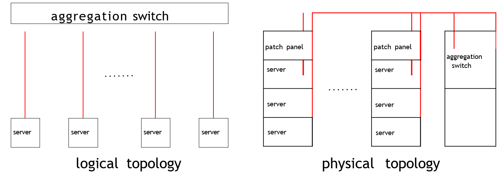{width=50%}

The solution is simple, but it can be costly for large data centers due to the need for faster network equipment in upper layers. For example: if 1 GB Ethernet is required at the access layer, 10 GB Ethernet at the aggregation layer, and 25 GB optical connections at the core layer. As a result, the cost of acquisition and energy consumption can be very high.

Switch-centric architectures:

- Classical 3-tier architecture
- Leaf-Spine architectures

## Switch-centric: Leaf-Spine architectures

It's an architecture based on two-stage interconnections based on a circuit switching architecture, once used in telephony (an alternative architecture to the "classical" packet switching). There are two levels:

- **Leaf** switches act as top-of-rack (ToR) switches  
- **Spine** switches are dedicated aggregation switches.

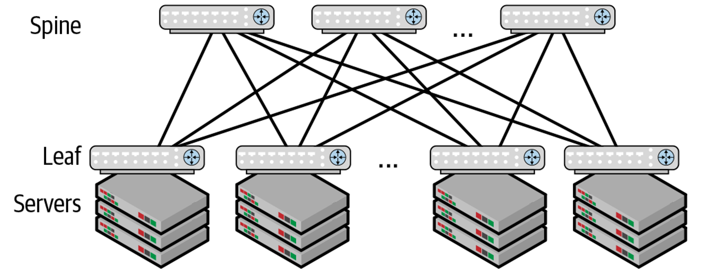

- Leaf and spine topology is bidirectional for each switching module.
- **Clos** design has advantages such as using homogeneous equipment and routing as the fundamental interconnect model. 
- Number of hops is the same for any pair of nodes
- Small blast radius: if you have a failure in the architecture, the blast (the number of interested machines) is limited.

pod 

- Add a super-spine tier for a scalable and cost-efficient architecture with maximum bisection bandwidth.
- Point Of Delivery (POD): a group of several components that work together to deliver network services. It enhances modularity, scalability, and manageability of data.
- Gigabit Ethernet switches with the same number of ports can be used.

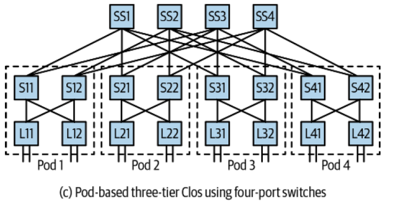

This architecture is known to be used by Microsoft and Amazon for example..

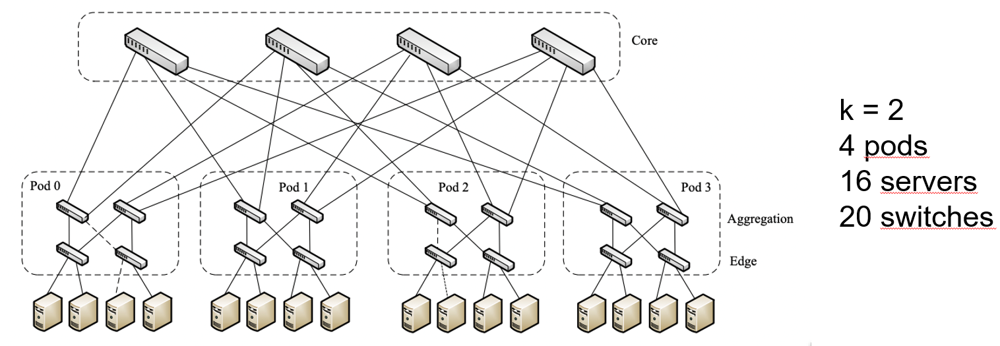

## Switch-centric: Google's case

- Google's design approach for their computing infrastructures: multistage Clos topologies. Their control is centralized, with one configuration pushed to all switches. They design their hardware to be modular, with simple and robust software.

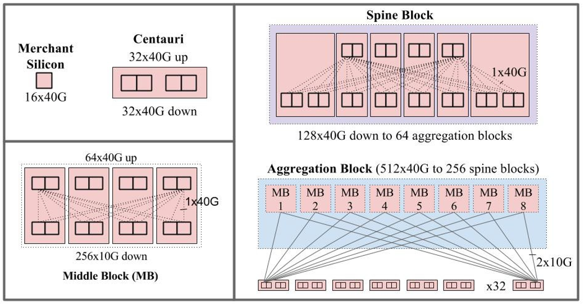

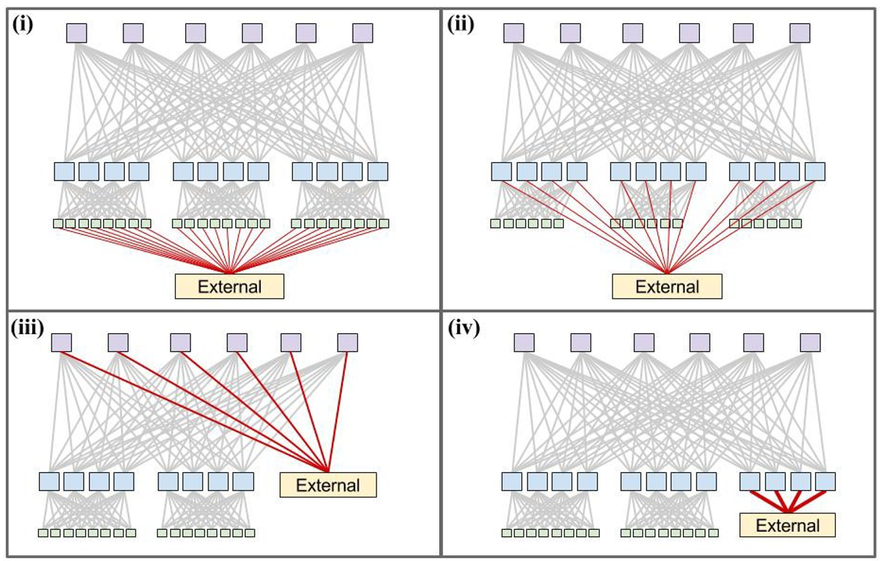{width=50%}

# Server-centric 

- A server-centric architecture proposed for container-sized data centers.
- Only servers used to build the data center, reducing costs.
- 3D-Torus topology used for direct server interconnection.
- Network locality exploited to increase communication efficiency.
- Drawbacks are servers requiring multiple NICs, long paths, and high routing complexity.

## Hybrid architectures 

