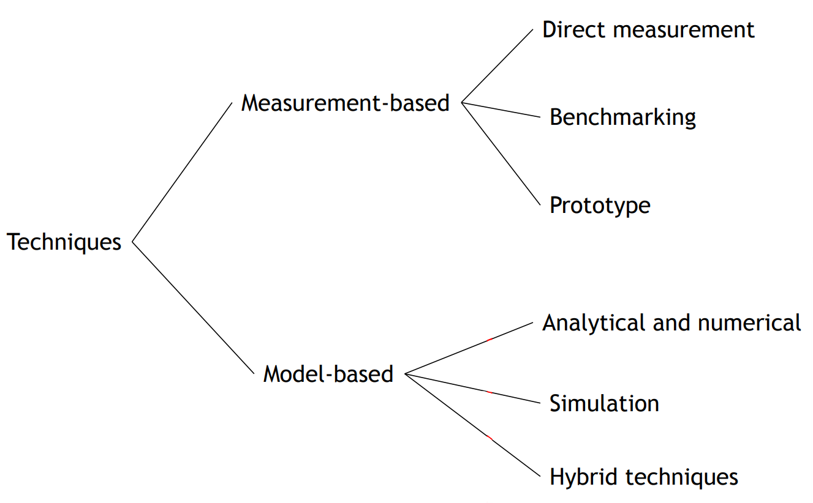

# Performance 

## Model based

Systems are complex so… Abstraction of the systems: Models

- **Analytical and Numerical techniques**: 
    - Use mathematical techniques that often rely on probability and stochastic process theory. 
    - They are precise and efficient but only apply to limited cases.

- **Simulation techniques**: 
    - Reproduce traces of the model. 
    - They are general but less accurate, especially for rare events. 
    - Solution time can be long for high-accuracy scenarios.

- **Hybrid techniques**: 
    - Combine analytical/numerical methods with simulation techniques for better accuracy

Possible models that we will se are: 

- Queueing networks 

### Queueing networks 

Queueing theory is the theory behind what happens when you have a lot of jobs, scarce resources, and so long queue and delays. 

Examples of queues in computer systems: 

- CPU uses a time-sharing scheduler
- Disk serves a queue of requests waiting to read or write blocks 
- A router in a network serves a queue of packets waiting to be routed 
- Databases have lock queues, where transactions wait to acquire the lock on a record

Different aspects characterize queuing models: 

- **Arrival**:  frequency of jobs is important: the average arrival rate $\lambda$ (req/s).
- **Service**: the service time is the time which a computer spends satisfying a job: the average duration $\frac{1}{\mu}$ and $\mu$ is the maximum service rate. 
- **Queue**: jobs or customers which cannot receive service immediately must wait in a buffer. 
- **Population**: we can both have members of the population indistinguishable or divided into classes, whose members differs in one or more characteristics, for example, arrival rate or service demand. 
- **Routing**: the policy that describes how the next destination is selected after finishing service at a station must be defined. It can be: 
	- probabilistic: random destination
	- round robin: the destination chosen by the job rotates among all the possible ones
	- shortes queue: jobs are moved to the one other subsystem with the mallest number of jobs waiting

{width=50%}

