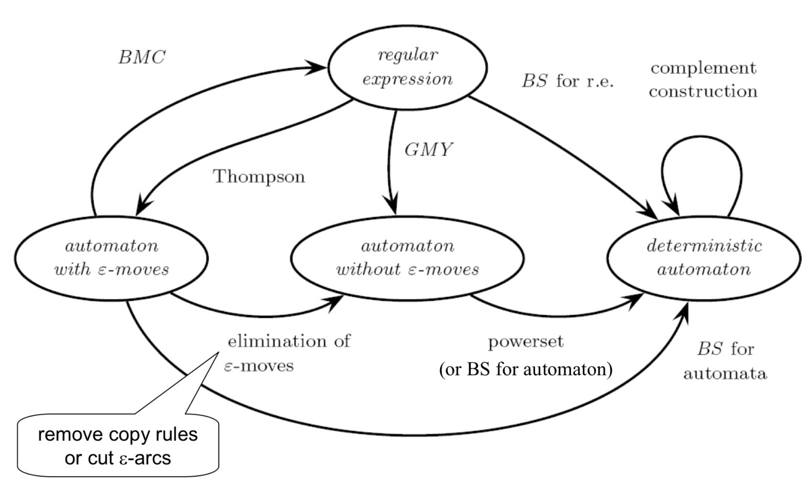
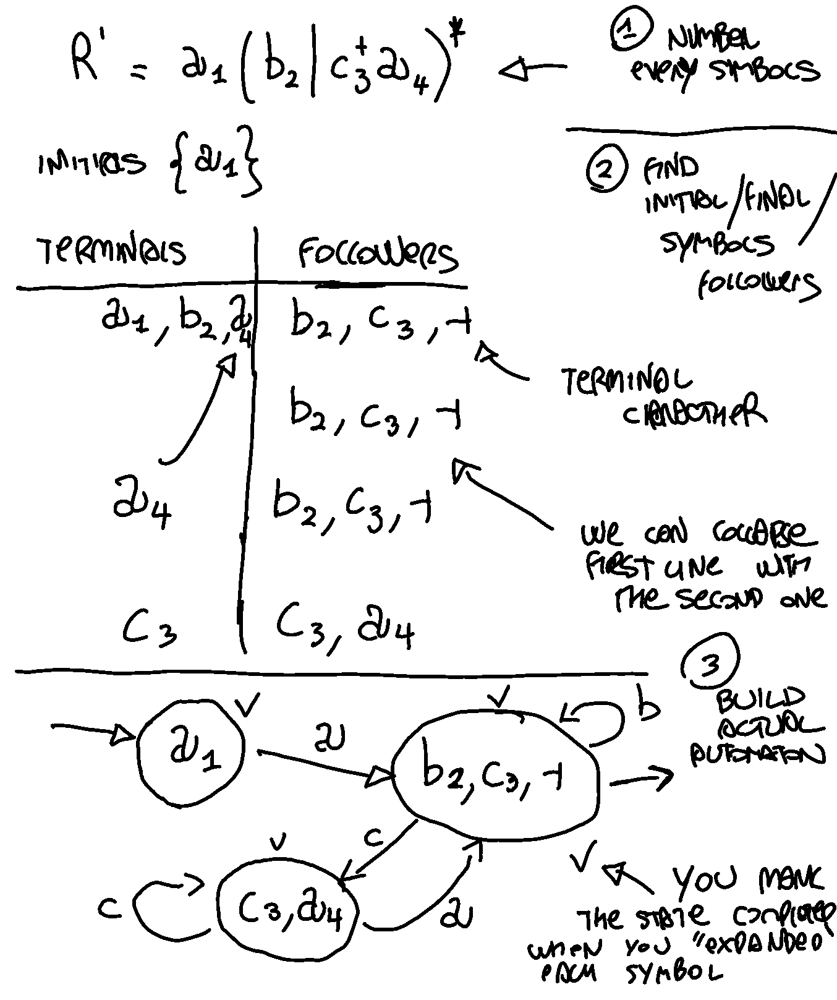

# Berry Sethy

Before starting: 

- initials: symbols at the start of the string 
- terminals: not the symbols that appear at the end of a string! But all the symbols that are not initials.
- followers: all the symbols that can follow a terminal

Convert a regular expression to finite state automaton. 

1) rename all the symbols giving a number to all of then 
2) find initial / terminals / followers symbols 
3) eventually collapse lines in the table
4) build actual automaton and in each state you put in the followers 

 

Procedure to check if it s minimal is to use a matrix where each column is a state and each line a transition letter. 

Berry Sethi can work also viceversa following the exact same rules. 

# BMC algorithm 

The way forward is based on the idea of eliminating all internal states one at a time, adding compensatory moves that preserve the recognized language, and that are labeled by expressions Regular. The procedure is carried out until only the two states and , with a single arc from to labeled by a regular expression, which will be the one sought. The order in which internal states are deleted is irrelevant.

The BMC-algorithm (Brzozowski-Mc-Kluskey) : translates every nfa A into a regular expression

It is used to convert an automata into a regular expression. 

1) you add an initial and final state 
2) then you iteratively: 
	1) choose a random node $X$
	2) replace the arrows **concatenating the symbols** on the arcs with this rule: create an arc from $A$ to $B$  if there are an arc from $A$ to $X$ and an arc from $X$ to $B$.
	3) repeat until the two artificial nodes are linked
3) the reg expression will be on the only final arc. If there are multiple final arcs just use $|$ operator. 

### Brozowski rule is very intuitive

It is used to convert a finite automata into a regular expression. It's very simple: just follow all the arcs and write down the symbols. The symbol autoloops become the symbol starred with Kleene'star. 

### Two possible way to eliminate $\epsilon$ transition :

- backword propagation (BP)
- forward propagation (FP)

note that eliminating the $\epsilon$ - moves produce indeterministic automatons. 

we cut transition 2 ε−→ 3 and we back-propagate the outgoing arc

