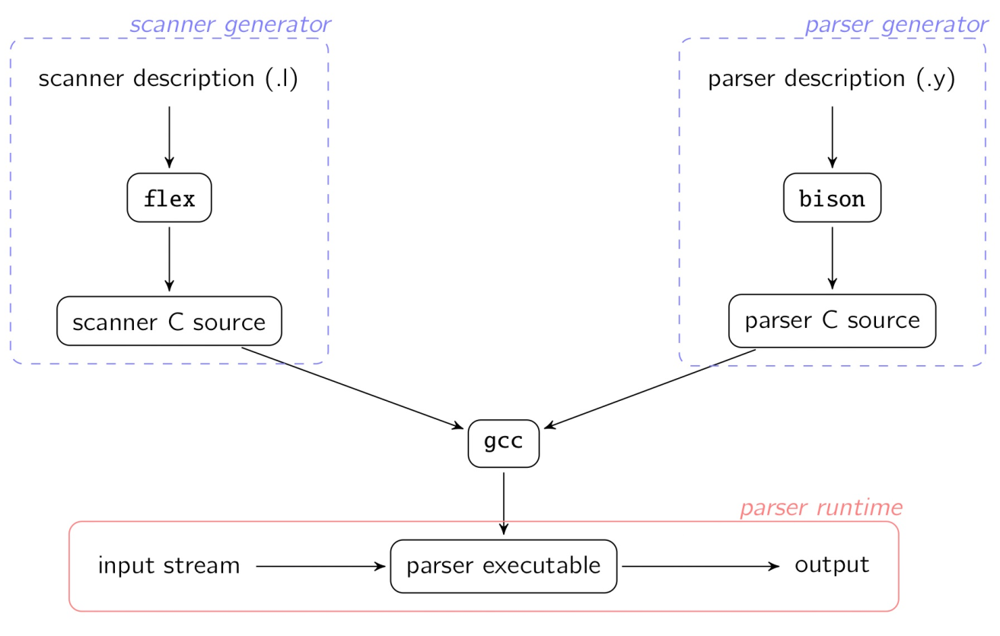
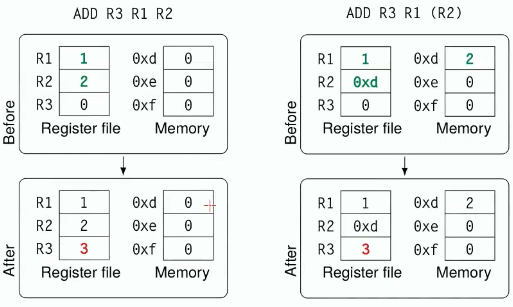
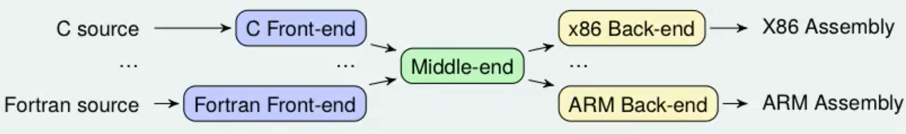
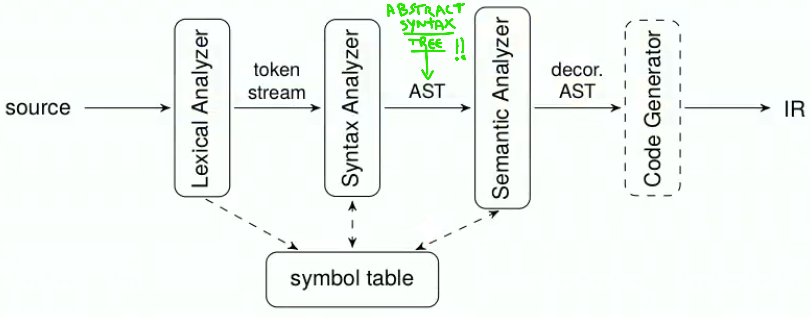
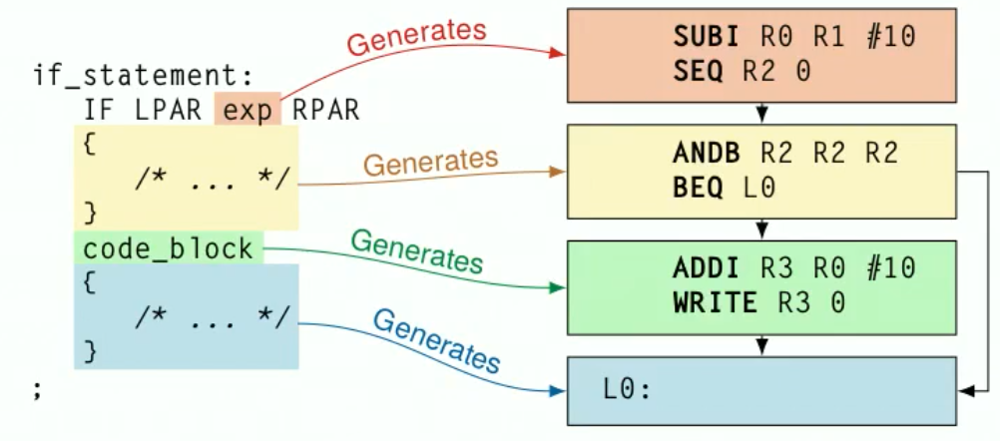

Often, on many distros linux you have already installed Bison and Flex, otherwise if debian based: 
````shell
sudo apt install flex
sudo apt install bison
````

Go in the acse folder wher you have "makefile" and use the command `make` to make the makefile. 
??? 


In computer science, **LR parsers** are a type of bottom-up parser that analyse deterministic context-free languages in linear time. 1 There are several variants of LR parsers: **SLR** parsers, **LALR** parsers, **Canonical LR(1)** parsers, **Minimal LR(1)** parsers, and **GLR** parsers. LR parsers can be generated by a parser generator from a formal grammar defining the syntax of the language to be parsed.

Bison uses the LALR(1) parsing algorithm, which is a type of bottom-up parsing.

LALR(1) Parsing:

LALR(1) stands for "Look-Ahead LR(1)" which is an efficient bottom-up parsing algorithm.


LALR(1) builds a parse tree for a given input string by starting at the leaves and working its way up to the root.


It's an efficient algorithm for parsing context-free grammars.


LALR(1) languages are a subset of context-free languages that can be parsed by the LALR(1) parsing algorithm.

LALR(1) languages are strictly less expressive than general context-free languages, but are more efficient to parse.


Lab is 20% of the exam. 

Some applications: 
- The standard regular expression syntax 
- Standard unix tools for text editing 
- Parser generation with flex and bison 
- The internal organization and workflow of a real-world compiler 
- How to modify and extend a simple compiler called ACSE

## Flex 

It's implemented as non-deterministic finite state automaton. 


- definitions: where you can declare useful REs
- rules: most important part where you bind RE combinations to actions 
- user code: C code

Each part is separated by ```%%```  


Longest matching rule 
The flex scanner in case of more than one match (with more one rules) the longer match will always win: if a longer regular expression match an expression and then others regular expression match subsets of the expression, the longer rule willl have precedence. 

the first rule 


Flex breaks up the input into individual tokens that are then passed to the parser (in our case we use Bison) for further processing.


Flex -> we do lexical analysis: from words to tokens 
In particular Flex generates a scanner (which recognizes tokens in the stream of characters and maybe decorate them in order to provide additional info). 


A flex file is structured in this way (three sections separated by \%\%). 

```` C
Definitions 
//declare useful REs
%% 
Rules
//bind RE combinations to actions
%%
User code
//C code (generally helper functions)

````

Each rule basically corresponds to a token to be recognized: in particular it links a token with an action to perform when the token is matched. 


Syntac and Semantic Analysis


3 levels 

Lexical Analysis 

Syntactic analysis 

Semantic analysis 
 


This is our workflow: 


The `yylex` function used by the parser will be provided by Flex.
The parser provides a `yyparse` function that returns 0 when the parsing is successful.


# Bison

It reads a specification of a grammar for a particular programming language or input format, and generates a parser which can recognize and parse input written in that language or format. 

- prologue: useful place where to put header file inclusions and variable declarations
- definitions
- rules 
- user code 


Bison file structure is similar to Acse. 


````C
%{
//prologue and headers 
}%
// definitions
%%
//rules like a context-free grammar 
not_terminal : terminal1 
				   | terminal2 TOKEN_A  
				   | terminal3 { /* C code */ }
%%
//user code
````


Very similar to grammar ... uppercase tokens are non terminals and lowercase tokens are terminals symbols. 

You can add semantic actions for each grammar rule. 

Byson uses bottom-up parsing: it always gives precedence to the inner-most rule. 


In acse the assembly code is generated while the parser (generated by Bison) is parsing (using the Bison semantic rules).


APPROFONDIRE shift and reduce conflict
````C
%union{ //in the %union I list the possible semantic data types  
	float f_value;
	struct Expr expr;
}

//Here I specify the type which the tokens can assume: 

%token <f_value> FLOAT //%token are terminals  
%type <expr> expr //%type are non terminals 
````

Semantic analysis how? 


## ACSE




The parser generated by Bison would be responsible for recognizing and parsing the ACSE code while the lexical analyzer (generated by Flex) would be responsible for breaking the code up into individual tokens.


Acse is a LANCE ( a simplified version of C) compiler which emits RISC-like assembly code and is built on Flex and Bison. 

Our exam consists in: 

- add tokens modifying Flex (lexical)
- add grammar rules to recognize new constructs using Bison (syntactic)
- write semantic actions to generate code for new constructs 

In particular: 


1) add the "keyword" to the Flex token declaration:
	- `"keyword" { return KEYWORD_TOKEN }`
2) then in Bison ( `Acse.y`) we place the token definition: 
	- `%TOKEN KEYWORD_TOKEN` 
3) Then you have to define the syntactic rules or modifications to existing one. 
4) Define the semantic actions needed to implement the required functionality, always in `Acse.y`. General stuff in the exam could be:
	- generate a custom structure to manage results
	- use some of the 3 possible techniques to manage nesting expressions and the "stack". 
	- modify existing code


> Mindset: in this kind of exercises we are not actually doing assignments, we are just writing the instructions that will produce the assignment when the program will be executed. We are translating the program, not executing. Compilation is a form of planning. No space for its value is reserved in the memory of the compiler, however, the compiler knows in which register or memory location the variable will be at runtime. 

 

---


ACSE is a simplified compiler in order to reduce the effort to understand how compilers work. ACSE accepts a C-like source language called LANCE:   
• very small subset of C99   
• standard set of arithmetic/logic/comparison operators   
• reduced set of control flow statements (while, do-whi le, if)   
• only one scalar type (int)   
• only one aggregate type (array of ints)   
- only two I/O operations:   
	- `read(var)` stores into var an integer read from standard   
	- `write(var)` writes var to standard output writing


LANCE produces a RISC-like assembly language: 

|Type  | Operands  | | 
|:--:|:---:|:--:|
| Ternary  | 1 destination and 2 source registers   | ADD R3 R1 R2  |
| Binary   | 1 destination and 1 source register, and 1 immediate operand  | ADD R3 R1 #4| 
| Unary   |1 destination and 1 address operand (label) |  LOAD R1 L0   |
| Jump   |1 address operand   |BEQ LO|

Jump instructions:
- BT: unconditional branch
- BEQ: branch if last result was zero 
- BNE: branch if last result was not zero

Using `( )` to point to the memory address. 



Special registers:

- `R0` zero, always contains 0  
- status word `PSW` , mainly exploited by conditional jumps
	- N, negative
	- Z, zero
	- V, overflow
	- C, carry


ACSE works using **asm** which translates assebly to machine code and **mace** which is a simulator of the fictional MACE process. A real-world example of a compiler is LLVM.   
Compiler translates a program written in a language and it's organized as a pipeline: 

- front-end: source language into intermediate forms
- middle-end: where transformations and optimizations are applied (for example vectorization)
- back-end


- Front-end: the source code is tokenized by a flex-generated scanner, while the stream of tokens is parsed by a bison-generated parser. At the end, the code is translated to a temporary intermediate o a representation by the semantic actions in the parser.
- No middle-end since no optimizations are made
- Back-end: we use the MACE processor 




The theory part of the course mainly focused on the frontend: 




## actual code 


`Acse.lex` : flex source (scanner)
`Acse.y`: Bison syntax grammar of LANCE in `Acse.y` . The semantic actions are responsible for the actual translation from LANCE to assembly
`codegen`: instruction generation functions: `aze_gencode.h` where there are all the helper functions to generate assembly. 


ACSE has: 

- reduced set of control flow statements (while, do-while, if)
- only one scalar type (int)
- only one aggregate type (arrayofuints)
- no functions
- limited I/O (just `read(var)` and `write(var)`)

Why this language? This is an ¨accademical" language and its focus to education. So there is basically nothing so that they can ask stuff to be implemented during the exam. 

The parser (Bison) modifies the intermediate languages made of variable and instructions list. Then backend process it. 

Precedence and associativity of expressions are handled by Bison. 


Constant folding: optimization to "merge" constants at compile time.  
To do this we use a structure which memorize the "value" and the type "IMMEDIATE|REGISTER". If at compile time there is a sum of two immediate, they will merged inside a single immediate.

To do this, you will use: 

````cpp
handle_bin_numeric_op()  //Arithmetic and logical operations   
handle_binary_comparison()   // Comparisons
````

Remember: yyerror() is the standard Bison function for signaling   
syntax errors. The YYERROR macro is what actually stops the   
syntactic action. *

We can use `getVariable(program,char * id)`;

````cpp
typedef struct t_axe_variable  {
	int type;   
	int isArray;   
	int arraySize;   
	int init_val;   
	char *ID;   
	t axe label *label ID;   
} t_axe_variable;
````


at the exam the grammar part is the most easy part. The difficult part is the semantic action. 

Tip: It's always useful to "de-sugar" a construct you are implementing   
to clear up any doubt you might have about its implementation

for syntax sugar -> any for can be replaced with while 


If in Bison part we use " $2" we refer to the second token

Semantic actions are independent blocks or scopes   
Variables declared in a semantic action are local to that action!


Things we can do: 

- global var: super easy to apply but it doesn't work if the statement is nestable 
- global stack: 
	- `t_list *save_stack = NULL`
	- `addFirst(save_stack,INTDATA(<var>))`
	- `int <var>=LINTDATA(save_stack)`
	- `removeFirst(save_stack);` 
- semantic value as a variable: we use 





from the example tries to write always a pseudocode. 


### Example of common snippets: 

````cpp
return_statement : RETURN 
	{
	// INSERT ALT INSTRUCTION
	gen_halt_instruction(program);
	}
	| RETURN exp
	{
		if ($2.expression_type  == IMMEDIATE){
		gne_addi_instruction(program, top->r_return, REG_0, $2.value);   
		} else{
		gen_add_inst ruction(program, top->r_return, REG_0, $2.value, C_DIRECT_ALL);
		}
	}
````

In general if there are identifier you will to verify if it is an array or not. 


Cheatsheet stuff: 

#### Working with Nonterminals

-   Check if a nonterminal (usually exp) is an immediate or a register: `if (${num}.expression_type == IMMEDIATE){...}else{...}`
-   Throw an error at compile time: `yyerror("{message}")`
-   Add a new type to give global properties to a token:
    -   In the token section: `%token <{struct of token name}> {token name}`
    -   Add to the %union struct: `t_{struct of token name} {struct of token name}`
    -   In the axe_struct.h file: `typedef struct t_{struct of token name}{...variable declarations...} t_{struct of token name}`
    -   Access variables in the rule code: `$<num corresponding to token>.{variable name}`
-   Evaluate exp nonterminal: `t_axe_expression unl_cond = handle_binary_comparison(program, $11, create_expression(0, IMMEDIATE), _NOTEQ_);`
    -   Check if the condition is true: `if(unl_cond.expression_type == IMMEDIATE){...} else{...}`


**WORKING WITH REGISTERS**

-   Creating a new register: `int reg = getNewRegister(program);`
-   Initializing a global register: `int glob_reg;` before the "semantic records" section in Acse.y, then initialize it with `glob_reg = getNewRegister(program);` before using it
-   Creating a register and assigning an immediate value: `int reg = gen_load_immediate(program, {val});`
-   Copying the value of a register type nonterminal into another already initialized register: `gen_add_instruction(program, dest_reg, REG_0, ${num}.value, CG_DIRECT_ALL);`
-   Copying the value of an immediate type nonterminal into another already initialized register: `gen_move_immediate(program, dest_reg, ${num}.value);`
-   Returning the register of an identifier nonterminal: `int reg = get_symbol_location(program, ${num}, 0);`. Remember to free the identifier with `free(${num});` at the end of code.
-   Checking if the content of a register is 0 (useful for loop counters as it can be followed by a conditional jump): `gen_andb_instruction(program, reg, reg, reg, CG_DIRECT_ALL);`
-   Adding another register value into a register: `gen_add_instruction(program, dest_reg, dest_reg, source_reg, CG_DIRECT_ALL);`
-   Adding an immediate value into a register: `gen_addi_instruction(program, dest_reg, dest_reg, {num});`


**WORKING WITH IMMEDIATES**

-   They can almost be treated like normal C integers. Remember that the number nonterminal is always an immediate.
-   Using the value of a number nonterminal: can be simply used with `${num}` and treated like a normal C integer.

**WORKING WITH ARRAYS**

-   Declaring a normal array initialized with zeros: `int *array = calloc(sizeof(int), {num for size});` needs to be freed at the end of code. This can be used as a normal C array with normal C array operations.
-   Saving a nonterminal array (represented by identifier) into a variable: `t_axe_variable *array = getVariable(program, ${num});` `S{num}` needs to be freed at the end of code.
-   Accessing an array variable's size like a normal integer: `{arrayname}->arraySize`
-   Condition which returns false if id is not an array: `!{array variable name}->isArray`
-   Saving an array element into a new register, when the index is contained in a register: `int reg = loadArrayElement(program, ${num of id of array}, create_expression({register containing index of element}, REGISTER));`
-   Saving an array element into a new register, when the index is contained in an immediate: `int reg = loadArrayElement(program, ${num of id of array}, create_expression({integer representing index}, IMMEDIATE));`
-   Storing an array element into an identifier nonterminal of an array: `storeArrayElement(program, ${num of array id}, create_expression({index of dest array}, IMMEDIATE), create_expression(sourceArray[index], REGISTER));`

WORKING WITH JUMPS AND LABELS

-   Declaring label: `t_axe_label *label = newLabel(program)`
-   Fixing label position of an already declared label in the code: `assignLabel(program, {labelname})`
-   Declaring label and fixing its position in the same point (use only for backwards jumps):

`t_axe_label *label = assignNewLabel(program, {labelname})`

-   Unconditional jump to label: `gen_bt_instruction(program, {labelname}, 0)`
-   Assigning label as global variable to a token: in the token declaration `%token <label> {tokenname}` then, to initialize it in the code of the rule `${num corresponding to the token} = newLabel(program)` and to place it `assignLabel(program, ${num corresponding to the token})`
